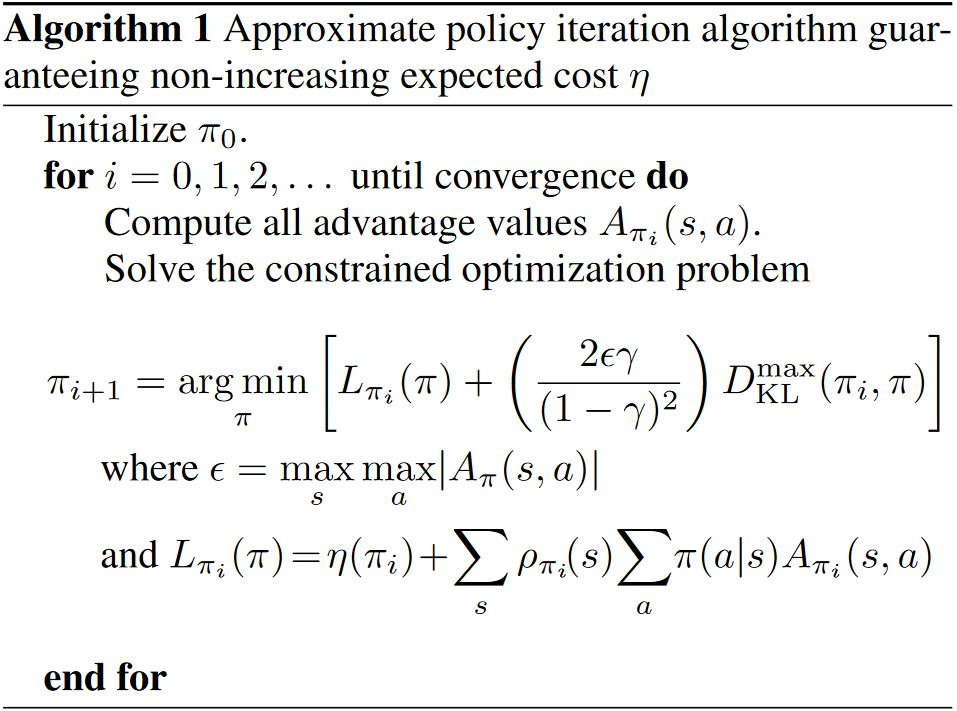
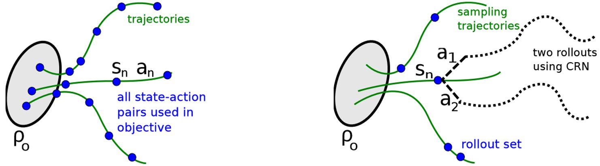

# Trust Region Policy Optimization

[A Natural Policy Gradient](https://proceedings.neurips.cc/paper/2001/file/4b86abe48d358ecf194c56c69108433e-Paper.pdf) Kakade, 2001  
[Trust region policy optimization.](http://proceedings.mlr.press/v37/schulman15.pdf) Schulman, L., Moritz, Jordan, Abbeel. 2015  

参考：[techblog: Natural Gradient Descent](https://agustinus.kristia.de/techblog/2018/03/14/natural-gradient/)  
&emsp;&emsp;&emsp;[知乎：自然策略梯度](https://zhuanlan.zhihu.com/p/546885304)

## 1 Natural Policy Gradient

&emsp;&emsp;标准梯度下降$$\pmb{\theta}_{k+1} = \pmb{\theta}_k - \alpha_k \nabla J(\pmb{\theta}_k)$$无法保证目标函数$$J(\pmb{\theta})$$按最大速度下降，因为标准梯度下降是非协变的 (non-covariant)，$$\pmb{\theta}$$的参数空间不是欧几里得的。一般来说参数空间具有黎曼度量结构，如神经网络。在这些情况下，普通梯度不能给出目标函数最陡峭的方向，所以[A Natural Policy Gradient](https://proceedings.neurips.cc/paper/2001/file/4b86abe48d358ecf194c56c69108433e-Paper.pdf)一文提出了能够实现参数空间最速下降的自然梯度。

### 1.1 Riemannian Space

&emsp;&emsp;欧式空间具有标准正交坐标系，其微分向量的平方长度为$$\vert d w \vert^2 = \sum_{i=1}^n (d w_i)^2$$。而黎曼空间是一种矢量空间，不具有正交坐标系，其微分向量的平方长度由正定二次型决定

$$\vert d \boldsymbol{w} \vert^2 = \sum_{i,j} \mathbf{G} dw_i dw_j$$

其中$$\mathbf{G}$$是一个$$n * n$$的对称矩阵。当$$\mathbf{G}$$为单位对角阵$$\mathbf{I}$$时，黎曼空间退化为欧氏空间。

&emsp;&emsp;黎曼空间中最速下降的梯度为

$$\tilde{\nabla} L(\boldsymbol{w}) = \mathbf{G}^{-1}(\boldsymbol{w}) \nabla L(\boldsymbol{w})$$

其中$$G$$可以用Fisher信息矩阵$$F$$替换。【[证明](https://zhuanlan.zhihu.com/p/546885304)】

&emsp;&emsp;似然函数$$L(\theta \mid x) = f_{\theta}(x) = f(\theta \mid x)$$ ($$L(\theta \mid x) = p(X = x; \theta) = p_{\theta}(x)$$)，对数似然函数为$$s(\theta) = \nabla_{\theta} \log p(x \mid \theta)$$，其Fisher矩阵为

$$  \mathbf{F} 
 =  \mathbb{E}_{p(x \mid \theta)}[\nabla \log p(x \mid \theta) \nabla \log p(x \mid \theta)^T]
$$

### 1.2 A Natural Gradient

&emsp;&emsp;一个有限MDP可以描述为$$(S, s_0, A, R, P)$$，agent的决策根据随机策略$$\pi (a; s)$$。假设每个策略$$\pi$$有静态分布$$\rho^{\pi}$$，那么average reward（或undiscounted reward）为

$$\eta(\pi) \equiv \sum_{s, a} \rho^\pi(s) \pi(a; s) R(s, a)$$

state-action值为

$$  Q^\pi(s, a) \equiv 
    E_\pi  \left\{
                \sum_{t=0}^{\infty} R\left(s_t, a_t\right) - \eta(\pi)\mid s_0=s, a_0=a
           \right\}
$$

value funtion为

$$J^{\pi} \equiv E_{\pi(a';s)} \{ Q^\pi(s, a') \}$$

&emsp;&emsp;考虑更复杂的情况，目标是找到一个能最大化平均奖励的策略且该策略是平滑参数化的，$$\tilde{\Pi} = \left\{ \pi_\theta: \theta \in \Re^m \right\}$$，其中$$\pi_\theta$$表示$$\pi(a; s, \theta)$$。

&emsp;&emsp;那么平均奖励的精确梯度为

$$\nabla \eta(\theta) = \sum_{s, a} \rho^\pi(s) \nabla \pi(a; s, \theta) Q^\pi(s, a)$$

其中，我们用$$\eta(\theta)$$来简写$$\eta(\pi_{\theta})$$。

&emsp;&emsp;最速下降方向向量为$$d \theta$$，其平方长度为$$\vert d \theta \vert^2 = \sum_{i,j} G_{i,j} d \theta_i d \theta_j = d \theta^T G(\theta) d \theta$$，所以最速下降的方向为$$G^{-1} \nabla \eta(\theta)$$。对于每个状态$$s$$都有一个对应的概率流形，分布$$\pi(a; s, \theta)$$是坐标系为$$\theta$$的流形上的一点。分布$$\pi(a; s, \theta)$$的Fisher信息矩阵为

$$      F_s(\theta) 
\equiv  \mathbb{E}_{\pi(a; s, \theta)} \left[
            \frac{\partial \log \pi(a ; s, \theta)}{\partial \theta_i} \frac{\partial \log \pi(a ; s, \theta)}{\partial \theta_j}
        \right]
$$

<b>Fisher信息矩阵在一定程度上是概率分布参数空间上的不变度量</b>，因为用它定义的距离与坐标系的选择（即参数化）如何无关。

&emsp;&emsp;由于平均奖励是在这些分布的集合上定义的，我们为度量做出的直接选择是

$$\color{green}{
    F(\theta) \equiv \mathbb{E}_{\rho^{\pi}}[F_s(\theta)]
}$$

其中期望与$$\pi_{\theta}$$的静态分布有关。值得注意的是，虽然每个$$F_s$$独立于MDP转移模型的参数，但是<b>静态分布的权重引入了对这些参数的依赖性</b>。

&emsp;&emsp;最终得到的<b>自然梯度</b>为

$$\color{green}{
    \widetilde{\nabla} \eta(\theta) \equiv F(\theta)^{-1} \nabla \eta(\theta)
}$$

## 2 Trust Region Policy Optimization

&emsp;&emsp;一种优化控制策略的方法，可保证单调改进。通过对理论上合理的方案进行一些近似，开发了一种实用的算法，称为信任区域策略优化 (TRPO)。该方法对优化更大的非线性策略有效，比如神经网络。尽管其近似偏离了理论，但是TRPO倾向于给出单调改进，且几乎不需要调整超参数。

### 2.1 Preliminaries

&emsp;&emsp;无限MDP表示为$$(\mathcal{S}, \mathcal{A}, P, c, \rho_0, \gamma)$$，其中$$P: \mathcal{S} \times \mathcal{A} \times \mathcal{S}$$为转移概率分布，$$c$$为cost，$$\rho_0$$为初态$$s_0$$的概率分布。随机策略为$$\pi : \mathcal{S} \times \mathcal{A}$$。

&emsp;&emsp;期望折扣cost为

$$\begin{aligned}
&   \eta(\pi) = 
        \mathbb{E}_{s_0, a_0, \ldots} \left[ \sum_{t=0}^{\infty} \gamma^t c (s_t) \right],  \\
&   \text { where } 
    s_0 \sim \rho_0\left(s_0\right), 
    a_t \sim \pi\left(a_t \mid s_t\right), 
    s_{t+1} \sim P\left(s_{t+1} \mid s_t, a_t\right)
\end{aligned}
    
$$

&emsp;&emsp;state-action value function $$Q_\pi$$，value function $$V_\pi$$和advantage function $$A_\pi$$分别为

$$\begin{aligned}
&   Q_\pi (s_t, a_t) = \mathbb{E}_{s_{t+1}, a_{t+1}, \ldots} 
                       \left[\sum_{l=0}^{\infty} \gamma^l c (s_{t+l}) \right], \\
&   V_\pi t(s_t) =  \mathbb{E}_{a_t, s_{t+1}, \ldots} 
                    \left[ \sum_{l=0}^{\infty} \gamma^l c (s_{t+l}) \right], \\
&   A_\pi (s, a) =  Q_\pi(s, a)-V_\pi(s),   \\
&   \text { where } a_t \sim \pi (a_t \mid s_t), 
                    s_{t+1} \sim P\left(s_{t+1} \mid s_t, a_t\right) 
    \text { for } t \geq 0 .
\end{aligned}$$

&emsp;&emsp;策略$$\tilde{\pi}$$的期望折扣cost $$\eta$$，用$$\pi$$的adavantage函数表示为

$$\begin{aligned}
&   \eta(\tilde{\pi}) = \eta(\pi) + \mathbb{E}_{s_0, a_0, s_1, a_1, \ldots}
                        \left[ \sum_{t=0}^{\infty} \gamma^t A_\pi (s_t, a_t) \right],   \\
&   \text { where } 
    s_0 \sim \rho_0 (s_0), 
    a_t \sim \tilde{\pi} (a_t \mid s_t), 
    s_{t+1} \sim P (s_{t+1} \mid s_t, a_t)
\end{aligned} \tag{1}$$

&emsp;&emsp;令$$\rho_\pi$$为(非归一化的)折扣访问频率

$$  \rho_\pi(s)
 =  \left( P(s_0=s)+\gamma P(s_1=s)+\gamma^2 P(s_2=s)+\ldots \right)
$$

把(1)改写为按状态求和，得到

$$  \eta(\tilde{\pi})
 =  \eta(\pi) + \sum_s \rho_{\tilde{\pi}}(s) \sum_a \tilde{\pi}(a \mid s) A_\pi(s, a)
\tag{2}$$

表明每次策略更新$$\pi \rightarrow \tilde{\pi}$$时，对于所有状态$$s$$都有非正的期望advantage，即$$\sum_a \tilde{\pi}(a \mid s) A_\pi(s, a) \le 0$$必能让$$\eta$$变小。当用确定性策略$$\tilde{\pi}(s) = \operatorname{arg} \min_a A_{\pi}(s, a)$$更新时，当至少有一个state-action的$$A$$为负且有非零访问概率时，才会改进策略。但是，由于估计和近似误差的存在，无法保证$$A \le 0$$。并且$$\rho_{\tilde{\pi}}(s)$$与$$\tilde{\pi}$$的关系复杂，所以(2)无法直接优化。

&emsp;&emsp;对$$\eta(\tilde{\pi})$$作局部近似，用$$\rho_\pi$$代替$$\rho_{\tilde{\pi}}$$，得到

$$\color{green}{\boxed{
    L_{\pi}(\tilde{\pi}) 
  = \eta(\pi) + \sum_s \rho_{\pi}(s) \sum_a \tilde{\pi}(a \mid s) A_\pi(s, a)
}}\tag{3}$$

对于参数化策略$$\pi_{\theta}$$，若$$\pi_{\theta}(a \mid s)$$关于$$\theta$$可微，那么$$L_{\pi}$$符合$$\eta$$的一阶等效，即二者关于$$\theta$$的梯度相等。

**How big a step?**  
— 保守策略迭代 (conservative policy iteration)，给出$$\eta$$改进的明确下界。

&emsp;&emsp;当前策略为$$\pi_{\text{old}}$$，假设可解$$\pi' = \operatorname{arg} \min_{\pi'} L_{\pi_{\text{old}}} (\pi')$$。新策略采用以下混合策略：

$$  \pi_{\text {new }}(a \mid s)
  = (1-\alpha) \pi_{\text {old }}(a \mid s)+\alpha \pi^{\prime}(a \mid s)
\tag{5}$$

Kakade and Langford为该更新证明了以下结果：

$$  \eta (\pi_{\text {new }}) 
\le L_{\pi_{\text{old}}}(\pi_{\text {new }})
    + \frac{2 \epsilon \gamma}{(1-\gamma(1-\alpha))(1-\gamma)} \alpha^2
\tag{6}$$

其中，$$\epsilon$$是$$\pi'$$关于$$\pi$$的最大advantage（正或负）

$$  \epsilon
  = \max _s \left|\mathbb{E}_{a \sim \pi^{\prime}(a \mid s)}\left[A_\pi(s, a)\right] \right|
$$

由于$$\alpha, \gamma \in [0, 1]$$，(6)意味着以下更简单的界限

$$  \eta (\pi_{\text {new }}) 
\le L_{\pi_{\text{old}}}(\pi_{\text {new }})
    + \frac{2 \epsilon \gamma}{(1-\gamma)^2} \alpha^2
\tag{8}$$

此界限仅在$$\alpha \ll 1$$时略弱，Kakade & Langford (2002)的保守策略迭代方法通常就是这种情况。此界限只适用于(5)生成的混合策略，该策略再实践中笨拙且受限，所以我们期望能有个**实用的策略更新方案，能够适用于所以一般随机策略类型**。

### 2.2 Monotonic Improvement Guarantee for General Stochastic Policies

&emsp;&emsp;主要理论成果：通过用$$\pi$$和之间的$$\tilde{\pi}$$的距离代替$$\alpha$$，将由(6)约束的<b>策略改进推广到一般随机策略</b>，而非仅仅是混合策略。 

&emsp;&emsp;距离度量采用总二分散度 (<b>total variation divergence</b>)。离散概率分布$$p, q$$之间的总二分散度为$$D_{\text{TV}} (p \| q) = \frac{1}{2} \sum_i \vert p_i - q_i \vert$$，定义

$$  D_{\text{TV}}^{\max}(\pi, \tilde{\pi})
  = \max_s D_{\text{TV}} \big( \pi(\cdot \mid s) \| \tilde{\pi}(\cdot \mid s) \big)
$$

**Theorem 1.** 令$$\alpha = D_{\text{TV}}^{\max}(\pi_{\text{old}}, \pi_{\text{new}})$$，且令$$\epsilon = \max_s \vert \mathbb{E}_{a \sim \pi^{\prime}(a \mid s)} [A_{\pi}(s, a)] \vert$$，那么(8)成立。

&emsp;&emsp;由于$$D_{\text{TV}} (p \| q)^2 \le D_{\text{KL}} (p \| q)$$，令$$  D_{\text{KL}}^{\max}(\pi, \tilde{\pi}) = \max_s D_{\text{KL}} \big( \pi(\cdot \mid s) \| \tilde{\pi}(\cdot \mid s) \big)$$，那么由(8)可得

$$\color{green}{\boxed{
    \eta(\tilde{\pi}) 
\le L_\pi(\tilde{\pi}) + C D_{\mathrm{KL}}^{\max }(\pi, \tilde{\pi}), 
\text { where } C = \frac{2 \epsilon \gamma}{(1-\gamma)^2}
}}\tag{10}$$

<figure>
   
</figure>

注意，从这里开始，我们假设adavantage values $$A_{\pi}$$的精确评估。

&emsp;&emsp;下面提出的TRPO将是Alg 1的近似，TRPO通过对KL散度的约束而非惩罚来稳健地允许大的更新。

### 2.3 Optimization of Parameterized Policies

&emsp;&emsp;前面考虑的都是与$$\pi$$的参数化无关的策略优化问题，并且基于所有状态下的策略都可以被评估的假设。下面将描述如何得到根据以上理论基础得到一个实用的算法，在有限采样次数和任意参数化下都实用。

&emsp;&emsp;考虑参数化的策略$$\pi_{\theta}(a \mid s)$$，其参数为$$\theta$$，所以用$$\theta$$来重载之前$$\pi$$的函数。用$$\theta_{\text{old}}$$来表示我们希望改进的旧策略的参数。  
&emsp;&emsp;前面推导出$$\eta(\theta) \le L_{\theta_{\text{old}}} + C D_{\mathrm{KL}}^{\max }(\theta_{\text{old}}, \theta)$$，且在$$\theta = \theta_{\text{old}}$$时取等号。因此通过求以下最小值，可以保证改进真是目标$$\eta$$。

$$ \min_{\theta} [L_{\theta_{\text{old}}} + C D_{\mathrm{KL}}^{\max }(\theta_{\text{old}}, \theta)]$$

&emsp;&emsp;在实际操作中，如果用罚系数$$C$$，步长会非常小。一个比较稳健的采用更大的步长的方法是在新策略和旧策略间的KL散度上加一个约束，i.e. a trust region constraint:

$$\begin{aligned}
    &\min_{\theta} L_{\theta_{\mathrm{old}}}(\theta) \\
    &\text { s.t. } D_{\mathrm{KL}}^{\max }\left(\theta_{\mathrm{old}}, \theta\right) \leq \delta
\end{aligned}$$

但是，因为约束的量太多（状态空间的每个点上的KL散度都受限）所以这个问题不好解。可以用考虑了平均KL散度的启发式近似方法：

$$  \bar{D}_{\mathrm{KL}}^\rho\left(\theta_1, \theta_2\right)
:=  \mathbb{E}_{s \sim \rho} 
    \bigg[  D_{\mathrm{KL}}\big(\pi_{\theta_1}(\cdot \mid s) \| \pi_{\theta_2}(\cdot \mid s)\big)
    \bigg]
$$

因此，提出通过解以下优化问题来生成策略更新：

$$\color{green}{\boxed{\begin{aligned}
    &\min_{\theta}  L_{\theta_{\mathrm{old}}}(\theta) \\
    &\text { s.t. } \bar{D}_{\mathrm{KL}}^{\max }\left(\theta_{\mathrm{old}}, \theta \right) \leq \delta
\end{aligned}}} \tag{13}$$

### 2.4 Sample-Based Estimation of the Objective and Constraint

&emsp;&emsp;这节主要介绍如何用Monte Carlo simulation来近似目标函数和约束函数。

&emsp;&emsp;将(13)中$$L_{\theta_{\mathrm{old}}}(\theta)$$展开，得到以下优化问题：

$$\begin{aligned}
    \min_{\theta}   & \sum_s \rho_{\theta_{\text {old }}}(s) \sum_a \pi_\theta(a \mid s) A_{\theta_{\text {old }}}(s, a) \\
    \text {s.t. }  & \bar{D}_{\mathrm{KL}}^{\rho_{\theta_{\text{old}}}} (\theta_{\text {old }}, \theta) \le \delta
\end{aligned}$$

首先，用期望$$\frac{1}{1 - \gamma} \mathbb{E}_{s \sim \rho_{\theta_{\text{old}}}} [\cdots]$$代替$$\sum_s \rho_{\theta_{\text {old }}}(s) [\cdots]$$。然后用Q-values $$Q_{\theta_{\text {old}}}$$代替$$A_{\theta_{\text {old}}}$$。最后，用重要性采样代替对action的求和。用$$q$$表示采样分布，单个$$s_n$$对损失函数的贡献为

$$  \sum_a \pi_\theta (a \mid s_n) A_{\theta_{\text{old}}}(s_n, a)
=   \mathbb{E}_{a \sim q} 
    \left[  \frac{\pi_\theta (a \mid s_n)}{q(a \mid s_n)} 
            A_{\theta_{\text {old }}}\left(s_n, a\right)    \right]
$$

把(14)写成如下期望的形式

$$\begin{aligned}
    \min_{\theta} \ &   \mathbb{E}_{s \sim \rho_{\theta_{\text{old}}}, a \sim q}\left[\frac{\pi_\theta(a \mid s)}{q(a \mid s)} Q_{\theta_{\text{old}}}(s, a)\right] \\
    \text {s.t.} \ &    \mathbb{E}_{s \sim \rho_{\theta_{\text{old}}}}\left[D_{\mathrm{KL}}\left(\pi_{\theta_{\text {old }}}(\cdot \mid s) \| \pi_\theta(\cdot \mid s)\right)\right] \leq \delta
\end{aligned}$$

&emsp;&emsp;剩下的就是用样本均值代替预期，用经验估计代替Q值。下面将介绍两种不同的估计方案。

### 2.4.1 Single path

&emsp;&emsp;在这个估计过程中，通过采样$$s_0 \sim \rho_0$$收集状态序列，然后模拟策略$$\pi_{\theta_{\text{old}}}$$对一些时间步长生成轨迹$$s_0, a_0, a_1, a_1, \ldots, s_{T-1}, a_{T-1}, s_T$$。因此，$$q(a \vert s) = \pi_{\theta_{\text{old}}} (a \vert s)$$。通过沿轨迹取未来成本的折扣和可以得到每个state-action的$$Q_{\theta_{\text{old}}} (s, a)$$。

### 2.4.2 Vine

&emsp;&emsp;在这个估计过程中，首先采样$$s_0 \sim \rho_0$$并仿真策略$$\pi_{\theta_i}$$来生成一些轨迹。然后沿着这些轨迹选一个子集表示为$$s_1, s_2, \ldots, s_N$$，称为"rollout set"。对rollout set中每个状态$$s_n$$，我们根据$$a_{n, k} \sim q(\cdot \vert s_n)$$采样$$K$$个动作。在实操中，我们发现$$q(\cdot \vert s_n) = \pi_{\theta_i}(\cdot \vert s_n)$$在连续问题中很好用，如机器人运动，而均匀分布在离散任务中很好用，比如Atari游戏，在这些任务中有时能取得更好的探索。

&emsp;&emsp;对于每个状态$$s_n$$下采样到的动作$$a_{n,k}$$，我们通过操作一个从状态$$s_n$$和动作$$a_{n,k}$$开始的rollout（i.e. 一段短的轨迹）来估计$$\hat{Q}_{\theta_i}(s_n, a_n, k)$$。通过对每个K rollouts中的噪声使用相同的随机数序列（i.e. 普通随机数），可以极大地减小不同rollout之间Q值的方差。

&emsp;&emsp;对于小且有限的动作空间，我们可以对每个给定的状态下可能的动作生成一个rollout。单个状态$$s_n$$对$$L_{\theta_{\text{old}}}$$的贡献为

$$  L_n(\theta) = \sum_{k=1}^K \pi_\theta (a_k \mid s_n) \hat{Q}(s_n, a_k)$$

其中，状态空间为$$\mathcal{A} = \{ a_1, \ldots, a_K \}$$

&emsp;&emsp;在大的或连续的状态空间中，我们可以利用**重要性采样**构造替代损失的估计器。单个状态$$s_n$$下得到的$$L_{\theta_{\text{old}}}$$自正则化估计量为

$$  L_n(\theta) = \frac
        {\sum_{k=1}^K  \frac{\pi_\theta\left(a_{n, k} \mid s_n\right)}
                            {\pi_{\theta_{\text {old }}}\left(a_{n, k} \mid s_n\right)} 
        \hat{Q}\left(s_n, a_{n, k}\right)}
        {\sum_{k=1}^K  \frac{\pi_\theta\left(a_{n, k} \mid s_n\right)}
                            {\pi_{\theta_{\text {old }}}\left(a_{n, k} \mid s_n\right)}}
$$

假设我们从状态$$s_n$$开始执行$$K$$个动作$$a_{n,1}, a_{n,2}, \cdots, a_{n,K}$$。该自正则估计量去除了Q值（注意，在Q值中增加一个常数，梯度是不变的）使用基线的需要。对$$s_n \sim \rho(\pi)$$取平均，就得到了$$L_{\theta_{\text{old}}}$$的估计和它的梯度。

<figure>
    
    <fiagcaption>左：Single Path，这里我们通过模拟策略生成一组轨迹，并将所有状态-动作对合并到目标中。右：Vine，我们生成一组“trunk”轨迹，然后从已到达的子集中生成“branch” rollout。对这些状态中的每一个，我们都执行多个动作并在每个动作后都执行一个rollout，用一般随机数（CRN）来抑制方差。</fiagcaption>
</figure>

&emsp;&emsp;Vine比single path好的地方在于，在代理损失中给定同样数量的Q值采样，vine对目标的本地估计具有更低的方差。即，vine对advantage值的估计更好。该方法的缺点在于必须对每个advantage做更多模拟。不仅如此，vine法需要对rollout集合中每个状态生成多条轨迹，这限制了算法可以将系统重置到任意状态的设定。与之相反，single path法无需状态重置且可直接在物理系统上实现。

<!-- 蓝 -->
<b></b>
<!-- 绿 --><!-- #33cc00 -->
<b></b>
<!-- 橙 -->
<b></b>