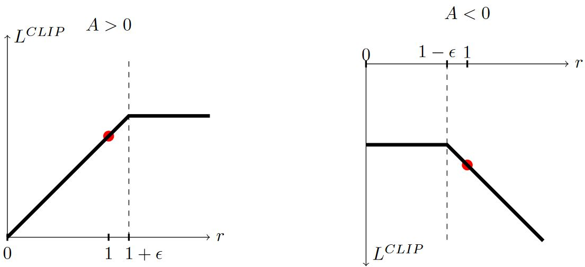
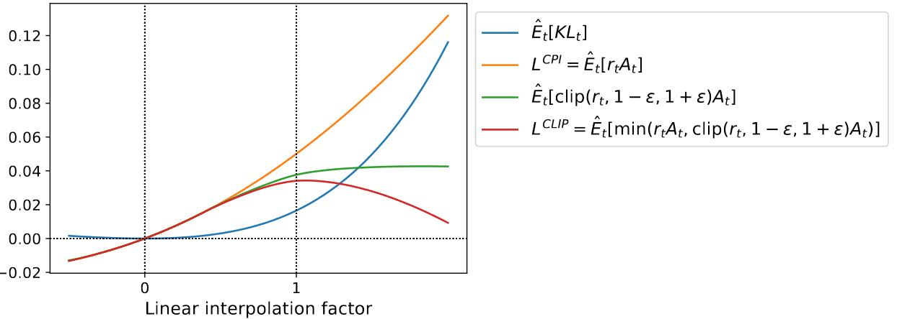
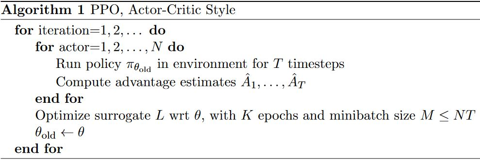

# Proximal Policy Optimization

[Proximal Policy Optimization Algorithms](http://arxiv.org/abs/1707.06347)John Schulman, F. Wolski, P. Dhariwal, A. Radford and O. Klimov, 2017

<br/>

*摘要*——文章提出了一类新的用于强化学习的策略梯度方法，在通过与环境交互采样数据时交替，并使用随机梯度上升优化一个“替代”目标函数。在标准策略梯度方法中每次采样都会进行一次梯度更新，本文提出了一种新的目标函数，使得在多个epochs用minibatch更新成为可能。新方法称为proximal policy optimization (PPO)，具有TRPO的部分优点，但更易于实现，更一般化，且有更好的采样复杂度（从经验上来说）。实验表明，PPO优于其它在线策略梯度方法，总体上在采样复杂度、简洁性和延迟时间之间取得了良好的平衡。

## 1 Introduction

&emsp;&emsp;利用神经网络作函数逼近器的强化学习中，主要的方法有deep Q-learning、原始的策略梯度方法和置信域/自然梯度方法。但是，在以下方面还有改进空间：可扩展性（拓展到大的模型和并行实现）、数据高效和鲁棒性（i.e. 无需调超参数即可胜任不同任务）。

&emsp;&emsp;本文试图介绍一种算法，该算法在只使用一阶优化的情况下，达到TRPO的数据效率和可靠性能。我们提出了一个新的截断概率比（clipped probability ratios）目标，形成了对策略表现的悲观估计（i.e. 下界）。为了优化策略，我们在从策略中采样数据和对采样数据进行多次优化之间进行交替。

&emsp;&emsp;实验对比了不同的替代目标，发现截断概率比目标最好。与其它方法相比，PPO在连续控制任务中表现得比其它方法好。在Atari中，（在样本复杂度上的）性能显著地比A2C好，且与ACER相当，但PPO更简单。

## 2 Background

### 2.1 Policy Gradient Methods

&emsp;&emsp;策略梯度方法计算策略梯度的估计量，并将其插入到随机梯度上升算法中。虽然提倡使用相同的轨迹对目标函数进行多步优化，但这样做的理由并不充分，而且在经验上往往会导致<b><font color="#FF4500">破坏性的大的策略更新</font></b>。

### 2.2 Trust Region Methods

&emsp;&emsp;TRPO中，在策略更新大小的约束下最大化目标函数（“替代”目标）。在论证TRPO时，实际使用的是惩罚项而不是约束条件。这源于某个替代目标（它计算状态上的最大KL而不是均值）对策略$$\pi$$的性能形成了一个下界。TRPO用硬约束来代替惩罚项是因为很难选择合适的罚系数$$\beta$$，固定的$$\beta$$无法胜任不同的问题，甚至在一个简单的问题上都可能效果不好。要想<b><font color="#FF4500">用一阶算法来模拟TRPO的单调改进很难</font></b>，选择一个固定的罚系数并用SGD来优化“替代”目标函数是不够的，还需要更多修饰。

## 3 Clipped Surrogate Objective

&emsp;&emsp;用$$r_t(\theta)$$表示概率比值$$r_t(\theta) = \frac{\pi_{\theta}(a_t \vert s_t)}{\pi_{\theta_{\text{old}}}(a_t \vert s_t)}$$，所以有$$r_t(\theta_{\text{old}}) = 1$$。TRPO最大化的“替代”目标即

$$  L^{\text{CPI}}(\theta)
=   \hat{\mathbb{E}}_t \left[
        \frac{\pi_\theta(a_t \mid s_t)}{\pi_{\theta_{\text {old }}}(a_t \mid s_t)} \hat{A}_t
    \right]
=   \hat{\mathbb{E}}_t\left[r_t(\theta) \hat{A}_t\right]
$$

上标CPI表示conservative policy iteration（保守策略迭代）。在没有约束条件的情况下，最大化这个目标函数会带来非常大的策略更新，所以下面我们需要修饰这个目标，惩罚那些让$$r_t(\theta)$$远离1的策略变化。

&emsp;&emsp;我们提出了如下目标函数：

$$\color{green}{
    L^{\text{CLIP}}(\theta)
=   \hat{\mathbb{E}}_t \left[ 
        \min \left( r_t(\theta) \hat{A}_t, 
                    \operatorname{clip}(r_t(\theta), 1-\epsilon, 1+\epsilon) \hat{A}_t \right) 
    \right]
}$$

```tip
clip( , , )函数，当第一项小于第二项时，函数值 = 第二项；当第一项大于第三项时，函数值 = 第三项；否则，函数值 = 第一项。
```

其中$$\epsilon$$是一个超参数，这里$$\epsilon = 0.2$$。$$\min$$函数中第一项即$$L^{\text{CPI}}$$。第二项$$\operatorname{clip}(r_t(\theta), 1-\epsilon, 1+\epsilon) \hat{A}_t$$通过截断概率比值的方式修饰了“替代”目标，移除了将$$r_t$$移出$$[1-\epsilon, 1+\epsilon]$$的激励。通过取截断目标和未截断目标中更小的，就可以得到未截断目标的一个下界。通过这个机制，我们可以忽略让目标更好的概率比的变化，但是考虑让目标更差的概率比的变化。注意，在$$\theta_{\text{old}}$$附近$$L^{\text{CLIP}} = L^{\text{CPI}}$$一阶成立，但是$$\theta$$离开$$\theta_{\text{old}}$$后就不成立了。注意，概率比在$$1-\epsilon$$处还是$$1+\epsilon$$处截断取决于adavantage $$\hat{A}_t$$的正负。下图是$$L^{\text{CLIP}}$$中的一项（i.e. 某个时刻$$t$$），整个$$L^{\text{CLIP}}$$是很多这样的项的和。

<figure></figure>

&emsp;&emsp;下图是“替代”目标$$L^{\text{CLIP}}$$另一种直觉来源，展示了在一个连续的控制问题上通过近端策略优化（我们将简要介绍的算法）得到的沿策略更新方向插值时，几个目标是如何变化的。

<figure>
    
    <figcaption>“替代”目标，因为我们在初始策略参数和更新的策略参数之间进行插值，而更新的策略参数是在PPO迭代一次之后计算的。更新后的策略与初始策略的KL散度约为0.02，此时L<sup>CLIP</sup>最大。该图对应于Hopper-v1问题上的第一次策略更新，使用了6.1节中提供的超参数。</figcaption>
</figure>

## 4 Adaptive KL Penalty Coefficient

&emsp;&emsp;另一种可以代替或者作为补充的方法，就是对KL散度加惩罚项，并且自适应地调整惩罚项的系数，使得每次策略更新的时候可以达到某个期望的KL散度值$$d_{\text{targ}}$$。在我们的实验中，KL惩罚项的性能不如截断代替目标，但该方法是一个重要的baseline，所以我们没有省略。

&emsp;&emsp;该算法的最简单示例，在每次策略更新的时候进行以下操作:  
* 用minibatch SGD的几个epoch，优化含KL惩罚的目标  
    &emsp;&emsp;$$L^{K L P E N}(\theta)=\hat{\mathbb{E}}_t\left[\frac{\pi_\theta\left(a_t \mid s_t\right)}{\pi_{\theta_{\text {old }}}\left(a_t \mid s_t\right)} \hat{A}_t-\beta \operatorname{KL}\left[\pi_{\theta_{\text {old }}}\left(\cdot \mid s_t\right), \pi_\theta\left(\cdot \mid s_t\right)\right]\right]$$
* 计算$$d=\hat{\mathbb{E}}_t\left[\mathrm{KL}\left[\pi_{\theta_{\text {old }}}\left(\cdot \mid s_t\right), \pi_\theta\left(\cdot \mid s_t\right)\right]\right]$$  
    — If $$d \lt d_{\text{targ}}/1.5$$, $$\beta \leftarrow \beta /2$$  
    — If $$d \gt d_{\text{targ}} \times 1.5$$, $$\beta \leftarrow \beta \times 2$$  

更新的$$\beta$$用于下一次策略更新。根据这个方案，策略更新时KL散度很少会与$$d_{\text{targ}}$$相差很大。这种相差很大的情况只会偶尔发生，而且$$\beta$$会迅速调整过来。上面的参数1.5和2都是启发式选择的，但是算法本身对它们并不敏感。$$\beta$$的初值是另一个超参数，但在实际使用是并不重要，因为算法本身会很快调整它。

## 5 Algorithm

&emsp;&emsp;前面章节提到的surrogate losses可以通过在典型的策略梯度实施的基础上小幅变化得到计算和微分。对于那些使用自动微分的实现，一个是简单构造loss $$L^{CLIP}$$或$$L^{KLPEN}$$来代替$$L^{PG}$$，一个是在这个目标上执行多步随机梯度上升。

&emsp;&emsp;大多是可减小方差的advantage函数估计器的计算技巧都利用了一个学过的state-value函数$$V(s)$$。如果用策略和价值函数参数共享的网络结构，我们就必须用结合了策略surrogate和价值函数误差项的loss function。这个目标函数还可以进一步增广，比如增加一项熵bonus以保证充分探索。将这些项结合起来，得到如下目标：

$$  L_t^{CLIP + VF + S}(\theta)
=   \hat{\mathbb{E}}_t \left[
        L_t^{C L I P}(\theta)-c_1 L_t^{V F}(\theta)+c_2 S\left[\pi_\theta\right]\left(s_t\right) \right]
$$

其中，$$c_1, c_2$$为系数，$$S$$为熵bonus，$$L_t^{V F}$$为方差loss $$(V){\theta}(s_t) - V_t^{targ})^2$$。

&emsp;&emsp;策略梯度实现的一种类型，非常适合与递归神经网络一起使用，每$$T$$个时间步长运行策略一次（$$T$$远小于episode长度），并用收集到的样本进行一次更新。这类实现需要一个视野不超过$$T$$的advantage估计器，比如

$$  \hat{A}_t
=   -V(s_t) + r_t + \gamma r_{t+1} + \cdots + \gamma^{T-t+1} r_{T-1}+\gamma^{T-t} V(s_T)
$$

其中，$$t$$表示在给定的T长度的序列片段$$[0,T]$$内的时间索引。写出advantage估计的一般形式，该式会在$$\lambda = 1$$的时候退化成上式。

$$  \hat{A}_t = \delta_t+(\gamma \lambda) \delta_{t+1}+\cdots+\cdots+(\gamma \lambda)^{T-t+1} \delta_{T-1},
\text{ where } \delta_t=r_t+\gamma V\left(s_{t+1}\right)-V\left(s_t\right)
$$

<figure></figure>

&emsp;&emsp;采用定长轨迹片段的PPO算法如上所示。每次迭代，$$N$$个（并行）中的每个actor收集$$T$$时间步长的数据。然后，基于这$$NT$$个时间步长的数据构造surrogate loss，并用minibatch SGD对$$K$$个epochs进行优化。