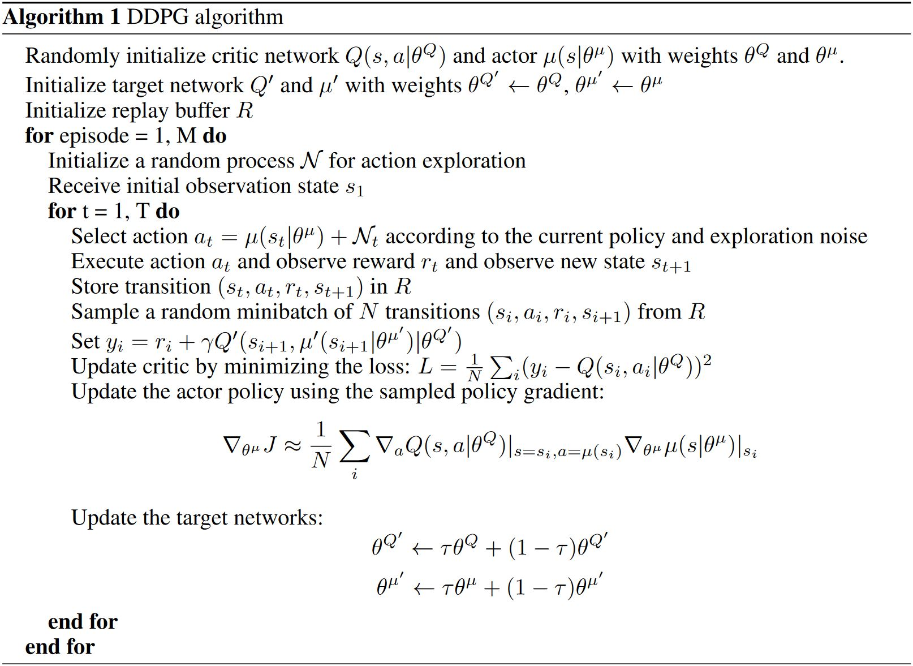

# Continuous Control with DRL

Continuous Control with Deep Reinforcement Learning. [C]//ICLR. Lillicrap T P, Hunt J J, Pritzel A, et al. 2015

 

*摘要*——DDPG试图将deep Q-learning应用到连续动作空间。本文提出了一种基于确定性策略梯度的actor-critic, model-free的算法，该算法可用于连续动作空间。采用同样的学习方法、网络结构和超参数的情况下，DDPG可以鲁棒地解决超过20个模拟的物理问题，包括经典问题，如车杆起摆、灵巧操作、腿的控制和车辆驾驶。DDPG可以找到与能完全获知系统动态的规划方法性能相当的算法。进一步地，对应很多任务，DDPG都能学习“端到端”的策略：直接从输入图像学习。

## 1. Introduction

&emsp;&emsp;AI领域的主要目标之一就是通过未处理的、高维的传感器输入来完成任务。最近，最近已经取得了显著进展，DQN可以通过未处理过的输入像素来玩Atari游戏且水平与人类差不多。为了达到这个目标，深度神经网络函数逼近器被用来估计动作-价值函数。  
&emsp;&emsp;但是，尽管DQN可以解决具有高维输入空间的问题，它只能处理离散且低维的动作空间问题。DQN无法直接应用道连续领域，因为它通过最大化动作-价值函数来选择动作，而这对于连续值的情况意味着每步都需要迭代优化。  
&emsp;&emsp;一个比较显然的解决方式就是对动作空间做离散化处理。但是，这种做法局限性很大，比较值得注意的一点就是维度灾难。过大的动作空间是很难被有效探索的，因此在这种情况下训练类似DQN这样的网络是很困难的。此外，直接把动作空间离散化会丢失动作空间的结构信息，而这些结构信息可能对解决很多问题来说很重要。  

&emsp;&emsp;本文提出了一种model-free, off-policy actor-critic算法，利用深度函数逼近器来学习高维连续动作空间中的策略。本文工作基于确定性策略梯度（DPG）实现。  
&emsp;&emsp;这里，本文将actor-critic方法与DQN结合起来。在DQN之前，一般认为用大的非线性函数逼近器来学习价值函数是困难且不稳定的。<b>DQN能稳定且鲁棒地学习是因为以下两点创新：1. 网络的训练是off-policy的，用的是经验池中的样本，最小化了样本间的关联性；2. 利用一个目标Q网络来训练网络，这样在TD回溯的时候目标是保持一致的。</b>本文利用了类似的思想，以及批量归一化的方法，一个深度学习中的最新进展。  
&emsp;&emsp;为了评估DDPG，本文构造了很多不同的有挑战性的物理控制问题。有一些经典问题，也有新的挑战，比如从视频输入直接学习动作策略。  
&emsp;&emsp;本文提出的model-free的方法称为Deep DPG (DDPG) 可以通过低维的观测（e.g. 笛卡尔坐标系活关节角度）学到有竞争力的策略。在很多情况下，DDPG还能直接从像素学到好的策略，并保持常数超参数和网络结构。  
&emsp;&emsp;该方法的关键特征是简单：只需一个前向的actor-critic架构和具有很少“moving parts”的学习算法，这使得DDPG易于实现且可以被扩展到更难的问题和更大的网络。在物理控制问题上，DDPG有时会超越规划算法的性能。

## 2 Background

&emsp;&emsp;在每个时间步$$t$$，agent都能获取观测$$x_t$$。一般来说，环境是部分可观的，所以可以用整个观测-动作对的历史$$s_t = (x_1, a_1, \ldots, a_{t-1}, x_t)$$来描述状态。这里，假设环境是完全可观的，那么$$s_t = x_t$$。  
&emsp;&emsp;环境$$E$$可能是随机的，被建模成Markov决策过程。  
&emsp;&emsp;从某个状态开始能得到的return定义为$$R_t = \sum_{i=t}^T \gamma^{(i-t)} r(s_i, a_i)$$。RL的目标是学习一个能最大化从初始分布开始得到的期望return的策略，$$J = \mathbb{E}_{r_i, s_i \sim E, a_i \sim \pi}[R_1]$$。对于策略$$\pi$$，其状态访问分布为$$\rho^\pi$$。  

&emsp;&emsp;很多RL方法都是利用一个递归关系，即Bellman方程：

$$  Q^\pi(s_t, a_t)
=   \mathbb{E}_{r_t, s_{t+1} \sim E}
    \big[ r(s_t, a_t) + \gamma \mathbb{E}_{a_{t+1} \sim \pi}[Q^\pi(s_{t+1}, a_{t+1})] \big]
\tag{2} $$

&emsp;&emsp;如果策略是确定性的，即可将策略表示成函数$$\mu : \mathcal{S} \leftarrow \mathcal{A}$$，并省去上式中括号内的期望：

$$  Q^\mu(s_t, a_t)
=   \mathbb{E}_{r_t, s_{t+1} \sim E}
    \big[ r(s_t, a_t) + \gamma Q^\mu(s_{t+1}, \mu(s_{t+1})) \big]
\tag{3} $$

<b>这个期望只与环境有关。</b>这意味着可以用off-policy的方式来学习$$Q^\mu$$，通过另一个随机行为策略$$\beta$$生成的序列来学习。

&emsp;&emsp;Q-learning是一个常用的off-policy算法。考虑由$$\theta ^Q$$参数化的函数逼近器，通过最小化如下loss来优化它：

$$  L\left(\theta^Q\right)
=   \mathbb{E}_{s_t \sim \rho^\beta, a_t \sim \beta, r_t \sim E}
        \left[ \left( Q(s_t, a_t \mid \theta^Q) - y_t \right)^2 \right]
\tag{4} $$

其中，

$$  y_t
=   r(s_t, a_t) + \gamma Q\left( s_{t+1}, \mu(s_{t+1}) \mid \theta^Q \right)
\tag{5} $$

这里$$y_t$$也由$$\theta ^Q$$决定，这点往往被忽略。

## 3 Algorithm

&emsp;&emsp;Q-learning无法直接应用到连续动作空间上，因为在连续空间中求贪心策略需要在每个时间步都对$$a_t$$做优化。所以，这里用了基于DPG算法的actor-critic方法。

&emsp;&emsp;DPG算法维护了一个参数化的actor函数$$\mu(s \vert \theta^\mu)$$，这个函数通过将状态确定性地映射到一个动作的方式表示当前策略。Critic $$Q(s, a)$$和Q-learning一样利用Bellman方程来学习。Actor的更新方式如下：

$$\begin{aligned}
    \nabla_{\theta^\mu} J 
& \approx   \mathbb{E}_{s_t \sim \rho^\beta}
            \left[\left. \nabla_{\theta^\mu} Q(s, a \mid \theta^Q) \right|_{s=s_t, a = \mu(s_t \mid \theta^\mu)}\right] \\
& = \mathbb{E}_{s_t \sim \rho^\beta}
    \left[  \left.\left. \nabla_a Q(s, a \mid \theta^Q) \right|_{s=s_t, a = \mu(s_t)} 
            \nabla_{\theta_\mu} \mu(s \mid \theta^\mu)\right|_{s=s_t} \right]
\end{aligned} \tag{6} $$

DPG中已经证明上式即为<b>策略梯度</b>，策略性能的梯度。

&emsp;&emsp;在Q-learning中引入非线性函数逼近器意味着无法保证收敛。本文的贡献在于借鉴DQN的成功之处改进了DPG，使得算法在大的状态和动作空间中可以用神经函数逼近器在线学习。

&emsp;&emsp;当在RL中用神经网络时，难点在于大多数的优化算法都假设样本是独立同分布的。显然，当样本是对环境序列探索生成的时候，这个假设不成立。另外，为了提高硬件优化的效率，用mini-batch的方式代替在线学习是必不可少的。

&emsp;&emsp;和DQN一样，这里采用<b>经验回放</b>的方法来解决以上问题。因为DDPG是off-policy的算法，所以replay buffer可以很大，算法能够从一系列无关的轨迹中学习。

&emsp;&emsp;直接对神经网络来实现Q-learning（如式(4)所示）已经被证明在很多环境下都是不稳定的。因为网络$$Q(s, a \mid \theta^Q)$$更新的时候也用到了计算目标值式(5)，所以$$Q$$的更新容易发散。DDPG的解决方式类似于目标网络，但是针对actor-critic进行了修改并且使用<b>“软”目标更新</b>，而不是直接复制权重。复制actor和critic的网络，并让这两个目标网络慢慢地跟着学习网络更新：$$\theta^{\prime} = \tau \theta + (1 - \tau)\theta^{\prime}$$，$$\tau \ll 1$$。<b>这限制了目标网络的更新速度，提高了学习的稳定性。</b>这一改变使得学习动作-价值函数与监督学习类似，而监督学习是存在鲁棒解的。我们发现目标$$\mu^{\prime}$$和$$Q^{\prime}$$都需要有稳定的目标$$y_i$$，这样才能保证训练critic的时候不会发散。这种方法学习的速度会比较慢，因为目标网络延缓了价值估计的传播。但是，在实践中，这点不如学习的稳定性重要。

&emsp;&emsp;用低维特征向量观测值学习时，观测的不同部分可能对应不同的物理单元（比如，位置和速度）且这些量的取值范围在不同的环境下不同。这使得网络难以高效地学习，可能会导致难以找到对不同尺度的状态值都适用的超参数。

&emsp;&emsp;本文采用了一种深度学习中的新技术，称为<b>batch normalization</b>。这个技术对一个minibatch中样本的不同维做归一化，得到单位均值和方差。此外，还要维持一个均值和方差的动态平均值，用于测试时的归一化（在DDPG中用于探索或者验证）。在低维的情况下，我们对状态输入、$$\mu$$网络的所有层和动作输入前$$Q$$网络的所有层都做batch归一化。

&emsp;&emsp;连续动作空间中的主要挑战就是探索。<b>像DDPG这样off-policy的方法具有一大优势，可以独立于学习算法来解决探索的问题。</b>通过把从包含噪声的过程$$\mathcal{N}$$中采样的噪声加进actor策略中，构造一个探索策略$$\mu^{\prime}$$

$$ \mu^{\prime}(s_t) = \mu(s_t \mid \theta_t^\mu) + \mathcal{N} $$

根据环境选择合适的$$\mathcal{N}$$。

<figure></figure>