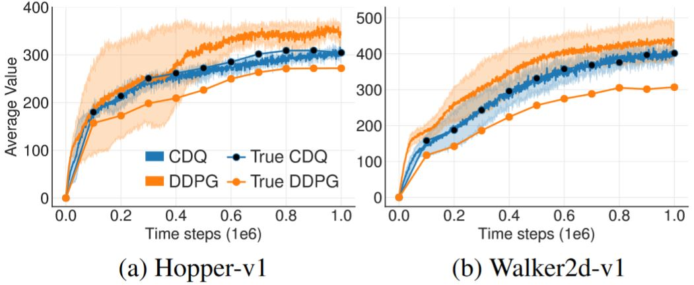
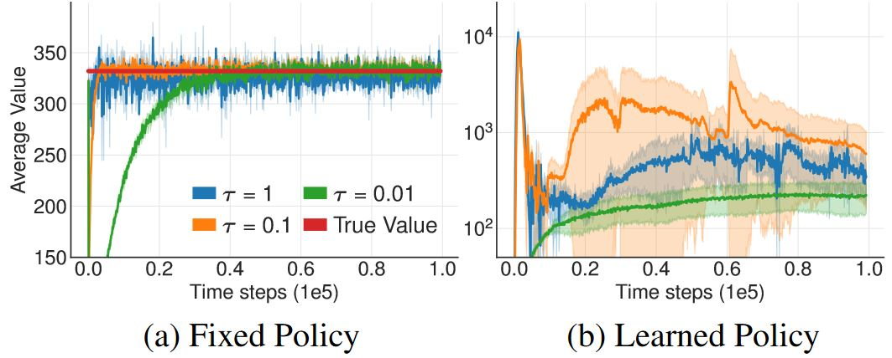
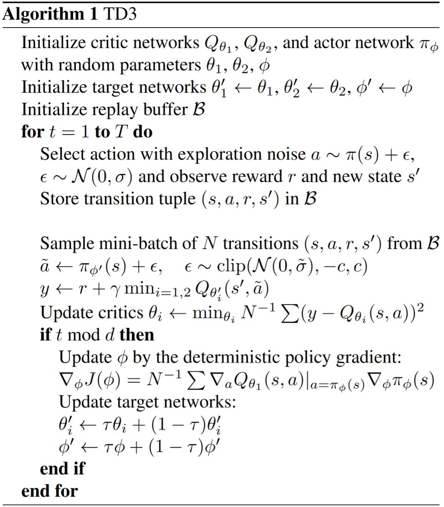

# Twin Delayed DDPG (TD3)

Addressing Function Approximation Error in Actor-Critic Methods. [C]//PMLR. Scott Fujimoto, Herke van Hoof, David Meger. 2018

 

*摘要*——在基于价值的强化学习方法中，如deep Q-learning，函数逼近器的误差会导致高估价值估计和次优策略。本文证明了这个问题在actor-critic架构下仍然存在，并提出了新的机制来最小化它对actor和critic的影响。TD3是基于Double Q-learning的，通过取两个critic中较小的来防止高估。本文描述了目标网络和高估偏差之间的关系，并提出用延迟策略更新来减少每次更新的误差，从而进一步提高性能。利用OpenAI gym进行测试，TD3在每个环境中都表现出了SOTA的性能。

## 1 Introduction

&emsp;&emsp;本文将指出TD方法中的高估偏差和累计误差在actor-critic架构中仍然存在。

&emsp;&emsp;高估偏差偏差是Q-learning的性质，对包含噪声的价值估计做最大化会带来持续存在的overestimation。在使用函数逼近器的情况下，由于估计误差的存在噪声是不可避免的。这种不准确性会被TD学习的特性进一步放大。这意味着每步预测都用了不准确的估计，这将带来累计误差。因为高估误差的存在，这种累计误差可能导致任意不好的状态被估计成一个很高的价值，导致次优的策略更新和发散的行为。

&emsp;&emsp;本文首先证明在连续控制的情况下，高估现象在确定性策略梯度的情况下也是存在的。进一步指出离散动作情况的普适解，Double DQN在actor-critic架构下无法使用。在训练过程中，Double DQN用一个单独的目标价值函数来估计当前策略的价值，使得动作评估的过程中没有最大化偏差。然而，由于actor-critic架构中策略改变较慢，当前与目标价值估计保持十分相似的关系，防止最大化偏差的存在。这个问题可以通过使用一个更早的变体Double Q-learning来解决，通过独立地训练一组critic来**将Double Q-learning拓展到actor-critic架构下**。尽管这样价值估计的偏差会减小，甚至是无偏的，但估计仍有很大的方差，仍然会导致在状态空间的局部存在高估。针对这个问题，本文提出了一个**clipped Double Q-learning**变体，将存在高估偏差的价值估计作为对真值估计的近似上界。这会有利于低估，而低估在学习过程中并不会被传播，因为低价值估计的动作会被策略规避掉。

&emsp;&emsp;考虑到噪声与高估偏差之间的关系，本文包含了多个减小方差的方法。首先，本文证明了目标网络对于减小方差有很重要的作用，因为它们能防止误差累计。然后，为了解决价值与策略的耦合问题，本文提出了在价值估计收敛前延迟策略更新。最后，本文提出了一个新的正则化方法，通过SARSA风格的更新bootstrap相似的动作估计来进一步减小方差。

&emsp;&emsp;本文在DDPG的基础上进行改进，得到Twin Delayed Deep Deterministic policy gradient algorithm (TD3)，TD3是actor-critic架构的，考虑了函数逼近误差与策略和价值更新之间的关系。

## 3 Background

&emsp;&emsp;强化学习的目标就是找到最优策略$$\pi_{\phi}$$，最大化期望return $$J(\theta) = \mathbb{s_i \sim p_{\pi}, a_i \sim \pi} [R_0]$$。在actor-critic方法中，策略即为actor，可以通过确定性策略梯度算法来更新：

$$  \nabla_\phi J(\phi)
=   \mathbb{E}_{s \sim p_\pi} \left[\left.\nabla_a Q^\pi(s, a) \right|_{a=\pi(s)} \nabla_\phi \pi_\phi(s)\right]
\tag{1} $$

其中，$$Q^\pi(s, a) = \mathbb{E}_{s_i \sim p_\pi, a_i \sim \pi}\left[R_t \mid s, a\right]$$即为critic。

&emsp;&emsp;在Q-learning中，$$Q$$函数可以通过TD的方式学习，基于式(2) 的Bellman方程进行更新。

$$  Q^\pi(s, a)
=   r + \gamma \mathbb{E}_{s^{\prime}, a^{\prime}}[Q^\pi(s^{\prime}, a^{\prime})], \quad a^{\prime} \sim \pi(s^{\prime})
\tag{2} $$

对于大的状态空间，可以用一个可微的函数逼近器$$Q_{\theta}(s, a)$$来估计$$Q$$。在deep Q-learning中，用TD更新网络的同时，还用到了一个固定目标网络$$Q_{\theta^{\prime}}(s, a)$$在多次更新的过程中保持一个固定的目标$$y$$：

$$ y = r + \gamma Q_{\theta^{\prime}}(s^{\prime}, a^{\prime}), \quad a^{\prime} \sim \pi_{\phi^{\prime}}(s^{\prime}) \tag{3} $$

其中，动作是根据目标actor网络$$\pi_{\phi^{\prime}}$$选择的。目标网络的权重可以周期性地直接把当前网络的权重直接完全拷贝过来，或者在每个时间步以一定比例更新，$$\theta^{\prime} \leftarrow \tau \theta + (1 - \tau)\theta^{\prime}$$。这种更新可以用于off-policy学习，从经验回放池进行随机minibatch采样。

## 4 Overestimation Bias

&emsp;&emsp;在离散动作的情况下，高估偏差明显是最大化造成的伪迹。而在actor-critic架构下，高估偏差的存在和影响相对来说不那么明显，因为策略是通过梯度下降的方式学习的。首先证明在4.1节的一些基本假设下，确定性策略梯度中的价值估计将是高估的。然后在4.2节中，本文将提出Double Q-learning在actor-critic架构下的一个clipped变体，减小高估偏差。

### 4.1 Overestimation Bias in AC

&emsp;&emsp;本节中假设策略是根据确定性策略梯度更新的，并证明这种更新方式会导致高估。给定当前策略参数$$\phi$$，用$$\phi_{\text{approx}}$$表示根据最大化近似critic $$Q_{\theta}(s,a)$$更新的actor参数，$$\phi_{\text{true}}$$表示根据真的价值函数$$Q^{\pi}(s,a)$$进行假设actor更新的参数（学习过程中是不知道的）：

$$\begin{aligned}
    \phi_{\text{approx}} 
& = \phi + \frac{\alpha}{Z_1} 
    \mathbb{E}_{s \sim p_\pi} \left[\left.\nabla_\phi \pi_\phi(s) \nabla_a Q_\theta(s, a) \right|_{a=\pi_\phi(s)}\right] \\
    \phi_{\text{true}} 
& = \phi + \frac{\alpha}{Z_2} 
    \mathbb{E}_{s \sim p_\pi} \left[\left.\nabla_\phi \pi_\phi(s) \nabla_a Q^\pi(s, a) \right|_{a=\pi_\phi(s)}\right]
\end{aligned}   \tag{4} $$

其中，假设$$Z_1$$和$$Z_2$$是用来对梯度进行正则化的，i.e.，使得$$Z^{-1} \| \mathbb{E}[\cdot] \| = 1$$。如果没有梯度正则化，那么高估偏差势必会出现在稍严格一点的条件下。补充材料中进一步研究了这个案例。用$$\pi_{\text{approx}}$$和$$\pi_{\text{true}}$$分别表示用$$\phi_{\text{approx}}$$和$$\phi_{\text{true}}$$参数化的策略。

&emsp;&emsp;由于梯度方向是局部最大化的，所以存在一个足够小的$$\epsilon_1$$使得如果$$\alpha \le \epsilon_1$$，那么$$\pi_{\text{approx}}$$的**近似值**的下界将由$$\pi_{\text{true}}$$的**近似值**决定：

$$  \mathbb{E}[Q_\theta(s, \pi_{\text{approx}}(s))] 
\ge \mathbb{E}[Q_\theta(s, \pi_{\text{true}}(s))]
\tag{5} $$

&emsp;&emsp;相反地，存在一个足够小的$$\epsilon_2$$使得如果$$\alpha \le \epsilon_2$$，那么$$\pi_{\text{approx}}$$的**真值**的上界将由$$\pi_{\text{true}}$$的**真值**决定：

$$  \mathbb{E}[Q^\pi(s, \pi_{\text{true}}(s))] 
\ge \mathbb{E}[Q^\pi(s, \pi_{\text{approx}}(s))]
\tag{6} $$

&emsp;&emsp;如果在期望中，价值估计至少和与$$\phi_{\text{true}}$$相关的真值一样大，$$\mathbb{E}[Q_\theta(s, \pi_{\text{true}}(s))] \ge \mathbb{E}[Q^\pi(s, \pi_{\text{true}}(s))]$$，那么式(5) 和(6) 意味着如果$$\alpha \le \min(\epsilon_1, \epsilon_2)$$，那么价值估计将会高估：

$$  \mathbb{E}[Q_\theta(s, \pi_{\text{approx}}(s))]
\ge \mathbb{E}[Q^\pi   (s, \pi_{\text{approx}}(s))]
\tag{7} $$

&emsp;&emsp;尽管这种高估在每次更新时都是最小的，但是这种误差的存在引起了两个问题。<b>第一，如果不加控制，这种高估可能会在多步更新后发展成显著偏差。第二，不准确的价值估计可能会导致差的策略更新。</b>这个问题尤其严重，因为存在反馈回路，次优的critic可能会导致次优动作的出现频率变高，下次策略更新时会强化次优动作。

**这种理论上的高估在SOTA方法的实践中会出现吗？**  
<figure>
    
    <figcaption>图1. DDPG与Cipped Double Q-learning中价值估计的高估偏差的对比，在MuJoCo环境中运行超过一百万个时间步长</figcaption>
</figure>

### 4.2 Clipped Double Q-Learning for AC

&emsp;&emsp;已有的减小高估偏差的方法在actor-critic架构下不起作用。本节提出了一种新的Double Q-learning的clipped变体，可以替换任意actor-critic方法中的critic。

&emsp;&emsp;在Double Q-learning中，通过维持两个分开的价值估计讲贪心更新与价值函数分离开，这两个价值估计更新时互相会用到对方。如果这两个价值估计是无关的，那么它们可以被用来对另一个价值估计选择的动作做无偏估计。在Double DQN中，作者提出用目标网络作为其中一个价值估计，并对当前价值网络求最大值得到贪心策略。Actor-critic架构下有类似的更新方式，在学习目标中用当前策略而不是目标策略：

$$  y = r + \gamma Q_{\theta^{\prime}}(s^{\prime}, \pi_\phi(s^{\prime}))    \tag{8} $$

&emsp;&emsp;但是，在实践过程中，actor-critic下策略更新较慢，当前和目标网络太相似无法做出独立的估计，也没有提供多少改进。反而，可以用原始的Double Q-learning的公式，一对actors $$(\pi_{\phi_1}, \pi_{\phi_2})$$和critics $$(Q_{\theta_1}, Q_{\theta_2})$$，其中$$\pi_{\phi_1}$$根据$$Q_{\theta_1}$$优化，$$\pi_{\phi_2}$$根据$$Q_{\theta_2}$$优化：

$$\begin{aligned}
    y_1 &= r + \gamma Q_{\theta^{\prime}_2}(s^{\prime}, \pi_{\phi_1}(s^{\prime}))   \\
    y_2 &= r + \gamma Q_{\theta^{\prime}_1}(s^{\prime}, \pi_{\phi_2}(s^{\prime}))
\end{aligned}   \tag{9} $$

<figure>
    
    <figcaption>Double DQN的actor-critic变体 (DDQN-AC) 与Double Q-learning (DQ-AC) 中价值估计的高估偏差的对比，在MuJoCo环境中运行超过一百万个时间步长</figcaption>
</figure>

&emsp;&emsp;从图2 中可以看出DDQN-AC也和DDPG一样有类似的高估问题，而Double Q-learning的估计虽然有效得多，但也没有完全消除高估。6.1节进一步证明了这种减小在实验中是不够的。

&emsp;&emsp;由于$$\pi_{\phi_1}$$是根据$$Q_{\theta_1}$$优化的，在$$Q_{\theta_1}$$的目标更新中用一个独立的估计将防止策略更新引入偏差。但是，critics之间并不是完全独立的，因为在学习目标的时候会用到另一个critic和同一个经验回放池。所以，对于某些状态$$s$$可能会有$$Q_{\theta_2}(s^, \pi_{\phi_1}(s)) \gt Q_{\theta_1}(s, \pi_{\phi_1}(s))$$。这可能会导致$$Q_{\theta_1}(s, \pi_{\phi_1}(s))$$总体上高估了真值，并且在状态空间的特定区域高估还会被进一步放大。为了解决这个问题，本文提出直接用有偏估计$$Q_{\theta_1}$$来作为偏差较小的价值估计$$Q_{\theta_2}$$的上界。即取两个估计中较小的那个，<b>Cipped Double Q-learning算法的更新目标为：</b>

$$\color{green}{
    y_1 = r + \gamma \min_{i=1,2} Q_{\theta^{\prime}_i}(s^{\prime}, \pi_{\phi_1}(s^{\prime}))
}\tag{10} $$

&emsp;&emsp;采样Cipped Double Q-learning算法，价值目标不会给使用标准Q-learning的目标带来额外的高估。尽管这个更新策略可能会带来低估的问题，但显然高估偏差更需要避免，被低估的动作在策略更新的过程中不会被显式传播。

&emsp;&emsp;在实现中，通过只用一个根据$$Q_{\theta_1}$$更新的actor可以减小计算消耗。对于$$Q_{\theta_2}$$可以用同样的目标$$y_2 = y_1$$。如果$$Q_{\theta_2} \gt Q_{\theta_1}$$，那么更新等价于标准更新且无额外偏差。如果$$Q_{\theta_2} \lt Q_{\theta_1}$$，那么意味着出现了高估，价值减小的方式与Double Q-learning类似。有限MDP情况下的收敛性证明是从这个直觉出发的，详见补充材料。

&emsp;&emsp;还有一个次要好处，通过把函数逼近器的误差看作随机变量，我们可以看出取最小的操作会为具有更低方差估计误差的状态提供更高的价值，因为一组随机变量的最小值随随机变量方差的增大而减小。这意味着式(10) 的<b>取最小值的操作会偏好具有低方差的价值估计的状态，稳定的学习目标会带来更安全的策略更新</b>。

## 5 Addressing Variance

&emsp;&emsp;第4章解决了方差对高估偏差的影响，但是方差本身还没有解决。除了对高估偏差有影响，高的方差还会给策略更新的梯度带来噪声。这点在实践中已经被证明会减慢训练速度并影响性能。本章将强调在每次更新时都最小化误差的重要性，建立目标网络和估计误差之间的关系，对actor-critic的学习步骤提出改进来减小方差。

### 5.1 Accumulating Error

&emsp;&emsp;估计误差在使用函数逼近器的情况下会恶化，因为并不完全满足Bellman方程，每次更新都会有残留的TD-error $$\delta(s,a)$$：

$$  Q_\theta(s, a)
=   r + \gamma \mathbb{E}\left[Q_\theta(s^{\prime}, a^{\prime})\right] - \delta(s, a)
\tag{11} $$

可以看出，**价值估计不是学习期望return的估计，而是对期望return减去期望的未来TD-errors折扣和做近似**：

$$\begin{aligned}
    Q_\theta(s_t, a_t)
&=  r_t + \gamma \mathbb{E}[Q_\theta(s_{t+1}, a_{t+1})] - \delta_t \\
&=  r_t + \gamma \mathbb{E}[r_{t+1} + \gamma \mathbb{E}[Q_\theta(s_{t+2}, a_{t+2}) - \delta_{t+1}]] - \delta_t \\
&=  \mathbb{E}_{s_i \sim p_\pi, a_i \sim \pi} \left[ \sum_{i=t}^T \gamma^{i-t}\left(r_i-\delta_i\right) \right]
\end{aligned}   \tag{12}$$

&emsp;&emsp;如果价值估计是关于未来奖励和估计误差的函数，那么估计的方差会与未来奖励和估计误差的方差成正比。给定一个大的折扣系数$$\gamma$$，如果在每次更新的时候误差没有被控制，那么方差会随着每次更新快速增长。并且，每次梯度更新只能减小与一个小的mini-batch相关的误差，这无法保证在这个mini-batch之外的价值估计误差的大小。

### 5.2 Target Networks and Delayed Policy Updates

&emsp;&emsp;本节探讨了目标网络和函数近似误差之间的关系，发现使用稳定的目标可以抑制误差的增长。这点使得在设计强化学习算法时，能够考虑高方差的估计与策略性能之间的相互影响。

&emsp;&emsp;目标网络是深度强化学习中一个为人们所熟知的获得稳定性的工具。目标网络在学习步骤中提供了一个稳定的目标，使得能够更大范围地覆盖训练数据。如果目标不固定，那么每次更新都会留下残差，而残差会累计。误差累计本身就是有害的，同时又有对价值估计求最大的策略，这二者一起会导致价值价值高度发散。

<figure>
    
    <figcaption>Hopper-v1环境中，无目标网络（τ=1）与缓更新的目标网络（τ=0.1, 0.01）随机状态的平均估计值，有一个固定的和一个学到的策略</figcaption>
</figure>

&emsp;&emsp;图3 提供了一些直观的理解。在没有目标网络的情况下进行价值估计的更新，所有的更新率都会导致类似的收敛行为。但是，当策略是根据当前价值估计训练的时候，使用快速更新的目标网络会导致高度发散的行为。

**为什么actor-critic方法学习失败了？**  
&emsp;&emsp;上述结果表明，没有目标网络时的发散是因为策略更新过程中价值估计的方差很大。图3 及第4章都表明失败可能是因为actor和critic更新过程中的相互作用。当策略较差时，价值估计会因为高估而发散，而如果价值估计本身就不准确，那么策略也会变差。

&emsp;&emsp;如果目标网络可以抑制误差，并且基于高误差状态的策略更新会导致行为发散，那么策略网络应该按比价值网络低的频率更新，这样可以在引入策略更新前最小化误差。本文提出<b>延迟策略更新</b>，直到价值误差尽可能地小。即在一定次数的critic更新后再更新策略和目标网络。为了保证TD error保持很小的值，我们缓慢地更新目标网络$$\theta^{\prime} \leftarrow \tau \theta + (1-\tau) \theta^{\prime}$$。

&emsp;&emsp;通过延迟策略更新，限制了对同样的critic重复策略更新的可能性。低频率的策略更新将使用更小方差的价值估计，理论上会带来更高质量的策略更新。这就创建了一个双时间尺度算法，在线性设定下通常需要收敛。6.1节的实验结果可以验证这种更新策略的有效性根据。

### 5.3 Target Policy Smoothing Regularization

&emsp;&emsp;确定性策略的一个问题是在价值估计时可能会过拟合一些窄的尖峰。在更新critic时，用了确定性策略的学习目标非常容易受到函数逼近器误差带来的不准确性的影响，导致目标的方差变大。这样带来的方差可以通过正则化来减小。本文提出一种深度价值学习的正则化策略，<b>target policy smoothing</b>，模仿了SARSA的更新方式。本文的方法贯彻了相似的动作应该有相似价值的理念。如果函数逼近器绝对地做到了这点，那么可以通过修改训练过程来强制相似动作符合这个关系。本文提出在目标动作附近的小区域内拟合价值

$$  y
=   r + \mathbb{E}_\epsilon[Q_{\theta^{\prime}}(s^{\prime}, \pi_{\phi^{\prime}}(s^{\prime})+\epsilon)]
\tag{13} $$

这通过自举相似的状态-动作价值估计带来了平滑价值估计的好处。在实践中，可以通过**给目标策略加入少量随机噪声，并对mini-batches取平均**来近似这个关于动作的期望。改进的目标更新：

$$  y
=   r + \gamma \mathbb{E}_\epsilon[Q_{\theta^{\prime}}(s^{\prime}, \pi_{\phi^{\prime}}(s^{\prime})+\epsilon)],
\epsilon \sim \operatorname{clip}(\mathcal{N}(0,\sigma), -c, c)
\tag{14} $$

其中，对加入的噪声进行裁剪，保证目标保持在小范围内。这样做的结果让人联想到Expected SARSA，在那个算法中价值估计是离策略学习的，并且选择加到目标策略中的噪声是与探索策略无关的。学到的价值估计与由参数$$\sigma$$定义的含噪声的策略相关。

&emsp;&emsp;直觉上，根据SARSA价值估计得到的策略会更安全，因为能够**抗扰的动作会被赋予更高的价值**。因此，这种更新还可以改进在随机领域中有失败案例的方法。类似的想法由Nachum等人在[Smoothed action value functions for learning gaussian policies, 2018](http://proceedings.mlr.press/v80/nachum18a/nachum18a.pdf)一文中提出，与本文对$$Q_{\theta^{\prime}}$$做平滑不同，他们是对$$Q_{\theta}$$做平滑处理。

<figure></figure>

## 7 Conclusion

&emsp;&emsp;本文发现高估偏差在actor-critic方法中也会带来问题。具有离散动作空间的Deep Q-learning中常用的减小高估偏差的方法在actor-critic中不适用。本文提出的Double Q-learning的变体可以尽可能地减小高估。

&emsp;&emsp;由于噪声和高估间的关系，本文分析了TD学习中的误差积累。本文研究了DRL中一个标准技巧的重要性，目标网络，从不精确的函数逼近和随机优化两个方面分析了这一技巧在限制误差方面的作用。最后，本文提出了一个SARSA风格的正则化技巧，通过修改TD目标来自举相似的状态-动作对。

&emsp;&emsp;本文提出的Twin Delayed Deep Deterministic policy gradient algorithm (TD3)极大地改善了DDPG的学习速度和性能，且超越了很多SOTA方法。本文的改进易于实现，可以被应用到任何其它actor-critic方法中。