# NeRF初步

## 1.1 显式 / 隐式建模

### 1.1.1 显式建模

<figure>
    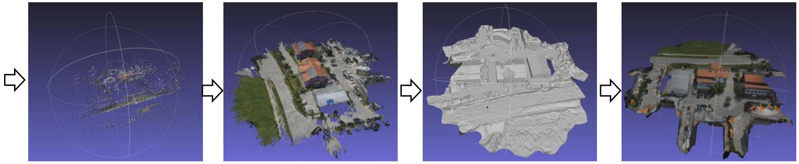
    <figcaption>传统方法得到的三维模型可能存在空洞</figcaption>
</figure>

<style>
table
{
    margin: auto;
}
</style>

|步骤|输入|输出|
|:----:|:----:|:----:|
|运动恢复结构（SfM）|多视角图像 摄像机内参|稀疏三维点云 摄像机外参（位姿）|
|多视立体视觉（MVS）|多视角图像 摄像机内、外参 稀疏三维点云|稠密三维点云|
|表面重建|稠密三维点云|场景/模型的三角网格|
|纹理重建|多视角图像 摄像机内、外参|场景/模型的纹理图像|

表面重建的结果可以用于物理仿真，纹理重建的结果可用于可视化。

### 1.1.2 隐式建模

<figure>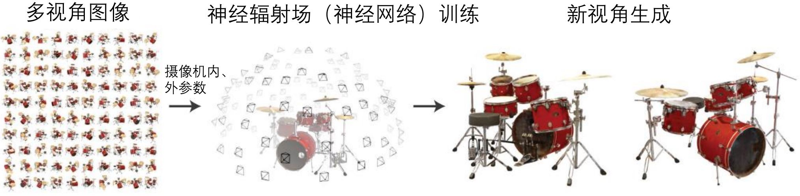</figure>

```warning
基于NeRF的方法可以用于可视化，但由于没有表面重建的过程，所以无法用于物理仿真
```

案例：BlockNeRF-城市级渲染、$$\text{F}^2$$NeRF-自由视点渲染

1. 什么是摄像机内、外参数？
2. 为什么需要摄像机内、外参数？
3. 如何获得摄像机内、外参数？

```note
摄像机的内参数由EXIF信息生成（可直接使用Colmap、Metashape等软件获得），外参数由运动恢复结构（SfM）获得。
```

## 1.2 相机几何与运动恢复结构

### 1.2.1 相机几何

<figure>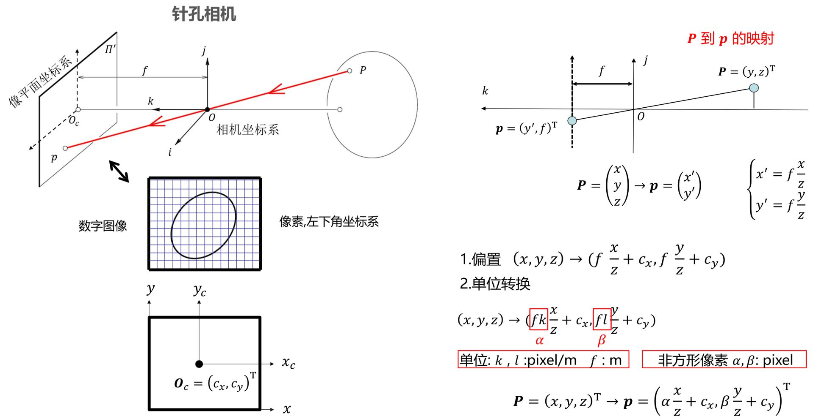</figure>

* 问题：点$$P$$到点$$p$$的变换是线性的吗？ 

<figure>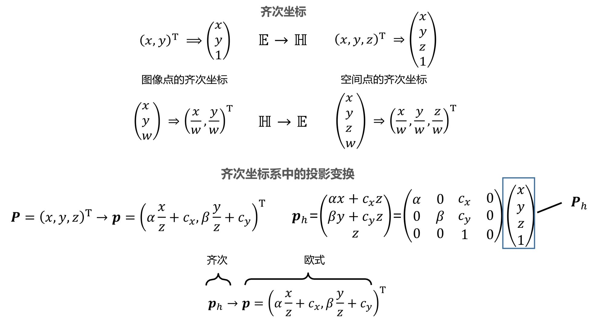</figure>

```tip
后续内容中没有特殊说明，所有坐标均采用齐次坐标表示，因此，不再使用h下标标识。
```

#### 1.2.1.1 内参

<figure>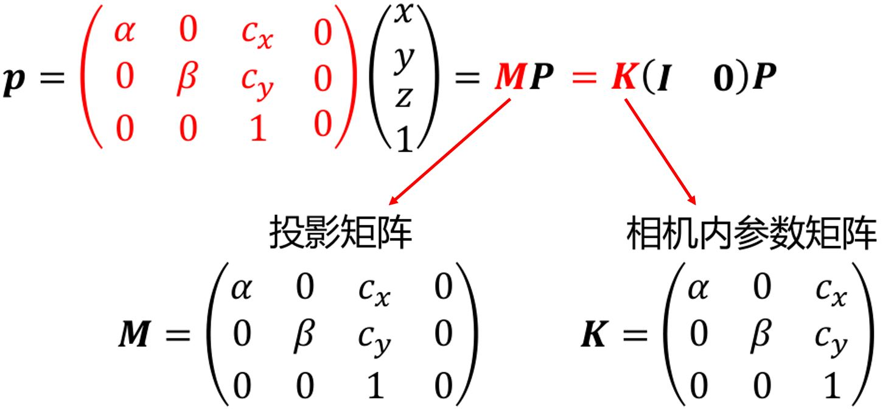</figure>

**内参数决定了相机坐标系下空间点到图像点的映射！**

#### 1.2.2.2 外参

* 相机坐标系描述三维物体的空间信息是否方便？  
* 如何将物体从世界坐标系转到相机坐标系？

#### 1.2.2.3 相机模型

<figure>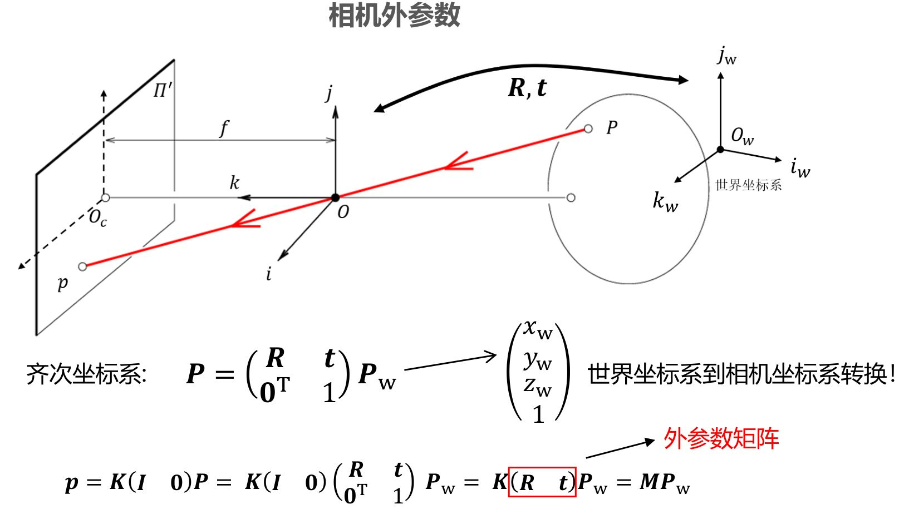</figure>

<figure>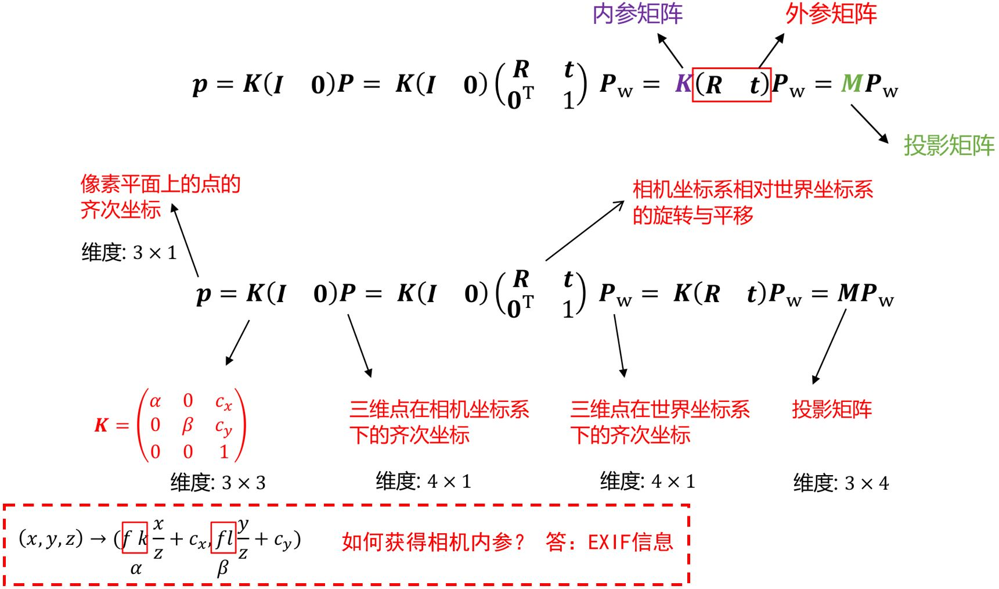</figure>

### 1.2.3 三角化与极几何

从单张图像恢复场景几何很困难，因为单幅视图2D到3D的映射具有多义性。

#### 1.2.3.1 三角化

<figure>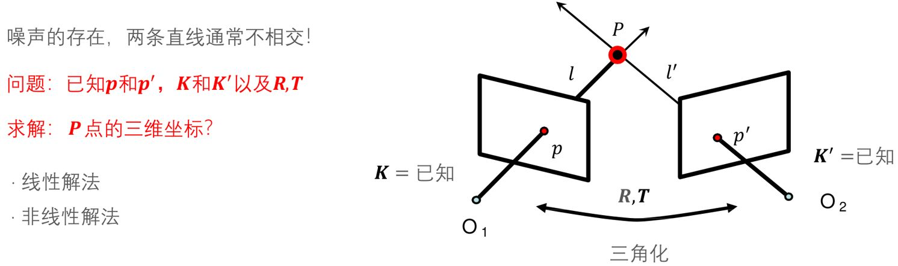</figure>

<figure>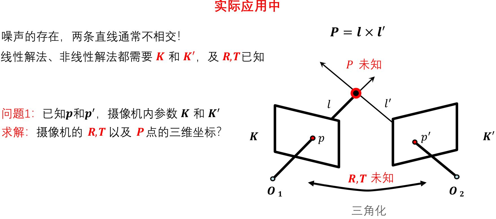</figure>

#### 1.2.3.2 极几何

<b><font color="#00B050">极几何</font></b>描述了同一场景或者物体的两个视点图像间的几何关系。

<figure>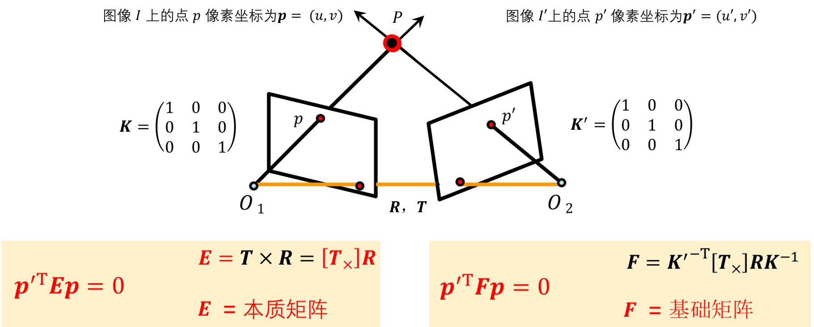</figure>

<b><font color="#00B050">本质矩阵</font></b>对规范化摄像机拍摄的两个视点图像间的极几何关系进行代数描述。  
<b><font color="#00B050">基础矩阵</font></b>对一般的透视摄像机拍摄的两个视点的图像间的极几何关系进行代数描述。

### 1.2.4 运动恢复结构

<b><font color="#00B050">Structure from Motion (SfM) </font></b>通过三维场景的多张图象，恢复出该场景的三维结构信息以及每张图片对应的摄像机参数。

<figure>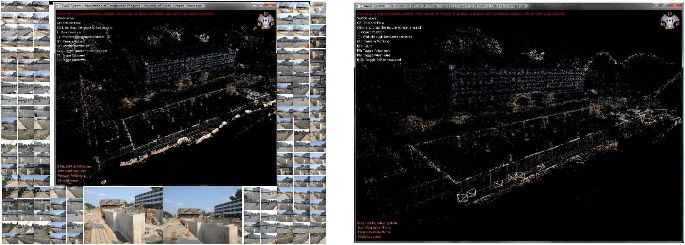</figure>

<figure>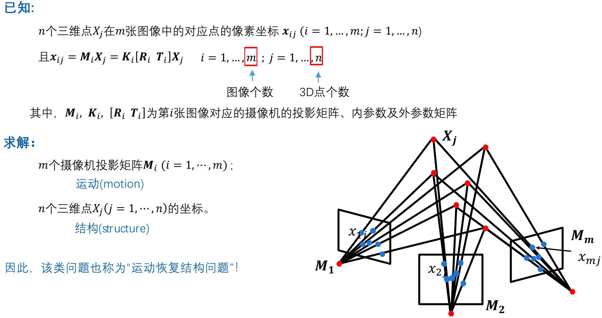</figure>

三种典型的运动恢复结构任务
1. 欧式结构恢复（摄像机内参数已知，外参数未知）
2. 仿射结构恢复（摄像机为仿射相机，内、外参数均未知）
3. 透视结构恢复（摄像机为透视相机，内、外参数均未知）

**欧式结构恢复（2视图）**

求解：$$n$$个三维点$$𝑋_𝑗 (j = 1, \cdots , n )$$的坐标；  
&emsp;&emsp;&emsp;$$m$$个摄像机的外参数$$\mathbf{R}_i$$及$$\mathbf{T}_i (i = 1, \cdots , m)$$

<figure>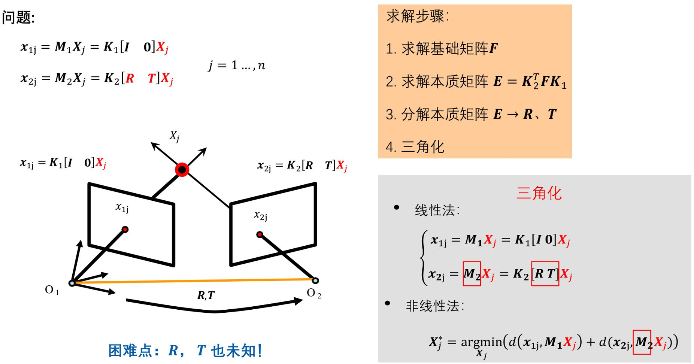</figure>

**代数方法（𝑵视图情况）**

<figure>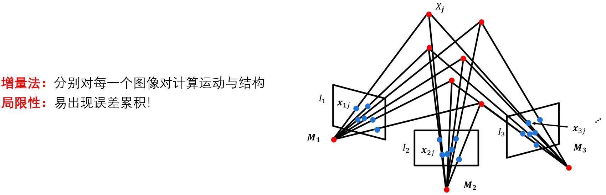</figure>

**捆绑调整（Bundle Adjustment）** <font color="#3399ff">恢复结构和运动的非线性方法</font>

<figure>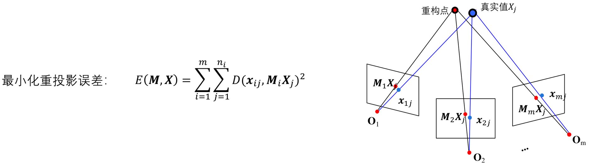</figure>
