# MLP与优化算法

<figure>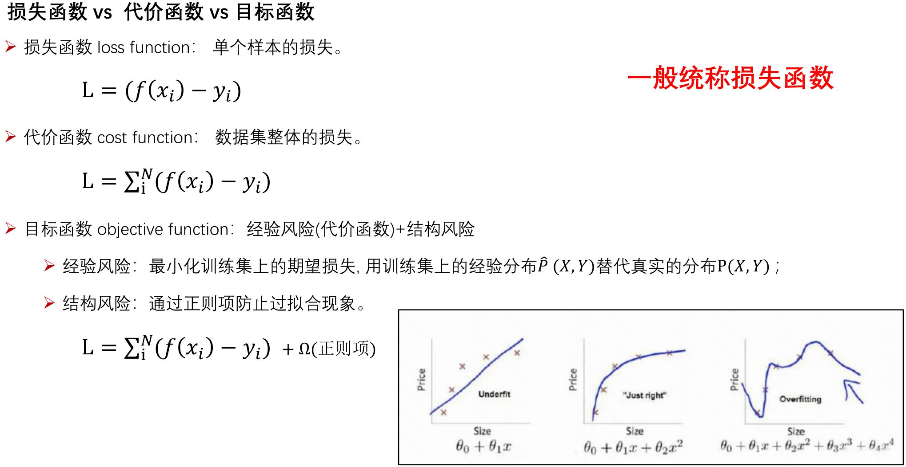</figure>

<figure>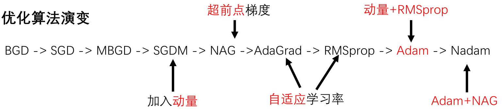</figure>

## 2.1 SGD家族

<figure>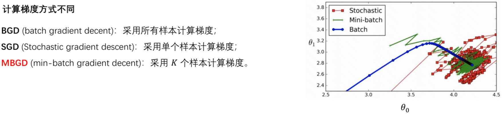</figure>

<figure>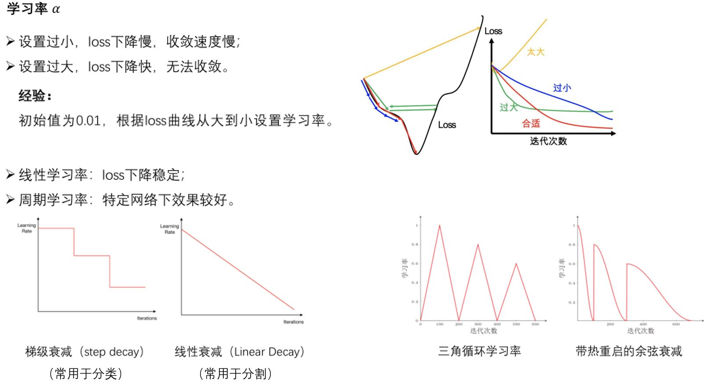</figure>

<figure>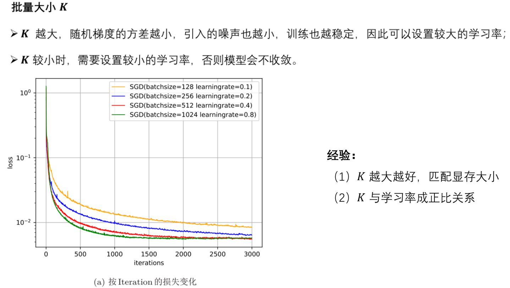</figure>

<b>缺点：梯度方向：收敛速度慢，可能在鞍点处震荡；  
&emsp;&emsp;&emsp;学习率：需要手动设定，非最优。</b>

## 2.2 SGD with Momenturn

<figure>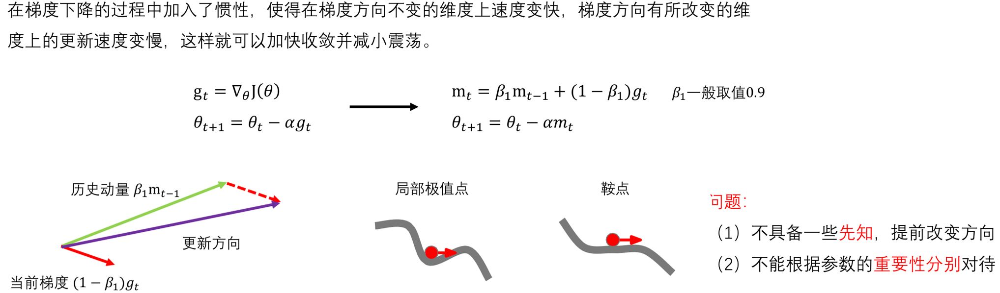</figure>

## 2.3 SGD with NAG

<figure>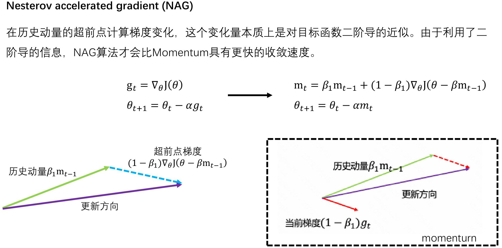</figure>

## 2.4 AdaGrad

<figure>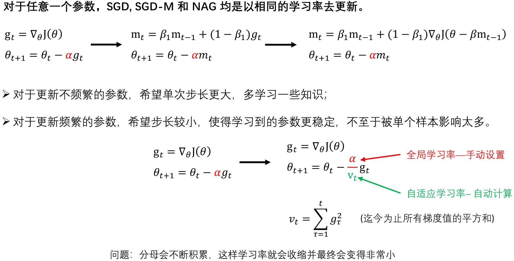</figure>

## 2.5 RMSprop

<figure>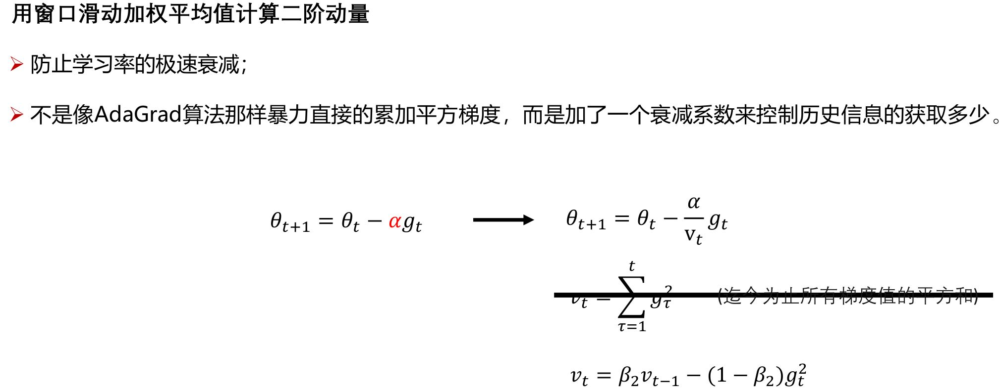</figure>

## 2.6 Adam & Nadam

<figure>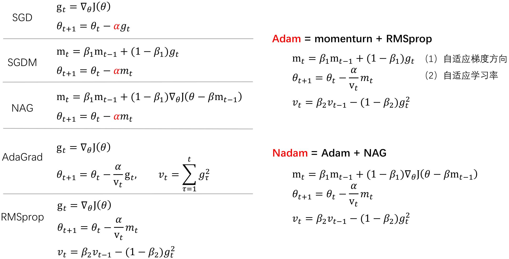</figure>

思考：[Adam那么棒，为什么还对SGD念念不忘？](https://www.zhihu.com/column/juliuszh)

## 2.7 梯度折断

&emsp;&emsp;一种比较简单的启发式方法，把梯度的模限定在一个区间，当梯度的模小于或大于这个区间时就进行截断。（在训练Transformer时经常用到）

$$\mathbf{g}_t = \max(\min(\mathbf{g}_t, b), a)$$

<figure>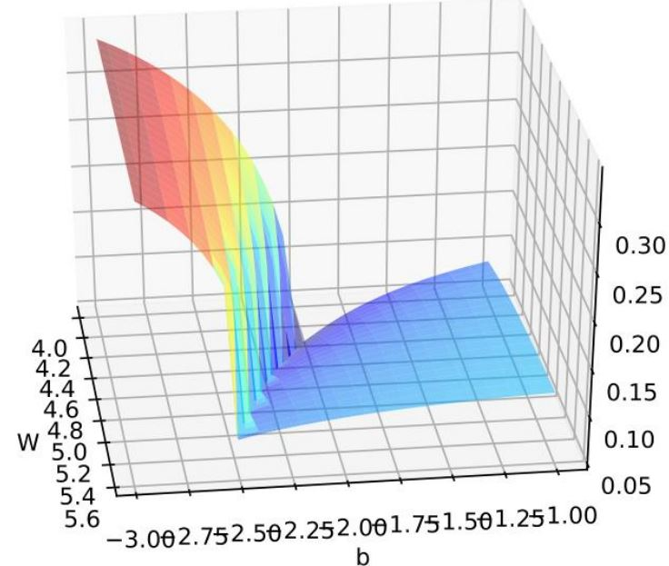</figure>