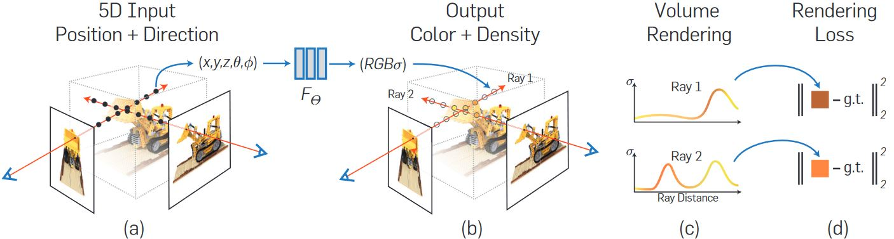
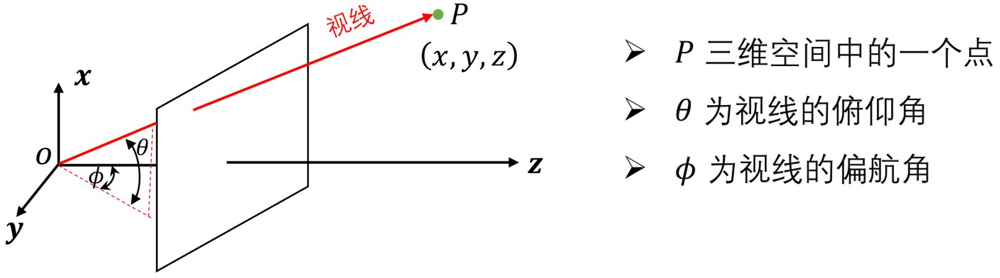
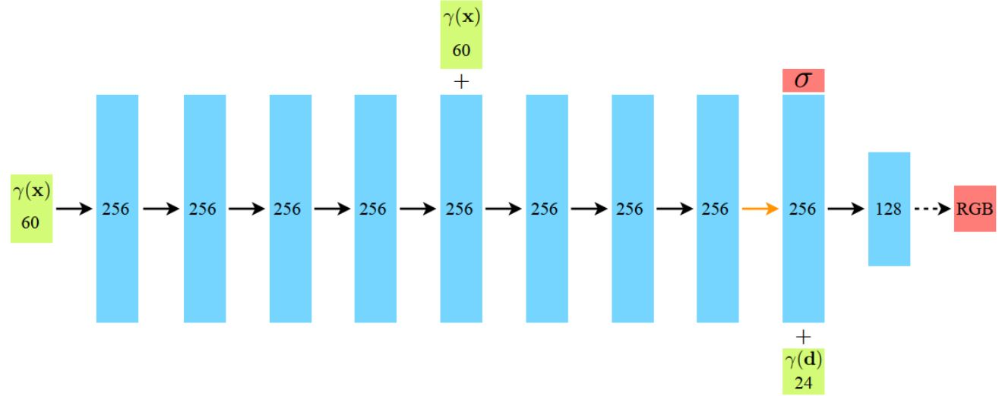
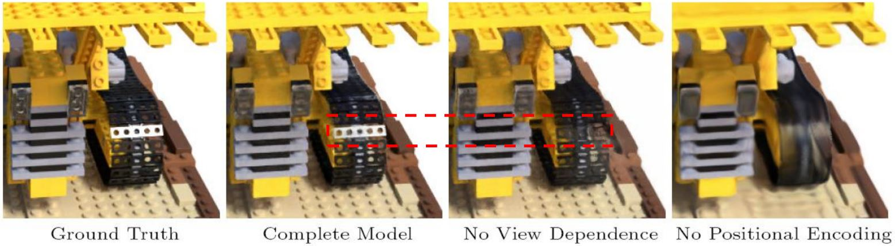
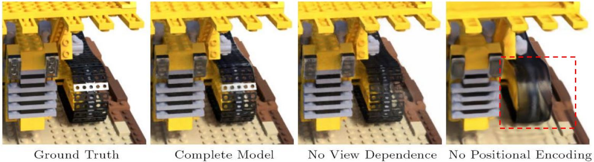
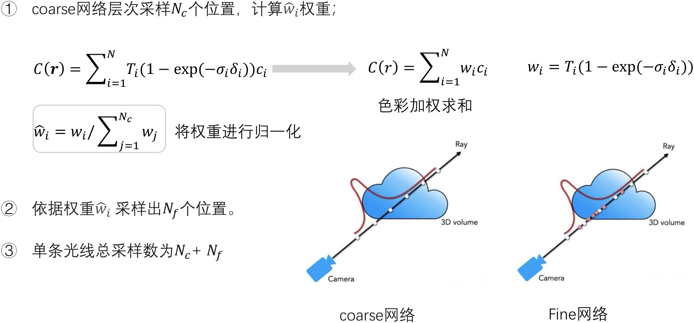

# NeRF开山之作

[NeRF: representing scenes as neural radiance fields for view synthesis](https://dl.acm.org/doi/abs/10.1145/3503250)

## 3.1 神经辐射场

<figure></figure>

三维场景：坐标值$$(x, y, z)$$ + 体密度$$\sigma$$（与材质有关） + 观察角度$$(\theta, \phi)$$看到的颜色值$$C$$（考虑了镜面反射问题）  
<b><font color="#00B050">辐射场</font></b>：定义在空间中的函数，记录了空间中每个点的体密度𝜎以及该点每个方向上的颜色值$$C$$（辐射值）  
体渲染：视线上所有的点投射到图像上形成像素颜色的过程  
**神经网络**：全连接神经网络$$F_{\Theta}$$

NeRF的pipeline：
* 推断：输入视线上点的坐标$$(x, y, z)$$和观察角度$$(\theta, \phi)$$，神经网络输出对应的RGB值和体密度$$\sigma$$。这样对视线上的每个点进行计算，将得到的结果进行体渲染，完成图像的生成。
* 训练：计算生成的图像与真实图像之间的误差，完成神经网络的更新。

## 3.2 体渲染

### 3.2.1 视线

<figure></figure>

视线$$r$$上的点可以表示为：

$$\color{green}{\mathbf{r}(t) = \mathbf{o} + t \mathbf{d}}$$

其中，$$\mathbf{o}$$是摄像机的光心在世界坐标系的坐标，$$\mathbf{d}$$为直线方向，是世界坐标系下的一个单位向量（笛卡尔坐标系），$$t$$是一个实数，表示从$$\mathbf{o}$$点沿视线到$$\mathbf{r}(t)$$点的距离。

```note
这里虽然用俯仰角和偏航角已经足够表示视线，但在代码中还是使用了三维向量来描述。  
已知光心和视线方向，点的位置只由它到光心的距离决定。
```

### 3.2.2 连续

&emsp;&emsp;<b><font color="#00B050">体渲染</font></b>：视线上$$\mathbf{r}$$所有的点投射到图像上形成像素颜色$$C$$的过程：

$$  C(\mathbf{r}) = \int_{t_{n}}^{t_{f}} T(t) \sigma(\mathbf{r}(t)) \mathbf{c}(\mathbf{r}(t), \mathbf{d}) dt, 
\text{where }   T(t) = \exp \left( -\int_{t_{n}}^{t} \sigma(\mathbf{r}(s)) ds \right) $$

其中，$$\mathbf{r}(t)$$为三维空间中的一个点，$$\mathbf{d}$$为视线方向，三维场景的近端和远端边界分别为$$t_{n}$$以及$$t_{f}$$；$$\mathbf{c}(\mathbf{r}(t), \mathbf{d})$$为三维点$$\mathbf{r}(t)$$从$$\mathbf{d}$$这个方向看到的颜色值；$$\sigma(\mathbf{r}(t))$$为体密度函数，反应了$$\mathbf{r}(t)$$位置的物理材质吸收光线的能力；$$T(t)$$是射线上从$$t_{n}$$到$$t$$的累积透射率。

### 3.2.3 离散

&emsp;&emsp;将$$t_{n}$$到$$t_{f}$$拆分为$$N$$个均匀分布区间，从每个区间中随机均匀抽取一个样本$$t_i$$：

$$  t_i 
\sim \mathcal{U} \left[t_n + \frac{i-1}{N}(t_f - t_n), t_n + \frac{i}{N}(t_f - t_n)\right]
\qquad i \text{从1到} N
$$

体渲染过程为

$$  \hat{C}(\mathbf{r})
=   \sum_{i=1}^N T_i\left(1 - \exp (-\sigma_i \delta_i)\right) \mathbf{c}_i 
\quad \text {where } T_i=\exp \left(-\sum_{j=1}^{i-1} \sigma_j \delta_j \right)
$$

## 3.3 NN与位置编码

### 3.3.1 神经网络

<figure></figure>

* 用途：记录辐射场信息
* 输入：坐标位置$$\mathbf{x}$$的位置编码以及视角向量$$\mathbf{d}$$的位置编码
* 输出：在坐标位置$$\mathbf{x}$$的体密度$$\sigma$$以及视线$$\mathbf{d}$$方向观察时$$\mathbf{x}$$处的的RGB值$$C$$

<b><font color="#FF4500">问题1</font></b>：为什么需要**视角向量**？

<figure></figure>

如果不考虑颜色和视角的关系，会丢失镜面反射的信息！

<b><font color="#FF4500">问题1</font></b>：为什么需要**位置编码**？

<figure></figure>

没有位置编码的情况下，高频几何和纹理细节丢失了！

### 3.3.2 位置编码

&emsp;&emsp;NeRF中的位置编码：

$$  \gamma(p)
=   \big( \sin (2^0 \pi p), \cos (2^0 \pi p), \cdots, \sin (2^{L-1} \pi p), \cos (2^{L-1} \pi p) \big)
$$

$$\gamma(\cdot)$$独立应用于待编码向量的各个维度，对于位置向量$$\mathbf{x}$$编码时$$L$$取10，对于视角向量$$\mathbf{d}$$编码时$$L$$取4。
经过位置编码，$$\mathbf{x}$$的编码$$\gamma(\mathbf{x})$$维度为60，$$\mathbf{d}$$的编码$$\gamma(\mathbf{d})$$维度为24。

```note
当空间位置改变时，位置编码的低频部分变化不大，但是高频部分变化会非常大。
```

## 3.4 损失函数与训练策略

* 难点：每条射线需要在近点与远点之间采样大量的点进行评估，导致计算量大
* 先验：射线上大部分区域都是空的，或者是被遮挡，对最终的颜色没有贡献。
* 策略：采用了一种“coarse to fine” 的层级采样策略，同时优化coarse网络和fine网络。

### 3.4.1 网络训练

&emsp;&emsp;策略：采用了一种“coarse to fine” 的层级采样策略，同时优化coarse网络和fine网络。

<figure></figure>

### 3.4..2 损失函数

&emsp;&emsp;损失函数：实际颜色$$C(\mathbf{r})$$与渲染结果$$\hat{C}_c(\mathbf{r})$$的平方误差（同时优化coarse和fine两个网络）

$$  \mathcal{L}
=   \sum_{\mathbf{r} \in \mathcal{R}}
    \left[ \left\| \hat{C}_c(\mathbf{r}) - C(\mathbf{r}) \right\|_2^2
         + \left\| \hat{C}_f(\mathbf{r}) - C(\mathbf{r}) \right\|_2^2 \right]
$$

其中，$$\mathbf{r}$$表示一条采样光线，$$\mathcal{R}$$表示所有采样光线。