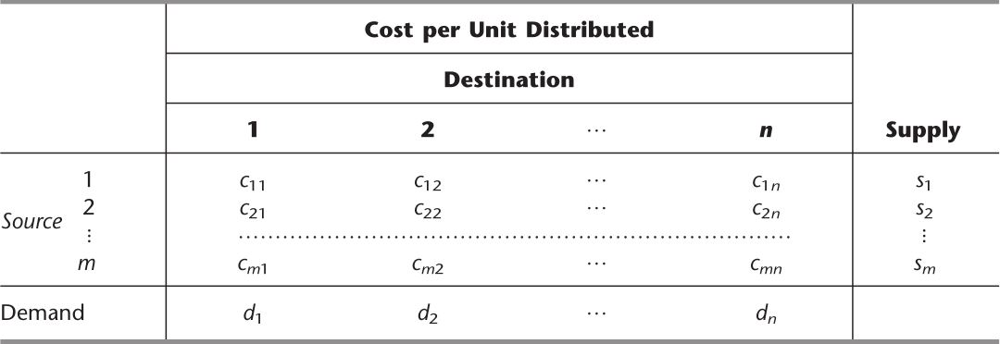
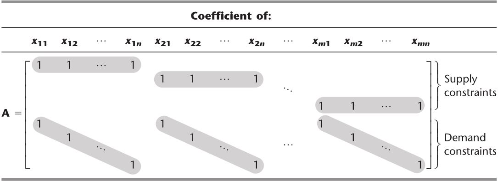

# 运输和指派问题

&emsp;&emsp;本章中将着重讨论两类重要的线性规划问题。第一类问题称为**运输问题**。之所以称其为运输问题，是因为这类问题的很多应用是为了解决运输的最优化。不过也有一些重要的应用与运输无关，如生产计划问题等。第二类问题称为**指派问题**，它的应用是指派对象去完成任务。尽管其应用看起来与运输问题有很大区别，不过我们将会看到指派问题实际上可以被看做运输问题的一种特殊形式。

&emsp;&emsp;运输和指派问题的应用一般需要大量的约束条件和变量，因此直接应用单纯形法的计算机程序解决这两类问题需要大量的计算。幸运的是，这两类问题的一个主要特点是约束条件里大多数系数$$a_{ij}$$都为零，并且系数不为零的部分又呈现出明显的结构。因此，可以利用这类问题的特殊结构设计一种特殊的改进算法，来节省计算的工作量。

&emsp;&emsp;为了描述它的特殊结构，首先介绍一下约束条件式里的系数表格（矩阵），如表8.1所示。$$a_{ij}$$表示第$$i$$个约束条件中第$$j$$个变量的系数。在以后的部分中，系数为零的地方将留为空白，系数不为零的地方标为阴影。 

<figure>
    <figcaption>表8.1 线性规划约束条件的系数表格</figcaption>
    
</figure>

## 8.1 运输问题

### 模型

<figure>
    <figcaption>表8.4 运输问题的术语</figcaption>
    
</figure>

&emsp;&emsp;<b><font color="#00B050">需求假设</font></b>：每一个产地都提供一个固定数量的产品，所有的产品都需要运往销地（我们用$$s_i$$代表第$$i$$个产地供应的产品数量，$$ i= 1, 2,\cdots, m$$）。 同样，每一个销地都只能接收一个固定数量的产品，所有销地接收的产品都是从产地运来的（我们用$$d_j$$代表第$$j$$个销地接收的产品数，$$j = 1, 2, \cdots, n$$）。

&emsp;&emsp;这个假设意味着供给和需求之间需要存在一个平衡，也就是所有产地的供给总和应该等于所有销地的需求总和。

&emsp;&emsp;<b><font color="#3399ff">可行解的特性</font></b>：一个运输问题**当且仅当**$$\sum_{i=1}^m s_i = \sum_{j=1}^n d_j$$时有可行解。

```note
在诸多实际问题中，供给事实上代表需要分发的最大数目（而非固定数目）。类似的，其他情况则是需求地需要接收的最大数目（而非固定数目）。由于违背了需求假设条件，因此，此类问题一般不完全适用运输问题模型。不过我们可以通过引人虚销地或虛产地以填补实际数目对最大数目的空缺，本节末将举两个例子来说明如何处理这类问题。
```

&emsp;&emsp;<b><font color="#00B050">成本假设</font></b>：任何特定产地运输到任何特定销地的费用与所需分发的单位数量成正比。因此，成本等于分配的单位成本乘以分配的单位数量。（用$$c_{ij}$$表示产地$$i$$到销地$$j$$的单位成本。）

<figure>
    <figcaption>表8.5 运输问题的参数表</figcaption>
    
</figure>

&emsp;&emsp;<b><font color="#00B050">模型</font></b>：任何问题（无论是否涉及运输）均适用于该运输问题模型，只要它**可以完全按照表8.5的参数表来描述**，并且**满足需求假设和成本假设**。目标是最小化分配的总成本。模型的所有参数都包含在此参数表中。

&emsp;&emsp;<font color="#3399ff"></font>运输问题实际上是一种特殊的线性规划问题。设总分销成本为$$Z$$，从产地$$i$$到销地$$j$$所分配的数量为$$x_{ij}$$，那么该运输问题的线性规划形式为

$$\begin{aligned}
\text{min } & Z = \sum_{i=1}^m \sum_{j=1}^n c_{ij} x_{ij} \quad \text{运输费用} \\
\text{s.t. } & \sum_{j=1}^n x_{ij} = s_i \ (i = 1, 2, \cdots, m) \quad \text{供应约束} \\
& \sum_{i=1}^m x_{ij} = d_j \ (j = 1, 2, \cdots, n) \quad \text{需求约束}
\end{aligned}$$

&emsp;&emsp;运输问题的约束系数呈现特殊的结构，如表8.6所示。<font color="#3399ff">任何符合这种特殊形式的线性规划问题均是运输问题而不用考虑其具体内容。</font>

<figure>
    <figcaption>表8.6 运输问题的约束系数</figcaption>
    
</figure>

&emsp;&emsp;<b><font color="#3399ff">整数解性质</font></b>：运输问题中任一$$s_i$$和$$d_i$$必须是整数值，所有基本可行解中（包括最优解）的变量也必须是整数解。

**违反条件假设**的问题重构：  
* 关于虚销地的例子（p313）  
* 关于虚产地的例子（p316）

### 运输问题拓展

&emsp;&emsp;一些产销分配问题不满足运输问题模型。一种情况是，一些问题的运输并不是直接从产地发往销地。在这种情况下，从特定的工厂运往特定的仓库可能首先要运往储运中心、其他工厂，或其他仓库，费用因运输线路的不同而异，而且，某些运输线路还存在运输上限。这类问题仍然是一类特殊的线性规划问题，称为**最小费用流问题**。没有对运输路线的运输量施加上限的最小成本流问题可以被看做一个**转载问题**。  
&emsp;&emsp;另一种情况是，直接从产地发往销地，但可能不符合运输问题的其他假设，如线性成本假设、需求假设。目前有很多关于运输问题一般化及其解法的研究。

## 8.2 用于运输问题的单纯形法

&emsp;&emsp;利用表8.6所示的特殊结构，可以极大地简化用单纯形法求解运输问题所需的大量计算。

### 运输单纯形法的提出


<br />
<!-- 蓝 -->
<b><font color="#3399ff"></font></b>
<!-- 绿 --> <!-- #33cc00 -->
<b><font color="#00B050"></font></b>
<!-- 橙 -->
<font color="#FF4500"></font>