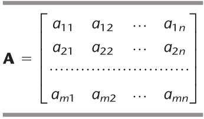
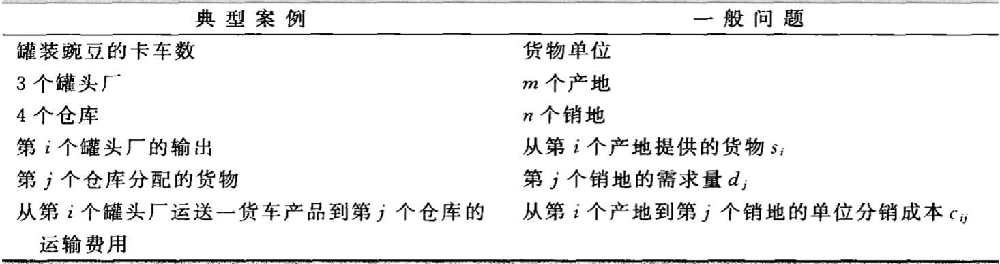

# 运输和指派问题

&emsp;&emsp;本章中将着重讨论两类重要的线性规划问题。第一类问题称为**运输问题**。之所以称其为运输问题，是因为这类问题的很多应用是为了解决运输的最优化。不过也有一些重要的应用与运输无关，如生产计划问题等。第二类问题称为**指派问题**，它的应用是指派对象去完成任务。尽管其应用看起来与运输问题有很大区别，不过我们将会看到指派问题实际上可以被看做运输问题的一种特殊形式。

&emsp;&emsp;运输和指派问题的应用一般需要大量的约束条件和变量，因此直接应用单纯形法的计算机程序解决这两类问题需要大量的计算。幸运的是，这两类问题的一个主要特点是约束条件里大多数系数$$a_{ij}$$都为零，并且系数不为零的部分又呈现出明显的结构。因此，可以利用这类问题的特殊结构设计一种特殊的改进算法，来节省计算的工作量。

&emsp;&emsp;为了描述它的特殊结构，首先介绍一下约束条件式里的系数表格(矩阵)，如表8.1所示。$$a_{ij}$$表示第$$i$$个约束条件中第$$j$$个变量的系数。在以后的部分中，系数为零的地方将留为空白，系数不为零的地方标为阴影。 

<figure>
    <figcaption>表8.1 线性规划约束条件的系数表格</figcaption>
    
</figure>

## 8.1 运输问题

### 8.1.1 模型

<figure>
    <figcaption>表8.4 运输问题的术语</figcaption>
    
</figure>

&emsp;&emsp;**需求假设**：每一个产地都提供一个固定数量的产品，所有的产品都需要运往销地（我们用$$s_i$$代表第$$i$$个产地供应的产品数量，$$ i= 1, 2,\cdots, m$$）。 同样，每一个销地都只能接收一个固定数量的产品，所有销地接收的产品都是从产地运来的（我们用$$d_j$$代表第$$j$$个销地接收的产品数，$$j = 1, 2, \cdots, n$$）。

&emsp;&emsp;这个假设意味着供给和需求之间需要存在一个平衡，也就是所有产地的供给总和应该等于所有销地的需求总和。

&emsp;&emsp;**可行解的特性**：一个<b><font color="#3399ff">运输问题有可行解的充分必要条件</font></b>为$$\sum_{i=1}^m s_i = \sum_{j=1}^n d_j$$。

```note
在诸多实际问题中，供给事实上代表需要分发的最大数目（而非固定数目）。类似的，其他情况则是需求地需要接收的最大数目（而非固定数目）。由于违背了需求假设条件，因此，此类问题一般不完全适用运输问题模型。不过我们可以通过引人虚销地或虛产地以填补实际数目对最大数目的空缺，这种重新定义的问题可以适应该模型。我们将在本节末举两个例子来说明如何处理这类问题。
```


<br />
<!-- 蓝 -->
<b><font color="#3399ff"></font></b>
<!-- 绿 --> <!-- #33cc00 -->
<b><font color="#00B050"></font></b>
<!-- 橙 -->
<font color="#FF4500"></font>