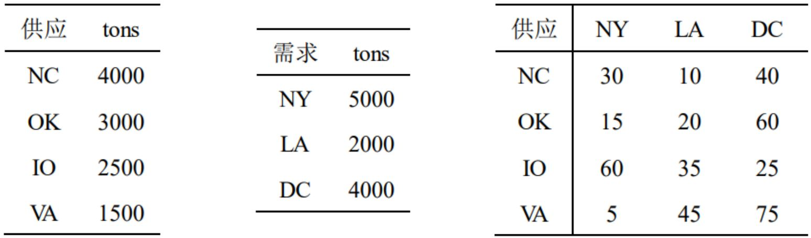

# Preliminaries

&emsp;&emsp;1.Standard form LP  
&emsp;&emsp;2.Embedded assumptions   
&emsp;&emsp;3.Converting to standard form

## 1.1 Standard form LP

&emsp;&emsp;关键元素：

**1.**$$ n $$个variables：$$ x_1，x_2,\ldots,x_n $$

**2.**1个objective function：$$ \mathbf{z} = c_1 x_1 + c_2 x_2 + \cdots + c_n x_n $$

**3.**$$ m $$个constraints：

$$\begin{aligned}
    a_{11}x_1 + a_{12}x_2 + \cdots + a_{1n}x_n = & \ b_1 \\
    a_{21}x_1 + a_{22}x_2 + \cdots + a_{2n}x_n = & \ b_2 \\
    \vdots & \\
    a_{m1}x_1 + a_{m2}x_2 + \cdots + a_{mn}x_n = & \ b_m \\
\end{aligned}
$$

**4.**非负：$$ x_1 \ge 0, x_2 \ge 0, \ldots, x_n \ge 0,  $$

### Explicit form

&emsp;&emsp;Minimize $$ \mathbf{z} = c_1 x_1 + c_2 x_2 + \cdots + c_n x_n $$

&emsp;&emsp;subject to

$$\begin{aligned}
    a_{11}x_1 + a_{12}x_2 + \cdots + a_{1n}x_n = & \ b_1 \\
    a_{21}x_1 + a_{22}x_2 + \cdots + a_{2n}x_n = & \ b_2 \\
    \vdots & \\
    a_{m1}x_1 + a_{m2}x_2 + \cdots + a_{mn}x_n = & \ b_m \\
\end{aligned}
$$

$$ x_1 \ge 0, x_2 \ge 0, \ldots, x_n \ge 0 $$

```tip
最小化一个目标函数  
等式约束  
变量非负
```

### Matrix form
 
cost vector 

$$  \mathbf{c} = 
[   \begin{matrix}
        c_1 & c_2 & \cdots & c_n 
    \end{matrix} 
]^T
$$

solution vector

$$  \mathbf{x} = 
[   \begin{matrix}
        x_1 & x_2 & \cdots & x_n 
    \end{matrix} 
]^T
$$

right-hand-side vector

$$  \mathbf{b} = 
[   \begin{matrix}
        b_1 & b_2 & \cdots & b_n 
    \end{matrix} 
]^T $$

constraint matrix

$$  \mathbf{A} = 
    \begin{bmatrix}
        a_{11} & a_{12} & \cdots & a_{1n} \\
        a_{21} & a_{22} & \cdots & a_{2n} \\
        \vdots & \vdots & \ddots & \vdots \\
        a_{m1} & a_{m2} & \cdots & a_{mn} \\
    \end{bmatrix} 
$$

$$\color{green}
{\boxed{
    \begin{aligned}
        \text{min} \quad & \mathbf{c}^T \mathbf{x} \\
        \text{s.t.} \quad & \mathbf{Ax} = \mathbf{b} \\
        & \mathbf{x} \ge 0 .
    \end{aligned}
}}
$$

**例**-运输问题

<center>
    <figure>
        
    </figure>
</center>

一个管理问题：如何用最经济的方法满足顾客的要求？

LP模型：  
— 要引入的**决策变量**有哪些？  
— **目标函数**是什么？  
— **约束**条件是什么？ 

<br />

## 1.2 Embedded assumptions in LP

1.<font color="#3399ff">Proportionality</font> Assumption  
— no discount  
— 没有回收利用的经济效益  

2.<font color="#3399ff">Additivity</font> Assumption  
— 总影响 = 各个变量的影响之和

3.<font color="#3399ff">Divisibility</font> Assumption  
— 所有的小数/分数都是允许的

3.<font color="#3399ff">Certainty</font> Assumption  
— 每个参数都是确定的 

<br />

## 1.3 Converting to standard form

**例**

$$\begin{aligned}
        \text{maximize} \quad & 3x_1 - 2x_2 - 4 |x_3| \\
        \text{s.t.}     \quad & -x_1 + 2x_2 \le -5    \\
                              & 3x_2 - x_3 \ge 6      \\
                              & 2x_1 + x_3 = 12       \\
                              & x_1 ,\ x_2 \ge 0      \\
\end{aligned}
$$

### Rule 1: Unrestricted (free) variables

$$
x_i^+ = \begin{cases}
            x_i , \quad & \text{if } x_i \ge 0 \\
            0 , \quad & \text{otherwise}
        \end{cases} \quad
x_i^- = \begin{cases}
            0 , \quad & \text{if } x_i \ge 0 \\
            x_i , \quad & \text{otherwise}
        \end{cases}
$$

$$  x_i \in \mathcal{R} \quad \Leftrightarrow \quad
\color{green}{
    x_i = x_i^+ - x_i^- \quad 
    x_i^+ ,\ x_i^- \ge 0  
}$$

— By product: $$ \lvert x_i \rvert = x_i^+ + x_i^- $$

— <font color="#FF4500">Potential problem</font>: 要求$$ x_i^+ \times x_i^- = 0 $$

$$\begin{aligned}
        \text{maximize} \quad & 3x_1 - 2x_2 - 4 (x_3^+ + x_3^-) \\
        \text{s.t.}     \quad & -x_1 + 2x_2 \le -5              \\
                              & 3x_2 - (x_3^+ - x_3^-) \ge 6    \\
                              & 2x_1 + (x_3^+ - x_3^-) = 12     \\
                              & x_1 ,\ x_2 ,\ x_3^+ ,\ x_3^- \ge 0 \\
\end{aligned}$$

### Rule 2: Inequality constraints

&emsp;&emsp;引入<b><font color="#00B050">松弛变量</font></b>和<b><font color="#00B050">剩余变量</font></b>

$$\begin{aligned}
        \text{maximize} \quad & 3x_1 - 2x_2 - 4 (x_3^+ + x_3^-) \\
        \text{s.t.}     \quad & -x_1 + 2x_2 + x_4 = -5          \\
                              & 3x_2 - (x_3^+ - x_3^-) - x_5 = 6\\
                              & 2x_1 + (x_3^+ - x_3^-) = 12     \\
                              & x_1 ,\ x_2 ,\ x_3^+ ,\ x_3^- ,\ x_4 ,\ x_5 \ge 0 \\
\end{aligned}
$$

### Rule 3: Minimization of the objective function

$$\color{green}{
    \text{max } \mathbf{c}^T \mathbf{x} 
= - \text{min } ( - \mathbf{c}^T \mathbf{x} )
}$$

$$\begin{aligned}
        \text{minimize} \quad & - 3x_1 + 2x_2 + 4x_3^+ + 4x_3^- \\
        \text{s.t.}     \quad & - x_1 + 2x_2 + x_4 = -5          \\
                              & 3x_2 - (x_3^+ - x_3^-) - x_5 = 6\\
                              & 2x_1 + (x_3^+ - x_3^-) = 12     \\
                              & x_1 ,\ x_2 ,\ x_3^+ ,\ x_3^- ,\ x_4 ,\ x_5 \ge 0 \\
\end{aligned}$$

### More on free variable and absolute value

&emsp;&emsp;<font color="#FF4500">潜在问题</font>：  
1.丢失了<font color="#3399ff">二次型约束</font>  
2.<font color="#3399ff">维数</font>增加  
3.原本的<font color="#3399ff">一个</font>解<font color="#3399ff">对应</font>现在的<font color="#3399ff">多个</font>解  
4.$$ |x| $$为<font color="#3399ff">凸函数</font>，而$$ -|x| $$为<font color="#3399ff">凹函数</font>  
5.当$$ \mathbf{c} $$为正时，最大化$$ \mathbf{c|x|} $$可能会成为问题

Reference: 'Linear' Programming with Absolute-Vaue Functionals. David F. Shanno, Roman L. Weil. Operations Research. Vol. 19. No. 1. (Jan - Feb. 1971). pp. 120-124.

