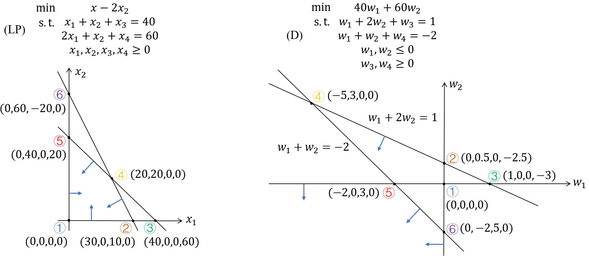
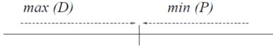

# Duality & Sensitivity Analysis

## 4.1 Dual Linear Program

### 4.1.1 Introduction

&emsp;&emsp;给定一个constraint matrix $$\mathbf{A}$$、right hand side vector $$\mathbf{b}$$和cost vector $$\mathbf{c}$$，可以得到一个对应的线性规划问题（原始问题）

$$ \text{(LP)} \quad
\begin{aligned}
    \text{min}  \quad & \mathbf{c}^T \mathbf{x} \\
    \text{s.t.} \quad & \mathbf{Ax} = \mathbf{b} \\
    & \mathbf{x} \ge 0 
\end{aligned}
$$

**问**：1. 可以用同样的数据$$(\mathbf{A, b, c})$$来构建另一个线性规划问题嘛？  
&emsp;&emsp;2. 如果是这样，这个新的线性规划与原来的原始问题有什么关系？

**猜想**：$$\mathbf{A}$$是一个$$m \times n$$的矩阵，$$\mathbf{b}$$是一个$$m$$维向量，$$\mathbf{c}$$是一个$$n$$维向量。  
&emsp;&emsp;$$\mathbf{b}$$和$$\mathbf{c}$$的角色可以互换吗？  
&emsp;&emsp;如果是这样，我们将会得到$$m$$个变量和$$n$$个约束。相应地，  
&emsp;&emsp;&emsp;（1）应该考虑将矩阵$$\mathbf{A}$$转置，将行改为列，反之亦然?  
&emsp;&emsp;&emsp;（2）非负变量→自由变量？  
&emsp;&emsp;&emsp;（3）等式约束→不等式约束？  
&emsp;&emsp;&emsp;（4）最小化目标函数→最大化目标函数？  

<b><font color="#00B050">Dual linear program</font></b>  
&emsp;&emsp;考虑如下线性规划

$$\color{green}{
    \text{(D)} \quad
    \begin{aligned}
        \text{max}  \quad & \mathbf{b}^T \mathbf{w} \\
        \text{s.t.} \quad & \mathbf{A}^T \mathbf{w} \le \mathbf{c} \quad \text{Dual Problem} \\
        & \mathbf{w} \in \mathbb{R}^m 
    \end{aligned}
}$$

原来的线性规划为

$$ \text{(LP)} \quad
\begin{aligned}
    \text{min}  \quad & \mathbf{c}^T \mathbf{x} \\
    \text{s.t.} \quad & \mathbf{Ax} = \mathbf{b} \quad \text{Primal Problem} \\
    & \mathbf{x} \ge 0 
\end{aligned}
$$

**例** 

<figure>
    
</figure>

### 4.1.3 Dual of LP in other form

#### Symmetric pair

$$  \text{(P)} \quad
\begin{aligned}
    \min \quad & \mathbf{c}^T \mathbf{x} \\
    \text{s.t.} \quad & \mathbf{Ax} \ge \mathbf{b}\\
    & \mathbf{x} \ge 0 
\end{aligned}
    \qquad \qquad \qquad
    \text{(D)} \quad
\begin{aligned}
    \max \quad & \mathbf{b}^T \mathbf{w} \\
    \text{s.t.} \quad & \mathbf{A}^T \mathbf{w} \le \mathbf{c} \\
    & \mathbf{w} \ge 0 
\end{aligned}
$$

$$  \qquad \qquad \quad
\begin{aligned}
    \min \quad & \mathbf{c}^T \mathbf{x} + \mathbf{0}^T \mathbf{s} \\
    \text{s.t.} \quad & \mathbf{Ax-Is} = \mathbf{b}\\
    & \mathbf{x, s} \ge 0 
\end{aligned}
    \qquad \qquad \quad \quad
\begin{aligned}
    \max \quad & \mathbf{b}^T \mathbf{w} \\
    \text{s.t.} \quad & 
        \begin{bmatrix}
            \mathbf{A}^T \\ - \mathbf{I}
        \end{bmatrix} \mathbf{w} 
        \le \begin{bmatrix}
            \mathbf{c} \\ \mathbf{0}
        \end{bmatrix} 
\end{aligned}
$$

#### Karmarkar's form LP

$$\begin{aligned}
    \min \quad & \mathbf{c}^T \mathbf{x} \\
    \text{s.t.} \quad & a_{11} x_{1}+a_{12} x_{2}+\cdots+a_{1 n} x_{n}=0 \\
    & \qquad \qquad \qquad \vdots \\
    & a_{m 1} x_{1}+a_{m 2} x_{2}+\cdots+a_{m n} x_{n}=0 \\
    & x_{1} + x_{2} + \cdots + x_{n} = 1 \\
    & x_{1}, x_{2}, \ldots, x_{n} \geq 0\\
\end{aligned}
\qquad \qquad \text{(DKLP)}
\begin{aligned}
    \max \quad & w_{m+1} \\
    \text{s.t.} \quad & a_{11} u_{1}+\cdots+a_{m 1} w_{m}+w_{m+1} \leq c_{1}\\
    & a_{12} w_{1}+\cdots+a_{m 2} w_{m}+w_{m+1} \leq c_{2}\\
    & \qquad \qquad \qquad \quad \vdots \\
    & a_{1 n} w_{1}+\cdots+a_{m n} w_{m}+w_{m+1} \leq c_{n}
\end{aligned}
$$

Dual (KLP)总是可行的，比如：  
&emsp;&emsp;$$w_1 = w_2 = \cdots = w_m = 0$$，$$w_{m+1} = \min \{ c_1, c_2, \ldots, c_n \}$$，那么这个$$\mathbf{w} = [w_1, \ldots, w_m, w_{m+1}]^T$$对于DKLP就是可行的。

## 4.2 Duality Theory

**问**：LP和它的对偶问题是怎么联系起来的呢？ 

我们用(P) primal problem表示原来的LP，用(D) dual problem表示新的新的LP。  
(P)和(D)是用一样的数据$$(\mathbf{A, b, c})$$定义的  
(D)问题是一个有$$m$$个变量、$$n$$个约束的线性规划问题，右端向量和成本向量在(P)和(D)中的角色互换了。

还有什么呢？

```tip
关于线性规划和它的对偶有很多有意思的问题  
Feasibility：  
— (P)和(D)是否都可行？一个可行，另一个不可行两者都不可行？  
Basic solutions：  
— (P)和(D)的基本解之间有关系吗？bfs呢？最优解呢?  
Optimality：  
— 问题(P)和(D)是否都有唯一的最优解？都有无穷多个？一个有唯一的，另一个有无穷多个？
```

### 4.2.1 Dual relationship

&emsp;&emsp;如果**把(D)看作primal problem**，会发生什么？

$$\begin{aligned}
        \text{max}  \quad & \mathbf{b}^T \mathbf{w} \\
        \text{s.t.} \quad & \mathbf{A}^T \mathbf{w} \le \mathbf{c}\\
        & \mathbf{w} \in \mathbb{R}^m 
\end{aligned}$$

&emsp;&emsp;通过以下几步将(D)写成它的标准型：
(1) 令$$\mathbf{w = u - v}$$；
(2) 增加松弛变量$$s$$；
(3) 最小化目标函数。

$$  \text{(P)} \quad
\begin{aligned}
    \min \quad & \begin{bmatrix}
                    -\mathbf{b}^T & \mathbf{b}^T & 0
                 \end{bmatrix} 
                 \begin{bmatrix}
                    \mathbf{u} \\ \mathbf{v} \\ \mathbf{s}
                 \end{bmatrix} \\
    \text{s.t.} \quad & \begin{bmatrix}
                            \mathbf{A}^T & -\mathbf{A}^T & \mathbf{I}
                        \end{bmatrix}
                        \begin{bmatrix}
                            \mathbf{u} \\ \mathbf{v} \\ \mathbf{s}
                        \end{bmatrix}
                        = \mathbf{c} \\ 
    & \mathbf{u, v, s} \ge 0 
\end{aligned}
    \qquad \qquad \qquad
    \text{(D)} \quad
\begin{aligned}
    \max \quad & \mathbf{c}^T \mathbf{w} \\
    \text{s.t.} \quad & \begin{bmatrix}
                            \mathbf{A} \\ -\mathbf{A} \\ \mathbf{I}
                        \end{bmatrix} 
                        \mathbf{w} \le 
                        \begin{bmatrix}
                            -\mathbf{b} \\ \mathbf{b} & 0
                        \end{bmatrix}\\
    & \mathbf{w} \text{ unrestricted } \in \mathbb{R}^n 
\end{aligned}
$$

**Lemma 4.1：**<b><font color="#3399ff">Dual of the dual = primal</font></b>

&emsp;&emsp;整理新得到的对偶问题，有$$\begin{aligned} -\max \quad & \mathbf{c}^T \mathbf{w} \\ \text{s.t.} \quad & \mathbf{Aw} \le -\mathbf{b}\\ & -\mathbf{Aw} \le \mathbf{b} \\ & \mathbf{w} \le 0 \end{aligned}$$，即$$\begin{aligned} \text{min}  \quad & -\mathbf{c}^T \mathbf{w} \\ \text{s.t.} \quad & -\mathbf{Aw} = \mathbf{b}\\ & \mathbf{w} \le 0 \end{aligned}$$。对于$$\mathbf{x} := - \mathbf{w}$$，我们有$$\begin{aligned} \min \quad & \mathbf{c}^T \mathbf{x} \\ \text{s.t.} \quad & \mathbf{Ax} = \mathbf{b}\\ & \mathbf{x} \ge 0 \end{aligned}$$。

### 4.2.2 Weak duality theorem

&emsp;&emsp;如果$$\mathbf{x}$$是(P)的一个可行解，$$\mathbf{w}$$是(D)的一个可行解，那么$$\begin{aligned} \mathbf{c}^T \mathbf{x} & =\mathbf{x}^T \mathbf{c} \\ & \ge \mathbf{x}^T \mathbf{A}^T \mathbf{w} \\ & = \mathbf{b}^T \mathbf{w} \end{aligned}$$

<b><font color="#3399ff">Weak Duality Theorem</font></b>：如果$$\mathbf{x}$$是(P)的一个原始可行解，$$\mathbf{w}$$是(D)的一个对偶可行解，那么$$\mathbf{c}^T \mathbf{x} \ge \mathbf{b}^T \mathbf{w}$$。

<figure>
    
</figure>

**Corollaries**：
1. 如果$$\mathbf{x}$$ primal feasible，$$\mathbf{w}$$ dual feasible，且$$\mathbf{c}^T \mathbf{x} = \mathbf{b}^T \mathbf{w}$$，那么$$\mathbf{x}$$是**primal optimal**，$$\mathbf{w}$$是**dual optimal**。
2. 如果原始问题是**无下界**的，那么它的对偶问题**无解**。（反之成立吗？）
3. 如果对偶问题是**无上界**的，那么它的原始问题**无解**。（反之成立吗？）

### 4.2.3 Strong duality theorem

问：weak duality的结果可以再强一些吗？  
&emsp;&emsp;原始最优值与对偶最优值之间是否还有一些距离?

<b><font color="#3399ff">Strong Duality Theorem</font></b>：  
&emsp;&emsp;（1）如果原始问题和对偶问题中任一个存在有限的最优值，那么另一个也有，并且$$\min \mathbf{c}^T \mathbf{x} = \max \mathbf{b}^T \mathbf{w}$$。（No duality gap! ）  
&emsp;&emsp;（2）如果任一个问题的目标值无界，那么另一个问题无解。

证：（1）注意到对偶的对偶是原始问题，并且还有一个事实“如果$$\mathbf{x}$$ primal feasible，$$\mathbf{w}$$ dual feasible，且$$\mathbf{c}^T \mathbf{x} = \mathbf{b}^T \mathbf{w}$$，那么$$\mathbf{x}$$是primal optimal，$$\mathbf{w}$$是dual optimal”。我们只需要证明这一点：如果**原始**问题有一个有限的**最优bfs** $$\mathbf{x}$$，那么就存在一个**对偶可行**解$\mathbf{w}$$使得$$\mathbf{c}^T \mathbf{x} = \mathbf{b}^T \mathbf{w}$$。

&emsp;&emsp;对最优bfs $$\mathbf{x}$$用单纯形法，其基为$$\mathbf{B}$$，定义：$$\mathbf{w}^T = \mathbf{c}_B^T \mathbf{B}^{-1}$$。那么

$$\begin{aligned}
    \mathbf{c}-\mathbf{A}^{T} \mathbf{w} 
    &=  \left[  \begin{array}{c}
            \       mathbf{c}_{B} \\ \mathbf{c}_{N}
                \end{array}\right]
        -\left[ \begin{array}{c}
                    \mathbf{B}^{T} \\ \mathbf{N}^{T}
                \end{array}\right] \mathbf{w} \\
    &=  \left[  \begin{array}{c}
                    \mathbf{c}_{B}-\mathbf{B}^{T}\left(\mathbf{B}^{T}\right)^{-1} \mathbf{c}_{B} \\
                    \mathbf{c}_{N}-\mathbf{N}^{T}\left(\mathbf{B}^{T}\right)^{-1} \mathbf{c}_{B}
                \end{array}\right] \\
    &=  \left[  \begin{array}{c}
                    0 \\ r_{N}
                \end{array}\right] \geq 0
\end{aligned}$$

因此$$\mathbf{w}$$ dual feasible，且

$$\begin{aligned}
    \mathbf{c}^{T} \mathbf{x} &=\mathbf{c}_{B}^{T} \mathbf{x}_{B} \\
&=  \mathbf{c}_{B}^{T} \mathbf{B}^{-1} \mathbf{b} \\
&=  \mathbf{w}^{T} \mathbf{b} \\
&=  \mathbf{b}^{T} \mathbf{w}
\end{aligned}$$

&emsp;&emsp;（2）这可以直接由弱对偶定理得到

**Implications**：
1. <b><font color="#00B050">Simplex multiplier</font></b> $$\color{green}{\mathbf{w}}$$与原始最优解$$\mathbf{x}$$对应，是一个对偶最优解。
2. 在单纯形法的每次迭代过程中simplex multiplier $$\mathbf{w}$$始终满足$$\mathbf{c}^T \mathbf{x} = \mathbf{b}^T \mathbf{w}$$。但是，只有当$$r_N \ge 0$$时$$\mathbf{w}$$是对偶可行的。
3. Revised simplex method：在保证原始问题可行和$$\mathbf{c}^T \mathbf{x} = \mathbf{b}^T \mathbf{w}$$（no duality gap）的同时，寻求对偶可行性。（在原始问题到达最优前无法得到$$r_N \ge 0$$。）

#### Further implications of strong duality theorem

<b><font color="#3399ff">Theorem of Alternatives</font></b>：不等式系统解的存在性

<b><font color="#3399ff">Farkas Lemma</font></b>：系统$$\mathbf{Ax = b}, \mathbf{x} \ge 0$$无解，当且仅当$$\mathbf{A}^T \mathbf{w} \le 0, \mathbf{b}^T \mathbf{w} \ge 0$$。  
另一种形式：有两个系统，(Ⅰ)$$\mathbf{Ax = b}, \mathbf{x} \ge 0$$，(Ⅱ)$$\mathbf{A}^T \mathbf{w} \le 0, \mathbf{b}^T \mathbf{w} \ge 0$$，这两个系统有且只有一个有解。

证：考虑LP和对应的dual

$$  \text{(P)} \quad
\begin{aligned}
    \min \quad & \mathbf{0}^T \mathbf{x} \\
    \text{s.t.} \quad & \mathbf{Ax} = \mathbf{b}\\
    & \mathbf{x} \ge 0 
\end{aligned}
    \qquad \qquad \qquad
    \text{(D)} \quad
\begin{aligned}
    \max \quad & \mathbf{b}^T \mathbf{w} \\
    \text{s.t.} \quad & \mathbf{A}^T \mathbf{w} \le \mathbf{0} 
\end{aligned}
$$

&emsp;&emsp;因为$$\mathbf{w = 0}$$是对偶可行的，可知当且仅当(D)是无下界时(P)不可行。注意当且仅当(Ⅰ)无解时(P)不可行，当且仅当(Ⅱ)有解(D)无上界。因此，当且仅当(Ⅱ)有解时(Ⅰ)无解。


## 4.3 Sensitivity Analysis
## 4.4 Dual Simplex Method
<br />
<b><font color="#3399ff"></font></b>
<!-- 绿 --><!-- #33cc00 -->
<b><font color="#00B050"></font></b>
<!-- 橙 -->
<b><font color="#FF4500"></font></b>