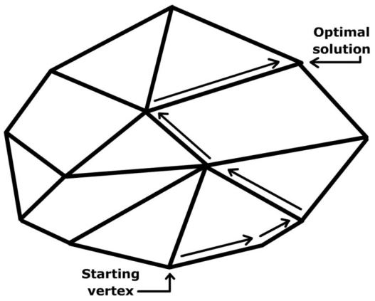
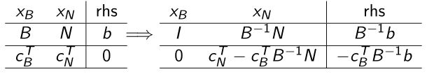
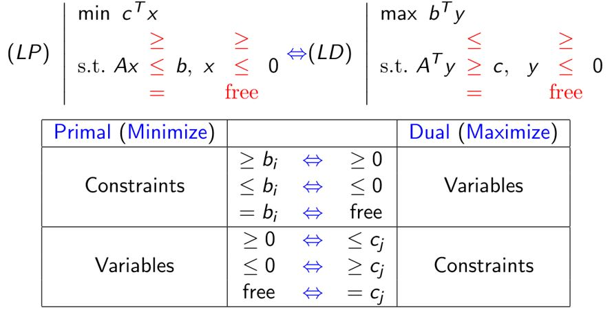
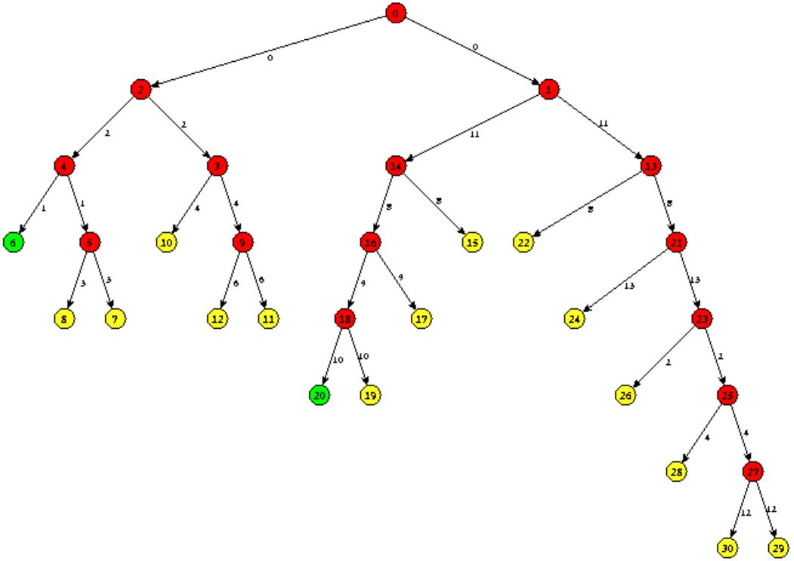
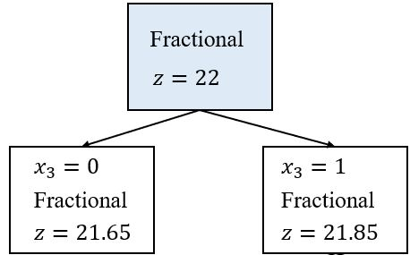
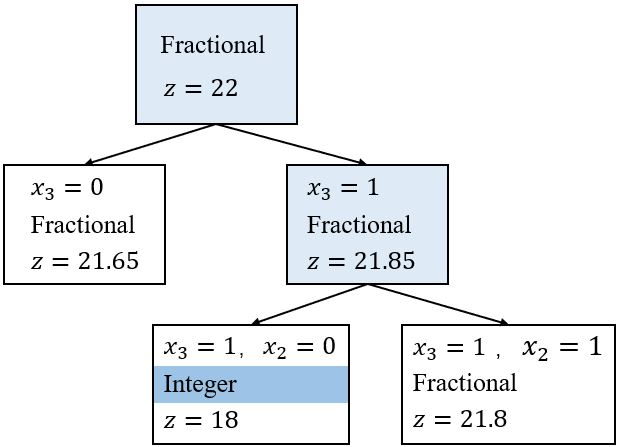
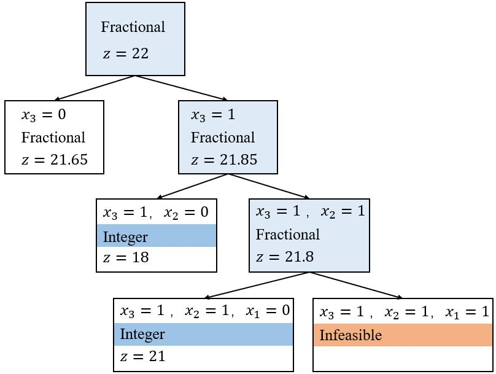
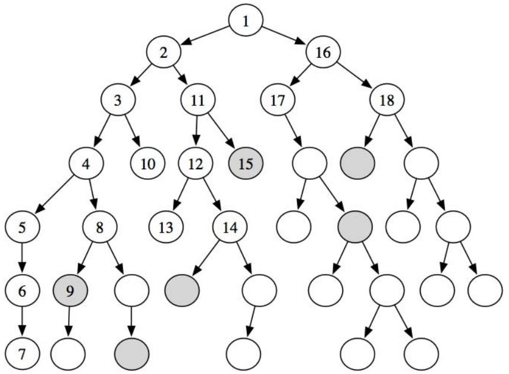

# Branch-and-Bound Method

## 1.1 Linear Program

&emsp;&emsp;首先，回顾一下<b><font color="#00B050">LP的标准形式</font></b>：

$$\color{green}
{   \begin{aligned}
        \text{min} \quad & \mathbf{c}^T \mathbf{x} \\
        \text{s.t.} \quad & \mathbf{Ax = b} \\
        & \mathbf{x} \ge 0 .
    \end{aligned}
}$$

其中，$$\mathbf{c} \in \mathbb{R}^n$$，$$\mathbf{A}$$是一个$$m \times n$$的行满秩矩阵，$$mathbf{b} \in \mathbb{R}^m$$。

&emsp;&emsp;对于某些矩阵$$\mathbf{B}$$，一个<b><font color="#00B050">polyhedron</font></b>是$$\{ \mathbf{c} \in \mathbb{R}^n \mid \mathbf{Bx} \ge \mathbf{d} \}$$形式的集合。

&emsp;&emsp;令$$\mathcal{P} \in \mathbb{R}^n$$为一个给定的多面体，向量$$\mathbf{x} \in \mathcal{P}$$，如果不存在$$\mathbf{y, z} \in \mathcal{P}$$和$$\lambda \in (0,1)$$使得$$\mathbf{x} = \lambda \mathbf{y} + (1 - \lambda \mathbf{z})$$，那么$$\mathbf{x}$$是$$\mathcal{P}$$的一个<b><font color="#00B050">extreme point</font></b>。

```note
线性规划的可行域是一个多面体，极点就是多面体的顶点，所以极点不能是多面体内任何两个其它点的凸组合，或者说不可能是这两个其它点连线上的点。
```

### 1.1.1 Basic solutions & Extreme Points 

&emsp;&emsp;令$$\color{green}{\mathcal{S} = \{ \mathbf{x} \in \mathbb{R}^n \mid \mathbf{Ax = b}, \mathbf{x} \ge 0 \}}$$为LP的可行域，由于$$\mathbf{A}$$是行满秩的，如果可行域不为空，那么一定有$$m \le n$$。我们假设$$m \lt n$$。  
&emsp;&emsp;令$$\mathbf{A = (B, N)}$$，其中$$\mathbf{B}$$是一个$$m \times m$$的满秩矩阵，i.e. $$\det(\mathbf{B}) \neq 0$$，那么称$$\mathbf{B}$$为一个<b><font color="#00B050">basis</font></b>。  
&emsp;&emsp;令$$\mathbf{x} = \begin{bmatrix} \mathbf{x_B} \\ \mathbf{x_N} \end{bmatrix}$$，我们有$$\mathbf{B x_B + N x_N = b}$$。令$$\mathbf{x_N} = 0$$，我们有$$\mathbf{x_B} = \mathbf{B}^{-1} \mathbf{b}$$。称$$\mathbf{x} = \begin{bmatrix} \mathbf{B}^{-1} \mathbf{b} \\ \mathbf{0} \end{bmatrix}$$为一个<b><font color="#00B050">basic solution</font></b>，$$\mathbf{x_B}$$为<b><font color="#00B050">basic variables</font></b>，$$\mathbf{x_N}$$为<b><font color="#00B050">nonbasic variables</font></b>。  
&emsp;&emsp;如果基本解是可行的，即$$\mathbf{B}^{-1} \mathbf{b} \ge 0$$，那么称$$\color{green}{\mathbf{x} = \begin{bmatrix} \mathbf{B}^{-1} \mathbf{b} \\ \mathbf{0} \end{bmatrix}}$$为<b><font color="#00B050">basic feasible solution</font></b>。  
&emsp;&emsp;$$\hat{\mathbf{x}} \in \mathcal{S}$$是$$\mathcal{S}$$的一个极点，当且仅当$$\hat{\mathbf{x}}$$是一个基本可行解时。  
&emsp;&emsp;如果两个极点只有一个基变量不一样，那么这两个点是<b><font color="#00B050">adjacent</font></b>的。  

**Basic Theorem of LP**: 考虑线性规划$$\min \{ \mathbf{c^T x} \mid \mathbf{Ax = b}, \mathbf{x} \ge 0 \}$$，如果$$\mathcal{S}$$至少有一个极值点，并且存在最优解，那么就一定存在一个是极值点的最优解。  
&emsp;&emsp;标准形式线性规划的可行域至少有一个极值点。  
&emsp;&emsp;因此，我们称线性规划的最优值要么是$$- \infty$$，要么是达到了可行域的极点（基本可行解）。

#### A naive algorithm for LP

&emsp;&emsp;令$$\min \{ \mathbf{c^T x} \mid \mathbf{Ax = b}, \mathbf{x} \ge 0 \}$$为一个有界的LP，穷举所有的基$$B \in \{ 1, \ldots, n \}$$，$$\begin{bmatrix} m \\ n\end{bmatrix} = O(n^m)$$，再计算出对应的基本解$$\mathbf{x} = \begin{bmatrix} \mathbf{B}^{-1} \mathbf{b} \\ \mathbf{0} \end{bmatrix}$$，在可行的基本方案中，返回目标函数值最大的那一个。  
&emsp;&emsp;这个方法耗时是$$O(n^m \cdot m^3)$$级的！！！有没有更有效的算法呢？

### 1.1.2 Simplex method

&emsp;&emsp;假设我们有一个基本可行解$$\hat{\mathbf{x}} = \begin{bmatrix} \mathbf{B}^{-1} \mathbf{b} \\ \mathbf{0} \end{bmatrix}$$，$$\mathbf{A = (B, N)}$$。令$$\mathbf{x} \in \mathcal{S}$$为LP的任意一个可行解，令$$\mathbf{x} = \begin{bmatrix} \mathbf{x_B} \\ \mathbf{x_N} \end{bmatrix}$$，$$\mathbf{c} = \begin{bmatrix} \mathbf{c_B} \\ \mathbf{c_N} \end{bmatrix}$$，那么$$\mathbf{B x_B + N x_N = b}$$且$$\mathbf{x_B} = \mathbf{B}^{-1} \mathbf{b} - \mathbf{B}^{-1} \mathbf{N x_N}$$

$$\begin{aligned}
        \mathbf{c}^T \mathbf{x} 
    &=  \mathbf{c_B}^T \mathbf{x_B} + \mathbf{c_N}^T \mathbf{x_N} \\
    &=  \mathbf{c_B}^T \mathbf{B}^{-1} \mathbf{b} - \mathbf{c_B}^T \mathbf{B}^{-1} \mathbf{N x_N} + \mathbf{c_N}^T \mathbf{x_N} \\
    &=  \mathbf{c}^T \hat{\mathbf{x}}^{T} + (\mathbf{c_N}^T - \mathbf{c_B}^T \mathbf{B}^{-1} \mathbf{N}) \mathbf{x_N}
\end{aligned}$$

令$$\color{green}{r_{\mathbf{N}} = \mathbf{c_N}^T - \mathbf{c_B}^T \mathbf{B}^{-1} \mathbf{N}}$$（被称为<b><font color="#00B050">reduced cost</font></b>），如果$$r_{\mathbf{N}} \ge 0$$，那么$$\mathbf{c}^T \mathbf{x} \ge \mathbf{c}^T \hat{\mathbf{x}}^T$$并且当前的极点$$\hat{\mathbf{x}}^T$$是<b><font color="#00B050">optimal</font></b>的。否则，一定存在一个$$r_i \lt 0$$，可以令当前的非基变量$$x_i$$变成基变量$$x_i \gt 0$$（<b><font color="#00B050">entering variable</font></b>）。再选择一个合适的基变量变成非基变量（<b><font color="#00B050">leaving variable</font></b>），就可以得到一个新的基本可行解，新的解的目标函数值小于当前基本可行解$$\hat{\mathbf{x}}$$的。

&emsp;&emsp;在几何学上，上述方法（单纯形法）从一个极点移动到其相邻的一个极点。由于只有有限数量的极点，该方法会在最优解处终止或者发现问题不可行的或无下界的。

<figure>
    
</figure>

* Step 0：计算初始基$$\mathbf{B}$$和基本可行解$$\mathbf{x} = \begin{bmatrix} \mathbf{B}^{-1} \mathbf{b} \\ \mathbf{0} \end{bmatrix}$$
* Step 1：如果$$r_{\mathbf{N}} = \mathbf{c_N}^T - \mathbf{c_B}^T \mathbf{B}^{-1} \mathbf{N} \ge 0$$，STOP，$$\mathbf{x}$$是一个最优解；否则，Step 2
* Step 2：选一个满足$$\mathbf{c}_j^T - \mathbf{c_b}^T \mathbf{B}^{-1} a_j \lt 0$$的$$j$$，如果$$\bar{a}_j=\mathbf{B}^{-1} \mathbf{a}_{j} \leq 0$$，STOP，该LP无界；否则，Step 3
* Step 3：计算步长$$\lambda=\min \left\{\frac{\bar{\mathbf{b}}_{i}}{\bar{\mathbf{a}}_{i j}} \mid \bar{\mathbf{a}}_{i j} \gt 0\right\}=\frac{\bar{\mathbf{b}}_{r}}{\bar{\mathbf{a}}_{r j}} \ge 0$$，令$$\mathbf{x} := \mathbf{x} + \lambda \mathbf{d}_j$$，其中$$\mathbf{d}_j = \begin{bmatrix} \mathbf{B}^{-1} \mathbf{a}_j \\ \mathbf{e}_j \end{bmatrix}$$，返回Step 1。

<figure>
    
    <figcaption>Simplex Tableau</figcaption>
</figure>

### 1.1.3 Duality

#### Dual theory: motivation

&emsp;&emsp;考虑如下**单一**等式约束的最小化问题：

$$  \text{(P)} \quad
    \begin{array}{ll}
        \min & f(x) \\
        \text {s.t.} & h(x)=0 \\
        & x \in X
\end{array}$$

其中，$$h(x)=0$$是一个hard constraint，$$x \in X$$是一个easy constraint。

这个问题该怎么解决呢？
* 有一个想法，通过放松硬约束$$h(x)=0$$来解决一个更简单的问题。
* 这可以通过将约束纳入目标函数来实现。如果违反了约束，就会带来相应的price。

&emsp;&emsp;给定一个<b><font color="#00B050">Lagrangian multiplier</font></b> $$\color{green}{\lambda}$$（price），那么Lagrangian dual function定义为

$$d(\lambda) = \min _{x \in X} L(x, \lambda) := f(x)+\lambda h(x)$$

给出了(P)的<b><font color="#00B050">lower bound</font></b>：

$$d(\lambda) \le f(x), \forall \text{ feasible solution of (P)}$$

&emsp;&emsp;最优下界可以通过解$$\text{(D)} \ \max_{\lambda} d(\lambda)$$得到，(D)被称为(P)的<b><font color="#00B050">Lagrangian dual problem</font></b>。

#### Dual of LP

&emsp;&emsp;考虑标准LP：

$$  \text{(P)} \quad
    \begin{array}{ll}
        \min & \mathbf{c}^T \mathbf{x} \\
        \text {s.t.} & \mathbf{Ax = b}, \mathbf{x} \ge 0
\end{array}$$

将乘数$$\pmb{\lambda} \in \mathbb{R}^m$$与$$\mathbf{Ax = b}$$联系起来，得到dual funtion

$$  d(\pmb{\lambda}) 
=   \min_{x \geq 0} {\mathbf{c}^T \mathbf{x} + \pmb{\lambda}^{T}(\mathbf{b-A x})}
=   \mathbf{b}^{T} \pmb{\lambda}
  + \min_{x \geq 0}(\mathbf{c} - \mathbf{A}^{T} \pmb{\lambda})^{T} \mathbf{x} 
=   \begin{cases}
       \mathbf{b}^{T} \pmb{\lambda}, & \text { if } \mathbf{A}^{T} \pmb{\lambda} \leq \mathbf{c} \\
        -\infty, & \text { otherwise }
    \end{cases}
$$

所以，对偶问题为

$$  \text{(D)} \quad
    \begin{array}{ll}
        \max & \mathbf{b}^T \pmb{\lambda} \\
        \text {s.t.} & \mathbf{A}^{T} \pmb{\lambda} \le \mathbf{c}
\end{array}$$

#### Inequality constraints

&emsp;&emsp;考虑LP：

$$  \text{(P)} \quad
    \begin{array}{ll}
        \min & \mathbf{c}^T \mathbf{x} \\
        \text {s.t.} & \mathbf{Ax \ge b} \\
        & \mathbf{x} \ge 0
\end{array}$$

添加松弛变量$$\mathbf{s} \ge 0$$，得到$$\begin{bmatrix} \mathbf{A} & -\mathbf{I} \end{bmatrix} \begin{bmatrix} \mathbf{x} \\ \mathbf{s} \\ \end{bmatrix} = \mathbf{b}$$，这会带来对偶约束$$\begin{bmatrix} \mathbf{A} & -\mathbf{I} \end{bmatrix}^T \pmb{\lambda} = \le \begin{bmatrix} \mathbf{c} \\ \mathbf{0} \\ \end{bmatrix} = \mathbf{b}$$。  
因此，LP的对偶问题为

$$  \text{(D)} \quad
    \begin{array}{ll}
        \max & \mathbf{b}^T \pmb{\lambda} \\
        \text {s.t.} & \mathbf{A}^{T} \pmb{\lambda} \le \mathbf{c} \\
        \pmb{\lambda} \ge \mathbf{0}
\end{array}$$

#### Primal & Dual forms

我们可以将一般LP对偶如下:

<figure></figure>

```note
对偶应用非常广泛，可以提高分支定界法或割平面法的效率。比如，在割平面法中利用对偶单纯形法可以避免多次重新计算，可以提高求解的效率。
```

## 1.2 Branch-and-bound method

分支定界策略：
* 求解问题的线性松弛。如果解是整数，那么就做完了。否则，通过在一个分数解发展分支来构造两个子问题。
* 当以下任一情况发生时，一个节点（子问题）是不活跃的:  
  &emsp;（1）节点正在被分支；  
  &emsp;（2）解是整数；  
  &emsp;（3）子问题不可行；  
  &emsp;（4）你可以通过一个边界参数来理解子问题。  
* 选择一个活跃节点并在分数变量处分支。重复以上过程直到不存在活跃的子问题。

<figure>
    
    <figcaption>Branch-and-bound search tree</figcaption>
</figure>

这是一个部分枚举的过程，所以分支定界法也称partial enumeration.

例：考虑如下0-1背包问题：

$$
\begin{array}{ll}
\max & 8 x_{1}+11 x_{2}+6 x_{3}+4 x_{4} \\
\text { s.t. } & 5 x_{1}+7 x_{2}+4 x_{3}+3 x_{4} \leq 14 \\
& x \in\{0,1\}^{4}
\end{array}
$$

其线性松弛问题的解为$$\mathbf{x} = (1, 1, 0.5, 0)$$，对应的值为22，这个解是非整数的。选择$$x_3$$来发展分支，那么两个子问题就分别是$$x_3 = 0$$和$$x_3 = 1$$。  
搜索树为：

<figure></figure>

这两个子问题的线性松弛解为  
&emsp;&emsp;$$x_3 = 0$$：$$\mathbf{x} = (1, 1, 0, 0.667)$$，目标值$$= 21.65$$  
&emsp;&emsp;$$x_3 = 1$$：$$\mathbf{x} = (1, 0.714, 1, 0)$$，目标值$$= 21.85$$。  
此时可以知道最优值不会比21.85多（实际上，我们知道最优值应该小于或等于21。）但是，我们仍然没有得到任何可行的整数解，所以我们选择一个子问题并在它的某一个变量发展分支。

选$$x_3 = 1$$为节点，按$$x_2$$分支，对应的搜索树为：

<figure></figure>

线性松弛解为  
&emsp;&emsp;$$x_3 = 1, x_2 = 0$$：$$\mathbf{x} = (1, 1, 1, 1)$$，目标值$$= 18$$  
&emsp;&emsp;$$x_3 = 1, x_2 = 1$$：$$\mathbf{x} = (0.6, 1, 1, 0)$$，目标值$$= 21.8$$。  

选$$x_3 = 1, x_2 = 0$$为节点，按$$x_1$$分支，对应的搜索树为：

<figure></figure>

线性松弛解为  
&emsp;&emsp;$$x_3 = 1, x_2 = 0, x_1 = 0$$：$$\mathbf{x} = (0, 1, 1, 1)$$，目标值$$= 18$$  
&emsp;&emsp;$$x_3 = 1, x_2 = 1, x_1 = 1$$：不可行。  

&emsp;&emsp;最优解为$$\mathbf{x} = (0, 1, 1, 1)$$。

```note
背包问题的线性松弛解总是只有一个分数变量。这在1958年由G.B. Dantzig证明的一个定理。
```

### 1.2.1 0-1 Knapsack by B&B

$$\text{(0-1 KP)} \quad
\max \{ \mathbf{c^T x} \mid \mathbf{a^T x \le b}, \mathbf{x} \in \{0, 1\}^n \}
$$

&emsp;&emsp;要解(0-1 KP)的LP松弛问题，只需要用贪心算法！假设变量的顺序为$$c_1 / a_1 \ge c_2 / a_2 \ge \cdots \ge c_n / a_n$$，令$$s$$为取到最大时的序号$$k$$，则$$\sum_{j=1}^k a_j \le b$$。

**Theorem**(Dantzig, 1957)：(0-1 KP) 的连续松弛问题的最优解为

$$\begin{aligned}
    &w_j=1, j=1, \ldots, s, \\
    &w_j=0, j=s+2, \ldots, N, \\
    &w_{s+1}=\left(b-\sum_{j=1}^s a_j\right) / a_{s+1} .
\end{aligned}$$

如果$$c_j, j = 1, \ldots, N$$是正整数，那么(LKP)最优值的上界为

$$  \text{UB}
=   \sum_{j=1}^s c_j + \left\lfloor(b-\sum_{j=1}^s a_j) c_{s+1} / a_{s+1}\right\rfloor
$$

### 1.2.2 How to branch?

&emsp;&emsp;我们想把当前的问题分成两个或更多的子问题，让它们比原来的问题更容易。一个常用的分支方法是：

$$x_i \le \left\lfloor x_i^* \right\rfloor, x_i \ge \left\lceil x_i^* \right\rceil$$

其中，$$x_i^*$$是一个分数变量。

&emsp;&emsp;选哪个变量来分支呢？一个常用的分支规则是：branch the most fractional variable，即在离整数点最远的变量处分支。

&emsp;&emsp;我们希望能够选择一个分支能让解决所有子问题所花的时间最短。我们要如何知道解每个子问题所需的时间呢？答案是不能，但是我们有一个idea：尝试预测子问题的困难程度。

&emsp;&emsp;一个比较好的分支规则：线性规划的松弛值改变了很多!

### 1.2.3 Which node to select?

&emsp;&emsp;分支定界法中的一个重要选择是选择下一个要处理的子问题的策略。目标：（1）最小化总的求解时间；（2）快速找到一个好的可行的解决方案。

一些常用的搜索策略：
* Best First
* Depth-First
* Hybrid Strategies
* Best Estimate

#### The best first approach

&emsp;&emsp;最小化总求解时间的一种方法是尽量最小化搜索树的大小。我们可以通过选择具有最优上界的子问题来实现这一点(最小化时的下界是最低的)。

最佳优先搜索的缺点：  
* 不一定能很快找到可行的解决方案，因为可行的解决方案“更有可能”在树的深处找到  
* 节点设置成本很高。所求解的线性规划在每次计算节点时可能会有很大的变化  
* 内存占用率过高。它可能需要大量内存来存储候选列表，因为树可能长得很“宽”

#### The deap First approach

<figure>
    
    <figcaption>深度优先的分支定界搜索方法中的节点扩展</figcaption>
</figure>

&emsp;&emsp;深度优先的方法总是选择最深的节点进行下一步处理。只要一直往下，直到你需要剪枝，然后返回走另一条路。这避免了最佳优先搜索的大多数问题：最小化候选节点的数量（节省内存）和节点设置成本最小化。LPs从一个迭代到下一个迭代变化很小，通常很快就能找到可行的解决方案。

&emsp;&emsp;缺点：如果初始下界不是很好，那么我们最终可能会处理很多非关键节点。

&emsp;&emsp;**混合策略**：先进行深度优先搜索直到你找到一个可行的解决方案，然后做最佳优先搜索。

## 1.3 Software for integer programming

Matlab code: **bintprog**可以解决0-1整数线性规划问题

商业优化软件**CPLEX**和**Gurobi**可以解决混合整数线性和二次规划问题。  
调用CPLEX MIP求解器的两种简单方法:  
&emsp;1. Optimization Programming Language (OPL) in CPLEX Optimization Studio.  
&emsp;2. CPLEX Matlab interface.


<br />
<!-- 蓝 -->
<b><font color="#3399ff"></font></b>
<!-- 绿 -->
<b><font color="#00B050"></font></b>
<!-- 橙 -->
<font color="#FF4500"></font>