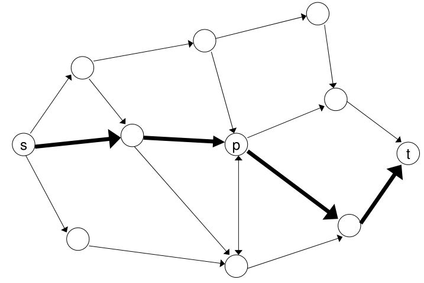
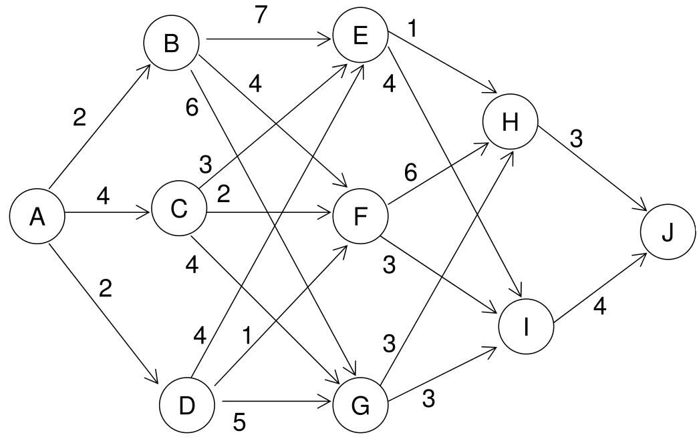

# Dynamic Programming

## 3.1 Shortest Paths

&emsp;&emsp;考虑一个具有非负弧长$$c_{ij}$$的图$$G = (V, A)$$，找出从s到t的最短路径。

<figure></figure>

一个最直接的方法：  
* 找出所有从s到t的路径
* 评估所有s-t路径的长度
* 找出最短的长度  
s−t路径的数量呈指数增长，对于大的图是不可行的。

```tip
如果s-t的最短路径经过节点p，那么子路径(s,p)和(p,t)一定分别为s到p和p到t的最短路径。
```

&emsp;&emsp;用$$d(v)$$表示从s到v的最短路径，那么

$$ d(v)=\min _{i \in V^{-}(v)}\left\{d(i)+c_{i v}\right\} $$

对于$$i \neq s$$，计算$$d(v)$$的**复杂度**为$$O(m)$$。

&emsp;&emsp;假设$$\vert V \vert = n$$和$$\vert A \vert = m$$，对节点进行排序使得对于所有的$$(i, j) \in A$$都有$$i \le j$$。$$D_k(j) = $$从s到j的最短路径长度，最多经过$$k$$条弧，那么

$$  D_k(j) 
=   \min \left\{D_{k-1}(j) ,\ \min_{i \in V^{-}(j)}\big[D_{k-1}(i)+c_{i j}\big]\right\}
$$

将$$k$$从1增大到$$m-1$$，即可得到最短路径。算法的复杂度为$$O(mn)$$。

**例**：找出从A到J的最短路径
<figure></figure>

## 3.2 Priciple of Optimality

Richard Bellman(1952)提出了最优性和动态规划的原理。  
— Richard Bellman on the Birth of Dynamic Programming. Stuart Dreyfus. Operations Research, Vol. 50, No. 1, 48-51, 2002

<figure>
    
    <figcaption>Richard Bellman (1920-1984)</figcaption>
</figure>

<b><font color="#00B050">Principle of optimality：在决策或选择的最优序列中，每个子序列也必须是最优的。</font></b>

&emsp;&emsp;最优原理适用于多阶段决策问题，有非常多的优化问题都满足这个原理，它适用于一类问题（而不是一个算法）。阶段可以指每个需要被计算值的节点，或者决定顺序的步骤。


## 3.3 0-1 Knapsack Problem
## 3.4 Integer Knapsack Problem
## 3.5 Uncapacitated Lot-Sizing

<br />
<b><font color="#3399ff"></font></b>
<!-- 绿 --><!-- #33cc00 -->
<b><font color="#00B050"></font></b>
<!-- 橙 -->
<b><font color="#FF4500"></font></b>