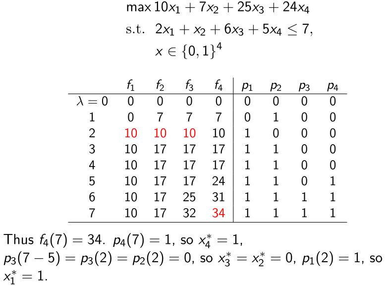
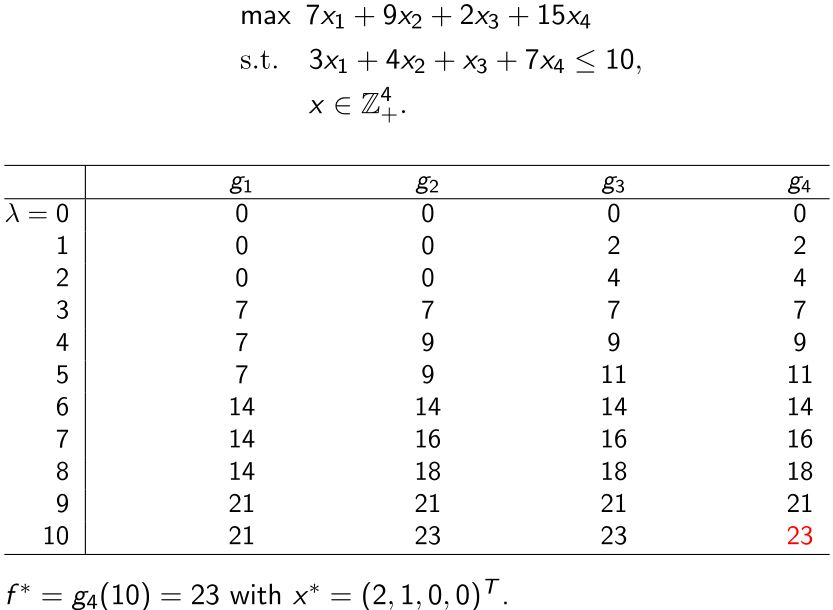
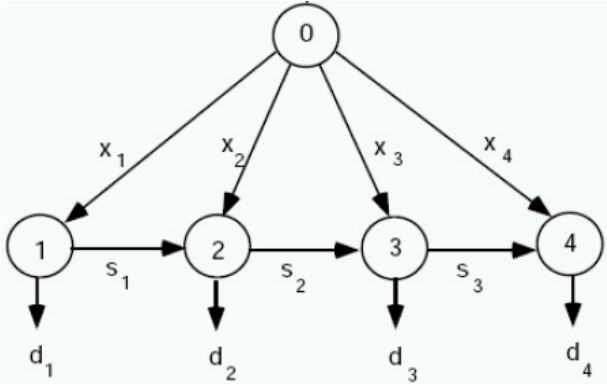

# Dynamic Programming

## 3.1 Shortest Paths

&emsp;&emsp;考虑一个具有非负弧长$$c_{ij}$$的图$$G = (V, A)$$，找出从s到t的最短路径。

<figure></figure>

一个最直接的方法：  
* 找出所有从s到t的路径
* 评估所有s-t路径的长度
* 找出最短的长度  
s−t路径的数量呈指数增长，对于大的图是不可行的。

```tip
如果s-t的最短路径经过节点p，那么子路径(s,p)和(p,t)一定分别为s到p和p到t的最短路径。
```

&emsp;&emsp;用$$d(v)$$表示从s到v的最短路径，那么

$$ d(v)=\min _{i \in V^{-}(v)}\left\{d(i)+c_{i v}\right\} $$

对于$$i \neq s$$，计算$$d(v)$$的**复杂度**为$$O(m)$$。

&emsp;&emsp;假设$$\vert V \vert = n$$和$$\vert A \vert = m$$，对节点进行排序使得对于所有的$$(i, j) \in A$$都有$$i \le j$$。$$D_k(j) = $$从s到j的最短路径长度，最多经过$$k$$条弧，那么

$$  D_k(j) 
=   \min \left\{D_{k-1}(j) ,\ \min_{i \in V^{-}(j)}\big[D_{k-1}(i)+c_{i j}\big]\right\}
$$

将$$k$$从1增大到$$m-1$$，即可得到最短路径。算法的复杂度为$$O(mn)$$。

**例**：找出从A到J的最短路径
<figure></figure>


## 3.2 Priciple of Optimality

Richard Bellman(1952)提出了最优性和动态规划的原理。  
— Richard Bellman on the Birth of Dynamic Programming. Stuart Dreyfus. Operations Research, Vol. 50, No. 1, 48-51, 2002

<figure>
    
    <figcaption>Richard Bellman (1920-1984)</figcaption>
</figure>

<b><font color="#00B050">Principle of optimality：在决策或选择的最优序列中，每个子序列也必须是最优的。</font></b>

&emsp;&emsp;最优原理适用于多阶段决策问题，有非常多的优化问题都满足这个原理，它适用于一类问题（而不是一个算法）。<b><font color="#00B050">阶段</font></b>可以指每个需要被计算值的节点，或者决定顺序的步骤。

```warning
最优性原理并不是一个定理，并不是所有的多阶段决策问题都满足它。
```


## 3.3 0-1 Knapsack Problem

&emsp;&emsp;考虑0-1背包问题

$$  f^* 
=   \max \{\mathbf{c}^\top \mathbf{x} \mid \mathbf{a}^\top \mathbf{x} \le b, \mathbf{x} \in \{0, 1\}^n\}
$$

&emsp;&emsp;要用动态规划解决背包问题，首先要从多阶段决策的角度来分析这个问题。决定每个物品要不要拿可以看作一次决策，在这个过程中背包的容量会变化。定义$$1 \le k \le n$$为阶段，$$0 \le \lambda \le b$$为状态。最优价值函数：

$$  f_k(\lambda)
=   \max \left\{ \sum_{j=1}^k c_j x_j \mid \sum_{j=1}^k a_j x_j \leq \lambda, \mathbf{x} \in \{0,1\}^k \right\}
$$

显然，当$$k = n,\ \lambda = b$$时有最优解，即$$f^* = f_n(b)$$。

&emsp;&emsp;下面，将问题写成递归的形式。对于第$$k$$个物品，只有拿和不拿两种情况。

$$\color{green}{
    f_k(\lambda)
=   \max \left\{ f_{k-1}(\lambda), c_k + f_{k-1}(\lambda - a_k) \right\}
}$$

初始条件：$$f_0(\lambda) = 0$$或$$f_1(\lambda) = 0, \text{ if } 0 \le \lambda \lt a_1$$，且$$f_1(\lambda) = \max(c_1, 0), \text{ for } \lambda \ge a_1$$。

&emsp;&emsp;如何求最优解呢？令$$p_l(\lambda) = 0, \text{ if } f_k(\lambda) = f_{k-1}(\lambda)$$，否则，令其为1。

&emsp;&emsp;**计算复杂度：**$$O(nb)$$。（伪多项式时间）

```warning
多项式时间的算法所需要的计算次数只与问题的规模n有关系。
```

**例：**0-1背包问题
<figure></figure>


## 3.4 Integer Knapsack Problem

&emsp;&emsp;考虑整数背包问题

$$  f^* 
=   \max \{ \sum_{j=1}^n c_j x_j \mid \sum_{j=1}^n a_j x_j \le b, x \in \mathbb{Z}_+^n \}
$$
其中，$$c_j \lt 0, a_j \gt 0, j = 1, \ldots, n$$。

&emsp;&emsp;下面，用动态规划来解决这个问题。定义$$r$$为阶段，$$\lambda$$为状态，得到问题

$$  g_r(\lambda)
=   \max \left\{ \sum_{j=1}^r c_j x_j \mid \sum_{j=1}^r a_j x_j \leq b, x \in \mathbb{Z}_+^r \right\}
$$

显然，当$$r = n, \lambda = b$$时有最优解，即$$z = g_n(b)$$。

&emsp;&emsp;递归方程：

$$  g_r(\lambda)
=   \max_{t = 0, 1, \ldots, \lfloor \lambda / a_r \rfloor} \{c_r t + g_{r-1}(\lambda - a_r t ) \}
$$

对于$$r = 1, \ldots, n$$和$$\lambda = 1, \ldots, b$$，计算$$g_r(\lambda)$$最多需要$$O(b)$$次，所有$$ g_n(b)$$的**计算复杂度为**$$O(n b^2)$$。

**问：**有更好的做法吗？  
— 把每个阶段决定拿几个改成决定要不要拿一个，如果拿了一个要不要再拿下一个。

对于$$x_r^*$$有两种情况：  
&emsp;(i) $$x_r^* = 0, g_r(\lambda) = g_{r-1}(\lambda)$$  
&emsp;(ii)$$x_r^* \ge 1$$，那么$$x_r^* = 1 + t$$，其中$$t$$是$$\ge 0$$的整数  
&emsp;&emsp;$$\Rightarrow (x_1^*, \ldots, x_{r-1}^*, t)$$对于有$$r$$个状态和$$\lambda - a_r$$个资源的背包问题是最优的。  
&emsp;&emsp;$$\Rightarrow (g_r(\lambda) = c_r + g_r (\lambda - a_r))$$。因此

$$\color{green}{
    g_r(\lambda)
=   \max \{g_{r-1}(\lambda), c_r + g_r(\lambda - a_r) \}
}$$

&emsp;&emsp;**计算复杂度：**$$O(nb)$$。

**例：**整数背包问题
<figure></figure>

```warning
注意：在整数背包问题中，表格的计算必须遵循从上到下，从左到右的顺序。
```


## 3.5 Uncapacitated Lot-Sizing

&emsp;&emsp;生产计划中的批量问题指的是决定最小成本生产和产品的库存保持问题从而在有限个离散阶段内满足需求。

&emsp;&emsp;$$f_t$$：$$t$$周期的固定生产成本；  
&emsp;&emsp;$$p_t$$：$$t$$周期的单位生产成本；  
&emsp;&emsp;$$h_t$$：$$t$$周期的固定储存成本；  
&emsp;&emsp;$$d_t$$：$$t$$周期的需求；  
&emsp;&emsp;$$x_t$$：$$t$$周期的产量；  
&emsp;&emsp;$$s_t$$：$$t$$周期末的库存，$$s_0 = 0$$，$$s_n = 0$$；  

<figure>
    
    <figcaption>ULS网络（n=4）</figcaption>
</figure>

&emsp;&emsp;ULS可以被看作一个 <b><font color="#00B050">fixed-charge network flow（固定费用网络流）问题</font></b>，需要决定打开哪条边$$(0, t)$$（这些弧是生产周期），并找出通过网络的最小成本流。

&emsp;&emsp;整数规划模型：

$$\begin{array}{ll}
    \min & \sum_{t=1}^n p_t x_t+\sum_{t=1}^n h_t s_t+\sum_{t=1}^n f_t y_t \\
    \text {s.t. } & s_{t-1} + x_t = d_t + s_t, \quad t = 1, \ldots, n, \\
    & x_t \leq M y_t, \quad \qquad \qquad t = 1, \ldots, n, \\
    & s_0 = 0, s_n = 0, s_t, x_t \geq 0, y_t \in\{0,1\}, \quad t=1, \ldots, n .
\end{array}$$

其中，$$M \gt 0$$是一个足够大的数（比如，各阶段的需求和）。

基本性质：  
&emsp;&emsp;存在一个最优解满足$$s_{t-1} x_t = 0$$。  
&emsp;&emsp;存在一个最优解使得如果$$x_t \gt 0$$，那么对于某个$$k$$有$$x_t = \sum_{i=t}^{t+k} d_i$$。

&emsp;&emsp;令$$d_{i t} = \sum_{j=i}^t d_j$$。因为$$s_t = \sum_{i=1}^t x_i - \sum_{i=1}^t d_i$$，目标函数可以表示成

$$  \sum_{t=1}^n p_t x_t + \sum_{t=1}^n h_t s_t + \sum_{t=1}^n f_t y_t
=   \sum_{t=1}^n c_t x_t + \sum_{t=1}^n f_t y_t - \sum_{t=1}^n h_t d_{1t}
$$

其中，$$c_t = p_t + \sum_{i=t}^n h_i$$。由于$$- \sum_{t=1}^n h_t d_{1t}$$为常数，所以可以从目标中去掉。

&emsp;&emsp;假设$$H(k)$$为阶段$$1, \ldots, k$$的解对应的最小成本。如果$$t \le k$$为最后一次生产的阶段，那么$$x_t = \sum_{i=t} d_i$$，成本为$$H(t-1) + f_t + c_t d_{tk}$$。

&emsp;&emsp;前向递归（<b><font color="#00B050">Wagner-Whitin算法</font></b>）：

$$\color{green}{
    H(k) = \min_{1 \le t \le k} \{ H(t-1) + f_t + c_t d_{tk} \}
}$$

其中，$$H(0) = 0$$。

&emsp;&emsp;对$$k = 1, 2, \ldots, n$$计算$$H(k)$$，得到最优值$$H(n)$$。

&emsp;&emsp;**计算复杂度：**$$O(n^2)$$。

<figure></figure>
