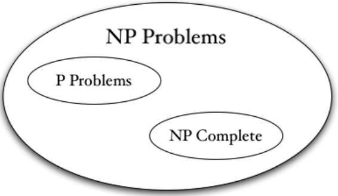

## Computational Complexity

计算复杂度的目标：  
&emsp;&emsp;给出量化问题**困难程度**的方法；  
&emsp;&emsp;比较两个不同问题的**相对难度**；  
&emsp;&emsp;严格定义**高效**算法的含义；  
&emsp;&emsp;声明一个问题的一个算法比另一个“**更好**”。

```note
这部分内容只是对计算复杂度进行简单介绍，因为计算复杂度的内容很多，有专门的课程。
```

## 4.1 Computational complexity

建立**问题分类**的计算复杂度理论所需要的要素如下:
&emsp;&emsp;理论适用的问题类别$$\mathcal{C}$$；  
&emsp;&emsp;（非空）子集$$\mathcal{C}_{\mathcal{E}} \subseteq \mathcal{C}$$的“简单”问题；  
&emsp;&emsp;（非空）子集$$\mathcal{C}_{\mathcal{H}} \subseteq \mathcal{C}$$的“困难”问题；  
&emsp;&emsp;两组问题之间的关系 $$\triangleleft$$ “不比…难”。  

我们的目标只是围绕这个机制给出一些定义:  
&emsp;&emsp;$$Q \in \mathcal{C}_{\mathcal{E}}, P \triangleleft Q \Rightarrow P \in \mathcal{C}_{\mathcal{E}}$$；  
&emsp;&emsp;$$P \in \mathcal{C}_{\mathcal{H}}, P \triangleleft Q \Rightarrow Q \in \mathcal{C}_{\mathcal{H}}$$。

## 4.2 Decision problem, Classes NP & P

&emsp;&emsp;这个理论只能应用于决策问题，有“是-否”答案的问题。  
&emsp;&emsp;&emsp;优化：$$\max \{ \mathbf{c^T x} \mid \mathbf{x} \in S \}$$  
&emsp;&emsp;&emsp;决策：$$\exists \mathbf{x} \in S$$使得$$\mathbf{c^T x} \ge k$$？

**例：**装箱问题（Bin Packing Problem, BPP）：给定很多物品的集合$$\mathcal{S}$$，每个物品有不同的尺寸，集装箱的尺寸是常数$$C$$。  
&emsp;&emsp;优化：确定可以划分$$\mathcal{S}$$的最小子集数量，使每个子集中物品的总大小不超过$$C$$  
&emsp;&emsp;决策：对于给定常数$$K$$决定$$\mathcal{S}$$是否可以被分成$$K$$个子集，使得每个子集中物品的总大小不超过$$C$$

```tip
所有的决策问题都可以转化成决策问题求解。
```

&emsp;&emsp;把优化转化成决策：假设你知道$$I \le z^* \le u$$，其中$$I, z^*, u \in \mathbb{Z}$$。如何通过解一系列决策问题来解决这个优化问题呢？

两分法搜索：  
&emsp;1. if $$(u - I \lt = 1), z^* = I$$; exit();  
&emsp;2. $$k = (I + u) / 2$$; if (dec($$k$$) == false), $$I = k$$; else $$u = k$$; goto 1;  
最多需要$$\color{green}{\log_2(u - I)}$$次调用dec($$k$$)。

### 4.2.1 Measuring the difficulty

&emsp;&emsp;我们对一个问题的复杂度感兴趣，而不是一个实例。一个问题（或模型）是由无限个实例组成的家族，其目标函数和约束有特定的结构。

可能的度量方法：  
&emsp;&emsp;根据经验：无法实际保证任何关于给定实例的难度；  
&emsp;&emsp;平均案例运行时间：难以分析，并且依赖于指定实例的概率分布；  
&emsp;&emsp;最差案例运行时间：复杂性理论是基于<b><font color="#FF4500">最坏情况</font></b>的方法。

### 4.2.2 Running time of an algorithm

&emsp;&emsp;算法的耗时与输入的规模有关。<b><font color="#00B050">时间复杂度函数</font></b>作为问题大小的函数，指定算法解决任何问题实例所需的**最大**时间量。

如何衡量问题的规模呢？  
— 在合理的编码方案中表示问题所必需的信息量的长度。  
— 对于一个问题实例$$X$$，输入的长度$$L(X)$$为实例的“标准”表示的二进制表示的长度。

&emsp;&emsp;整数$$2^n \leq x \lt 2^{n+1}$$可以表示成一个向量$$(v_0, v_1, \ldots, v_n)$$，其中

$$ x = \sum_{i=0}^n v_i 2^i, v_i \in \{0, 1\} $$

注意，$$n \le \log_2 x \lt n+1$$。所以，需要对数数量的比特数来表示$$x \in \mathbb{Z}$$，即$$\log_2 x + 1$$。

**例：**TSP问题，有$$n$$个城市，对饮成本$$c_{ij} \in \mathbb{Z}$$，求$$\max_{i,j} c_{ij} = \theta$$，需要$$L(X) = \log(n) + n^2 \log(\theta)$$比特来表示一个实例。  
**例：**背包问题，$$n, a_j, c_j, b$$，其中$$a_j, c_j, b$$为有理数，$$a_j \le b$$，那么$$L(X) = \log(n) + (2n + 2) \log(b) + 2n \log(\theta)$$，其中$$\theta = \max c_j$$。

如何度量计算时间？  
— 希望这个度量与特定电脑无关；  
— 计算<b><font color="#FF4500">基本运算的数量</font></b>；  
— 假设每个基本操作都在单位时间内完成。（只要数字的规模不增长得太快，这是合理的。）

给定一个问题$$P$$、能解决$$P$$的算法$$A$$以及问题$$P$$的一个实例$$X$$：  
&emsp;&emsp;$$L(X) =$$实例（以合理的编码方式）的长度；  
&emsp;&emsp;$$g_A(X) =$$用算法$$A$$解决实例$$X$$需要的基本计算的量；  
&emsp;&emsp;$$f_A(I) = \sup\{ g_A(X) \vert L(X) = I \}$$为算法$$A$$的运行时间。  
$$f_A(I)$$即为$$O(g(I))$$，如果存在$$c \gt 0$$，使得$$f_A(I) \le c g(I)$$。考虑了函数在$$k \rightarrow \infty$$时的渐近行为。

* 算法$$A$$被称为<b><font color="#00B050">多项式时间算法</font></b>，如果$$f_A(I) = O(I^p)$$对某个固定的$$p$$。  
&emsp;&emsp;$$A$$是**强多项式时间**的，如果$$f_A(I)$$的边界由一个与数据规模（数字的大小）无关的函数决定。  
&emsp;&emsp;$$A$$是**弱多项式时间**的，如果$$f_A(I)$$是多项式的但不是强多项式的。$$O(I^p)$$中的$$I$$包含了与$$\log \theta$$有关的项，其中$$\theta$$是给定实例中最大的数。

* 算法$$A$$被称为<b><font color="#00B050">指数时间算法</font></b>，如果$$f_A(I) \neq O(I^p)$$，对于任意的$$p$$，i.e. 存在$$c_1, c_2 \gt 0, d_1, d_2 \gt 1$$和正整数$$k$$使得$$c_1 d_1^I \le f_A(I) \le c_2 d_2^I, \forall I \ge I^{\prime}$$。

* 算法$$A$$被称为<b><font color="#00B050">伪多项式时间算法</font></b>，如果$$A$$是以一元形式编码的数据长度为多项式的算法。一元的意思是我们使用一个符号的字母表。（如十进制，而非二进制）实际上，这表明$$A$$与参数和实例数据$$\theta$$的大小有多项式关系，而不是$$\log \theta$$。  
**例：**整数背包问题，存在一个$$O(Nb)$$的算法可以解这个问题，其中，$$N$$是物品的数量，$$b$$是背包的大小。这不少一个多项式时间算法。如果$$b$$由关于$$n$$的多项式函数决定的话，那么这个算法是多项式时间的。  
&emsp;&emsp;令$$\theta$$为给定实例中的最大数字。输入数据的长度为$$I = O(\log(\theta))$$。如果算法需要$$\theta$$步，那么这是一个指数时间算法！因为$$f_A(I) \ge O(\theta) = O(2^I)$$。

### 4.2.3 Classes NP & P

#### The class NP

* 问题类型NP $$\neq$$ "Non-polynomial"
* NP = 在<b><font color="#3399ff">非确定性图灵机</font></b>上可以在多项式时间内解决的一类决策问题。
* NP $$\approx$$ 一类决策问题，这类问题具有对于每一个答案是“yes”的实例，都有一个<b><font color="#3399ff">简短的（多项式）证明</font></b>的性质。（即证明答案是“yes”很容易）

```warning
我们只能研究很快就能验证答案是否正确的问题，而验证一个问题简单与解决这个问题是否简单无关。
```
  
* 如果一个优化问题对应的决策问题是NP的，那么这个优化问题可以通过多项式时间次数回答决策问题得到解决。
* P是NP问题中可以在多项式时间内被解决的那类。

**例：**对于一个0-1背包问题实例$$X$$。  
&emsp;&emsp;决策问题：存在$$x \in S = \{ x \in \{0, 1\}^n \mid a^T x \le b \}$$使得$$c^T x \ge k$$吗？  
&emsp;&emsp;输入的长度：$$L(X) = \log(n) + 2n \log(\theta) + \log b + \log k$$。  
&emsp;&emsp;对于一个实例，如果它的答案是“yes”，那么它满足：  
&emsp;&emsp;(a) 读一个解$$x \in \{0, 1\}^n$$;  
&emsp;&emsp;(b) 检查$$a^T x \le b$$和$$c^T x \ge k$$。  
&emsp;&emsp;(a)和(b)都可以在$$L$$的多项式时间内完成。

**问：**整数背包问题呢？  
— 整数背包问题也是有多项式时间的算法的。

**P问题：**

1. 具有非负权重的最短路径问题：$$O(m^2)$$。这个问题中计算的次数与边权重的大小无源，所以是强多项式时间的。  

2. 解方程组$$Ax = b$$。  
&emsp;&emsp;(a) 通过高斯消元法即可找到解$$x = A^{-1}b$$，$$n$$次pivots且每次pivot需要$$O(n^2)$$次计算。所以总计算量为$$O(n^3)$$。  
&emsp;&emsp;(b) 出现的数的大小受限于$$(A, b)$$的任意子矩阵的最大行列式。由于$$\det(A)$$包含$$n! \lt n^n$$项，所以这个最大的数由$$(n \theta)^n$$决定，其中$$\theta$$是$$(A, b)$$中最大的。这表明这个表达式的规模受限于一个与$$n$$和$$\log \theta$$相关的多项式函数：$$\log((n \theta)^n) = n \log(\theta)$$。  
&emsp;&emsp;(c) 与输入的规模成多项式关系。

3. 指派问题：$$O(n^4)$$。

4. 线性规划：$$\min \{ c^T x \mid Ax = b, x \ge 0 \}$$。  
&emsp;&emsp;算法：George Dantzig在1947年提出了单纯形法。但是，单纯形法有表现很差的反例，所以很长时间内人们都是不知道线性规划是否有多项式算法的。直到1979年，Leonid Khachiyan提出了椭球法，该方法在最坏的情况下也是多项式时间的，但是该方法一般来说表现都比单纯形法差，难以实现。到了1984年，N. Karmarkar提出了内点法并用程序实现了内点法（其复杂度为$$O(n^4 L)$$）。1990s后有了路径跟随法。  
&emsp;&emsp;<b><font color="#FF4500">Open problem in LP</font></b>：LP存在**强多项式**算法吗？

#### The class co-NP

&emsp;&emsp;这类问题的补问题是NP的。  
&emsp;&emsp;co-NP $$\approx$$ 一类决策问题，这类决策问题具有对于每个有“no”回答的实例，都有简短的证明的特性。

### 4.3 Polynomial Reduction & The Class NPC

&emsp;&emsp;如果问题$$P, Q \in$$ NP，并且如果$$P$$的一个实例可以在多项式时间内被转化成$$Q$$的一个实例，那么$$P$$是polynomially reducible到$$Q$$。我们可以写成$$P \triangleleft Q$$。

```tip
现在，我们想问一个问题：NP问题中最难的是什么？
```

&emsp;&emsp;如果$$P \in$$ <b><font color="#00B050">NPC (NP-complete)</font></b>，那么$$Q \in$$ NP $$\Rightarrow Q \triangleleft P$$。  
&emsp;&emsp;如果$$P \in$$ NP且我们可以在多项式时间内将任意其它问题$$Q \in$$ NP转化成$$P$$，那么在这个意义上$$P$$就是**NP中最难的问题**。

&emsp;&emsp;如果一个优化问题对应的决策问题是NPC的，那么这个优化问题是<b><font color="#00B050">NP-hard</font></b>问题。

&emsp;&emsp;Stephen A. Cook于1970年证明了<b><font color="#00B050">Satisfiability problem</font></b>是NPC的。满足性问题是第一个已知的NPC问题！Stephen A. Cook于1982年获得了图灵奖。

&emsp;&emsp;满足性问题：给定$$N = \{ 1, \ldots, n \}$$和$$2m$$个子集$$\{C_i\}_{i=1}^m$$和$$\{D_i\}_{i=1}^m$$。是否存在$$x \in \{0,1\}^n$$使得$$\sum_{j \in C_i} x_j + \sum_{j \in D_i}(1- x_j) \ge 1$$？

## 4.4 P vs NP Problem

&emsp;&emsp;$$Q \in$$ P, $$P \triangleleft Q \Rightarrow P \in$$ P.  
&emsp;&emsp;$$P \in$$ NPC, $$P \triangleleft Q \Rightarrow Q \in$$ NPC.

<figure></figure>

**P vs NP Problem – Clay Mathematics Institute**

<figure></figure>


<br />
<b><font color="#3399ff"></font></b>
<!-- 绿 --><!-- #33cc00 -->
<b><font color="#00B050"></font></b>
<!-- 橙 -->
<b><font color="#FF4500"></font></b>