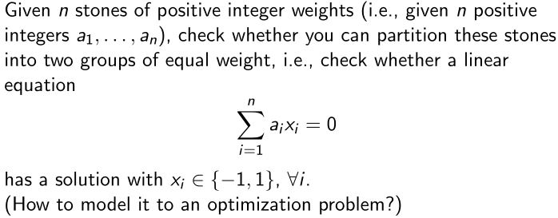

# 整数规划

&emsp;&emsp;复旦大学管理学院孙小玲教授于2012年在台湾国立交通大学的公开课的学习笔记。课程的参考用书为孙小玲、李端的《整数规划》，课程资料孙教授放在了自己的[网站](http://my.gl.fudan.edu.cn/teacherhome/xlsun)上。很可惜这个网站我没能打开，可能是因为天妒英才，孙教授已经于2014年因病与世长辞，网站已无人维护。课程的讲义可以根据这个[CSDN文章](https://blog.csdn.net/weixin_40762182/article/details/124237403)获取，课程视频可以在[bilibili](https://www.bilibili.com/video/BV14z4y1Z7kw?spm_id_from=333.337.search-card.all.click&vd_source=ad1cdccd70e36fb8ead1355a256b8a4e)看到搬运的。

---

# Introduction

### What is Interger Programming?

* <b><font color="#00B050">Operations Research (O.R.)</font></b>是应用高级分析方法帮助做出更好决策的学科，即**Science of Better**。
* Mathematical Programming (Optimization)是运筹学的一个分支。它是关于如何从一组可用的备选方案中做出决策（符合某些标准）。
* <b><font color="#00B050">Integer Programming</font></b>是关于离散或整数变量的决策。

### Why bother to use integer decision variable?

* 如果变量和一个不可分的物理实体相关，那么它必须是整数，比如：要制造的飞机数量，股票数量……
* 如果要决定“是”或“否”（0或1）
* 在大多数情况下，离散决策的连续近似对于实际目的来说不够精确。

### Simple examples

**Example 1 (Stone Problem)**

<figure>
    
</figure>

**Example 2 背包问题 (Knapsack Problem)**

&emsp;&emsp;一个窃贼有一个大小为$$b$$的背包。他闯入一家商店，里面有$$n$$件物品。每件物品都有价值$$c_j$$和大小$$a_j$$。窃贼应该选择哪些物品来优化其盗窃行为？

&emsp;&emsp;令$$x_j = \begin{cases} 1,\ \text{选了第} j \text{个物品} \\ 0,\ \text{Otherwise} \end{cases}$$，问题可以建模为0-1整数规划模型：

$$\begin{array}{ll}
    \max & \sum_{j=1}^{n} c_{j} x_{j} \\
    \text { s.t. } & \sum_{j=1}^{n} a_{j} x_{j} \leq b \\
    & x_{j} \in\{0,1\}, j=1, \ldots, n
\end{array}$$

**Example 3 指派问题 (Assignment Problem)**

&emsp;&emsp;$$n$$个人可以做$$n$$项工作，每个人可以被指派去做一个工作，每个人$$i$$做工作$$j$$的成本为%%c_{ij}$$。问题是找到一个分配方法使成本最低。

&emsp;&emsp;令$$x_{ij} = \begin{cases} 1,\ \text{如果第} j \text{个人做工作}j \\ 0,\ \text{Otherwise} \end{cases}$$，问题可以表述为

$$\begin{array}{ll}
    \min & \sum_{i=1}^{n}\sum_{j=1}^{n} c_{ij} x_{ij} \\
    \text { s.t. } & \sum_{i=1}^{n} x_{ij}=1 ,\ i=1,\ldots,n \\
    & \sum_{i=1}^{n} x_{ij}=1 ,\ j=1,\ldots,n,\ x_{ij} \in \{0,1\}
\end{array}$$

#### Some Real-World Optimization Problems

* 火车调度
* 航空公司机组安排
* 公路路面养护与修复
* 生产计划
* 发电规划
* 电信
* 切割问题

### Classification of integer programming problems

* 我们称存在连续变量的问题为<b><font color="#00B050">混合整数规划</font></b>。
* 在有些问题中，$$x$$的取值只能是0或1，这一样的变量称为二元变量。含有二元变量的整数规划称为二元整数规划（BIPs，即<b><font color="#00B050">0-1规划</font></b>）。

&emsp;&emsp;<b><font color="#00B050">整数线性规划</font></b> Pure Integer Linear Programming：

$$\text{(IP)} \quad \min \{ 
        \mathbf{c}^T \mathbf{x} \mid \mathbf{Ax \leq b, x} \in \mathbb{Z}_+^n  
    \}
$$

&emsp;&emsp;<b><font color="#00B050">混合0-1规划</font></b> Mixed 0-1 Programming：

$$  \text{(MIP)} \quad \min \{
        \mathbf{c}^T \mathbf{x} + \mathbf{h}^T \mathbf{y} \mid 
        \mathbf{Ax + Gy \leq b}, \mathbf{x} \in \mathbb{B}^{n}, \mathbf{y} \in \mathbb{R}_{+}^{p}
    \}
$$

&emsp;&emsp;<b><font color="#00B050">非线性整数规划</font></b> General (Nonlinear) Integer Programming：

$$\begin{array}{lll}
    \text{(NLIP)} \quad & \min f(x) \\
    & \text { s.t. }  g_{i}(x) \leq b_{i}, i=1, \ldots, m, \\
    & \qquad x \in \mathcal{X},
\end{array}$$

其中$$f$$和$$g_i, i=1, \ldots, m$$为$$\mathbb{R}^n$$上的实值函数，$$\mathcal{X}$$是$$\mathbb{Z}^n$$（$$\mathbb{R}^n$$中所有整数点的集合）的一个有限子集。

&emsp;&emsp;<b><font color="#00B050">混合整数非线性规划</font></b> Mixed-Integer Nonlinear Programming：

$$\begin{array}{lll}
    \text{(MNLIP)} \quad & \min f(x, y) \\
    & \text { s.t. }  g_{i}(x, y) \leq b_{i}, i=1, \ldots, m, \\
    & \qquad x \in \mathcal{X}, y \in \mathcal{Y}
\end{array}$$

其中$$f$$和$$g_i, i=1, \ldots, m$$为$$\mathbb{R}^{n+q}$$上的实值函数，$$\mathcal{X}$$是$$\mathbb{Z}^n$$的一个有限子集，$$\mathcal{Y}$$是$$\mathbb{R}^q$$的一个连续子集。

```note
尽管线性规划的可行解有无数个，但是最优解只会出现在顶点上，所以单纯形法在实际应用中是有效的。  
整数规划的可行解是有限个，那它的求解过程有多难呢？
```

### How Hard is Integer Programming?

一个简单直观的想法：**穷举**  
&emsp;&emsp;对于石头问题和0-1背包问题，列出所有可行的点，用一个每秒能计算$$10^8$$次的超级计算机需要：  
&emsp;&emsp;$$n=30, 2^{30} \approx 10^9, 10 \text{秒}$$  
&emsp;&emsp;$$n=60, 2^{60} \approx 10^18, 360 \text{年}$$  
&emsp;&emsp;$$n=100, 2^{100} \approx 10^30, 4 \times 10^{14} \text{年}$$  
&emsp;&emsp;……

&emsp;&emsp;**四舍五入**：求解连续优化并将解四舍五入到最近的整数点。

&emsp;&emsp;**启发式算法**：贪心和局部搜索算法。  
对于0-1背包问题，将利润与重量的比值排序为：$$\frac{c_{j1}}{a_{j1}} \geq \frac{c_{j2}}{a_{j2}} \geq \cdots \geq \frac{c_{jn}}{a_{jn}} \geq $$，按$$j1, \ldots, jn$$的顺序选择物品，直到再加下一个物品会超过背包的总容量$$b$$。

&emsp;&emsp;最优解？（如果不是，则构建反例）

#### Deep thoughts

* 大多数整数规划问题是**NP-complete**或**NP-hard**，也就是说组合优化问题能有多难这个问题就可以有多难。如果我们有办法解决其中一个问题，我们就能够解决任何其他组合问题。
* 解一个线性规划问题的松弛只能得到整数规划问题最优解的下界。
* 四舍五入到可行的整数解很困难或着说几乎不可能。
* LP松弛的最优解可以离MIP的最优解非常远（完全单模情况除外）。
* 求解一般整数规划可能比求解线性规划或凸优化问题困难得多。

这不仅仅是些经验之谈，有一个完整的理论围绕着它。

## Course Description

1. 能够使用整数变量在管理科学、工业工程和运输科学中建立复杂的数学模型，并学习如何使用各种软件包求解整数规划模型。
2. 理解NP-complete和NP-hard的概念，以及使用复杂性理论工具解决整数规划问题的难度。
3. 能够使用求解整数规划的基本方法。
4. 理解多面体理论和有效不等式的基本概念，以及如何将该理论集成到整数规划的求解方法中。
5. 了解基于列生成和Dantzig-Wolfe分解的大规模整数规划高级方法。

### Course modules

* Module 1 IP Basic
  * 用整数决策变量建模问题
  * 分支定界法 求解IPs的“主力”算法的基础知识
  * 求解IP的软件（Matlab, CLPEX, AIMMS）
* Module 2 IP Theory
  * 复杂性理论 是什么让问题变得“难”或“容易”，复杂度类别P、NP和NP完备性
  * 多面体理论 维度、面、极性以及分离和优化的等价性。
* Module 3 Basic Algorithms
  * 分支定界
  * 动态规划
  * 割平面法
* Module 4 Advanced Algorithms
  * 拉格朗日松弛
  * 列生成和Dantzig-Wolfe分解
  * Branch-and-Price
* Module 5 Nonlinear IP
  * 二次0-1优化、最大割问题
  * 二次背包问题

## Examples from Combinatorial Optimization

**Example 1 (Set Covering Problem)**

&emsp;&emsp;考虑一定数量的地区，问题是决定在哪里安装一套应急服务中心。对于每个可能的中心，安装服务中心的成本以及可以服务的地区都是已知的。目标是选择一组成本最低的服务中心，以便覆盖每个地区。

&emsp;&emsp;令$$M={1, \ldots, m}$$为地区的集合，$$N={1, \ldots, n}$$为可能的中心的集合。令$$S_j \subseteq M$$为位于$$j \in N$$的中心可以服务到的地区，$$c_j$$为它的建造费用。定义一个0-1关联矩阵$$\mathbf{A}$$，其中如果$$i \in S_j$$则$$a_{ij} = 1$$，否则$$a_{ij} = 0$$。令$$x_j = \begin{cases} 1, \text{ if 选了中心}j \\ 0, \text{ otherwise} \end{cases}$$。  
&emsp;&emsp;问题可以表述为

$$\begin{array}{lll}
    \min & \sum_{j=1}^n c_j x_j \\
    \text {s.t.} & \sum_{j=1}^n a_{ij} x_j \geq 1, i=1, \ldots, m \\
    & x \in \{ 0, 1 \}^n
\end{array}$$

**Example 2: Facility location problem**


<br />
<!-- 蓝 -->
<b><font color="#3399ff"></font></b>
<!-- 绿 -->
<b><font color="#00B050"></font></b>
<!-- 橙 -->
<font color="#FF4500"></font>

