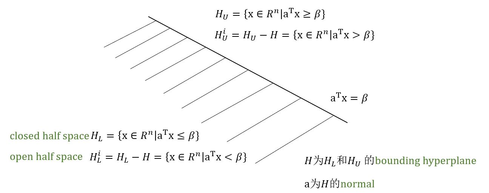
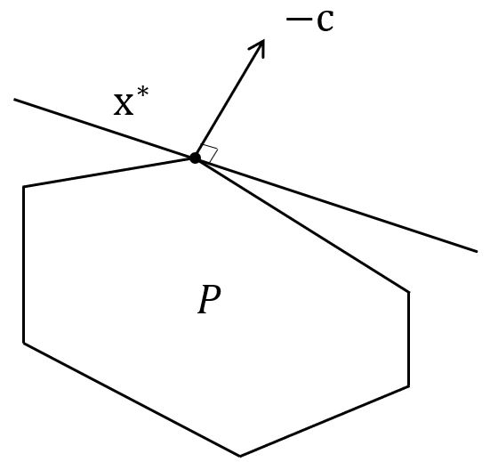

# Geometry of LP

&emsp;&emsp;1.Terminologies  
&emsp;&emsp;2.Background knowledge  
&emsp;&emsp;3.Graphic method  
&emsp;&emsp;4.Fundamental theorem of LP 

## 2.1 Terminologies

&emsp;&emsp;Baseline Model: (LP)

$$\begin{aligned}
    \text{min}  \quad & \mathbf{c}^T \mathbf{x} \\
    \text{s.t.} \quad & \mathbf{Ax} = \mathbf{b} \\
    & \mathbf{x} \ge 0 .
\end{aligned}
$$

&emsp;&emsp;<font color="#00B050">Feasible domain </font>

$$P = \{ 
    \mathbf{x} \in \mathbf{R}^n | \mathbf{Ax} = \mathbf{b} ,\ \mathbf{x} \ge 0 
\}$$

&emsp;&emsp;<font color="#00B050">Feasible solution</font>

$$  \mathbf{x} \text{ is a } feasible \ solution \text{ if } \mathbf{x} \in P
$$

&emsp;&emsp;<font color="#00B050">Consistency</font>

$$ \text{when } P \neq \emptyset ,\ \text{LP is } consistent $$

&emsp;&emsp;<font color="#00B050">Bounded feasible domain</font>

$$ P \text{ is } bounded \text{ if } \exists M \gt 0 
\text{ such that } \|x\| \le M ,\ \mathbf{x} \in P
$$

在这种情况下，可以说“LP的可行域有界”。

&emsp;&emsp;<font color="#00B050">Bounded LP</font>

$$ LP \text{ is } bounded \text{ if } \exists M \in R 
\text{ such that } \mathbf{c}^T \mathbf{x} \ge M ,\ \forall \mathbf{x} \in P
$$

```warning
问：LP的可行域有界 等价于 LP有界？  
LP有界其可行域必有界，反之不成立。
```

&emsp;&emsp;Optimal solution

$$\mathbf{x}^* \text{ is an optimal solution if }
\mathbf{x}^* \in P \text{ and } 
\mathbf{c}^T \mathbf{x}^* = \min_{x \in P} \mathbf{c}^T \mathbf{x}
$$

&emsp;&emsp;Optimal solution set 

$$ P^* = \{ \mathbf{x}^* | \mathbf{x}^* \text{ is optimal} \} $$

We say $$ \mathbf{x}^* \ solves $$ LP, if $$ \mathbf{x}^* \in P^* $$.

<br />

## 2.2 Background knowledge

Observation 1: 标准形式的LP中的**等式约束**是解空间内的“hyperplane”。

#### Definition: hyperplane

&emsp;&emsp;对于一个向量$$ \mathbf{a} \in \mathbf{R}^n ,\ \mathbf{a} \neq 0 $$和一个标量$$ \beta \in \mathbf{R} $$，定义$$ \color{green}{ H = \{ \mathbf{x} \in \mathbf{R}^n \lvert \mathbf{a}^T \mathbf{x} = \beta \} } $$为<font color="#00B050">hyperplane（超平面）</font>。

<center>
    <figure>
        
    </figure>
</center>

**Property 1**：法向量$$ \mathbf{a} $$垂直于超平面$$ H $$上的所有向量。

证: $$ \forall \mathbf{y,z} \in H ,\ \mathbf{a}^T(\mathbf{y-z}) = \mathbf{a}^T \mathbf{y} - \mathbf{a}^T \mathbf{z} = \beta -\beta = 0 $$

**Property 2**：法向量$$ \mathbf{a} $$指向upper half space。

证: $$ \forall \mathbf{z} \in H ,\ \mathbf{w} \in H_L^i ,\ \mathbf{a}^T(\mathbf{w-z}) = \mathbf{a}^T \mathbf{w} - \mathbf{a}^T \mathbf{z} \lt \beta -\beta = 0 $$

#### Definition: polytope

&emsp;&emsp;一个**polyhedral set**或**polyhedron**是由有限个closed half spaces的交形成的。如果它是非空且有界的，则称它为<font color="#00B050">polytope</font>。

**Property 3**：标准的LP的可行域$$ P = \{ \mathbf{x} \in \mathbf{R}^n \vert \mathbf{Ax=b} ,\ \mathbf{x} \ge 0 \} $$为多边集合。

**Property 4**：如果$$ P \neq \emptyset $$且$$ \exists \beta \in \mathbf{R} $$，这样$$ P \subset H_L := \{ \mathbf{x} \in \mathbf{R}^n \vert -\mathbf{c}^T \mathbf{x} \le \beta \} $$那么$$ \min_{\mathbf{x} \in P} \mathbf{c}^T \mathbf{x} \ge \beta $$。进一步地，如果$$ \mathbf{x}^* \in P \cap H $$，那么$$ \mathbf{x}^* \in P^* $$。

<center>
    <figure>
        
    </figure>
</center>

## 2.3 Graphic Method

* Step 1: 画出可行域$$ P $$（如果$$ P = \emptyset $$，STOP！无解。）
* Step 2: 用$$ \mathbf{-c} $$作为每个顶点的法向量来看对于某些$$ \beta \in \mathbf{R} $$，是否有$$ P \in H_L := \{ \mathbf{x} \in \mathbf{R}^n \vert -\mathbf{c}^T \mathbf{x} \le \beta \} $$。  
&emsp;&emsp;1.如果“YES”，那么就找到了最优解。  
&emsp;&emsp;2.如果“NO”，那么此问题无下界。

### Pros & Cons

优点：几何上简单

缺点：代数上复杂  
&emsp;&emsp;&emsp;—有多少个顶点？  
&emsp;&emsp;&emsp;—如何识别各个顶点？

**例** 给定以下LP

$$\begin{aligned}
        \text{min}  \quad   & -x_1 - 2x_2 \\
        \text{s.t.} \quad   &  x_1 + x_2 \le 40 \\
                            & 2x_1 + x_2 \le 60 \\
                            & x_1 ,\ x_2 \ge 0  \\
\end{aligned}
$$

化成标准型，$$ \mathbf{c} = \begin{bmatrix}-1 & -2 & 0 & 0\end{bmatrix}^T $$，$$ \mathbf{A} = \begin{bmatrix}1 & 1 & 1 & 0 \\ 2 & 1 & 0 & 1\end{bmatrix} $$，$$ \mathbf{b} = \begin{bmatrix}40 \\ 60\end{bmatrix} $$

$$\begin{aligned}
        \text{min}  \quad   & -x_1 - 2x_2 \\
        \text{s.t.} \quad   &  x_1 + x_2 + x_3 = 40 \\
                            & 2x_1 + x_2 + x_4 = 60 \\
                            & x_1 ,\ x_2 ,\ x_3 ,\ x_4 \ge 0  \\
\end{aligned}
$$

<center>
    <figure>
        
    </figure>
</center>

### Any better way?

**Simplex Method**: 一种<font color="#3399ff">generate and manage</font>可行解集（polyhedral set）的顶点的方法。

<br />

## 2.4 Fundamental theorem of LP

### 2.4.1 Background knowledge

#### Definition: linear, affine, conic, convex combination  

&emsp;&emsp;$$ \mathbf{x}^1, \mathbf{x}^2, \ldots, \mathbf{x}^P \ \in \mathbf{R}^n ,\ \lambda_1, \lambda_2, \ldots, \lambda_P \ \in \mathbf{R} $$且$$ \mathbf{x} = \sum_{i=1}^P \lambda_i \mathbf{x}^i $$，定义$$ \mathbf{x} $$为$$ \{ \mathbf{x}^1, \mathbf{x}^2, \ldots, \mathbf{x}^P \} $$的一个<font color="#00B050">linear combination</font>。  
如果$$ \sum_{i=1}^P \lambda_i = 1 $$，那么$$ \mathbf{x} $$为$$ \{ \mathbf{x}^1, \mathbf{x}^2, \ldots, \mathbf{x}^P \} $$的一个<font color="#00B050">affine combination</font>（仿射组合）。  
如果$$ \lambda_i \ge 0 $$，那么$$ \mathbf{x} $$为$$ \{ \mathbf{x}^1, \mathbf{x}^2, \ldots, \mathbf{x}^P \} $$的一个<font color="#00B050">conic combination</font>（圆锥组合）。  
如果$$ \sum_{i=1}^P \lambda_i = 1 ,\ \lambda_i \ge 0 $$，那么$$ \mathbf{x} $$为$$ \{ \mathbf{x}^1, \mathbf{x}^2, \ldots, \mathbf{x}^P \} $$的一个<font color="#00B050">convex combination</font>（凸组合）。

#### Definition: affine set, convex set and cone

&emsp;&emsp;令$$ S $$为$$ \mathbf{R}^n $$的一个子集  
如果$$ S $$中任意两点的仿射组合落在$$ S $$内，那么$$ S $$就是一个<font color="#00B050">affine set</font>。  
如果$$ S $$中任意两点的凸组合落在$$ S $$内，那么$$ S $$就是一个<font color="#00B050">convex set</font>。  
如果对于所有的$$ \mathbf{x} \in S $$且$$ \lambda \ge 0 $$都有$$ \lambda \mathbf{x} \in S $$，那么$$ S $$就是一个<font color="#00B050">cone</font>（锥）。

**例** <font color="#3399ff">Hyperplane是convex的，不是affine的。</font>

证：$$ \mathbf{x}^1 , \mathbf{x}^2 $$是$$ H $$内任意两点，要证$$ H $$是凸集，即证凸组合$$ \lambda_1 \mathbf{x}^1 + \lambda_2 \mathbf{x}^2 \in H ,\ \lambda_1 + \lambda_2 = 1 ,\ \lambda_1 , \lambda_2 \ge 0 $$

$$ \begin{aligned}
    \alpha^T (\lambda_1 \mathbf{x}^1 + \lambda_2 \mathbf{x}^2) 
= & \lambda_1 \alpha^T \mathbf{x}^1 + \lambda_2 \alpha^T \mathbf{x}^2 \\
= & \beta (\lambda_1 + \lambda_2) \\
= & \beta
\end{aligned} $$

**例** <font color="#3399ff">Lower half space是convex的，不是affine的。</font>

证：$$ \mathbf{x}^1 , \mathbf{x}^2 $$是$$ H_L $$内任意两点，要证$$ H_L $$是凸集，即证凸组合$$ \lambda_1 \mathbf{x}^1 + \lambda_2 \mathbf{x}^2 \in H_L ,\ \lambda_1 + \lambda_2 = 1 ,\ \lambda_1 , \lambda_2 \ge 0 $$

$$ \begin{aligned}
    \alpha^T (\lambda_1 \mathbf{x}^1 + \lambda_2 \mathbf{x}^2) 
= & \lambda_1 \alpha^T \mathbf{x}^1 + \lambda_2 \alpha^T \mathbf{x}^2 \\
\le & \beta (\lambda_1 + \lambda_2) \\
= & \beta
\end{aligned} $$

&emsp;&emsp;要证$$ H_L $$不是仿射的，可取$$ \lambda_1 , \lambda_2 \le 0 $$，则有$$ \alpha^T (\lambda_1 \mathbf{x}^1 + \lambda_2 \mathbf{x}^2) \ge \beta $$，不在$$ H_L $$内。

**例** <font color="#3399ff">可行域</font> $$P = \{ \mathbf{x} \in \mathbf{R}^n \vert \mathbf{Ax} = \mathbf{b} ,\ \mathbf{x} \ge 0 \}$$ <font color="#3399ff">的几何意义？</font>

&emsp;&emsp;1.$$ P $$是一个polyhedral set。 
&emsp;&emsp;2.$$ P $$是一个convex set。  
&emsp;&emsp;3.$$ P $$是m个hyperplane与第一象限的cone的交集。  
&emsp;&emsp;4.$$ \mathbf{Ax} = \mathbf{b} ,\ \mathbf{x} \ge 0 $$表明rhs向量$$ \mathbf{b} $$落在由约束矩阵$$ \mathbf{A} $$各列生成的cone内。
$$  \mathbf{Ax} 
=   [\mathbf{A}_1 \mathbf{A}_2 \cdots \mathbf{A}_n] 
    \begin{bmatrix} x_1 \\ x_2 \\ \vdots \\ x_n \end{bmatrix} 
=   \sum_{j=1}^n x_j \mathbf{A}_j 
\ \in \mathbf{R}^m
$$  
&emsp;&emsp;5.实际上，集合$$ A_c = \{ \mathbf{y} \in \mathbf{R}^m \vert \mathbf{y=Ax} ,\ \mathbf{x} \in \mathbf{R}^n ,\ \mathbf{x} \ge 0 \} $$是由矩阵$$ \mathbf{A} $$的各列生成的一个convex cone。

#### Definition: interior and boundary points

&emsp;&emsp;给定一个集合$$ S \subset \mathbf{R}^n $$，如果对于集合内一点$$ \mathbf{x} $$,$$ \exists \epsilon \gt 0 $$使得球$$ B = \{ \mathbf{y} \in \mathbf{R}^n \vert \ \vert \vert \mathbf{x-y} \vert\vert \le \epsilon \} \ \subset S $$，那么$$ x $$就是集合$$ S $$的一个<font color="#28a745">interior point</font>，否则就是<font color="#28a745">boundary point</font>。表示形式如下：

$$\begin{aligned}
    int(S)  &= \{ \mathbf{x} \text{ is an interior point of S} \} \\
    bdry(S)  &= \{ \mathbf{x} \text{ is an boundary point of S} \} 
\end{aligned}$$

```tip
凸集的边界点有何特别之处？  
—几何理解：过凸集的边界点可以找到supporting hyperplane把整个凸集划分到lower or upper half space中。
```

**Separation Theorem**  
&emsp;&emsp;$$ S \subset \mathbf{R}^n $$是一个凸集，那么对于任意的$$ \mathbf{x} \in bdry(S) $$，都存在一个hyperplane$$ H $$，使得$$ \mathbf{x} \in H $$且$$ S \subseteq H_L $$（或$$ S \subseteq H_U $$）

**Question**  
—如何理解一个LP（二维或三维的）存在finite optimal solution，那么$$ P $$的一个顶点即为最优？  
&emsp;&emsp;Hint：考虑supporting hyperplane $$ H = \{ \mathbf{x} \in \mathbf{R}^n \vert -\mathbf{c^T x} = \beta \} $$。

—更高维的情况是怎样的呢？  
&emsp;&emsp;这将引出the Fundamental Theorem of LP。

```tip
所有的边界点都是一样的吗？  
—有些点坐在其它点的“肩”上（在其它点的连线上），有些不是。
```

#### Definition: extreme point

&emsp;&emsp;如果$$ \mathbf{x} $$不可以由凸集$$S$$内其它点的凸组合表示，那么称$$ \mathbf{x} $$是凸集$$ S $$的一个<font color="#28a745">extreme point</font>。

<center>
    <figure>
        
    </figure>
</center>

**Definition**: $$ P $$是一个convex polyhedron，$$ H $$为$$ P $$的一个supporting hyperplane，那么将$$ F = P \cap H $$定义为$$ P $$的一个<font color="#28a745">face</font>，  
当$$ dim(F) = 0 $$时，$$ F $$为一个<font color="#28a745">vector</font>；  
当$$ dim(F) = 1 $$时，$$ F $$为一个<font color="#28a745">edge</font>；  
当$$ dim(F) = dim(P)-1 $$时，$$ F $$为一个<font color="#28a745">facet</font>。

**Theorem**: 如果$$ P $$是一个convex polyhedron，$$ \mathbf{x} \in P $$，**当且仅当**$$ \mathbf{x} $$是$$ P $$的extreme point时，$$ \mathbf{x} $$是$$ P $$的vertex。

```tip
对于LP的可行域P而言，它的vertices即为extreme points。那么如何利用该性质来generate and manage所有的顶点呢？
```
&emsp;&emsp;当$$\mathbf{x}$$为$$P$$的一个极值点时，显然为$$ \begin{cases} \mathbf{Ax=b} \\ \mathbf{x} \ge 0 \end{cases} $$的解。但是，极值点有何特别之处呢？

$$\begin{aligned}
        \text{min}  \quad   & -x_1 - 2x_2 \\
        \text{s.t.} \quad   &  x_1 + x_2 + x_3 = 40 \\
                            & 2x_1 + x_2 + x_4 = 60 \\
                            & x_1 ,\ x_2 ,\ x_3 ,\ x_4 \ge 0  \\
\end{aligned}
$$

Verticies $$  v^1 =\begin{bmatrix}0\\ 0\\ 40\\ 60\\ \end{bmatrix} ,\ v^2 =\begin{bmatrix}30\\ 0\\ 10\\ 0\\ \end{bmatrix} ,\ v^3 = \begin{bmatrix}20\\ 20\\ 0\\ 0\\ \end{bmatrix} ,\ v^4 =\begin{bmatrix}0\\ 40\\ 0\\ 20\\ \end{bmatrix}$$  
Edge $$  v^5 = \begin{bmatrix}20\\ 0\\ 20\\ 20\\ \end{bmatrix} \ \text{— one zero } x_i$$  &emsp;&emsp;Interior $$  v^6 = \begin{bmatrix}15\\15\\ 10\\ 15\\ \end{bmatrix} \ \text{— no zero } x_i$$
$$  n=4,\ m=2,\ n-m=2 $$

&emsp;&emsp;$$\mathbf{Ax=b}$$中有$$m$$个线性方程，$$n$$个变量。  
当$$n \gt m$$时，要求系统的线性方程<font color="#3399ff">只需要考虑$$m$$个线性方程中的$$m$$个变量</font>。  
<font color="#3399ff">求解极值点</font>：令$$n-m$$个变量为零，并求出剩下的$$m$$个线性方程中的$$m$$个变量。  
矩阵$$\mathbf{A}$$中与非零（正）变量相关的列最好是<font color="#3399ff">线性无关的</font>。


```note
当可行域为非空polytope时，可行域内的任意一个点都可以用extreme points的凸组合表示。
```
 

#### Resolution theorem

&emsp;&emsp;$$ V = \{ \in \mathbf{R}^n \vert i \in I \} $$为$$P$$的一系列extreme points，$$I$$为一个finite index set，那么$$ \forall \mathbf{x} \in P $$，有$$ \color{green}{\mathbf{x} = \sum_{i \in I}\lambda_i + \mathbf{d}} $$


<br />
$$
$$
$$  $$
<!-- 蓝 -->
<font color="#3399ff"></font>
<!-- 绿 -->
<font color="#28a745"></font>  <!-- #34d058 #00B050 -->
<!-- 橙 -->
<font color="#FF4500"></font>