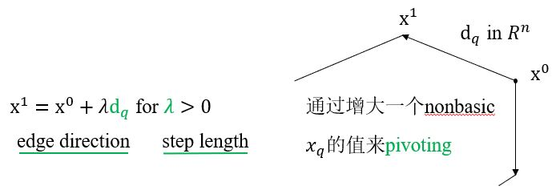

# Simplex Method

&emsp;&emsp;1.Simplex method  
&emsp;&emsp;2.Phase one method  
&emsp;&emsp;3.Big M method  

#### What have we learned so far?

&emsp;&emsp;Consider a standard form LP (primal problem)

$$ \text{(LP)} \quad
\begin{aligned}
    \text{min}  \quad & \mathbf{c}^T \mathbf{x} \\
    \text{s.t.} \quad & \mathbf{Ax} = \mathbf{b} \\
    & \mathbf{x} \ge 0 .
\end{aligned}
$$

&emsp;&emsp;1.如果它的feasible domain $$P$$ nonempty，那么它至少有一个vertex（extreme point）。— from Resolution Theorem

&emsp;&emsp;2.如果$$P$$ nonempty且objective value $$\mathbf{z}$$ not unbounded，那么（LP）在（至少）一个vertex（extreme point）处取到。— from Fundamental Theorem

&emsp;&emsp;3.$$P$$只有finitely many vertices（extreme point）。— $$C(n,m)$$

&emsp;&emsp;4.Vertices可以用代数的方法来生成，和bsf's的一样。

#### Implications

&emsp;&emsp;当$$C(n,m)$$很小时，可以枚举出所有的bsf's（vertices）来找到最优的那个作为最优解。— Enumerate Method

&emsp;&emsp;当$$C(n,m)$$变大时，我们需要一个更系统的、有效的方法来做这个工作。— Simplex Method

---

## 3.1 Simplex method

&emsp;&emsp;Convinced by Prof. George B. Dantzig in 1947.

### 3.1.1 Basic ideas

Phase 1:

* Step 1 (<b><font color="#00B050">Starting</font></b>)  
&emsp;&emsp;找到一个初始的extreme point (ep) 或声明$$P$$是空的。

Phase 2：

* Step 2 (<b><font color="#00B050">Checking optimality</font></b>)  
&emsp;&emsp;如果当前ep是最优的，STOP！
* Step 3 (<b><font color="#00B050">Pivoting</font></b>)  
&emsp;&emsp;Move to a better ep.  
&emsp;&emsp;Return to Step 2.

&emsp;&emsp;从Step 3回到Step 2的过程称为一次<font color="#3399ff">iteration</font>。  
&emsp;&emsp;如果我们不重复同一个ep，那么算法将总是在有限次迭代后终止。—— <font color="#3399ff">a finite algorithm</font>  
&emsp;&emsp;如何有效地生成更好的极值点？—— <font color="#3399ff">basic feasible solutions</font>

**What else have we learned?**

&emsp;&emsp;$$P$$中一点$$\mathbf{x}$$为极值点，当且仅当$$\mathbf{x}$$是关于某个基$$\mathbf{B}$$的一个basic feasible solution。

&emsp;&emsp;最多存在$$C(n,m)$$个基本可行解。当$$\text{rank}(A) = m \le n$$，那么一个bfs可以通过$$ \mathbf{A} = \begin{bmatrix} \mathbf{B} & \mathbf{N}\end{bmatrix} \ \mathbf{x} = \begin{bmatrix} \mathbf{x}_B \\ \mathbf{x}_N \end{bmatrix} $$并且令$$\mathbf{x}_N = 0$$以解出$$\mathbf{x}_B = \mathbf{B^{-1} b}$$。

### 3.1.2 Baseline

Phase 1:

* Step 1 (<b><font color="#00B050">Starting</font></b>)  
&emsp;&emsp;找到一个初始的basic feasible solution (bfs) 或声明$$P$$是空的。

Phase 2：

* Step 2 (<b><font color="#00B050">Checking optimality</font></b>)  
&emsp;&emsp;如果当前bfs是最优的，STOP！
* Step 3 (<b><font color="#00B050">Pivoting</font></b>)  
&emsp;&emsp;Move to a better bfs.  
&emsp;&emsp;Return to Step 2.

**Challenge**  
&emsp;&emsp;当我们从一个bfs移动到另一个时，我们真的移动了吗？  
&emsp;&emsp;如果没有的话，我们可能陷入循环了！

### 3.1.3 Nondegeneracy

**例** 

$$\begin{cases}
    &  x_1 + x_2 \le 40 \\
    & 2x_1 + x_2 \le 60 \\
    & x_1 \le 20        \\
    & x_1 ,\ x_2 \ge 0  
\end{cases}
\quad \Leftrightarrow \quad
\begin{cases}
    &  x_1 + x_2 + s_1 = 40 \\
    & 2x_1 + x_2 + s_2 = 60 \\
    &  x_1 +       s_3 = 20 \\
    & x_1 ,\ x_2 ,\ s_1 ,\ s_2 ,\ s_3 \ge 0  \\    
\end{cases}$$

<center>
    <figure>
        
    </figure>
</center>

**Observations:**

&emsp;&emsp;如果一个ep是由正好有$$m$$**个正的basic variables**和$$n-m$$个为零的non-basic variables组成的，那么两者间的对应关系是**一对一**的。— a nondegenerate bfs  
&emsp;&emsp;只有当**basic variables中至少有一个为零**时，这个ep才可能与不止一个bfs对应。— a degenerate bfs

**Terminology**: 如果所有的bfs都是<b><font color="#00B050">非退化的</font></b>，那么LP <b><font color="#00B050">nondegenerate</font></b>。

**Property 1**: 如果一个bfs $$\mathbf{x}$$是非退化的，那么$$\mathbf{x}$$<font color="#3399ff">由n个hyperplane唯一确定</font>。

Why? $$n$$ hyperlanes? Where are they?

&emsp;&emsp;$$\mathbf{A} = \begin{bmatrix}\mathbf{B} & \mathbf{N}\end{bmatrix}$$，$$\mathbf{x} = \begin{bmatrix}\mathbf{x_B} \\ \mathbf{x_N}\end{bmatrix} = \begin{bmatrix}\mathbf{B^{-1}b} \\ 0\end{bmatrix}$$，令$$\mathbf{M} = \begin{bmatrix}\mathbf{B} & \mathbf{N} \\ 0 & \mathbf{I} \end{bmatrix}$$，那么$$\mathbf{M}$$是非奇异的，并且$$ \mathbf{Mx} = \begin{bmatrix}\mathbf{B} & \mathbf{N} \\ 0 & \mathbf{I} \end{bmatrix} \begin{bmatrix}\mathbf{x_B} \\ \mathbf{x_N}\end{bmatrix} = \begin{bmatrix}\mathbf{b} \\ 0\end{bmatrix} $$。因此，$$\mathbf{x} = \begin{bmatrix}\mathbf{x_B} \\ \mathbf{x_N}\end{bmatrix} =  \mathbf{M}^{-1} \begin{bmatrix}\mathbf{b} \\ 0\end{bmatrix}$$由$$n$$个线性无关的hyperpalne唯一决定。

&emsp;&emsp;$$\mathbf{M}^{-1}$$（或$$\mathbf{M}$$）是LP的<b><font color="#00B050">fundamental matrix</font></b>，$$\mathbf{M}^{-1} = \begin{bmatrix}\mathbf{B}^{-1} & -\mathbf{B}^{-1}\mathbf{N} \\ 0 & \mathbf{I} \end{bmatrix}$$。因此，若$$\mathbf{B}^{-1}$$已知即可得到$$\mathbf{M}^{-1}$$。

```tip
fundamental matrix中包含了linear programming的所有信息。
```

**Property 2**: 如果一个bfs $$\mathbf{x}$$是退化的，那么$$\mathbf{x}$$由超过$$n$$个hyperplane<font color="#3399ff">超定</font>。

&emsp;&emsp;因为除了$$ \begin{bmatrix}\mathbf{B} & \mathbf{N} \\ 0 & \mathbf{I} \end{bmatrix} \begin{bmatrix}\mathbf{x_B} \\ \mathbf{x_N}\end{bmatrix} = \begin{bmatrix}\mathbf{b} \\ 0\end{bmatrix} $$的$$n$$个hyperplane外，还至少有一个basic variable $$\mathbf{x}_i = 0$$（因为bfs is degenerate），也是一个hyperplane。

**Property 3**: 对于一个退化的有$$p(\lg m)$$个正的元素的bfs $$\mathbf{x}$$，可能有$$\left(\begin{matrix}n-p \\ n-m \end{matrix}\right) = \frac{(n-p)!}{(n-m)!(m-p)!}$$个<font color="#3399ff">不同的bfs与同一个极值点相关</font>。

### 3.1.4 Simplex method under nondegeneracy

Basic idea: 利用a <font color="#3399ff">simple pivoting</font> scheme从一个bfs(ep)移动到另一个bfs(ep)。

只考虑<font color="#3399ff">neighboring</font> bfs(ep)，而非同时考虑所有bfs(ep)。

Definition: 如果两个bfs有$$m-1$$个<font color="#3399ff">共同的basic variable</font>（不是指它们的值），那么这两个bfs <font color="#3399ff">adjacent</font>。

<center>
    <figure>
        
    </figure>
</center>

**Observations:**

&emsp;&emsp;在非退化的情况下，每个基本可行解（极值点）都有$$n-m$$个adjacent neighbors。

&emsp;&emsp;对于一个bfs，所有的相邻bfs都可以通过<font color="#3399ff">将一个非基本变量从零增加到正的并且将一个基本变量从正的减小为零</font>来到达。— <b><font color="#00B050">Pivoting</font></b>

#### (1) Pivoting

Concept: 一个nonbasic变量进入basis（从0到positive），同时一个basic变量离开basis（从positive到0）。

<center>
    <figure>
        
    </figure>
</center>

**Who and where are my neighbours?**

&emsp;&emsp;当前的ep沿着$$P$$的boundary edge走到相邻ep。当前ep有$$n-m$$个邻居，应有$$n-m$$条edge directions指向相邻的极值点，与各个非基变量（nbv）的增加相对应。令edge direction $$\mathbf{d}_q \in \mathbf{R}^n$$与非基变量$$x_q$$的增加相对应。

Where are these edge directions?

#### (2) Fundamental matrix and edge direction

**Conjecture**

&emsp;&emsp;$$\mathbf{d}_q$$是$$\mathbf{M}^{-1}$$中与$$x_q$$相关的列，i.e. $$\color{green}{\mathbf{d}_q=   \begin{bmatrix}  - \mathbf{B}^{-1} \mathbf{A}_q & 0 & \cdots & 0 & 1 & 0 & \cdots & 0\end{bmatrix}^T } $$ 。其中，$$\mathbf{A} = \begin{bmatrix}\mathbf{A}_1 & \mathbf{A}_2 & \cdots & \mathbf{A}_n \end{bmatrix}$$。

**例**

<center>
    <figure>
        
    </figure>
</center>

在$$v_A$$处，basic variables为$$\{x_3,x_4\}$$，nonbasic variables为$$\{x_1,x_2\}$$，  
所以$$\mathbf{B}=\begin{bmatrix} 1 & 0 \\ 0 & 1 \end{bmatrix}$$，$$\mathbf{N}=\begin{bmatrix} 1 & 1 \\ 2 & 1 \end{bmatrix}$$，$$\mathbf{M}^{-1} = \begin{bmatrix} 1 & 0 & -1 & -1 \\ 0 & 1 & -2 & -1 \\ 0 & 0 & 1 & 0 \\ 0 & 0 & 0 & 1 \end{bmatrix}$$

**General case**

&emsp;&emsp;一般来说，对于$$\lambda \ge 0$$，

$$  \mathbf{x}(\lambda) 
=   \mathbf{x} + \lambda \mathbf{d}_q 
=   \begin{bmatrix}
        \mathbf{x_B} \\ \mathbf{x_N} 
    \end{bmatrix} 
  + \lambda \begin{bmatrix}
                -\mathbf{B}^{-1} \mathbf{A}_q \\ 0 \\ \vdots \\ 1 \\ \vdots \\ 0
            \end{bmatrix}$$

（1）非基变量，均为0，除了$$x_q$$被$$\lambda$$增大，i.e. $$\mathbf{x_N}(\lambda) = \mathbf{x_N} + \lambda \begin{bmatrix} 0 & \cdots & 1 & \cdots & 0 \end{bmatrix}^T$$  
（2）基变量，由于$$\mathbf{Bx_B + Nx_N = b}$$，因此$$\mathbf{x_B = B^{-1}b - B^{-1}Nx_N}$$。当$$x_q$$被$$\lambda$$增大时，其它的非基变量仍为0，那么$$\mathbf{x_B}(\lambda) = \mathbf{B^{-1}b} - \lambda \mathbf{B}^{-1} \mathbf{A}_q$$。因此，$$\mathbf{d}_q= \begin{bmatrix}- \mathbf{B}^{-1} \mathbf{A}_q \\ \mathbf{e}_q \end{bmatrix} $$。

**问：** edge direction $$\mathbf{d}_q$$总是可行的方向吗？这要求对于足够小的步长$$\lambda \gt 0$$，需要满足$$\mathbf{x}(\lambda) = \mathbf{x} + \lambda \mathbf{d}_q \in P$$。即必须有$$\mathbf{Ax}(\lambda) = \mathbf{b}$$且$$\mathbf{x}(\lambda) \ge 0$$。等同于要证$$\mathbf{Ad}_q = 0$$且$$\mathbf{x}(\lambda) \ge 0$$。

* Yes，当问题是<font color="#3399ff">非退化</font>的时候，<font color="#3399ff">每个edge direction都是一个可行的方向</font>。

证：（1）由$$\mathbf{MM}^-1 = \mathbf{I}$$可得$$\mathbf{Ad}_q = 0$$；  
&emsp;&emsp;（2）对于非退化的情况，$$\mathbf{x}(\lambda) = \mathbf{x} + \lambda \begin{bmatrix}- \mathbf{B}^{-1} \mathbf{A}_q \\ \mathbf{e}_q \end{bmatrix}$$。因此，当$$\lambda$$足够小时$$\mathbf{x}(\lambda) \ge 0$$。i.e. 在非退化的情况下，an edge direction $$\mathbf{d}_q$$ is a feasible direction! 

* No，当问题是<font color="#3399ff">退化</font>的时候，<font color="#3399ff">不一定每个edge direction都是一个可行的方向</font>。

#### (3) Good neighbour

Which neighbour is a good one?

**问：** 如果当前bfs不是最优的，那么哪个相邻的bfs是更好的呢？也就是说，要**往哪个edge direction移动**呢？或者说，**哪个非基变量是一个好的转入候选**呢？

**Observations**


<br />
$$
$$
$$  $$
<!-- 蓝 -->
<font color="#3399ff"></font>
<!-- 绿 --> <!-- #33cc00 -->
<b><font color="#00B050"></font></b>
<!-- 橙 -->
<font color="#FF4500"></font>