# Introduction

<figure>
   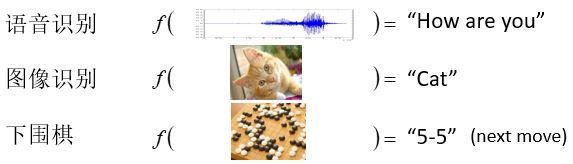
</figure>

&emsp;&emsp;本课程将聚集**深度学习**，如果说机器学习=寻找函数，那么深度学习中机器就是要找一个函数，而这个函数是一个类神经网络。函数的输入可以有很多种类，向量、矩阵、序列等。

<figure>
   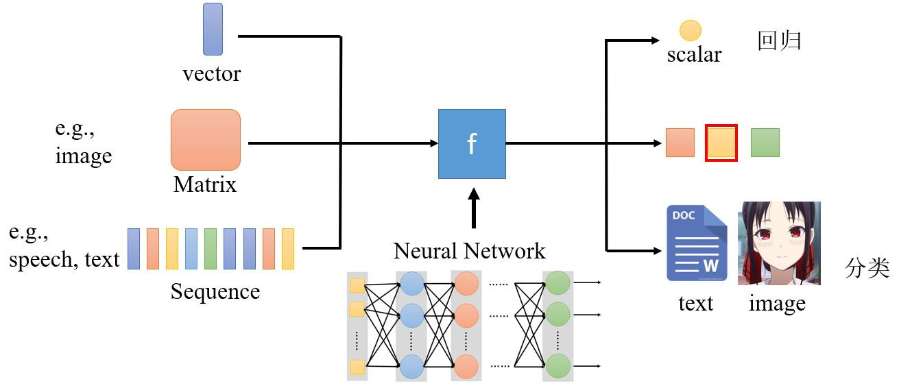
</figure>

**机器学习的框架：**

<figure>
   
</figure>

**1. Function with unknown parameters**

$$y = f(\qquad) \rightarrow y = b + w x_1$$

&emsp;&emsp;根据domain knowledge将$$y = f(\quad)$$写出<b><font color="#00B050">model</font></b> $$y = b + w x_1$$，其中，$$y$$和$$x_1$$为<b><font color="#00B050">feature</font></b>，$$w$$和$$b$$为未知参数，称$$w$$为<b><font color="#00B050">weight</font></b>，称$$b$$为<b><font color="#00B050">bias</font></b>。

**2. Define loss from training data**

&emsp;&emsp;<b><font color="#00B050">Loss</font></b>是关于参数的函数$$L(b,w)$$，用于评估一组值的好坏程度。

令loss：$$L = \frac{1}{N} \sum_n e_n$$  
&emsp;&emsp;若$$e = \| y - \hat{y} \|$$，则$$L$$为mean absolute error (MAE)  
&emsp;&emsp;若$$e = (y - \hat{y})^2$$，则$$L$$为mean square error (MSE)。

如果$$y$$和$$\hat{y}$$都是概率分布，可以选择cross entropy（交叉熵）作为loss。

**3. Optimization**

Gradient descent  $$w^*, b^* = \arg \min_{w, b} L$$
* （随机）选取一个初始值$$w^0$$，$$b^0$$
* 计算$$\frac{\partial L}{\partial w} \vert_{w = w_0, b = b_0}$$和$$\frac{\partial L}{\partial b} \vert_{w = w_0, b = b_0}$$  
  通过选取合适的<b><font color="#00B050">learning rate</font></b> $$\color{green}{\eta}$$来控制更新的步长。因为$$\eta$$是人为选定的，所以是一个hyperparameter。  
  &emsp;&emsp;$$w^1 \leftarrow w^0 - \eta \frac{\partial L}{\partial w} \vert_{w = w_0, b = b_0} \qquad b^1 \leftarrow b^0 - \eta \frac{\partial L}{\partial b} \vert_{w = w_0, b = b_0}$$
* 迭代更新$$w$$和$$b$$

```warning
梯度下降法可能会陷入局部极值，但这并不是在这个方法中所要解决的真正难题。
```

## 1.1 Function with unknown

<figure>
   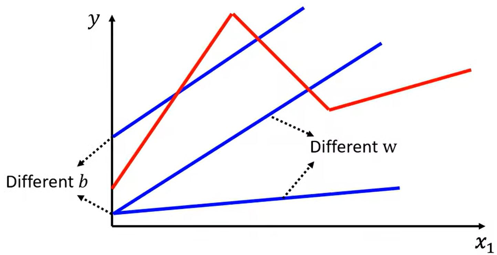
</figure>

&emsp;&emsp;前面我们考虑了线性模型$$y = b + w x_1$$，但是线性模型非常受限，即有<b><font color="#00B050">model bias</font></b>，所以还需要更加复杂的模型。

<figure>
   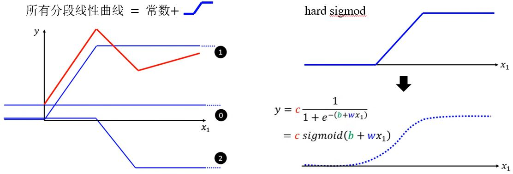
</figure>

&emsp;&emsp;所有的分段线性曲线可以用常数和如下图所示的蓝色曲线组成，而所有连续曲线都可以用分段线性曲线来近似。这个蓝色曲线可以用<b><font color="#00B050">sigmod函数</font></b>$$\color{green}{y =c \frac{1}{1+e^{-(b+w x_1)}} = c \operatorname{sigmoid}(b+w x_{1})}$$来近似。通过改变$$w$$、$$b$$和$$c$$可以得到不同形状的sigmod函数。

<figure>
   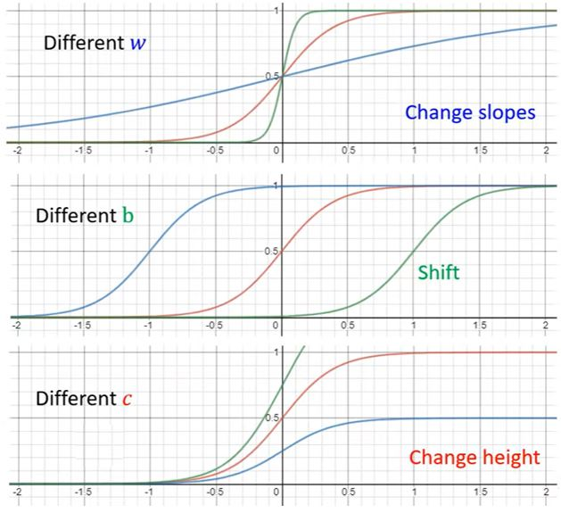
</figure>

这样，就可以得到新的模型（更多特征）：

$$y = b + w x_1 \rightarrow y = b + \sum_i c_i \operatorname{sigmoid}(b_i + w_i x_1)$$

$$  y = b + \sum_j w_j x_j \rightarrow 
    \boxed{y = b + \sum_i c_i \operatorname{sigmoid}(b_i + \sum_j w_{ij} x_j)}
$$

其中，$$j$$是特征的序号，$$i$$是sigmoid的序号。

&emsp;&emsp;下面，以$$i = 1, 2, 3$$和$$j = 1, 2, 3$$的情况为例。

<figure>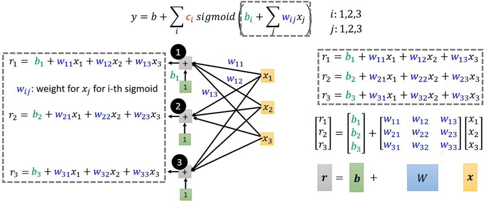</figure>
<figure>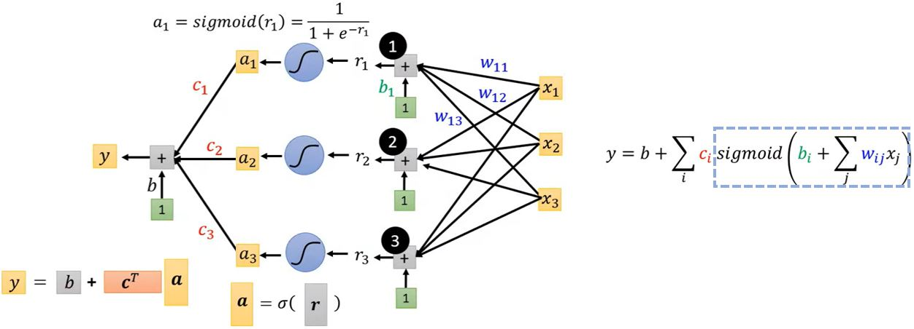</figure>

<figure>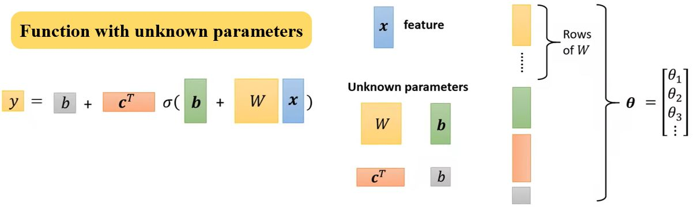</figure>

## 1.2 Define Loss

&emsp;&emsp;Loss是关于参数的函数$$L(b,w)$$，用于评估一组值的好坏程度。

<figure>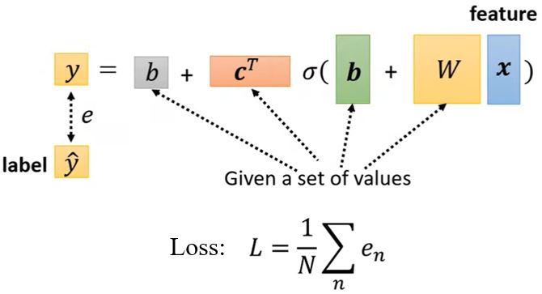</figure>

## 1.3 Optimization

$$  \pmb{\theta}^* = \arg \min_{\theta} L \qquad
    \pmb{\theta} = \begin{bmatrix}
        \theta_1 \\ \theta_2 \\ \theta_3 \\ \vdots
    \end{bmatrix}
$$

* （随机）选择初始值$$\pmb{\theta}^0$$
* 计算梯度$$\boldsymbol{g}=\nabla L(\pmb{\theta}^0)$$，$$\pmb{\theta}^1 \leftarrow \pmb{\theta}^0 - \eta \boldsymbol{g}$$  
  &emsp;&emsp;$$\boldsymbol{g}=\begin{bmatrix}\left.\frac{\partial L}{\partial \theta_{1}}\right|_{\boldsymbol{\theta}=\boldsymbol{\theta}^{0}} \\ \left.\frac{\partial L}{\partial \theta_{2}}\right|_{\boldsymbol{\theta}=\boldsymbol{\theta}^{0}} \\ \vdots\end{bmatrix}$$，$$\begin{bmatrix}\theta_{1}^{1} \\ \theta_{2}^{1} \\ \vdots \end{bmatrix}leftarrow\begin{bmatrix} \theta_{1}^{0} \\ \theta_{2}^{0} \\ \vdots \end{bmatrix}-\begin{bmatrix} \left.\eta \frac{\partial L}{\partial \theta_{1}}\right|_{\pmb{\theta}=\pmb{\theta}^{0}} \\ \left.\eta \frac{\partial L}{\partial \theta_{2}}\right|_{\pmb{\theta}=\pmb{\theta}^{0}} \\ \vdots \end{bmatrix}$$
* 计算梯度$$\boldsymbol{g}=\nabla L(\pmb{\theta}^1)$$，$$\pmb{\theta}^2 \leftarrow \pmb{\theta}^1 - \eta \boldsymbol{g}$$  
* …

&emsp;&emsp;在实际应用中，我们通常会把训练数据分成多个batch，<b><font color="#3399ff">1 epoch = 访问所有batch一次</font></b>。1 epoch更新次数 = 样本数量 / batch size，batch size也是一个hyperparameter。

<figure>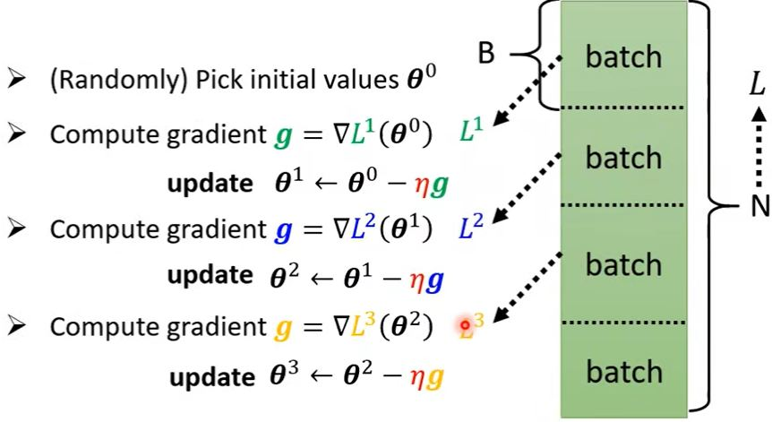</figure>

## 1.4 Improvement

### 1.4.1 Activation Function

<figure>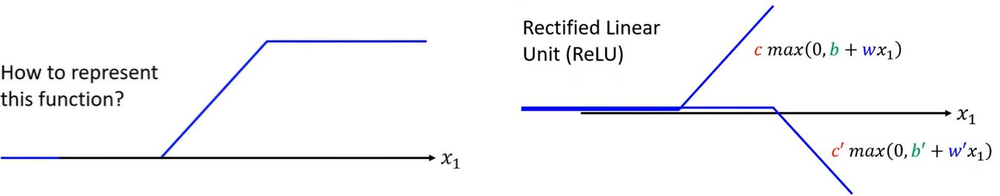</figure>

&emsp;&emsp;前面我们用Sigmod函数来近似hard sigmod，其实还可以用<b><font color="#00B050">Rectified Linear Unit (ReLU)</font></b>来近似，即$$y = b + \sum_i c_i \operatorname{sigmoid}(b_i + \sum_j w_{ij} x_j) \rightarrow y = b + \sum_{2i} c_i \max(0, b_i + \sum_j w_{ij} x_j)$$。其中，Sigmod和ReLU都是<b><font color="#00B050">激活函数</font></b>。

<figure>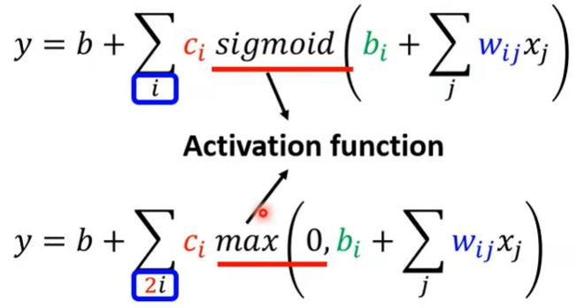</figure>

### 1.4.2 Deep Learning

模型还可以如何改进呢？  — 增加层数

<figure>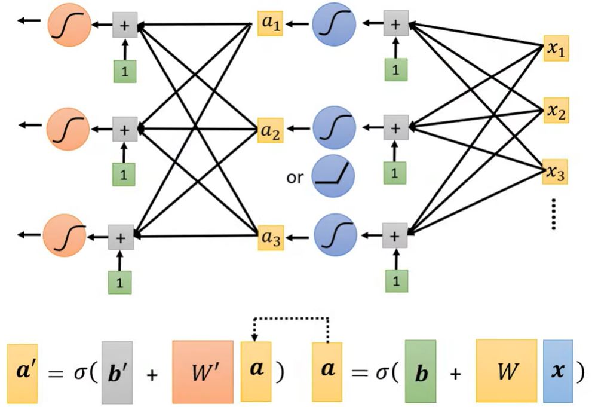</figure>

<figure>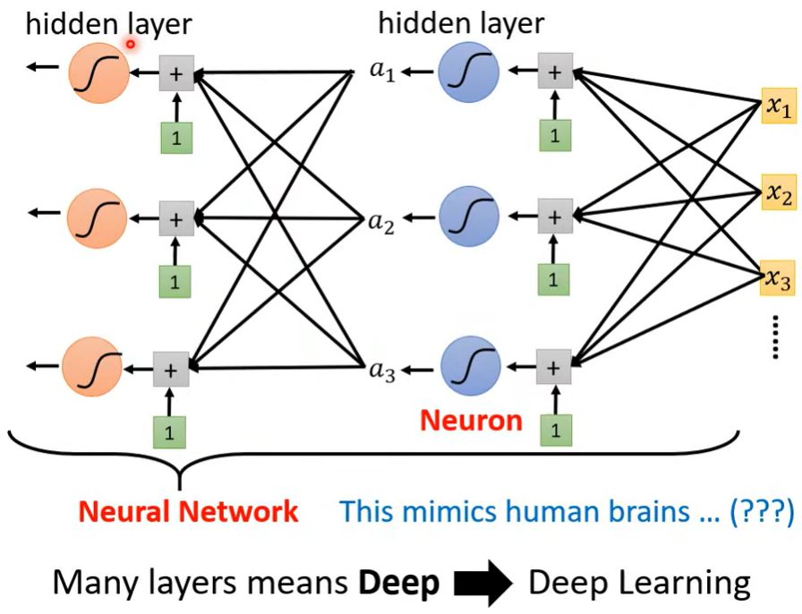</figure>

<b><font color="#00B050">Deep = 很多隐藏层</font></b> 为什么我们构建更深的网络，而不是增加输入的个数构建一个"fat"网络呢？

为什么不构建更深的网络呢？  
— 更深的网络可能会在训练数据上取得更好的效果，但是在测试数据上反而表现更差，这种问题称为<b><font color="#FF4500">overfitting</font></b>（过拟合）。


<!-- 蓝 -->
<b><font color="#3399ff"></font></b>
<!-- 绿 --><!-- #33cc00 -->
<b><font color="#00B050"></font></b>
<!-- 橙 -->
<b><font color="#FF4500"></font></b>