# General Guidance

Framework of ML

<figure>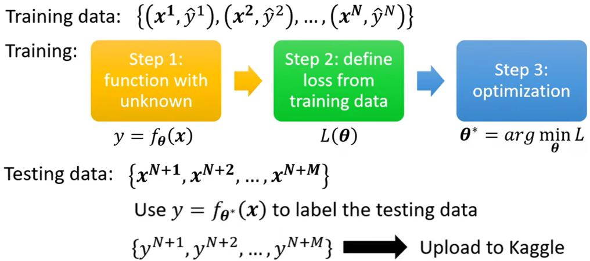</figure>

General guide

<figure>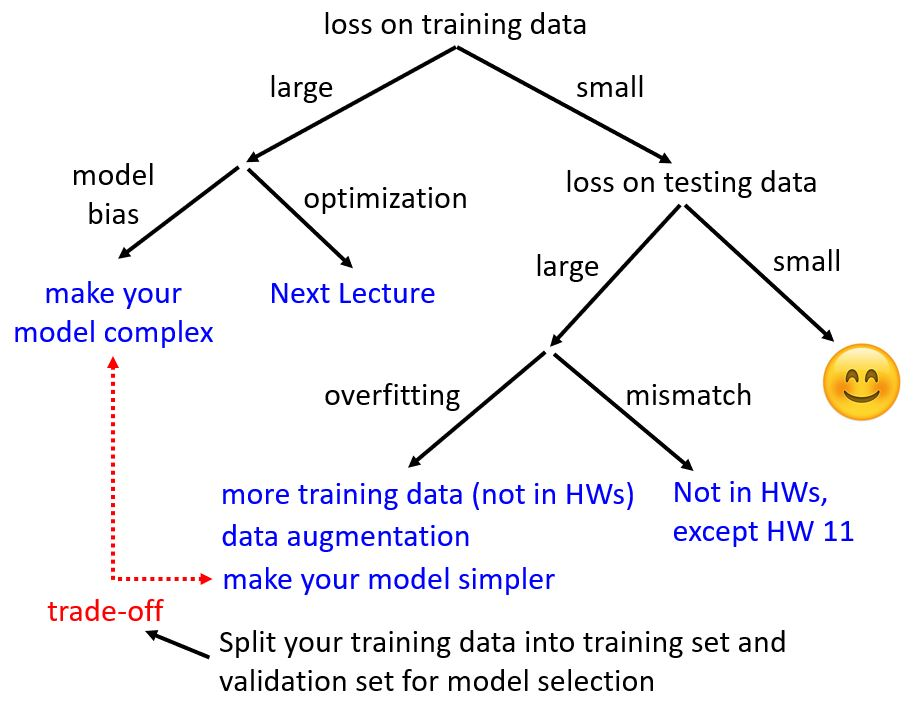</figure>

### Large loss on training data

#### Model bias

<figure>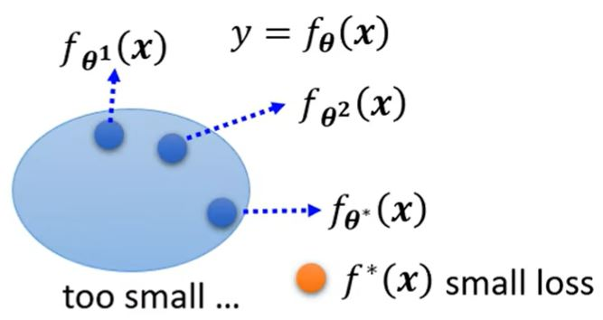</figure>

&emsp;&emsp;模型过于简单。具有较小loss的$$f^*(x)$$根本不在集合内，所以无论怎么调整参数$$\pmb{\theta}$$都不能找到这个函数。

&emsp;&emsp;解决方法：重新设计模型，增加它的弹性。

#### Optimization issue

<figure></figure>

&emsp;&emsp;大的loss不一定都是因为model bias的存在，还有另一种可能：最优的函数是在我们找到的集合里，但是梯度下降这个方法没有能够帮我们找出它，它输出了一个并非最好的$$f_{\pmb{\theta}^*}(x)$$。

<figure>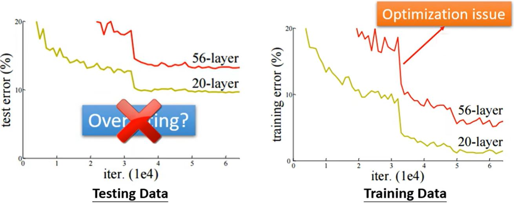</figure>

如何判断是哪个原因呢？
* 通过比较来洞察
* 从易于优化的网络开始，如更浅的网络或其它模型
* 如果更深的网络没能在训练数据上得到更小的loss，说明存在优化的问题
Solution：更有效的优化技术（下一课）

### Overfitting

&emsp;&emsp;训练数据上的loss小，而测试数据上的loss大，why?

&emsp;&emsp;一个极端的例子：<figure>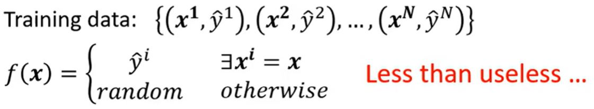</figure>

在这个例子中，这个函数什么用都没有，但是它在训练数据上的loss为零。

<figure></figure>

如何解决这个问题呢？

1. 获取更多的训练数据（更多的采样、数据增强）

<figure>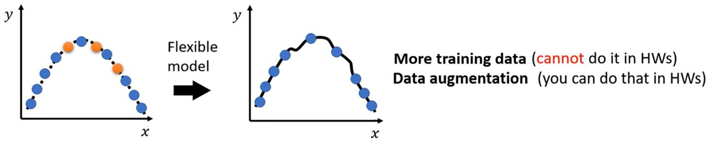</figure>

2. 对模型进行约束

<figure>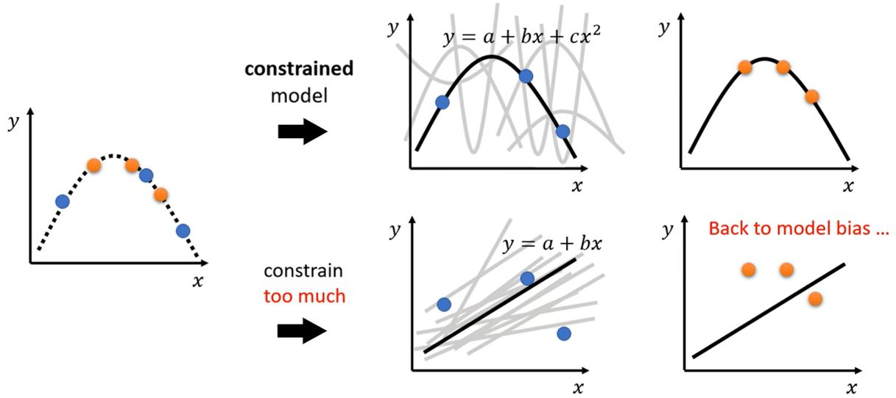</figure>

**Bias-Complexity trade-off**

<figure>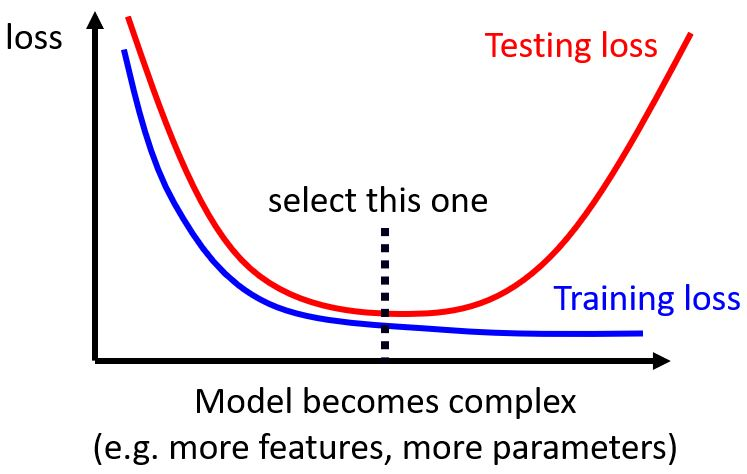</figure>

### Trade-off

<figure>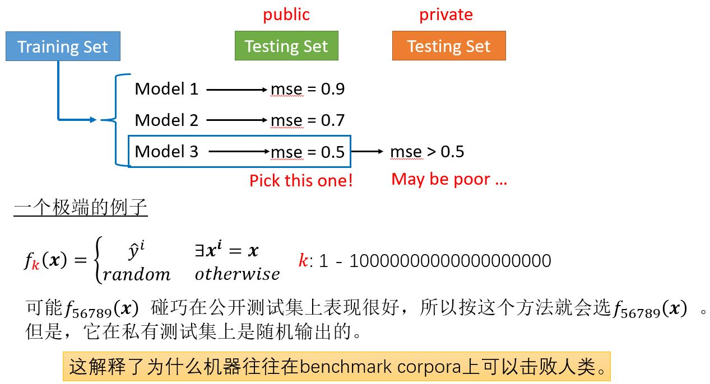</figure>

&emsp;&emsp;这个问题要如何解决呢？

#### Cross validation

<figure>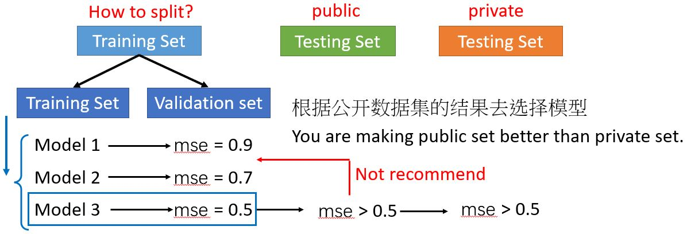</figure>

**N-fold Cross Validation**

<figure>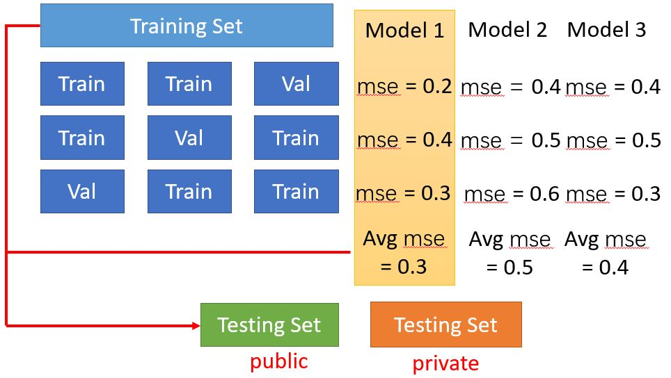</figure>

### Mismatch

&emsp;&emsp;训练数据和测试数据的分布不同。要了解数据是怎么生成的。（大多数作业没有这个问题，除了HW11。）

<figure>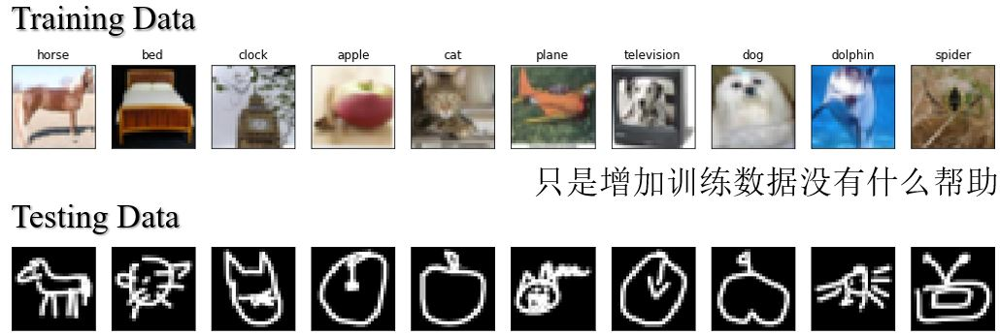</figure>