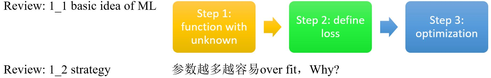
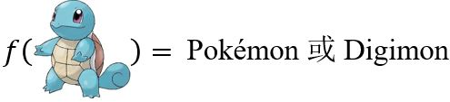

# Brief Talk on ML

## The Pokémon Digimon Classifier

<figure></figure>

&emsp;&emsp;以Pokémon vs. Digimon作为案例。我们希望找到一个函数，可以实现

<figure></figure>

即确定一个带有未知参数的函数（基于领域知识）。

Observation

<!-- 蓝 -->
<b></b>
<!-- 绿 --><!-- #33cc00 -->
<b></b>
<!-- 橙 -->
<b></b>