# Brief Talk on ML

## The Pokémon Digimon Classifier

<figure></figure>

&emsp;&emsp;以Pokémon vs. Digimon作为案例。我们希望找到一个函数，可以实现

<figure></figure>

即确定一个带有未知参数的函数（基于领域知识）。

**Observation**

Source of Digimon: https://github.com/mrok273/Qiita  
Source of Pokémon: https://www.kaggle.com/kvpratama/pokemon-images-dataset/data

<figure>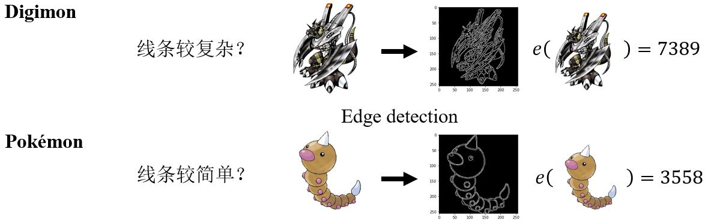</figure>

**Function with Unknown Parameters**

<figure>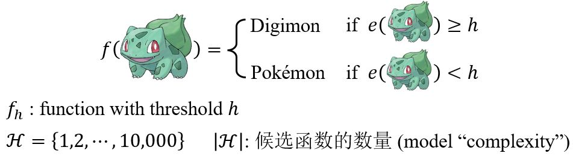</figure>

**Loss of a function** (given data)

<figure>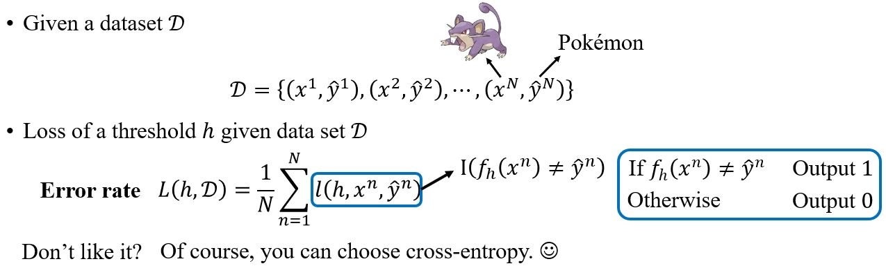</figure>

### Training Examples

<figure>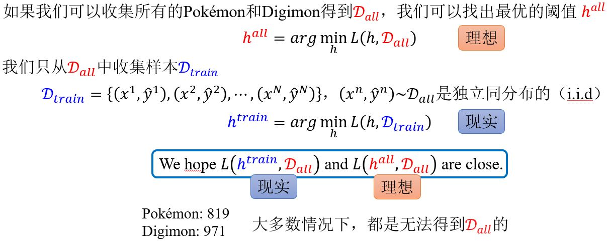</figure>

<figure>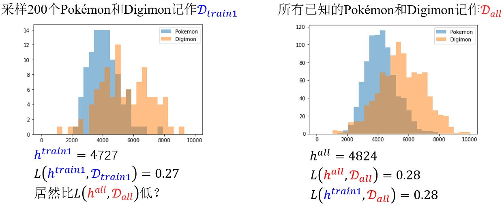</figure>

<figure>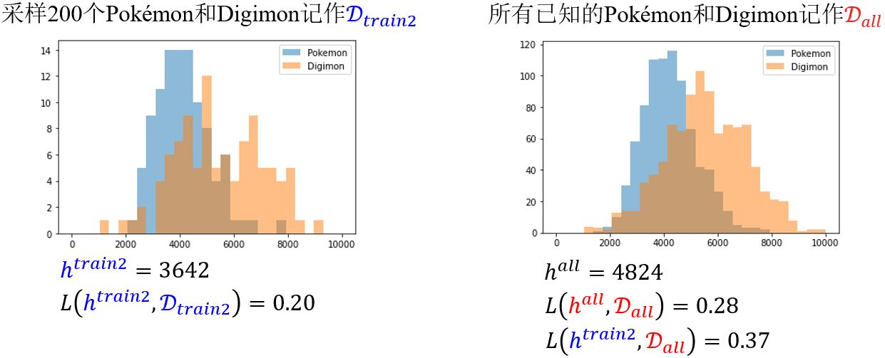</figure>

&emsp;&emsp;$$L(\color{red}{h^{all}, D_{all}} \color{black}{)}$$只有在$$D_{all}$$上是最小的，所以$$L(\color{blue}{h^{train}, D_{train}} \color{black}{)}$$是可以比$$L(\color{red}{h^{all}, D_{all}} \color{black}{)}$$小的。

### What do we want?

<figure>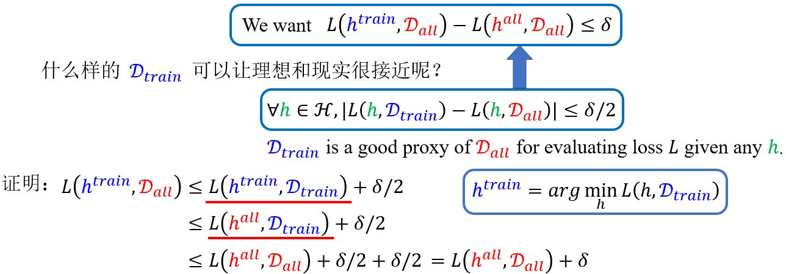</figure>

所以，我们希望采样到**good** $$\color{blue}{D_{train}}$$满足

<figure>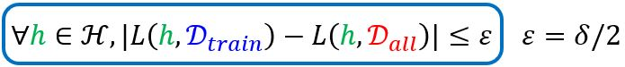</figure>

那么到底有多大概率会采样到**bad** $$\color{blue}{D_{train}}$$呢？

### Probability of failure

```note
以下讨论Very General，  
是model-agnostic的  
无需关于data distribution的假设  
可以用任意的loss function  
```

<figure>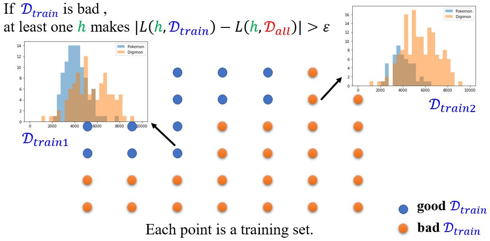</figure>

<figure>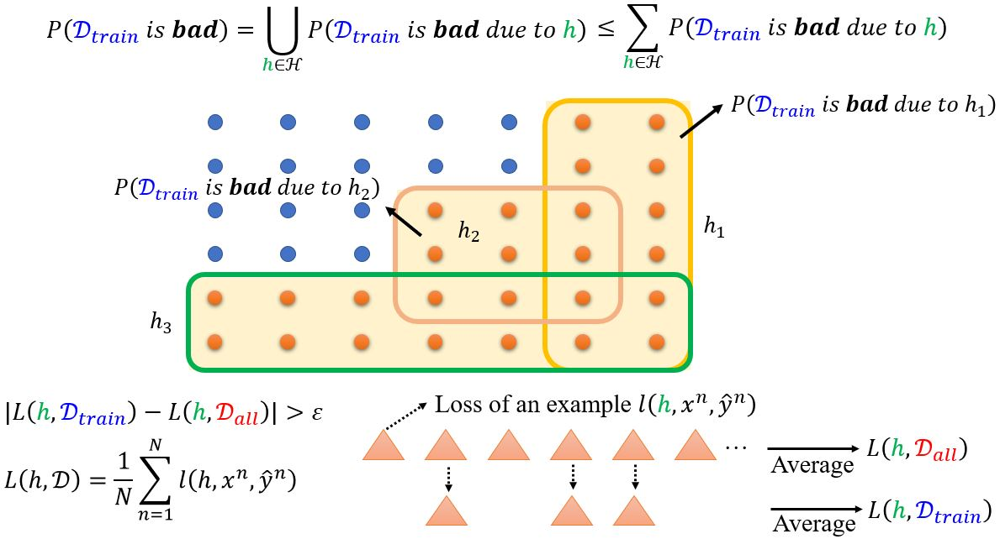</figure>

<figure>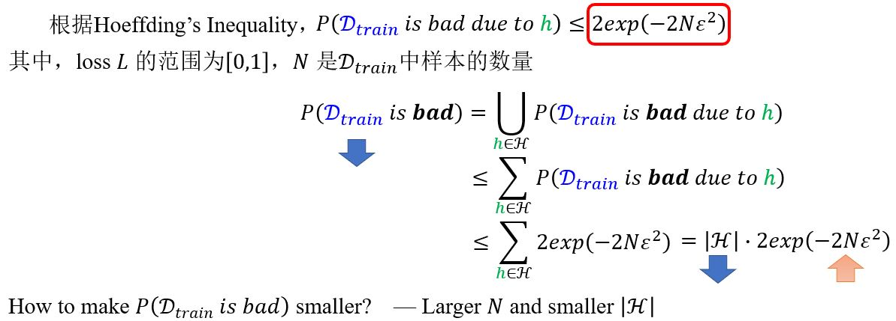</figure>

<figure>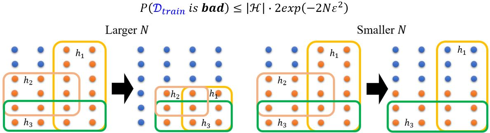</figure>

**例**：<figure>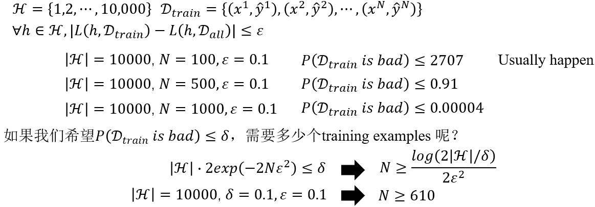</figure>

### Model Complexity

<figure>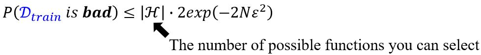</figure>

如果参数是连续的呢？  
&emsp;&emsp;Answer 1: 计算机中所有计算都是离散的。  
&emsp;&emsp;Answer 2: VC-dimension (not this course)

<figure>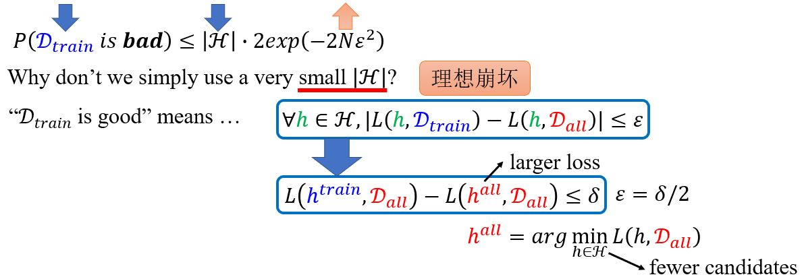</figure>

#### Tradeoff of Model Complexity

<figure>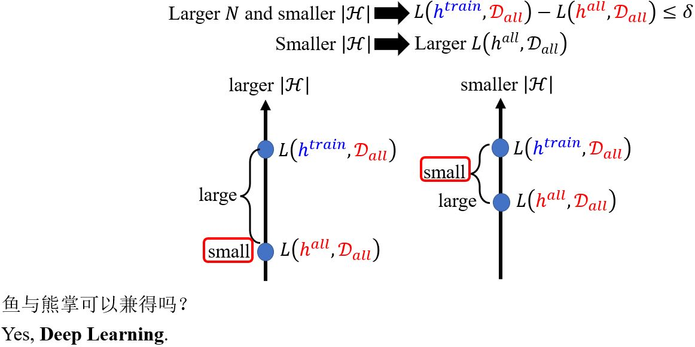</figure>


## Why Deep?

### Review: Why hidden layer?


<!-- 蓝 -->
<b><font color="#3399ff"></font></b>
<!-- 绿 --><!-- #33cc00 -->
<b><font color="#00B050"></font></b>
<!-- 橙 -->
<b><font color="#FF4500"></font></b>