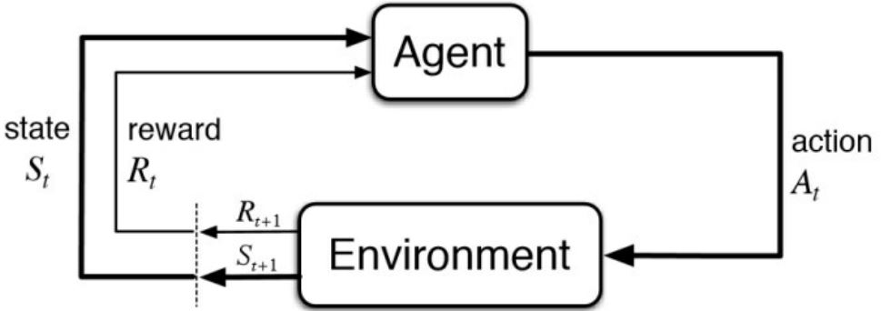
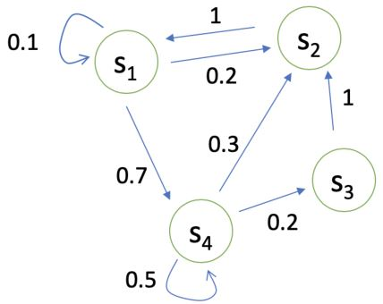
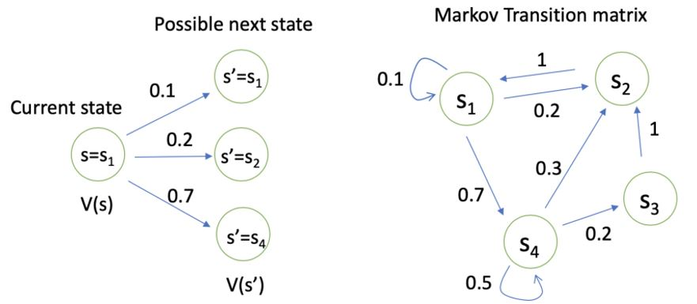
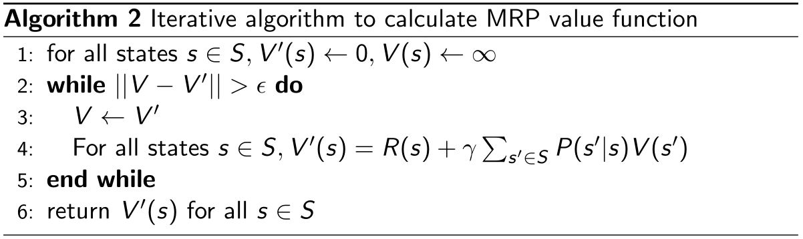
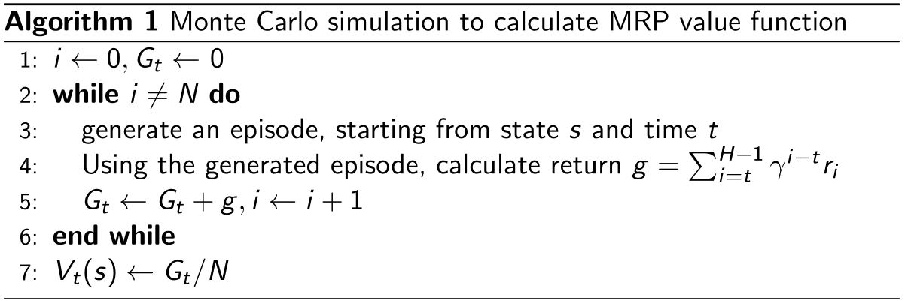
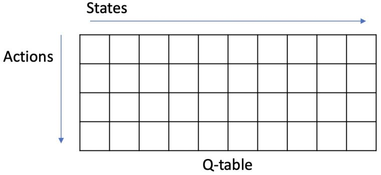

# Markov Decision Process (MDP)

请先阅读书本的Chapter 1和Chapter 3

&emsp;&emsp;MDP框架是非常灵活的，能够以很多不同的方式应用到很多不同的问题上。比如，其时间步长可以是决策和行为的任意连续阶段。行为可以是低阶的控制，也可以是高阶的决策。状态也有很多不同的形式，可以完全由低阶的感觉决定，也可以是高解和抽象的。一般来说，行为可以是我们想要学习如何做出的任何决定，而状态可以是我们知道的任何可能对做出这些决定有用的东西。  
&emsp;&emsp;需要特别指出的是，agent和环境之间的边界通常与机器人或动物身体的物理边界不同。如果我们将MDP框架应用于人或动物，肌肉、骨骼和感觉器官应该被视为环境的一部分。奖励也可能是在自然和人工学习系统的物理体内计算的，但被认为是在agent外部的。agent-环境的边界代表agent的absolute control的限制，而不是其知识的限制。

<figure>
    
    <figcaption> Fig 2.1 MDP中agent-环境的交互 </figcaption>
</figure>

&emsp;&emsp;马尔科夫决策过程可以模拟许多现实世界的问题，它正式描述了强化学习的框架。

在MDP下，环境是完全可观的。  
* 最优控制主要处理连续的MDP
* 部分可观问题可以转化为MDP

<b><font color="#00B050">Markov Property：</font></b>   
&emsp;1. 历史状态 $$h_t = \{ s_1, s_2, \ldots, s_t \}$$  
&emsp;2. 状态$$s_t$$是马尔可夫的，当且仅当  
   
$$ p(s_{t+1} \vert s_t) = p(s_{t+1} \vert h_t) \tag{1}$$
$$ p(s_{t+1} \vert s_t, a_t) = p(s_{t+1} \vert h_t, a_t) \tag{2}$$

&emsp;3. “The future is independent of the past given the present.”

```note
Markov Property对状态做出了限制，state必须包含之前的agent-environment的交互所有方面的信息，这些信息会对未来产生影响。
```

<br />

## 2.1 Markov Processes/ Chain

<center>
    <figure>
        
    </figure>
</center>

状态转移矩阵$$P$$指定了$$p(s_{t+1} = s' \vert s_t = s)$$

$$  P = \begin{bmatrix}
    P(s_1 \vert s_1) & P(s_2 \vert s_1) & \cdots & P(s_N \vert s_1) \\
    P(s_1 \vert s_2) & P(s_2 \vert s_2) & \cdots & P(s_N \vert s_2) \\
    \vdots           & \vdots           & \ddots & \vdots           \\
    P(s_1 \vert s_N) & P(s_2 \vert s_N) & \cdots & P(s_N \vert s_N)
\end{bmatrix}
$$

## 2.2 Markov Reward Processes (MRPs)

马尔可夫奖励过程为 **马尔可夫链 + 奖励**

<b><font color="#00B050">Markov Reward Processes</font></b>：  
&emsp;1. $$S$$是状态（$$s \in S$$）的（有限）结合  
&emsp;2. $$P$$是指定$$p(s_{t+1} = s' \vert s_t = s)$$的动力学/过渡模型  
&emsp;3. $$R$$是<b><font color="#00B050">reward function</font></b> $$R(s_t = s) = \mathbb{E}[r_t \vert s_t = s]$$  
&emsp;4. Discount factor $$\gamma \in [0,1]$$

如果状态数有限，$$R$$可以是一个向量。

### 2.2.1 Return and Value function

<b><font color="#00B050">Horizon</font></b>：  
* 每集的最大时间步数 2 
* 可以是无限的，否则称为有限马尔可夫（奖励）过程

<b><font color="#00B050">Return</font></b>：  
* 时间步数$$t$$到horizon的奖励的折扣总和
$$G_t = R_{t+1} + \gamma R_{t+2} + \gamma^2 R_{t+3} + \cdots + \gamma^{T-t-1} R_{T}$$

MRP的状态价值函数 $$V_t(s) = \mathbb{E}[G_t \vert s_t = s] = \mathbb{E}[R_{t+1} + \gamma R_{t+2} + \gamma^2 R_{t+3} + \cdots + \gamma^{T-t-1} R_{T}\vert s_t = s]$$
* 时刻$$t$$状态$$s$$下的return期望值
* 未来奖励的当前价值

### 2.2.2 Why Discount Factor?

1. 避免循环马尔可夫过程中的无限回报
2. 未来的不确定性可能无法充分体现
3. 如果奖励是有实际价值的，即时奖励可能比延迟奖励更有吸引力
4. 动物/人类的行为表现出对即时奖励的偏好
5. 有时可以使用没有折扣的马尔可夫奖励过程（即$$\gamma=1$$），e.g. 如果所有序列终止。  
&emsp;$$\gamma = 0$$：只关心即时奖励  
&emsp;$$\gamma = 1$$：延迟奖励等于即时奖励

### 2.2.3 MRP价值函数的计算

价值函数：从状态$$s$$开始的期望return

$$  V(s) 
=   \mathbb{E}[G_t \vert s_t = s]
=   \mathbb{E}[
        R_{t+1} + \gamma R_{t+2} + \gamma^2 R_{t+3} + \cdots 
        \vert s_t = s]
$$

MRP价值函数满足如下的<b><font color="#00B050">Bellman equation</font></b>：  

$$\color{green}{V(s) = R(s) + \gamma \sum_{s' \in S}{P(s' \vert s) V(s')}}$$

其中，$$R(s)$$为即时奖励，$$\gamma \sum_{s' \in S}{P(s' \vert s) V(s')}$$为延迟奖励的折扣总和。

```tip
Bellman equation描述了状态间的迭代关系。  
当前状态价值函数 = 即时奖励 + 下一步每个状态的价值函数×转移概率累计求和之后×折扣因子
```

<center>
    <figure>
        
    </figure>
</center>

因此，我们可以把$$V(s)$$写成矩阵形式。

$$  \begin{bmatrix}
        V(s_1) \\ V(s_2) \\ \vdots \\ V(s_N)
    \end{bmatrix}
=   \begin{bmatrix}
        R(s_1) \\ R(s_2) \\ \vdots \\ R(s_N)
    \end{bmatrix}
  + \gamma \begin{bmatrix}
        P(s_1 \vert s_1) & P(s_2 \vert s_1) & \cdots & P(s_N \vert s_1) \\
        P(s_1 \vert s_2) & P(s_2 \vert s_2) & \cdots & P(s_N \vert s_2) \\
        \vdots           & \vdots           & \ddots & \vdots           \\
        P(s_1 \vert s_N) & P(s_2 \vert s_N) & \cdots & P(s_N \vert s_N)
    \end{bmatrix}
    \begin{bmatrix}
        V(s_1) \\ V(s_2) \\ \vdots \\ V(s_N)
    \end{bmatrix}
$$

$$ V = R + \gamma P V $$

MRP的解析解为$$V = (I - \gamma P)^{-1} R$$
* 对于$$N$$中状态，矩阵求逆的复杂度为$$O(N^3)$$
* 此方法只能解决小型的MRPs

### 2.2.4 MRP值的迭代算法

&emsp;1. 动态规划
<center>
    <figure>
        
    </figure>
</center>

&emsp;2. Monte-Carlo evaluation
<center>
    <figure>
        
    </figure>
</center>

&emsp;3. Temporal-Difference learning（前两个方法的结合）

## 2.3 Markov Decision Processes (MDPs)

马尔可夫决策过程为 **马尔可夫奖励过程 + 决策**

<b><font color="#00B050">Markov Decision Processes</font></b>：  
&emsp;1. $$S$$是状态（$$s \in S$$）的（有限）结合  
&emsp;2. $$\color{green}{A}$$是<b><font color="#00B050">行为的有限集合</font></b>  
&emsp;3. $$p^a$$是各个行为对应的动力学/过渡模型 $$p(S_{t+1} = s' \vert S_t = s ,\ \color{green}{A_t = a})$$  
&emsp;4. $$r$$是期望的<b><font color="#00B050">reward function</font></b> $$r(S_t = s ,\ A_t = a) = \mathbb{E}[R_t \vert S_{t-1} = s ,\ \color{green}{A_{t-1} = a}]$$  
&emsp;5. Discount factor $$\gamma \in [0,1]$$

MDP是一个元组：$$(S ,\ A ,\ P ,\ R ,\ \gamma)$$

### 2.3.1 Policy in MDP

* 策略指定在每个状态下要采取的行动
* 给定一个状态，指定行为的分布情况
* 策略：$$\pi (a \vert s) = P(a_t =a \vert s_t = s)$$
* 策略是静止的（时间独立的），对于任意的$$t \gt 0$$，$$A_t ~ \pi (a \vert s)$$

&emsp;&emsp;给定一个MDP $$(S ,\ A ,\ P ,\ R ,\ \gamma)$$和一个策略$$\pi$$，状态序列$$S_1, S_2, \ldots$$为**马尔可夫过程**$$(S, P^{\pi})$$，状态和奖励序列$$S_1, R_1, S_2, R_2 \ldots$$为**马尔可夫奖励过程**$$(S, P^{\pi}, R^{\pi}, \gamma)$$，其中

$$\begin{aligned}
    P^{\pi}(s' \vert s) &= \sum_{a \in A} \pi(a \vert s) P(s' \vert s, a) \\
    R^{\pi}(s) &= \sum_{a \in A} \pi(a \vert s) R(s, a)
\end{aligned}$$

<center>
    <figure>
        
    </figure>
</center>

上图中，左边是MP/MRP的状态转移过程，右边是MDP的状态转移过程，可以看出MDP多了行为决策的过程。

### 2.3.2 Value function for MDP

&emsp;&emsp;MDP的<b><font color="#00B050">状态价值函数</font></b>是$$v^{\pi}(s)$$是从状态$$s$$出发，遵循策略$$\pi$$的期望return

$$V^{\pi}(s) = \mathbb{E}_{\pi}[G_t \vert s_t=s]    \tag{3}$$

&emsp;&emsp;<b><font color="#00B050">行为价值函数</font></b>$$q^{\pi}(s, a)$$是从状态$$s$$出发，采取行为$$a$$，遵循策略$$\pi$$的期望return

$$q^{\pi}(s, a) = \mathbb{E}_{\pi}[G_t \vert s_t=s, A_t=a]  \tag{4}$$

&emsp;&emsp;$$v^{\pi}(s)$$与$$q^{\pi}(s, a)$$的关系为

$$V^{\pi}(s) = \sum_{a \in A} \pi(a \vert s) q^{\pi}(s, a)  \tag{5}$$

### 2.3.3 Bellman Expectation Equation

&emsp;&emsp;状态价值函数可以分解为即时奖励加上后继状态的折扣值

$$  v^{\pi}(s)
=   E_{pi} [R_{t+1} + \gamma v^{\pi}(s_{t+1}) \vert s_t = s]
\tag{6}$$

&emsp;&emsp;行为价值函数也可以类似地分解

$$  q^{\pi}(s, a)
=   E_{pi} [   
        R_{t+1} + \gamma q^{\pi}(s_{t+1}, A_{t+1}) 
        \vert s_t = s, A_t = a
    ]
\tag{7}$$

根据

$$v^{\pi}(s) = \sum_{a \in A} \pi (a \vert s) q^{\pi}(s, a) \tag{8}$$

$$  q^{\pi}(s, a) 
=   R_s^a + \gamma \sum_{s' \in S} P(s' \vert s,a) v^{\pi}(s')
\tag{9}$$

因此

$$  v^{\pi}(s) 
=   \sum_{a \in A} \pi(a \vert s) 
        (R(s,a) + \gamma \sum_{s' \in S} P(s' \vert s,a) v^{\pi}(s'))
\tag{10}$$

$$  q^{\pi}(s,a) 
=   R(s,a) + \gamma \sum_{s' \in S} P(s' \vert s,a)
                    \sum_{a' \in A} \pi (a' \vert s') q^{\pi}(s', a')
\tag{11}$$

<center>
    <figure>
        
    </figure>
</center>

（补充：[Bellman方程的数学证明](https://zhuanlan.zhihu.com/p/108484403)）

### 2.3.4 Policy Evaluation

&emsp;&emsp;评估给定策略$$\pi$$下的状态值：计算$$v^{\pi}(s)$$，也称 (value)  prediction。

<center>
    <figure>
        
    </figure>
</center>

## 2.4 Decision Making in MDP

<b><font color="#00B050">Prediction</font></b>（评估给定的策略）：  
* 输入：马尔可夫决策过程$$<S ,\ A ,\ P ,\ R ,\ \gamma>$$和策略$$\pi$$或者马尔可夫奖励过程$$<S ,\ P^{\pi} ,\ R^{\pi} ,\ \gamma>$$
* 输出：价值函数$$v^{\pi}$$

<b><font color="#00B050">Control</font></b>（搜索最优策略）：  
* 输入：马尔可夫决策过程$$<S ,\ A ,\ P ,\ R ,\ \gamma>$$
* 输出：最优价值函数$$v^*$$和最优策略$$\pi^*$$

&emsp;&emsp;**马尔可夫决策过程中的预测和控制可以用动态规划来求解**，因为MDP中贝尔曼方程给出了循环分解且价值函数可以存储和重用解决方案。

### 2.4.1 Policy evaluation on MDP

1. 目标：评估给定策略$$\pi$$
   
2. 输出：该策略下的价值函数$$v^{\pi}$$
   
3. 解决：迭代Bellman expectation backup  
   在每次迭代$$t+1$$，对于所有的状态$$s \in S$$更新从$$v_t(s')$$到$$v_{t+1}(s)$$，其中$$s'$$是$$s$$的下一状态。  
   $$   v_{t+1}(s) 
    =   \sum_{a \in A} \pi(a \vert s) 
            (R(s,a) + \gamma \sum_{s' \in S} P(s' \vert s,a) v_t(s'))
    \tag{14}$$

4. 收敛：$$v_1 \rightarrow v_2 \rightarrow \cdots \rightarrow v_{\pi}$$  
   特定策略的Bellman expectation backup  
   可以按式(14)迭代或者以MRP $$<S ,\ P^{\pi} ,\ R^{\pi} ,\ \gamma>$$的形式  
   $$   v_{t+1}(s) 
    =   R^{\pi}(s) + \gamma P^{\pi}(s' \vert s) v_t(s')
    \tag{16}$$

例：[GridWorld: Dynamic Programming Demo](https://cs.stanford.edu/people/karpathy/reinforcejs/gridworld_dp.html)

#### 最优价值函数

&emsp;&emsp;最优的状态价值函数$$v^*(s)$$是所有策略下的最大价值函数

$$v^*(s) = \max_{\pi} v^{\pi}(s)$$

&emsp;&emsp;最优策略为

$$\pi^*(s) = \text{arg max}_{\pi} v^{\pi}(s)$$

&emsp;&emsp;如果知道了最优值时，那么这个MDP就被解决了。**虽然最优价值函数是唯一的，但可能会有多个最优策略**（比如两个具有相同最优价值函数的动作）。

#### 寻找最优策略

&emsp;&emsp;通过最大化$$q^*(s,a)$$可以得到最优策略

$$  \pi^*(a \vert s) = \begin{cases}
        1 \quad ,\ \text{if } a = \text{arg max}_{a \in A} q^*(s,a) \\
        0 \quad ,\ \text{otherwise}
    \end{cases}
$$

* 任何MDP都有一个确定的最优策略
* 如果$$q^*(s,a)$$已知，那么就可以立即得到最优策略

&emsp;&emsp;寻找最优策略的一种方法是枚举，确定的策略总数为$$\vert A \vert^{\vert S \vert}$$。其它方法比如policy iteration和value iteration会效率高很多。

### 2.4.2 MDP control

&emsp;&emsp;MDP的控制即为搜索最优策略的过程

$$\pi^*(s) = \text{arg max}_{\pi} v^{\pi}(s) \tag{18}$$

MDP的最优策略是一个infinite horizon问题（agent永远会行动），它是
1. Deterministic
2. Stationary（与时间步长无关）
3. Unique? 不一定，可能有具有相同最优值的状态动作

#### Policy iteration

<center>
    <figure>
        
    </figure>
</center>

迭代以下两步：
1. <font color="#3399ff">Evaluate</font>策略$$\pi$$（给定当前的$$\pi$$，计算$$v$$）
2. <font color="#3399ff">Improve</font>策略（通过对$$v^{\pi}$$采取贪婪行动 $$\pi' = \text{greedy}(v^{\pi})$$）

如何改进策略？
1. 计算策略$$\pi$$下的state-action值：$$q^{\pi}(s,a) = R(s,a) + \gamma \sum_{s' \in S} P(s' \vert s,a) v^{pi_i}(s')$$
2. 对于所有的$$s \in S$$计算新的策略：$$\pi_{i+1}(s) = \text{arg max}_a q^{pi_i}(s,a)$$

<center>
    <figure>
        
    </figure>
</center>

&emsp;&emsp;**策略的改进过程具有单调性**，所以当改进停止时，$$q^{\pi}(s, \pi'(s)) = \max_{a \in A} q^{\pi}(s, a) = q^{\pi}(s, \pi(s)) = v^{\pi}(s)$$。因此满足<b><font color="#00B050">Bellman optimality equation</font></b>

$$v^{\pi}(s) = \max_{a \in A} q^{\pi}(s, a)$$

因此，对于所有的$$s \in S$$都有$$v^{\pi}(s) = v^*(s)$$，所以$$\pi$$是一个最优策略。

&emsp;&emsp;最优值函数由贝尔曼最优方程达到

$$\begin{aligned}
    v^{\pi}(s) &= \max_{a} q^{\pi}(s, a)  \\
    q^{\pi}(s, \pi'(s)) 
&=  R(s,a) + \gamma \sum_{s' \in S} P(s' \vert s, a) v^*(s')
\end{aligned}$$

因此，

$$\begin{aligned}
    v^{\pi}(s) 
&=  \max_a R(s,a) + \gamma \sum_{s' \in S} P(s' \vert s, a) v^*(s') \\
    q^{\pi}(s, \pi'(s)) 
&=  R(s,a) + \gamma \sum_{s' \in S} P(s' \vert s, a) 
             \max_{a'} q^{\pi}(s', a')
\end{aligned}$$

#### Value iteration

&emsp;&emsp;Value iteration是**把Bellman optimality equation作为规则来迭代**的。如果已知子问题的最优解$$v^*(s')$$，那么按以下贝尔曼最优方程规则迭代，就可以得到最优解$$v^*(s)$$

$$  v(s) \leftarrow  
\max_{a \in A} \left( 
    R(s,a) + \gamma \sum_{s' \in S} P(s' \vert s, a) v^(s') 
\right)
$$

1. 目标：找到最优策略$$\pi$$
2. 解决：迭代贝尔曼最优方程
3. Value iteration algorithm：  
   初始化 $$k = 1$$且对于所有状态$$s$$有$$v_0(s) = 0$$  
   for $$k = 1 : H$$  
   &emsp;对于每个状态$$s$$  
   &emsp;&emsp;&emsp;$$\begin{aligned} q_{k+1}(s, a) &= R(s,a) + \gamma \sum_{s' \in S} P(s' \vert s, a) v_k(s') \\ v_{k+1}(s) &= \max_{a} q_{k+1}(s, a)\end{aligned}$$  
   &emsp;$$k \leftarrow k+1$$  
   在值迭代后检索最优策略  
   &emsp;&emsp;$$\pi(s) = \text{arg max}\left(R(s,a) + \gamma \sum_{s' \in S} P(s' \vert s, a) v_{k+1}(s')\right)$$

例：[GridWorld: Dynamic Programming Demo](https://cs.stanford.edu/people/karpathy/reinforcejs/gridworld_dp.html)  
&emsp;&emsp;[Policy iteration and value iteration on FrozenLake](https://github.com/cuhkrlcourse/RLexample/tree/master/MDP)

#### 二者区别

1. Policy iteration包含：**policy iteration + policy improvement**，两者反复迭代直到策略收敛。
2. Value iteration包含：**寻找最优价值函数 + 一次策略选取**。两者没有重复，因为一旦价值函数是最优的，那么它的策略也应该是最优的（即收敛的）。
3. 寻找最优价值函数也可以看作是策略改进（因为取max）和截断策略评估（无论收敛如何，只扫描所有状态后重新分配$$v(s)$$）的组合。

### 2.4.3 总结

<style>
table
{
    margin: auto;
}
</style>

|问题|Bellman Equation|Algorithm|
|:----:|:----:|:----:|
|Prediction|Bellman Expectation Equation|Iterative Policy Evaluation|
|Control|Bellman Expectation Equation|Policy Iteration|
|Control|Bellman Optimality Equation|Value Iteration|