# Training Fails

## 2.1 When Gradient is Small

<figure></figure>

优化为什么会失败呢？  
— 梯度为零，有两种情况：局部极小值和鞍点，这两种点统称为**critical point**（驻点）。在局部极小值点无路可走，而鞍点只要能够逃离的话还是可以继续下降的。

&emsp;&emsp;如何判断是局部极小还是鞍点呢？

### 2.1.0 Local minima & Saddle point

#### Taylor series approximation

<figure>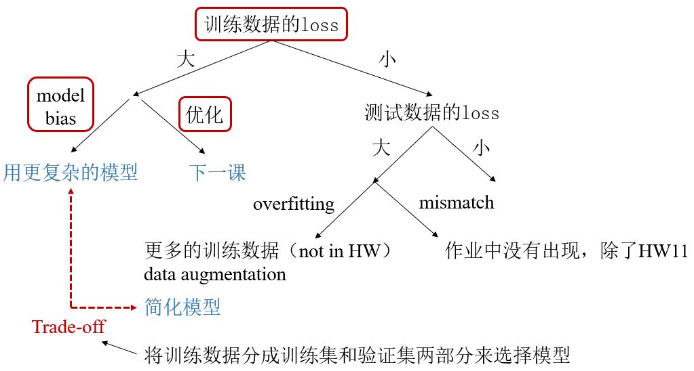</figure>

#### Hessian

<figure>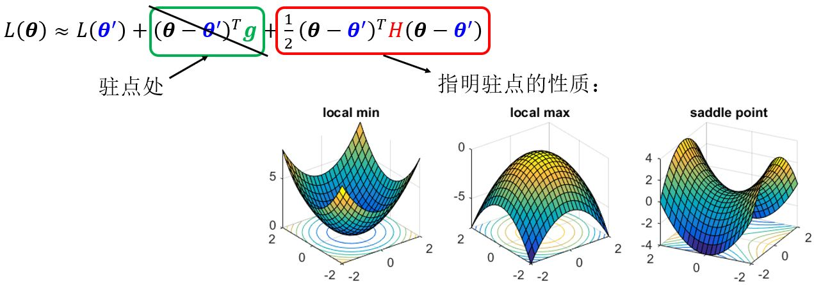</figure>

<figure>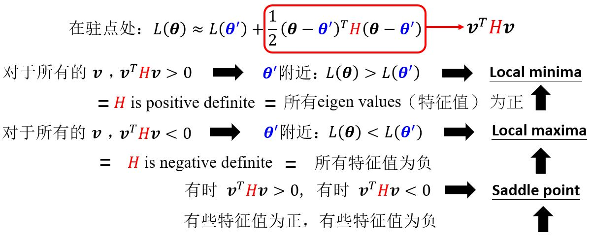</figure>

**例**：<figure>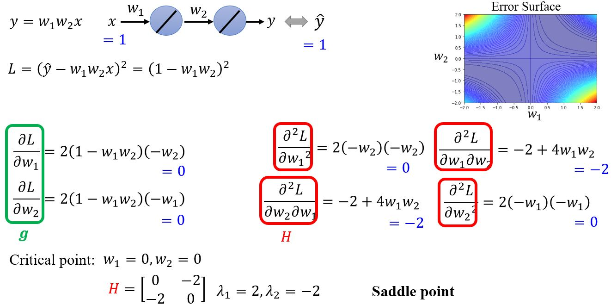</figure>

#### Don't afraid of saddle point?

&emsp;&emsp;$$H$$或许可以告诉我们参数更新的方向！

<figure>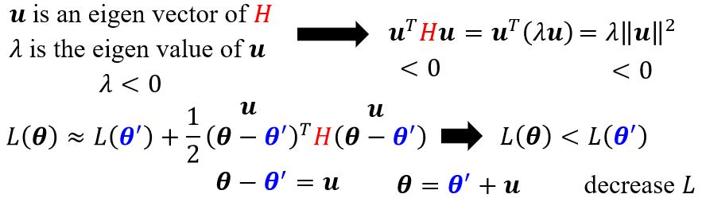</figure>

**例**：<figure>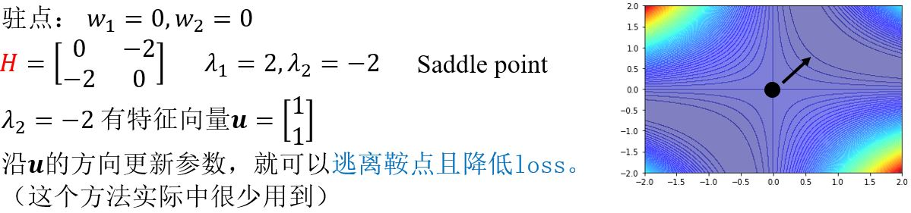</figure>

### 2.1.1 Saddle point v.s. Local minima

<figure>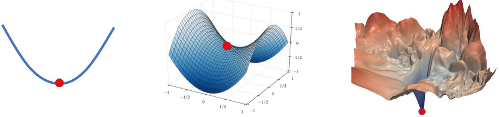</figure>

&emsp;&emsp;低维空间里的局部极小值点可能只是高维空间中的一个鞍点，那么当你有很多参数的时候，会不会局部极小值点就很少见了呢？

<figure>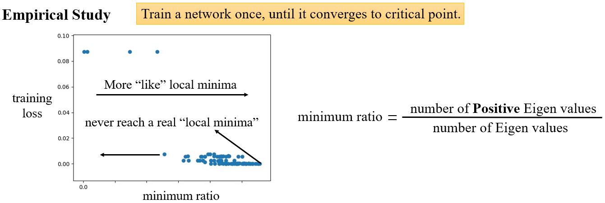</figure>

### 2.1.2 Small gradient

<figure>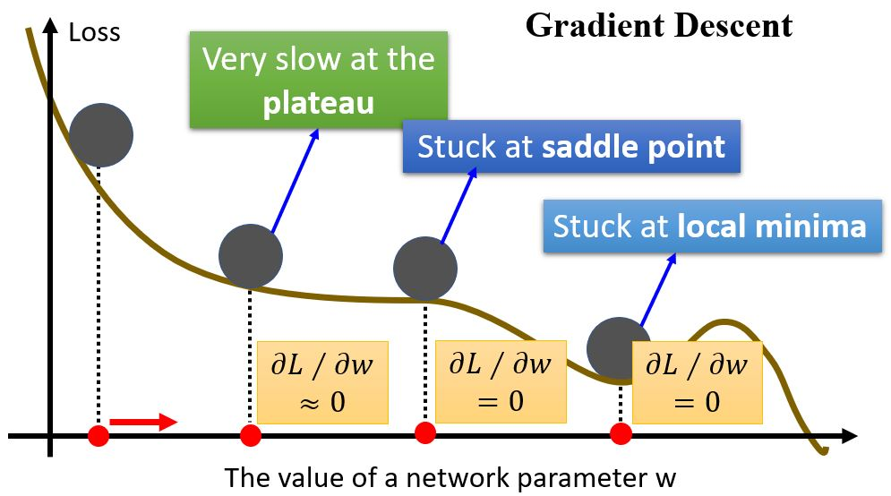</figure>

## 2.2 Tips for Training

### 2.2.1 Batch

#### Review: Optimization with batch

<figure>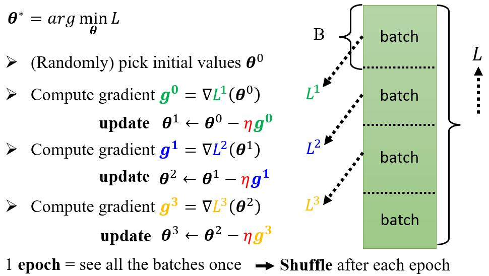</figure>

#### Small batch v.s. Large batch

&emsp;&emsp;考虑有20个样本的情况（$$N=20$$）：

<figure>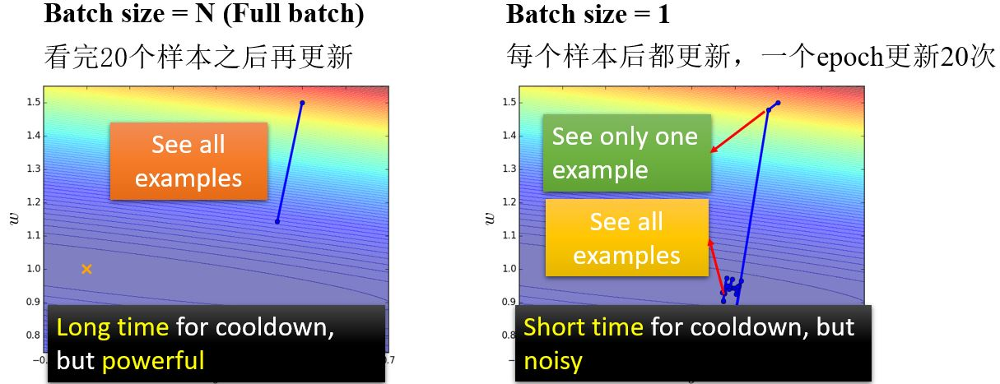</figure>

左边的方法更新的一步更稳定，但是看起来花的时间长。但是实际上，考虑到并行运算，<b>大的batch size在计算梯度的时候并不需要更长的时间</b>。

<figure>
    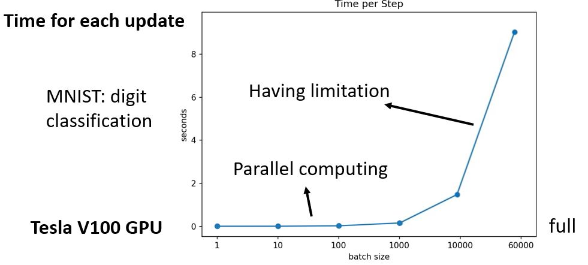
    <figcaption>用Tesla V100 GPU在MNIST数据集上每次更新的时间随batch size变化的情况</figcaption>
</figure>

&emsp;&emsp;并且，<b>较小的batch一次epoch所需的时间反而更长</b>（花更多的时间来把所有的数据看一遍）。

<figure>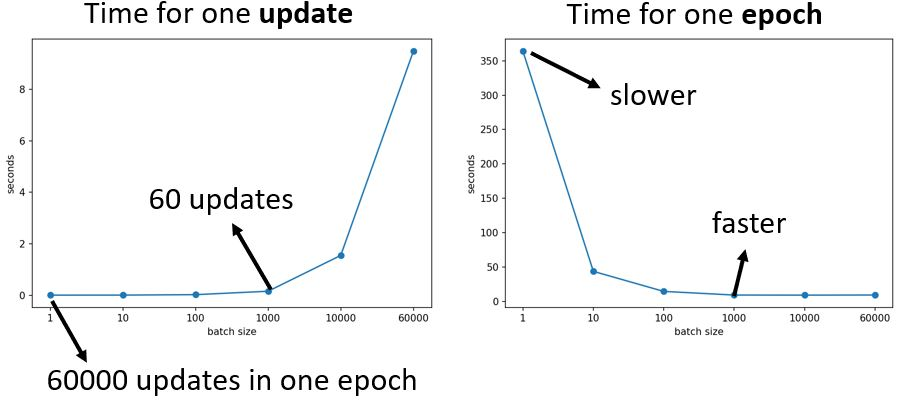</figure>

&emsp;&emsp;那么大的batch就一定好吗？

<figure>
    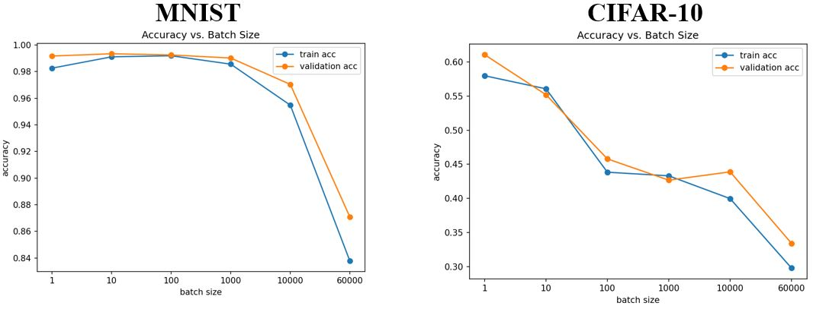
    <figcaption>不同训练集上准确率随batch size变化的情况</figcaption>
</figure>

从上图可以看出，小的batch size的表现更好。那么大的batch size有什么问题呢？  — <b>Optimization Fails</b>（因为用的都是一样的模型，所以不是因为model bias）

* <b>小的batch size性能更好</b>
* <b>“noisy”的更新有利于训练</b>

<figure>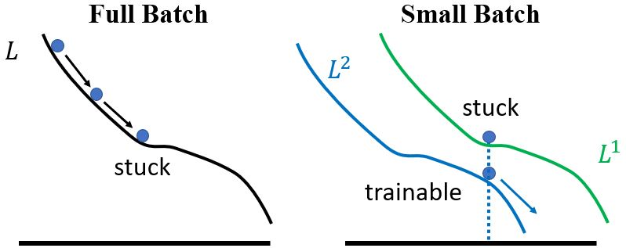</figure>

此外，<b>small batch在测试数据上表现也更好</b>。

<figure>
    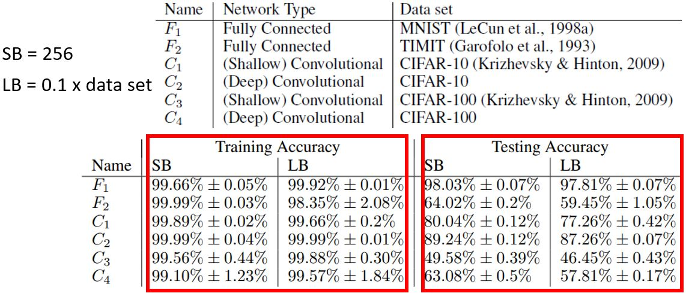
    <figcaption>On Large-Batch Training for Deep Learning: Generalization Gap and Sharp Minima中的结果</figcaption>
</figure>

<figure>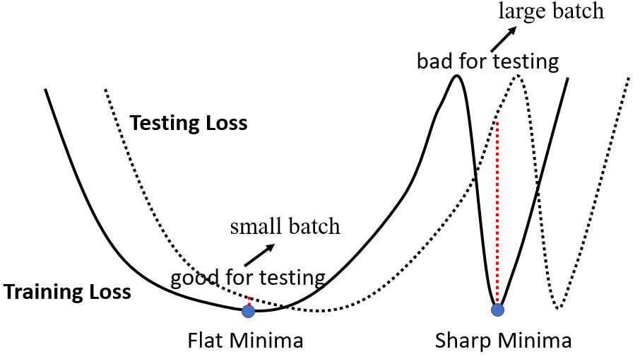</figure>

&emsp;&emsp;Small Batch v.s. Large Batch，两者各有优缺点，所以**batch size是一个需要我们决定的hyperparameter**。

<figure>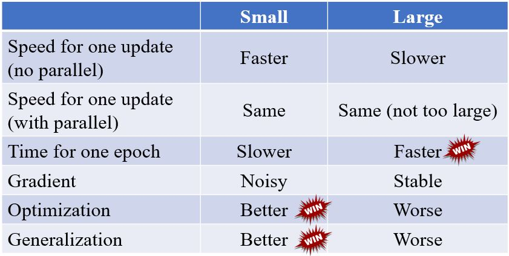</figure>

两者兼得？  
&emsp;&emsp;[Large Batch Optimization for Deep Learning: Training BERT in 76 minutes](https://arxiv.org/abs/1904.00962)  
&emsp;&emsp;[Extremely Large Minibatch SGD: Training ResNet-50 on ImageNet in 15 Minutes](https://arxiv.org/abs/1711.04325)  
&emsp;&emsp;[Stochastic Weight Averaging in Parallel: Large-Batch Training That Generalizes Well](https://arxiv.org/abs/2001.02312)  
&emsp;&emsp;[Large Batch Training of Convolutional Networks](https://arxiv.org/abs/1708.03888)  
&emsp;&emsp;[Accurate, large minibatch sgd: Training imagenet in 1 hour](https://arxiv.org/abs/1706.02677)

### 2.2.2 Momentum

<figure>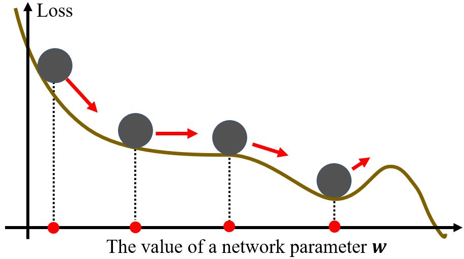</figure>

&emsp;&emsp;考虑物理世界，error surface就是斜坡，而参数是一个球，球从斜坡上滚下来，由于惯性的存在，它不一定会被鞍点或局部极小点卡住。

#### (Vanilla) Gradient descent

<figure>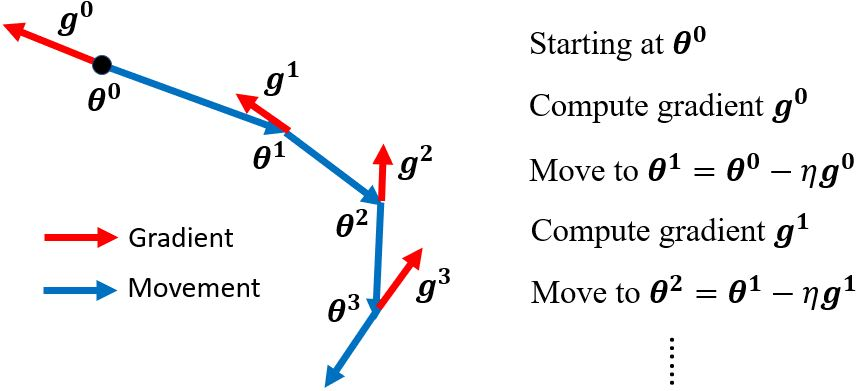</figure>

&emsp;&emsp;一般的梯度下降：计算初始点处的梯度，然后往梯度的反方向更新一次参数，得到一组新的参数，然后计算梯度并往梯度的反方向更新一次参数……不断重复这个过程。

#### Gradient descent + Momentum

<figure>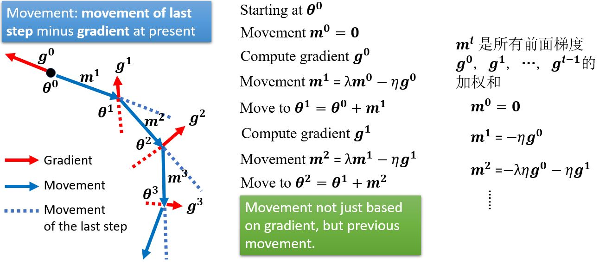</figure>

<figure>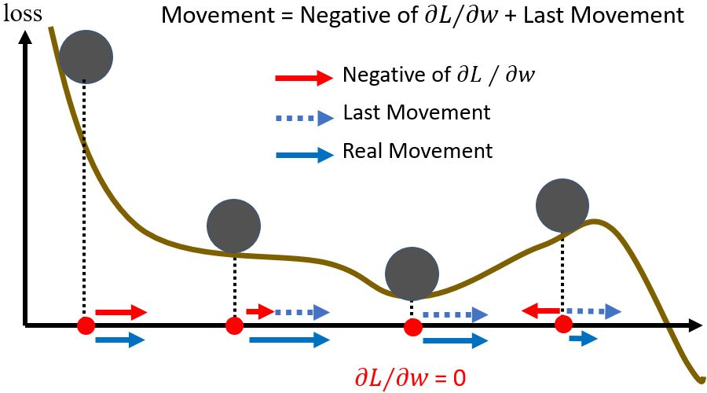</figure>

### 2.2.3 Concluding remarks

* 驻点处梯度为零
* 驻点可能是鞍点或局部极小值点
  * 可以利用Hessian矩阵来区别
  * 沿着Hessian矩阵的特征向量可以逃离鞍点
  * 局部极小点可能是很少见的
* 更小的batch size和momentum可以帮助逃离驻点

## 2.3 

<!-- 蓝 -->
<b></b>
<!-- 绿 --><!-- #33cc00 -->
<b></b>
<!-- 橙 -->
<b></b>