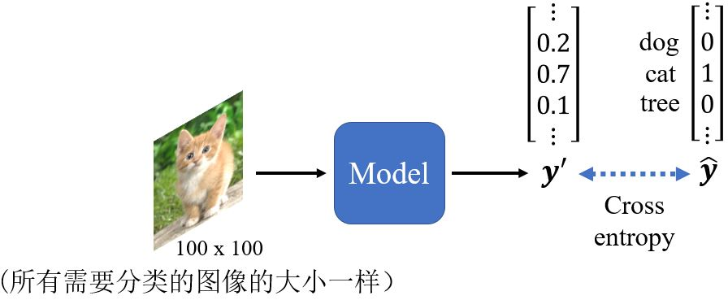
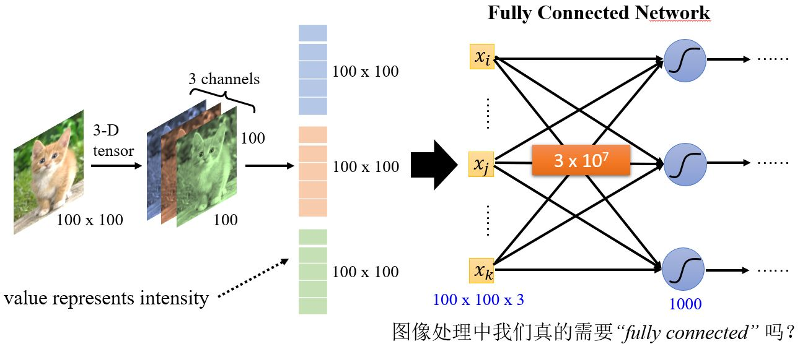

# Convolutional Neural Network 

<figure>
    
    <figcaption>Image Classification</figcaption>
</figure>

<figure></figure>

&emsp;&emsp;对于计算机来说，一张图像是一个三维张量。以一张100*100个像素的图片为例，如果我们把所有数据竖着排开构成一个向量，可以建立一个全连接的神经网络，并得到非常多的参数。虽然更多的参数会增加模型的弹性，提高它的能力，但是也会增加overfitting的可能性。那在做图像辨识的时候如何减少参数的个数呢？考虑到图像本身的特性，其实我们并不需要每个神经元都和输入的每个维度都有权重。

## 3.1

### 3.1.1 Observation 1

<!-- 蓝 -->
<b></b>
<!-- 绿 --><!-- #33cc00 -->
<b></b>
<!-- 橙 -->
<b></b>