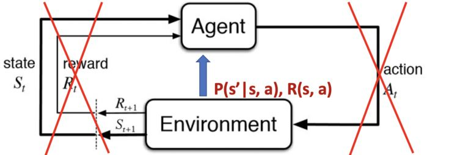
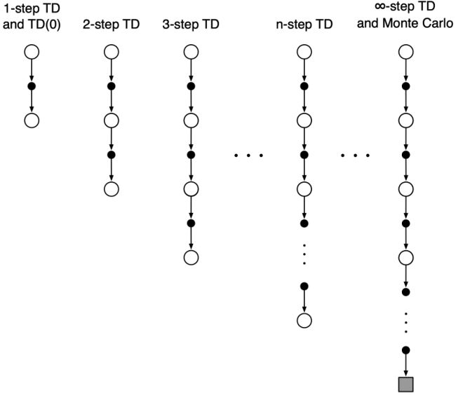
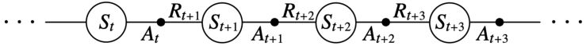
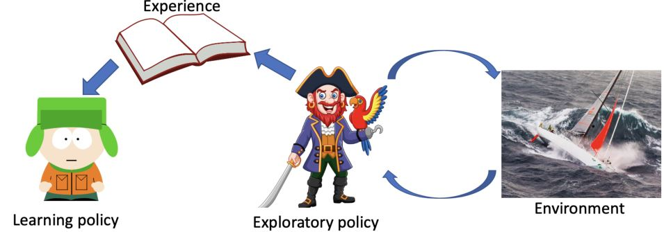
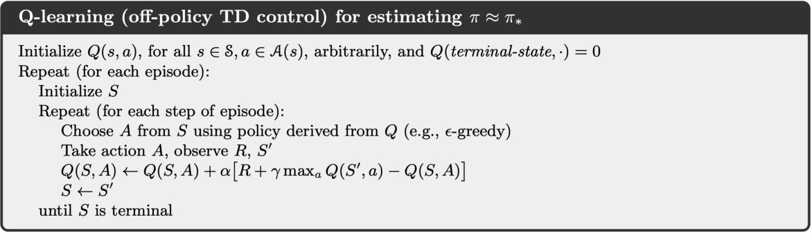
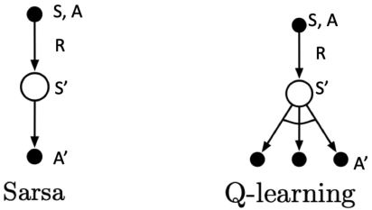
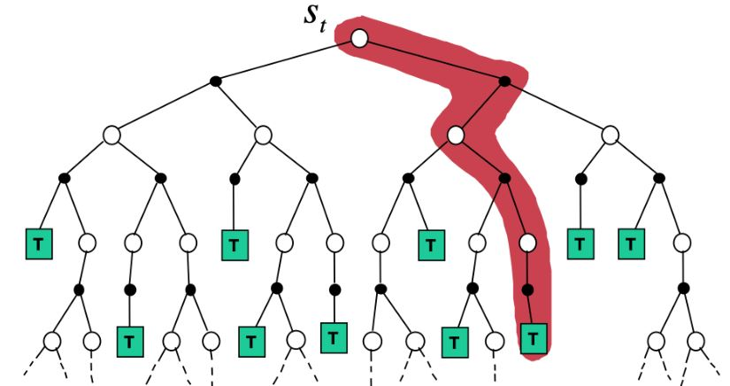
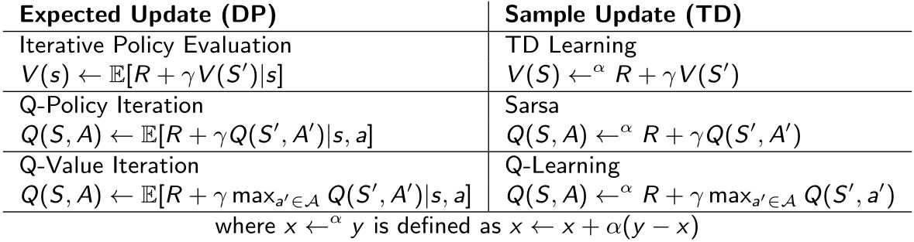

# Model-free prediction & control

* Model-free prediction: Estimate value function of an unknown MDP
* Model-free control: Optimize value function of an unknown MDP

请先阅读书本的Chapter 5和Chapter 6

<figure>
    
</figure>

&emsp;&emsp;Policy iteration和value iteration都是假设可以直接接触环境的动态过程和奖励的。然而在很多实际问题中，MDP模型可能是未知的或者过大而无法利用。

```note
强化学习中“episode（事件）”指的是agent在环境里面根据某个策略从开始到结束这一过程，“trajectory”是一段状态动作序列。
```

**Model-free RL: learning by iteration**
* 无模型的RL可以在与环境交互的过程中解决问题
* 不再能够直接访问已知的转移动态过程和奖励函数 
* trajectory/episodes是在agent与环境交互的过程中收集的
* 每个trajectory/episode包含$$\{S_1, A_1, R_1, S_2, A_2, R_2, \ldots, S_T, A_T, R_T\}$$

**Model-free prediction: policy evaluation without the access to the model**

在无法接触MDP模型时，估计某个策略下的期望return  
* Monte Carlo policy iteration
* Temporal Difference (TD) learning

## 3.1 Monte-Carlo Methods

* Return：$$G_t = R_{t+1} + \gamma R_{t+2} + \gamma^2 R_{t+3} + \cdots$$ 在策略$$\pi$$下
* $$v^{\pi}(s) = \mathbb{E}_{\tau \sim \pi} [G_t \vert S_t = s]$$，按策略$$\pi$$生成的trajectory$$\tau$$的期望
* MC simulation：对很多trajectory进行简单采样，计算所有轨迹的实际return，然后取平均
* MC policy iteration使用经验平均return替代期望return
* MC不需要MDP的动态过程/奖励，没有**bootstrapping（在之前估计的基础上估计）**，也无需假设状态是马尔可夫的
* 只能应用于由一系列独立事件组成的MDPs（每个episode都会终止）

&emsp;&emsp;假设经验被划分为episodes，并且无论选择什么动作，所有episodes最终都会结束。只有在一个episodes完成时，价值估计和策略才会改变。因此，<font color="#3399ff">Monte-Carlo方法可以在“episode-by-episode”意义上是增量的</font>，而不是在step-by-step（在线）意义上。这里的“Monte-Carlo”特指基于averaging complete return的方法。

### 3.1.1 MC policy iteration

&emsp;&emsp;Monte-Carlo预测法可以在episode-by-episode的基础上进行增量实现。

评估状态$$v(s)$$：  
1. 在一个随机事件中访问状态$$s$$的每个时间步长$$t$$
2. 增量计数 $$N(s) \leftarrow N(s) + 1$$
3. 增量总return $$S(s) \leftarrow S(s) + G_t$$
4. 值的评估根据平均return $$v(s) = S(s) / N(s)$$

根据大数定律，当$$N(s) \rightarrow \infty$$时，$$v(s) \rightarrow v^{\pi}(s)$$。

#### Incremental mean
来自样本$$x_1, x_2, \ldots$$的平均值

$$\begin{aligned}
    \mu_t 
& = \frac{1}{t} \sum_{j = 1}^t x_j    \\
& = \frac{1}{t} \left(x_t + \sum_{j = 1}^{t-1} x_j\right)   \\
& = \frac{1}{t} (x_t + (t - 1) \mu_{t - 1}) \\
& = \mu_{t - 1} + \frac{1}{t} (x_t - \mu_{t - 1})
\end{aligned}$$

#### Incremental MC Updates
1. 收集一次episode $$(S_1, A_1, R_1, \ldots, S_t)$$
2. 对于每个有$$G_t$$（计算所得的return）的状态$$S_t$$  
   &emsp;&emsp;$$N(S_t) \leftarrow N(S_t) + 1$$  
   &emsp;&emsp;$$v(S_t) \leftarrow v(S_t) + \frac{1}{N(S_t)} (G_t - v(S_t))$$
3. 或者使用一个更新的均值（旧的事件会被忘记），适合解决非静态问题（$$\alpha$$可以理解为学习率）  
   &emsp;&emsp;$$v(S_t) \leftarrow v(S_t) + \alpha (G_t - v(S_t))$$

### 3.1.2 DP vs. MC 策略评估

&emsp;&emsp;动态规划（DP）通过价值估计$$v_{i-1}$$引导其余的期望回报的方法计算$$v_i$$。根据Bellman expectation backup迭代：

$$  v_i(s) 
=   \sum_{a \in A} \pi(a \vert s) 
        \bigg[R(s,a) + \gamma \sum_{s' \in S} P(s' \vert s,a) v_{i-1}(s')\bigg]
$$

<figure>
    
</figure>

&emsp;&emsp;MC用一次采样episode来更新经验平均return

$$v(S_t) \leftarrow v(S_t) + \alpha (G_{i,t} - v(S_t))$$

<figure>
    
</figure>

#### MC与DP的区别
1. MC根据样本经验进行操作，因此可以在没有模型的情况下直接学习。
2. MC不会在其他价值估计的基础上更新其价值估计。  
（这两个不同点并没有紧密联系，可以分开。）

#### MC相较于DP的优势
1. MC可以用于环境未知的情况。
2. 即使是环境动态特性完全已知的情况下，使用采样episode仍有很大的优势，e.g. 转移概率难以计算的情况。
3. 估计某个单一的状态的值与全部状态无关。所以可从感兴趣的状态开始采样，然后再取return的平均。

## 3.2 Temporal-Difference Learning

* TD法是直接从episodes的经验学习  
* TD是无模型的：MDP的转移特性/奖励  
* TD从不完整的episodes中学习，通过bootstrapping的方式。

### 3.2.1 one-step TD

* 目标：根据策略$$\pi$$下的经验在线学习$$v(\pi)$$
* 最简的TD算法：TD(0)  
   &emsp;&emsp;向估计return $$R_{t+1} + \gamma v(S_{t+1})$$方向更新$$v(S_t)$$  
   &emsp;&emsp;&emsp;&emsp;$$v(S_t) \leftarrow v(S_t) + \alpha(R_{t+1} + \gamma v(S_{t+1}) - v(S_t))$$
* <b><font color="#00B050">TD target</font></b>：$$\color{green}{R_{t+1} + \gamma v(S_{t+1})}$$
* <b><font color="#00B050">TD error</font></b>：$$\color{green}{\delta = R_{t+1} + \gamma v(S_{t+1}) - v(S_t)}$$
* 与incremental Monte-Carlo相比  
   &emsp;&emsp;给定episode $$i$$，用实际return $$G_t$$更新$$v(S_t)$$  
   &emsp;&emsp;&emsp;&emsp;$$v(S_t) \leftarrow v(S_t) \alpha(G_{i,t} - v(S_t))$$

### 3.2.2 TD与MC的区别

1. TD可以在每步后在线学习  
   MC必须等到episode结束才能知道return
2. TD可以从不完全序列中学习  
   MC只能从完全序列中学习
3. TD能用在连续的（non-terminating）环境中  
   MC只能用在episodic（terminating）环境中
4. TD利用马尔可夫性，在马尔可夫环境中更有效  
   MC没有利用马尔可夫性，在非马尔可夫环境中更有效

### 3.2.3 n-step TD

* n-step TD法是one-step TD和MC的一般情况
* 可以根据需要平滑地从一个方法转移到另一个，以满足特定任务的需求。

<figure>
    
</figure>

&emsp;&emsp;考虑以下n（$$n = 1, 2, \infty$$）步的return

$$ \begin{aligned}
    n = 1 (TD) \quad & G_t^{(1)} = R_{t+1} + \gamma v(S_{t+1})  \\
    n = 2 \quad \quad \quad \ 
    & G_t^{(2)} = R_{t+1} + \gamma R_{t+2} + \gamma^2 v(S_{t+2}) \\
    & \vdots    \\
    n = \infty (MC) \quad 
    & G_t^{\infty} = R_{t+1} + \gamma R_{t+2} + \cdots + \gamma^{T-t-1} R_T  \\
\end{aligned}$$

因此，n-step return被定义为

$$  G_t
=   R_{t+1} + \gamma R_{t+2} + \cdots 
    + \gamma^{n-1} R_{t+n} + \gamma^n v(S_{t+n})
$$

n-step TD：$$v(S_t) \leftarrow v(S_t) + \alpha (G_t^n - v(S_t))$$

## 3.3 策略迭代

迭代以下两步：
1. **Evaluate**策略$$\pi$$（给定当前的$$\pi$$，计算$$v$$）
2. **Improve**策略（通过对$$v^{\pi}$$采取贪心行为 $$\pi' = \text{greedy}(v^{\pi})$$）

<figure>
    
</figure>

### 3.3.1 已知MDP的策略迭代

1. 计算策略$$\pi$$下的状态-动作价值：$$q_{\pi_i}(s,a) = R(s,a) + \gamma \sum_{s' \in S} P(s' \vert s,a) v_{\pi_i}(s')$$
2. 对于所有的$$s \in S$$计算新策略$$\pi_{i+1}$$：$$\pi_{i+1}(s) = \text{arg} \max_a q_{\pi_i}(s,a)$$

问题：如果$$R(s,a)$$和$$P(s' \vert s,a)$$都不可知或不可得怎么办呢？

### 3.3.2 利用动作价值函数的GPI

策略迭代的Monte Carlo版

<figure>
    
</figure>

1. 策略评估：Monte Carlo策略评估 $$Q = q_{\pi}$$
2. 策略改进：贪心策略改进？
   $$\pi(s) = \text{arg}\max_a q(s,a)$$

#### Monte Carlo ES

* 在PI中获得收敛保证的一个假设：episode有exploring starts
* Exploring starts可以确保无限频繁地选择所有动作

<figure>
    
</figure>

#### Monte Carlo with ϵ-greedy exploration

* exploration与exploitation的权衡（这部分内容将在后面的课程中详细讨论）
* ϵ-贪心探索：确保持续探索

1. 所有的动作的概率都是非零的
2. 有$$1 - \epsilon$$的概率选择贪心动作
3. 有$$\epsilon$$的概率随机选择一个动作
$$ \pi(s \vert a) = \begin{cases}
    \epsilon / |A| + 1 - \epsilon \quad 
        & \text{if } a^* = \text{arg}\max_{a \in A} Q(s,a)    \\
    \epsilon / |A|  & \text{otherwise}
\end{cases}
$$

<b><font color="#00B050">Policy improvement theorem</font></b>：对于任意的ϵ-贪心策略$$\pi$$，关于$$q_{\pi}$$的ϵ-贪心策略$$\pi$$都是一次改进，$$v_{\pi '}(s) \ge v_{\pi}(s)$$

<figure>
    
</figure>

### 3.3.3 MC vs. TD 预测与控制

时序差分学习相较于蒙特卡洛有以下优势：
1. 较小的方差
2. 在线
3. 不完全序列
   
所以可以在控制回路中用TD代替MC
* 将TD用于$$Q(S,A)$$
* 用ϵ-贪心策略改进
* 在每个时间步长更新，而不是等到一次episode结束

## 3.4 On-Policy & Off-Policy

首先，回顾一下TD预测：

&emsp;&emsp;一次episode由交替的状态序列和状态-动作对组成

<figure>
    
</figure>

估计价值函数的TD(0)法：  
&emsp;&emsp;$$A_t \leftarrow $$由$$\pi$$给出的$$S$$的动作  
&emsp;&emsp;采取动作$$A_t$$，观察$$R_{t+1}$$和$$S_{t+1}$$  
&emsp;&emsp;$$v(S_t) \leftarrow v(S_t) + \alpha(R_{t+1} + \gamma v(S_{t+1}) - v(S_t))$$

那么，如何估计动作价值函数$$Q(S, A)$$呢？

### 3.4.1 Sarsa: On-policy TD control

&emsp;&emsp;一次episode是由交替的状态序列和状态-动作对组成的。

<figure>
    
</figure>

一步ϵ-贪心策略，然后bootstrap状态价值函数：

$$          Q(S_t, A_t)
\leftarrow  Q(S_t, A_t) + \alpha \big[
                R_{t+1} + \gamma Q(S_{t+1}, A_{t+1}) - Q(S_t, A_t)
            \big]
$$

每次从非终止状态$$S_t$$转换后完成更新。

&emsp;&emsp;TD target $$R_{t+1} + \gamma Q(S_{t+1}, A_{t+1})$$

<figure>
    
</figure>

#### n-step Sarsa

&emsp;&emsp;考虑以下n（$$n = 1, 2, \infty$$）步的Q-returns

$$ \begin{aligned}
    n = 1 (Sarsa) \quad & q_t^{(1)} = R_{t+1} + \gamma Q(S_{t+1}, A_{t+1})  \\
    n = 2 \quad \quad \quad \ 
    & q_t^{(2)} = R_{t+1} + \gamma R_{t+2} + \gamma^2 Q(S_{t+2}, A_{t+2})   \\
    & \vdots    \\
    n = \infty (MC) \quad 
    & q_t^{\infty} = R_{t+1} + \gamma R_{t+2} + \cdots + \gamma^{T-t-1} R_T \\
\end{aligned}$$

因此，n-step Q-return被定义为

$$  q_t^{(n)}
=   R_{t+1} + \gamma R_{t+2} + \cdots 
    + \gamma^{n-1} R_{t+n} + \gamma^n Q(S_{t+n}, A_{t+n})
$$

n-step Sarsa用n-step Q-return更新$$Q(s,a)$$：$$Q(S_t, A_t) \leftarrow Q(S_t, A_t) + \alpha (q_t^{(n)} - Q(S_t, A_t))$$

### 3.4.2 在线学习 vs. 离线学习

On-policy learning：从$$\pi$$中收集的经验来学习策略$$\pi$$  
&emsp;&emsp;按非最优的方式行动，以此探索所有动作，然后减少探索，e.g. ϵ-贪心。

另一种重要方法是<font color="#3399ff">off-policy learning</font>使用<font color="#3399ff">两个不同的策略</font>：  
&emsp;&emsp;一个是正在被学习并成为最优策略的策略  
&emsp;&emsp;另一个更具探索性，用于生成轨迹

Off-policy learning：从另一个策略$$\mu$$中采样的经验来学习策略$$\pi$$  
&emsp;&emsp;$$\pi$$：target policy  
&emsp;&emsp;$$\mu$$：behavior policy

### 3.4.3 Off-policy learning

<figure>
    
</figure>

遵循以下行为策略$$\mu(a \vert s)$$来收集数据  
&emsp;&emsp;$$S_1, A_1, R_2, \ldots, S_t \sim \mu$$  
&emsp;&emsp;用$$S_1, A_1, R_2, \ldots, S_t$$更新$$\pi$$

这种方案有很多好处：  
1. 在遵循探索性策略的同时学习最优策略
2. 通过观察人或其它agents来学习
3. 重用由旧策略$$\pi_1, \pi_2, \ldots, \pi_{t-1}$$生成的经验

### 3.4.4 Q-learning

Off-policy control with Q-learning：  
* 行为价值$$Q(s, a)$$的离线学习
* 无需重要性采样
* TD目标中的下一个动作是从备选动作$$A' \sim \pi(. \vert S_t)$$中选择的
* 将$$Q(S_t, A_t)$$更新为备选动作的值  
  $$Q(S_t, A_t) \leftarrow Q(S_t, A_t) + \alpha (R_{t+1} + \gamma Q(S_{t+1}, A') - Q(S_t, A_t))$$

&emsp;&emsp;Q-learning中行为策略和目标策略都是允许改进的。<font color="#3399ff">目标策略</font>$$\pi$$<font color="#3399ff">对</font>$$Q(s, a)$$<font color="#3399ff">贪心</font>

$$\pi(S_{t+1}) = \text{arg}\max_{a'} Q(S_{t+1}, a')$$

<font color="#3399ff">行为策略</font>$$\mu$$可以是完全随机的，但是我们让它随着<font color="#3399ff">对</font>$$Q(s, a)$$<font color="#3399ff">的ϵ-贪心而改进</font>。

&emsp;&emsp;因此，Q-learning的目标为

$$\begin{aligned}
    R_{t+1} + \gamma Q(S_{t+1}, A')
& = R_{t+1} + \gamma Q(S_{t+1}, \text{arg}\max_{a'} Q(S_{t+1}, a')) \\
& = R_{t+1} + \gamma \max_{a'} Q(S_{t+1}, a')
\end{aligned}$$

Q-learning的更新过程为

$$          Q(S_t, A_t) 
\leftarrow  Q(S_t, A_t) + \alpha \big[
                R_{t+1} + \gamma \max_{a} Q(S_{t+1}, a) - Q(S_t, A_t)
            \big]
$$

<figure>
    
</figure>

### 3.4.5 Sarsa与Q-learning对比

**Sarsa: on-policy TD control**  
&emsp;&emsp;按ϵ-贪心，用从$$Q$$派生的策略从$$S_t$$选择动作$$A_t$$  
&emsp;&emsp;采取行为$$A_t$$，观察$$R_{t+1}$$和$$S_{t+1}$$  
&emsp;&emsp;按ϵ-贪心，用从$$Q$$派生的策略从$$S_t$$选择动作$$A_t$$  
&emsp;&emsp;$$Q(S_t, A_t) \leftarrow Q(S_t, A_t) + \alpha \big[R_{t+1} + \gamma Q(S_{t+1}, A_{t+1}) - Q(S_t, A_t) \big]$$

**Q-learning: off-policy TD control**  
&emsp;&emsp;按ϵ-贪心，用从$$Q$$派生的策略从$$S_t$$选择动作$$A_t$$  
&emsp;&emsp;采取行为$$A_t$$，观察$$R_{t+1}$$和$$S_{t+1}$$  
&emsp;&emsp;然后将$$A_{t+1}$$“想象”为更新目标中的$$\text{arg}\max_{a'} Q(S_{t+1}, a')$$  
&emsp;&emsp;$$Q(S_t, A_t) \leftarrow  Q(S_t, A_t) + \alpha \big[R_{t+1} + \gamma \max_{a} Q(S_{t+1}, a) - Q(S_t, A_t)\big]$$

Sarsa和Q-learning的回溯图

<figure>
    
</figure>

例：[Cliff Walk](https://github.com/cuhkrlcourse/RLexample/tree/master/modelfree)（书 Example 6.6）  
&emsp;&emsp;[Sarsa和Q-learning的例子](https://github.com/cuhkrlcourse/RLexample/tree/master/modelfree)

## 3.5 总结

```note
Bootstrapping：更新时涉及估计    
    DP自助，MC不自助，TD自助  
Sampling：更新时对期望采样  
    DP不采样，MC采样，TD采样  
```

### 3.5.1 Unified view

#### 1. Dynamic Programming Backup

$$v(S_t) \leftarrow \mathbb{E}_{\pi} [R_{t+1} + \gamma v(S_{t+1})]$$

<figure>
    
</figure>

#### 2. Monte-Carlo Backup

$$v(S_t) \leftarrow v(S_t) + \alpha (G_t - v(S_t))$$

<figure>
    
</figure>

#### 3. Temporal-Difference Backup

$$\text{TD(0): } v(S_t) \leftarrow v(S_t) + \alpha(R_{t+1} + \gamma v(S_{t+1}) - v(S_t))$$

<figure>
    
</figure>

#### 4. Reinforcement Learning

<figure>
    
</figure>

### 3.5.2 Model-free

**无模型预测**  
* 在不知道MDP模型的情况下，只通过与环境交互来评估状态价值

**MDP的无模型控制**  
* 无模型控制：优化一个**未知**MDP的价值函数
* 利用MC和TD的广义策略迭代（Generalized Policy Iteration, GPI）

### 3.5.3 DP与TD

<figure>
    
</figure>

## 3.6 Importance Sampling

&emsp;&emsp;估计一个函数的期望为$$E_{x \sim P}[f(x)] = \int{f(x) P(x) dx} \approx \frac{1}{n} \sum_i f(x_i)$$，但是有时很难从$$P(x)$$中采样$$x$$，可以从另一个分布$$Q(x)$$中对$$x$$采样，然后修改权重

$$\begin{aligned}
    \mathbb{E}_{x \sim P}[f(x)]
& = \int{P(x) f(x) dx}  \\
& = \int{Q(x) \frac{P(x)}{Q(x)} f(x) dx}    \\
& = \mathbb{E}_{x \sim Q} \bigg[\frac{P(x)}{Q(x)} f(x)\bigg]
\approx \frac{1}{n} \sum_i \frac{P(x_i)}{Q(x_i)} f(x_i)
\end{aligned}$$

&emsp;&emsp;<font color="#3399ff">离线RL的重要性采样</font>：用从另一个策略（行为策略）采样的轨迹来估计回报的期望

$$\begin{aligned}
        \mathbb{E}_{T \sim \pi}[g(T)]
& =     \int{P(T) g(T) dT}  \\
& =     \int{Q(T) \frac{P(T)}{Q(T)} g(T) dT}    \\
& =     \mathbb{E}_{T \sim \mu} \bigg[\frac{P(T)}{Q(T)} g(T)\bigg]  \\
\approx \frac{1}{n} \sum_i \frac{P(T_i)}{Q(T_i)} g(T_i)
\end{aligned}$$

### 3.6.1 离线MC的重要性采样

1. 根据行为策略$$\mu$$生成episode，并计算生成的return $$G(t)$$，即$$S_1, A_1, R_2, \ldots, S_T \ \sim \ \mu$$。
2. 根据策略之间的相似性返回权重$$G_t$$，在整个情节中乘以重要性采样校正  
    $$   G_t^{\pi / \mu} 
    =   \frac{\pi (A_t \vert S_t)}{\mu (A_t \vert S_t)}
        \frac{\pi (A_{t+1} \vert S_{t+1})}{\mu (A_{t+1} \vert S_{t+1})}
        \cdots \frac{\pi (A_T \vert S_T)}{\mu (A_T \vert S_T)} G_t
    $$
3. 用矫正后的return更新价值函数 $$V(S_t) \leftarrow V(S_t) + \alpha (G_t^{\pi / \mu} - V(S_t))$$

### 3.6.2 离线TD的重要性采样

1. 根据行为策略$$\mu$$生成的TD目标来评估$$\pi$$
2. 根据重要性采样来加权TD目标$$R + \lambda V(S')$$
3. 只需要一次重要性采样校正  
    $$V(S_t) \leftarrow  V(S_t) + \alpha 
        \left(\frac{\pi (A_t \vert S_t)}{\mu (A_t \vert S_t)} (R_{t+1} + \lambda V(S_{t+1})) - V(S_t)\right)$$
4. 策略只要在一个步骤中是相似的即可

```note
为什么不对Q-learning使用重要性采样？  
— 简单来说是因为Q-learning不对策略分布进行期望值估计。
```

&emsp;&emsp;价值迭代中的贝尔曼最优性回溯

$$  Q(s, a)
=   R(s, a) 
  + \gamma \sum_{s' \in S} {P(s' \vert s,a) \max_{a'} {Q(s', a')}}
$$

Q-learning可以被认为是价值迭代的基于采样的版本，使用从环境中收集的样本而不是使用过渡动态的期望值

$$  Q(s, a)
=   r + \gamma \max_{a'} {Q(s', a')}
$$

Q-learning是在转换分布上，而不是在策略分布上，因此不需要修正不同的策略分布。