# Convolutional Neural Network 

## 3.1 Image Classification

<figure></figure>

<figure></figure>

&emsp;&emsp;对于计算机来说，一张图像是一个三维张量。以一张100*100个像素的图片为例，如果我们把所有数据竖着排开构成一个向量，可以建立一个全连接的神经网络，并得到非常多的参数。虽然更多的参数会增加模型的弹性，提高它的能力，但是也会增加overfitting的可能性。那在做图像辨识的时候如何减少参数的个数呢？考虑到图像本身的特性，其实我们并不需要每个神经元都和输入的每个维度都有权重。

### 3.1.1 Receptive field

#### Observation 1

<figure></figure>

&emsp;&emsp;如果我们只需要神经元识别一些特征，那么神经元可能并不需要看一整张图片，只需要将图片的一小部分当作输入，就足以检测一些关键特征是否出现了。

#### Simplification 1

<figure>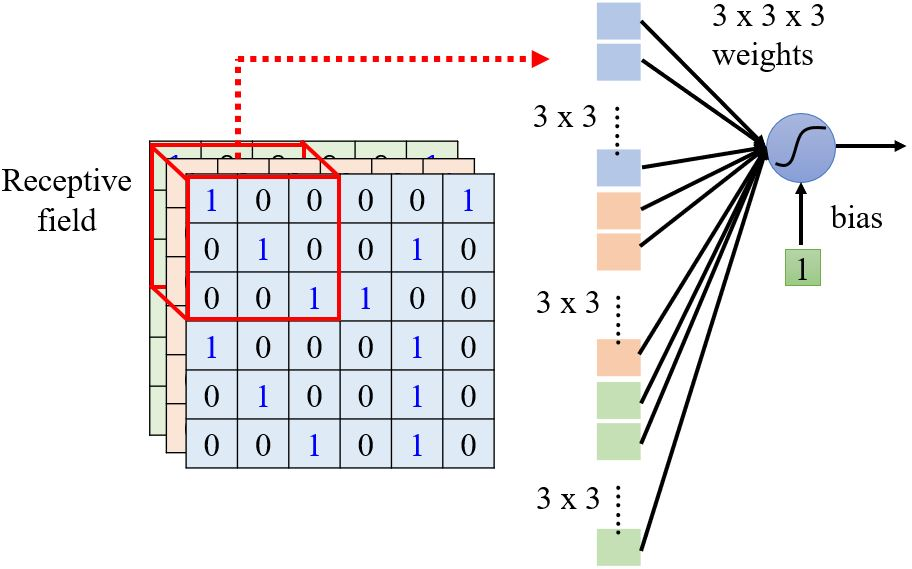</figure>

<figure>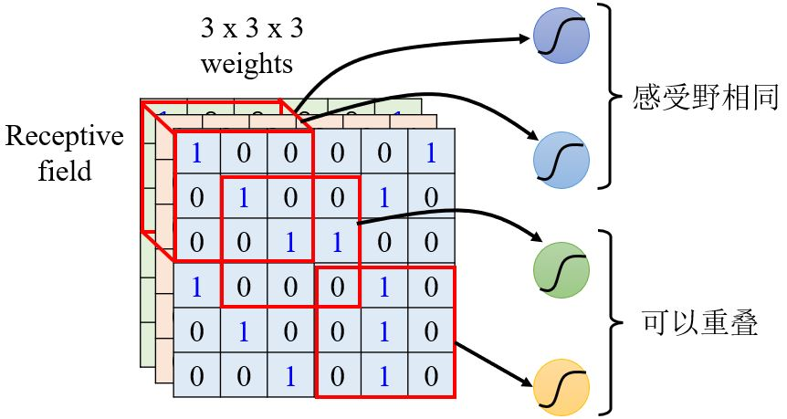</figure>

* 不同的神经元可以有不同大小的感受野吗？
* 感受野可以只包含某些通道吗？
* 感受野可以不是正方形的吗？

**Typical setting**

<figure>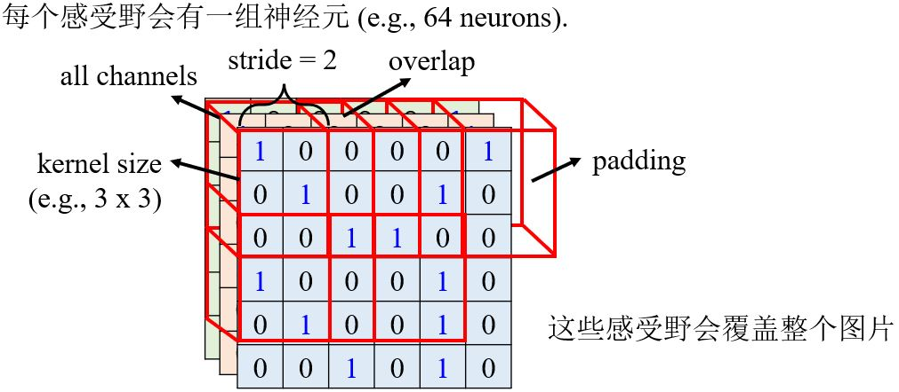</figure>

&emsp;&emsp;每个感受野之间相隔的距离为stride，是一个hyperparameter，通过调节它可以改变感受野互相重叠的大小。如果感受野之间互不重合，那么就可能漏掉出现在两个感受野之间的pattern，所以我们会希望感受野之间有高度的重叠。如果感受野超出了图片本身，可以进行padding，将空的地方补值为0（或其它值）。

```tip
为什么卷积核的大小通常都是3*3呢？难道我们的特征就出现在这个范围内吗？
```

### 3.1.2 Parameter sharing

#### Observation 2

<figure>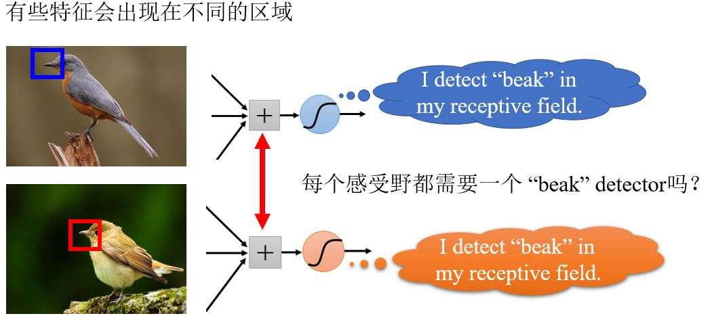</figure>

#### Simplification 2

&emsp;&emsp;我们可以让不同感受野的神经元共享参数吗？

<figure>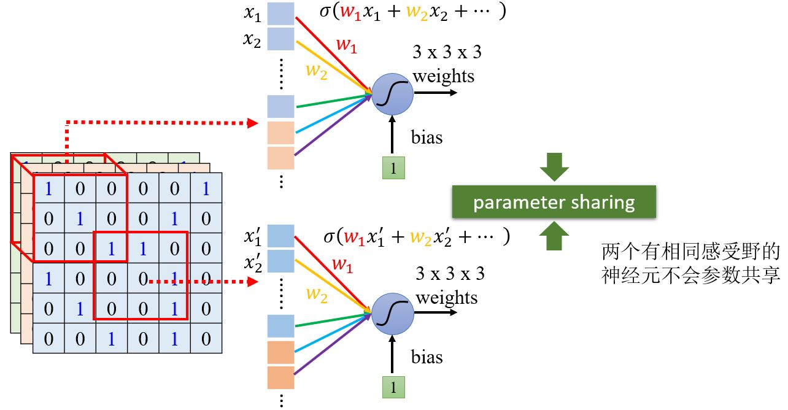</figure>

神经元的参数如果一样的话，输出会不会永远是一样的呢？  
— 不会，因为它们的输入不一样。

**Typical Setting**

<figure>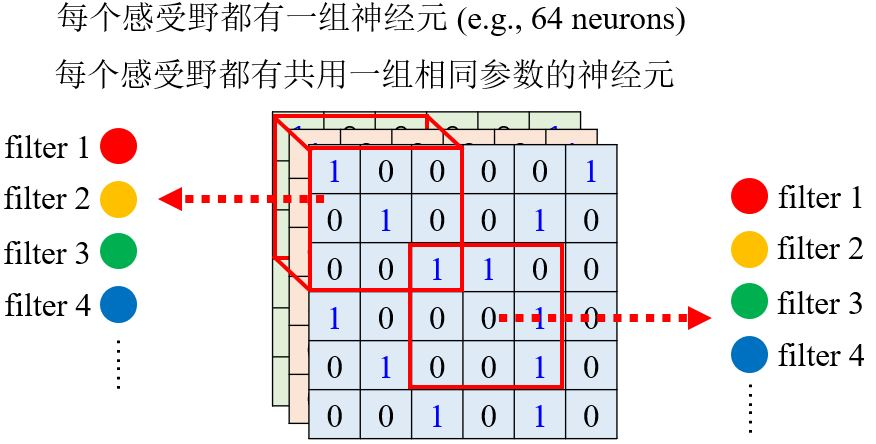</figure>

### 3.1.3 Benefit of convolutional layer 

<figure>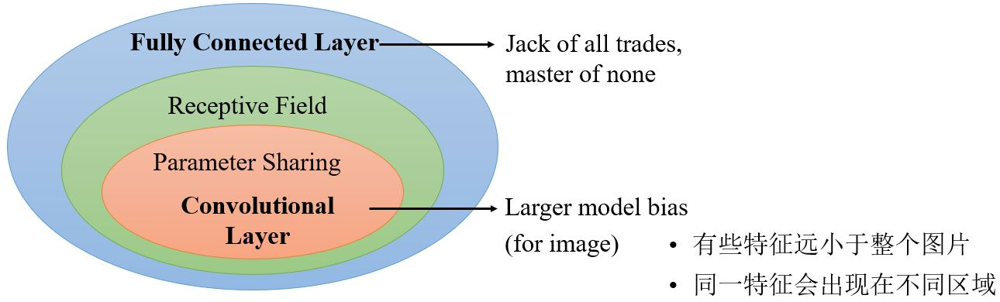</figure>

## 3.2 Convolutional Layer

&emsp;&emsp;另一个基于**filter**的角度来介绍CNN。

<figure>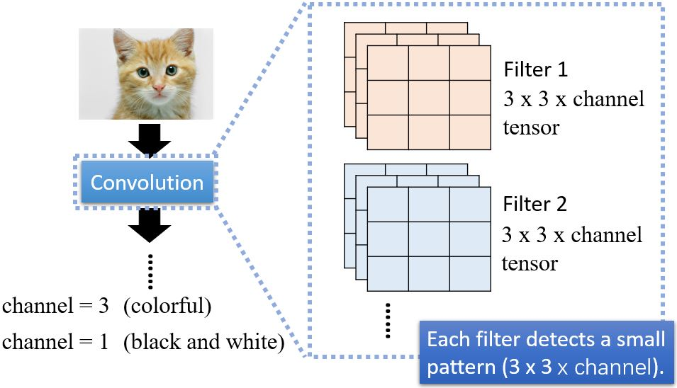</figure>

1. 求出filter 1与左上角第一个感受野的内积；  
2. 向右移动感受野（stride=1），求出求出filter 1与当前感受野的内积
3. ……

<figure>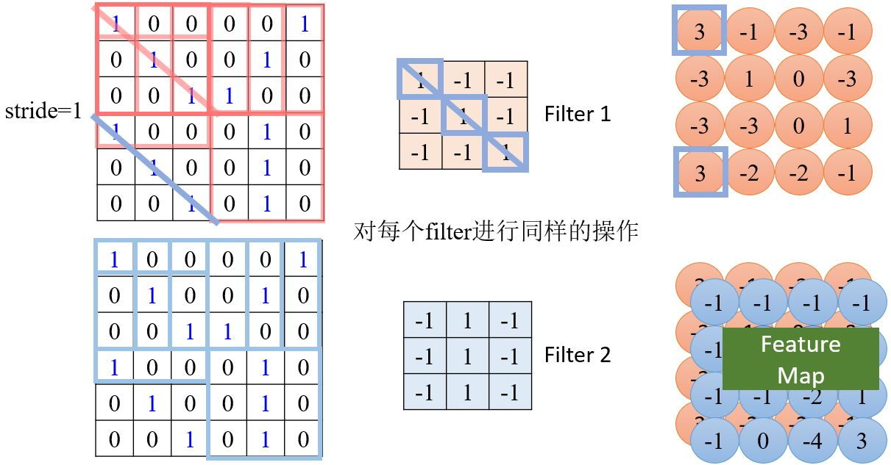</figure>

<figure>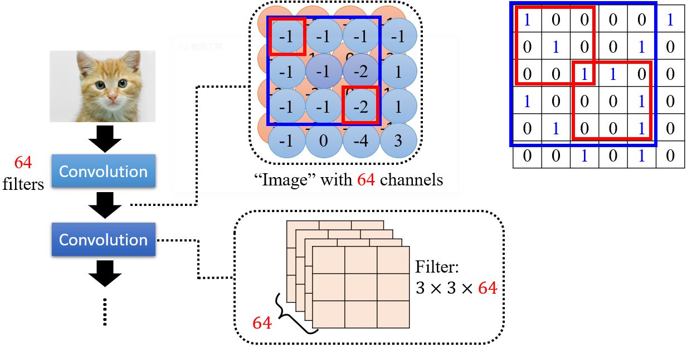</figure>

如果感受野的大小一直不变，会无法侦测到比较大的pattern吗？  
— 不会。以两层卷积网络为例，第二层的3\*3的大小实际对应原图5\*5的范围，所以只要网络够深，它是可以看到比较大的特征的。

### Comparison of Two Stories

<figure>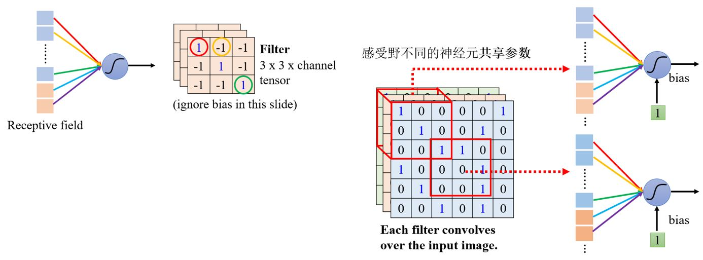</figure>
<figure>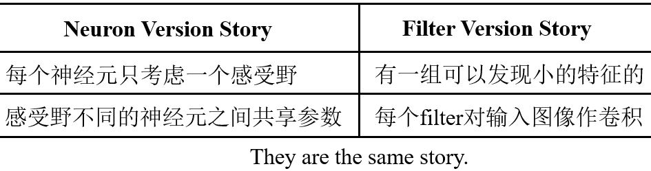</figure>

## 3.3 Pooling

### 3.3.1 Observation 3

&emsp;&emsp;对像素作二次采样不会改变目标本身。比如下面这张图，如果去除当中的奇数行和偶数列，得到的仍然是原来的那只鸟。

<figure>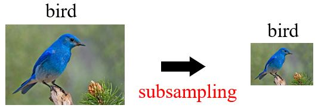</figure>

### 3.3.2 Pooling – Max pooling

<figure>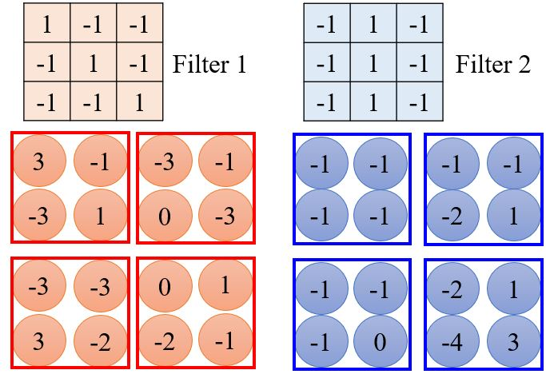</figure>

<figure>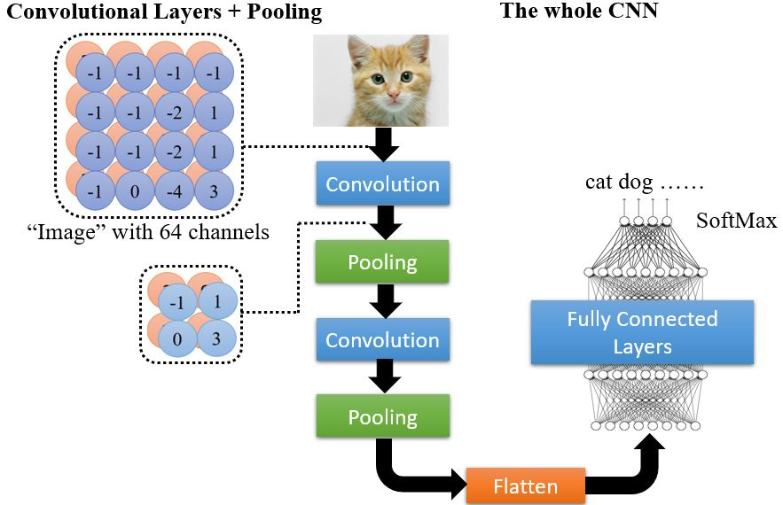</figure>

&emsp;&emsp;池化的过程会把图像变小，从而减少运算量，但是也会对效果产生影响。如果算力足够的话，可以不进行池化，全用卷积神经网络。

## 3.4 Applications

### 3.4.1 Playing Go

<figure>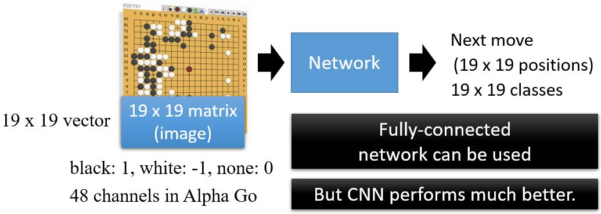</figure>

&emsp;&emsp;为什么对围棋选CNN呢？

<figure>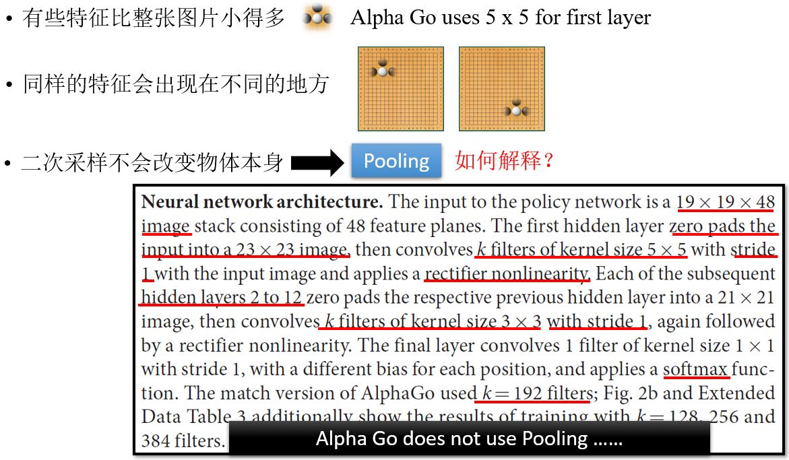</figure>

### 3.4.2 More Applications

<figure>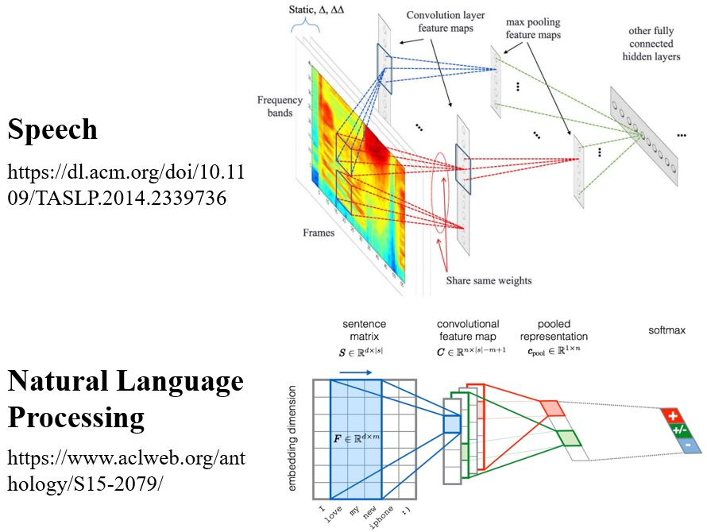</figure>

### To learn more

<figure>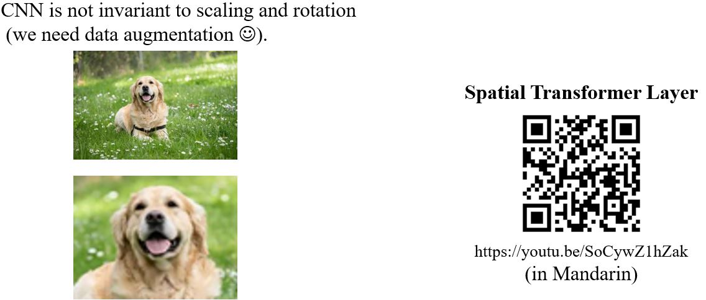</figure>

---

## Validation

&emsp;&emsp;为什么用了验证集，结果还是过拟合的呢？

<figure>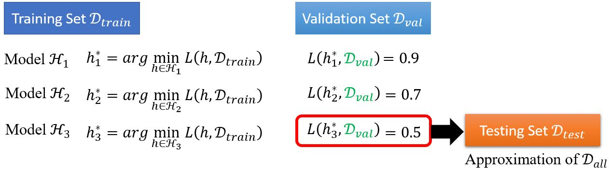</figure>

<figure>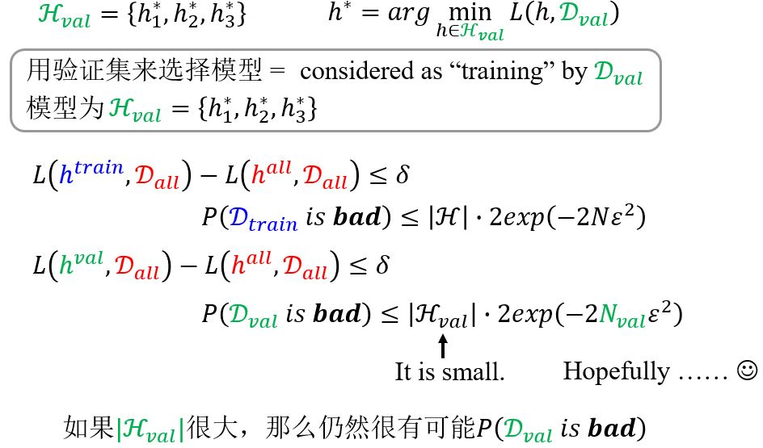</figure>

## Why Deep?


## Spatial Transformer Layer *

<!-- 蓝 -->
<b><font color="#3399ff"></font></b>
<!-- 绿 --><!-- #33cc00 -->
<b><font color="#00B050"></font></b>
<!-- 橙 -->
<b><font color="#FF4500"></font></b>