# Self-attention

## 4.1 Sequence as Input

<figure></figure>

&emsp;&emsp;目前为止，我们的网络的输入都是一个vector，输出可能是一个数值或者一个类别。那如果我们的输入是一排向量呢？输入的数量（即序列的长度）会改变呢？我们又该如何处理呢？

### 4.1.1 Vector set as input

&emsp;&emsp;什么情况下输入是一个长度可变的序列呢？

<figure></figure>
&emsp;&emsp;输入是一个句子，把句子中的每个词汇描述成一个向量，那么model的输入就是大小会变的vector set。如果采用<b>one-hot encoding</b>对词汇进行编码，那么每个词汇就对应一个独热向量。另一种方法是<b>word embedding</b>，每个词对应一个包含语义信息的向量。  
To learn more: https://youtu.be/X7PH3NuYW0Q (in Mandarin)

<figure></figure>
&emsp;&emsp;一段声音信号也是一排向量，一个window内的信号可以描述成一个向量（有很多种描述方法），称为<b>frame</b>，窗口每次向右移10ms。

Graph也是一组向量 (consider each **node** as **a vector**)。

<figure></figure>
&emsp;&emsp;social network就是一个graph，其中每个node就是一个人，节点与节点间的edge就是两个人之间的关系，每个节点可以看作一个向量，其中包含了这个人的各种相关信息，所以整个graph可以看作是一堆向量组成的。  

<figure></figure>
&emsp;&emsp;一个分子也是一个graph，每个原子可以用一个one-hot vector表示，一个分子就是一堆向量。

### 4.1.2 What is the output?

&emsp;**1. 每个向量都有一个对应的label** <b>Sequence Labeling</b>（本节主要关注的情况）

<figure></figure>

Example applications
<figure></figure>

&emsp;**2. 每个序列对应一个label**

<figure>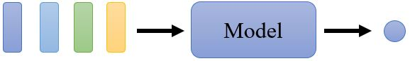</figure>

Example applications
<figure>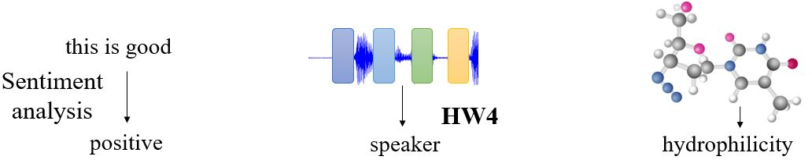</figure>

&emsp;**3. 模型自己决定label的数量**<b> seq2seq
</b>

<figure>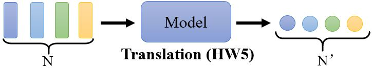</figure>

## 4.2 Self-attention

**Sequence labeling**
<figure>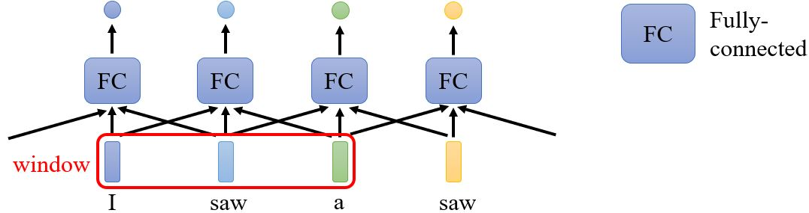</figure>
&emsp;&emsp;如果用全连接结构来解决这个问题，可以考虑上下文吗？FC可以考虑附近的内容。如何让考虑整个序列呢？用一个覆盖整个序列的窗口吗？

<figure>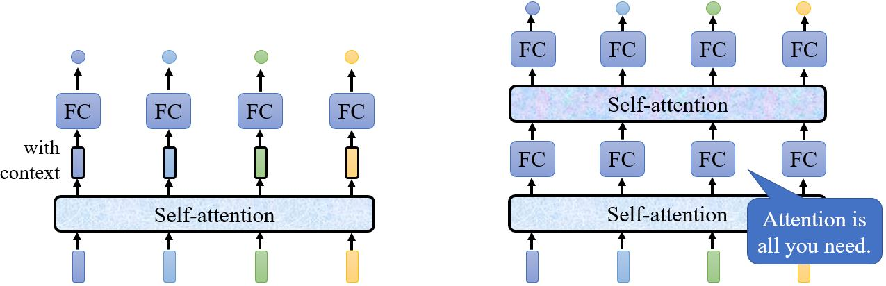</figure>

&emsp;&emsp;Self-attention层会吃一整个序列的咨询，然后输出与输入数量相同的vector，自注意力层可以和全连接层交替使用。

<figure>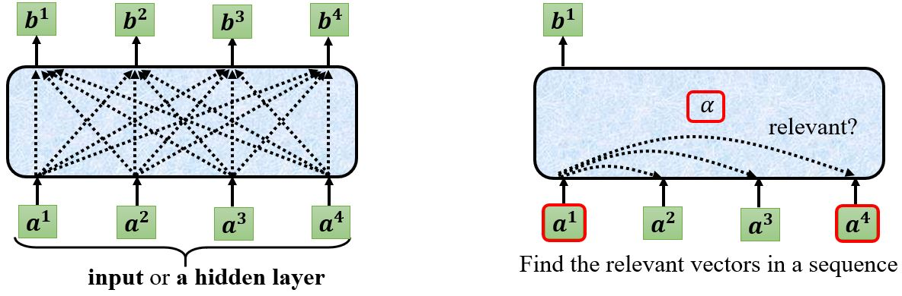</figure>

&emsp;&emsp;首先根据$$\mathbf{a^1}$$找出序列中与$$\mathbf{a^1}$$相关的其它向量，每个向量与$$\mathbf{a^1}$$的关联程度可以用数值$$\alpha$$来表示。那么自注意力机制中的module怎么决定两个向量之间的关联性呢？

<figure>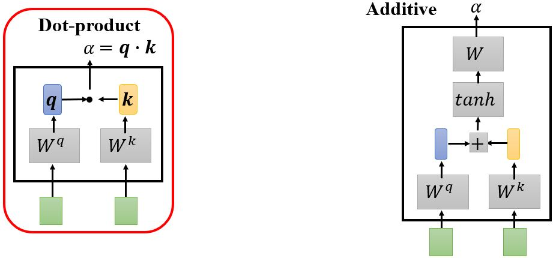</figure>
&emsp;&emsp;计算attention有很多种方法，e.g. dot-product、additive… 比较常用的是dot-product（transformer中采用的方法），下面以dot-product为例讲解。

<figure>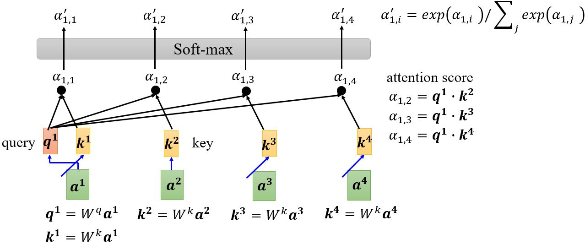</figure>
<figure>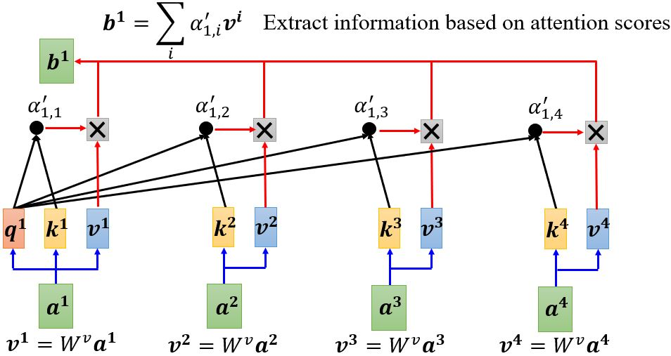</figure>
<figure>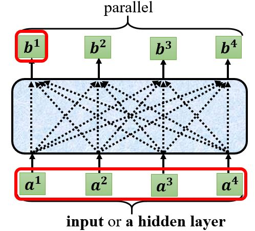</figure>

&emsp;&emsp;这样我们就得到了$$\mathbf{b^1}$$，下面开始计算$$\mathbf{b^2}$$。需要注意的是，这里$$\mathbf{b^1}, \ldots, \mathbf{b^4}$$并不需要依次计算，而是同时计算出来的。
<figure>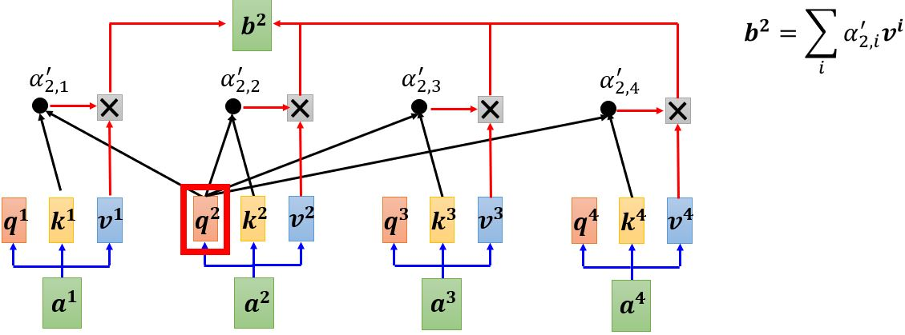</figure>

&emsp;&emsp;下面我们再从矩阵的角度重新解释一下self-attention是如何运作的。

<figure>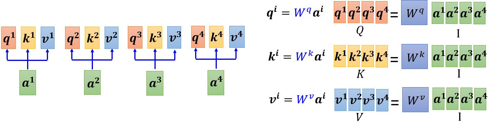</figure>
<figure>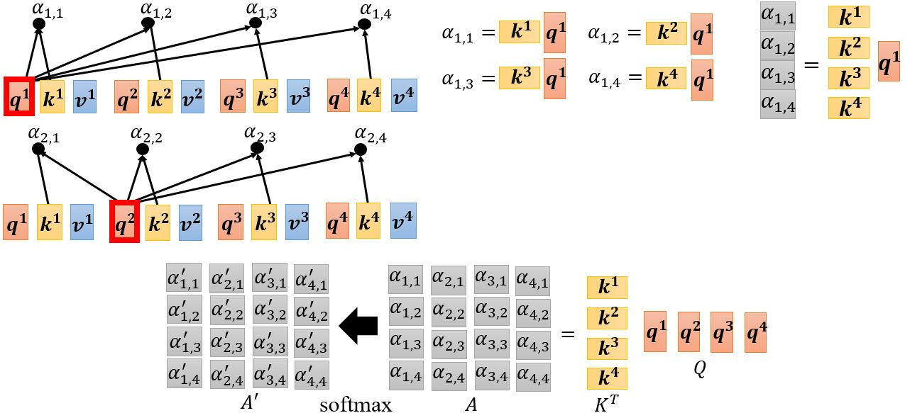</figure>
<figure>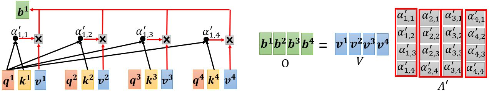</figure>
<figure>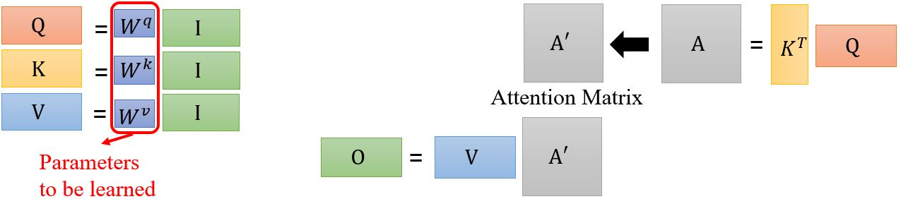</figure>

## 4.3 Multi-head Self-attention

&emsp;&emsp;多头注意力机制现在也很常用，可以判断<b>different types of relevance</b>。head的个数也是一个hyperparameter，下面以2 heads为例。

<figure>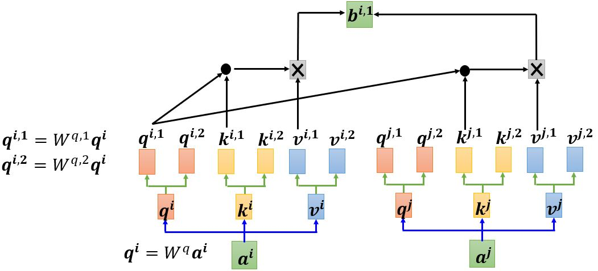</figure>
<figure>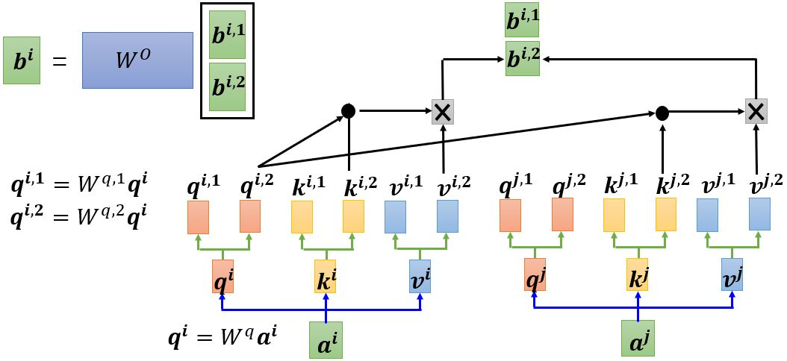</figure>

## 4.4 Positional Encoding

&emsp;&emsp;对于self-attention层而言，每个数据出现在序列的哪个位置没有区别。所以我们需要做positional encoding，每个位置都有一个唯一的positional vector $$e^i$$。

<figure>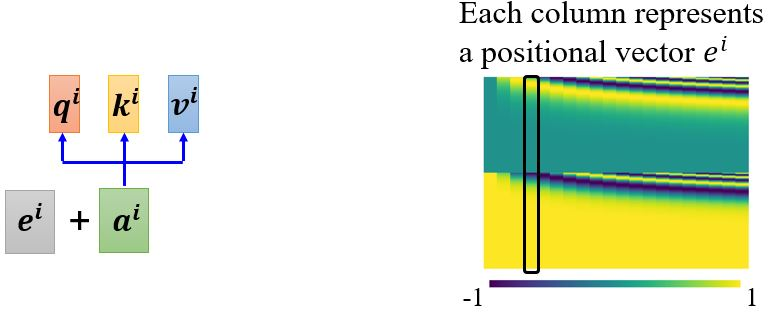</figure>

不同的编码方式：
* **hand-crafted**（这可能会带来一些问题，比如序列的长度比编码长度长）
* **learned from data**

&emsp;&emsp;Positional encoding仍是一个尚待研究的问题，比如2020年发表在arxiv上的一篇[论文](https://arxiv.org/abs/2003.09229)中的工作如下：

<figure>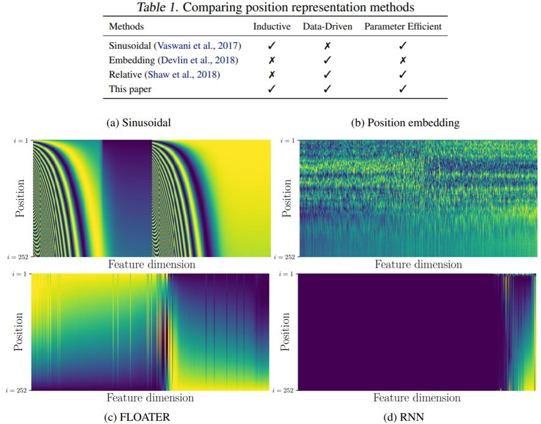</figure>

## 4.5 Many Applications

&emsp;&emsp;Self-attention应用广泛，如[Transformer](https://arxiv.org/abs/1706.03762)、[BERT](https://arxiv.org/abs/1810.04805)……广泛运用在Natural Langue Processing (NLP)中！

### 4.5.1 Self-attention for speech

&emsp;&emsp;一段语音信号是一个非常长的序列，如果输入序列长度为$$L$$，那么attention matrix $$\mathbf{A'}$$会是一个$$L \times L$$的非常大的矩阵。在语音辨识中有一种方法，[Truncated Self-attention](https://arxiv.org/abs/1910.12977)。因为Self-attention没有必要关注整个句子，可以只考虑句子的一部分，这样可以加快计算。
<figure>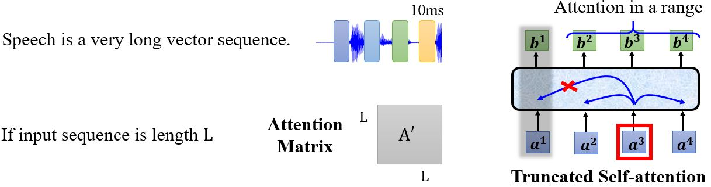</figure>

### 4.5.2 Self-attention for image

<figure>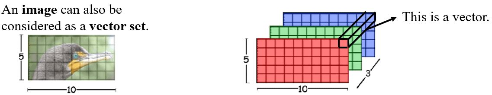</figure>
<figure>
    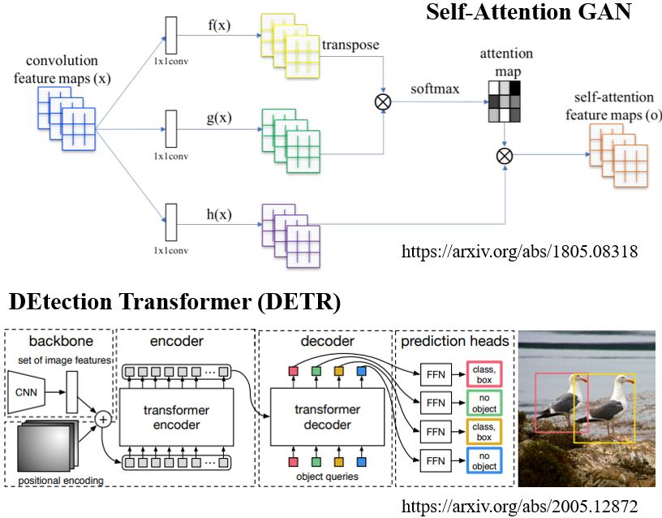
    <figcaption>两个例子</figcaption>
</figure>

#### Self-attention v.s. CNN

<figure>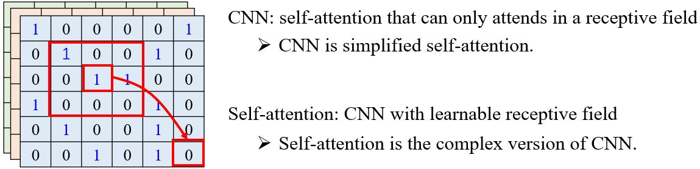</figure>
<figure>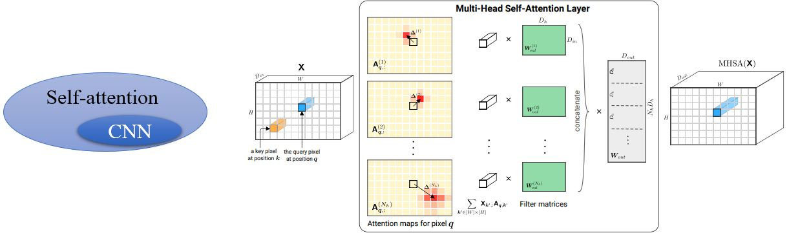</figure>

&emsp;&emsp;[On the Relationship between Self-Attention and Convolutional Layers](https://arxiv.org/abs/1911.03584)一文详细证明了CNN是Self-attention的一个特例，只要Self-attention参数合适就可以做到和CNN一样的事情。  

<figure>
    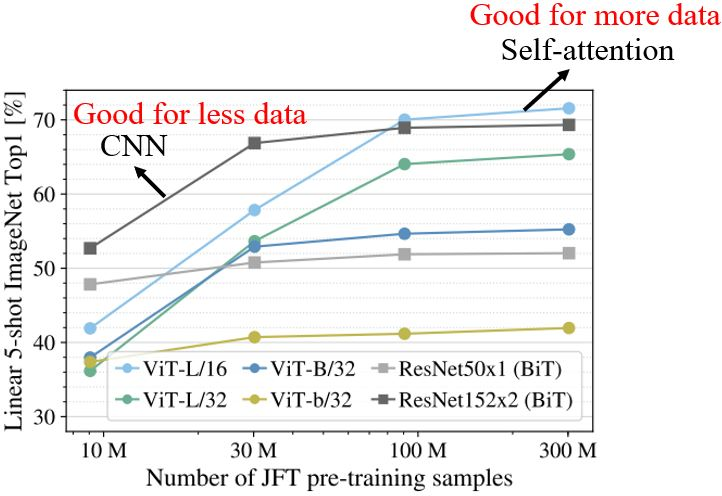
    <figcaption>An Image is Worth 16x16 Words: Transformers for Image Recognition at Scale</figcaption>
</figure>

&emsp;&emsp;CNN是Self-attention的一个subset，那么Self-attention会比较flexible，会比较需要更多的data，如果data不够可能会overfitting。

<!-- 蓝 -->
<b></b>
<!-- 绿 --><!-- #33cc00 -->
<b></b>
<!-- 橙 -->
<b></b>