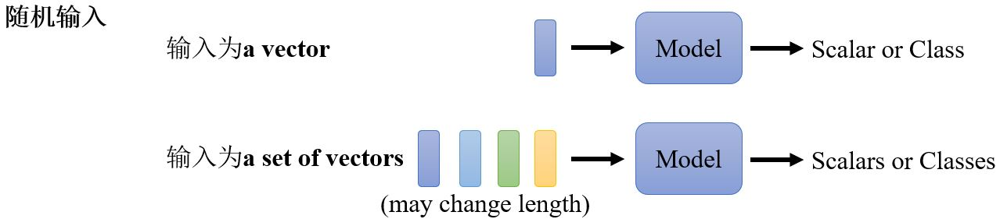
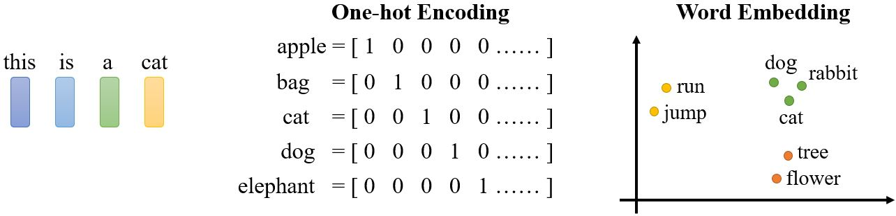
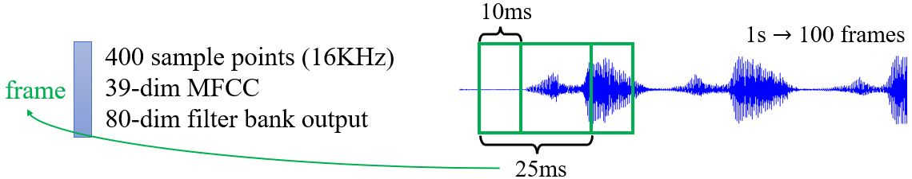
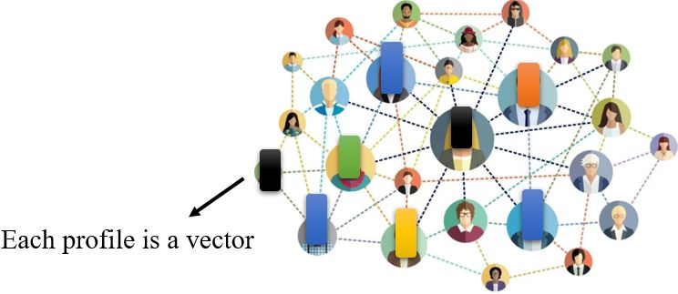
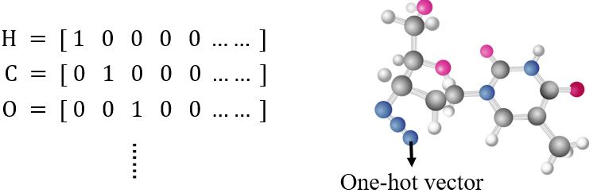
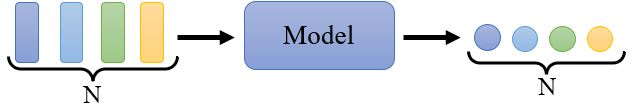

# Sequence as Input

<figure></figure>

&emsp;&emsp;目前为止，我们的网络的输入都是一个vector，输出可能是一个数值或者一个类别。那如果我们的输入是一排向量呢？输入的数量（即序列的长度）会改变呢？我们又该如何处理呢？

### 4.1.1 Vector set as input

&emsp;&emsp;什么情况下输入是一个长度可变的序列呢？

<figure></figure>
&emsp;&emsp;输入是一个句子，把句子中的每个词汇描述成一个向量，那么model的输入就是大小会变的vector set。如果采用<b>one-hot encoding</b>对词汇进行编码，那么每个词汇就对应一个独热向量。另一种方法是<b>word embedding</b>，每个词对应一个包含语义信息的向量。  
To learn more: https://youtu.be/X7PH3NuYW0Q (in Mandarin)

<figure></figure>
&emsp;&emsp;一段声音信号也是一排向量，一个window内的信号可以描述成一个向量（有很多种描述方法），称为<b>frame</b>，窗口每次向右移10ms。

Graph也是一组向量 (consider each **node** as **a vector**)。

<figure></figure>
&emsp;&emsp;social network就是一个graph，其中每个node就是一个人，节点与节点间的edge就是两个人之间的关系，每个节点可以看作一个向量，其中包含了这个人的各种相关信息，所以整个graph可以看作是一堆向量组成的。  

<figure></figure>
&emsp;&emsp;一个分子也是一个graph，每个原子可以用一个one-hot vector表示，一个分子就是一堆向量。

### 4.1.2 What is the output?

&emsp;**1. 每个向量都有一个对应的label**

<figure></figure>
<figure></figure>

&emsp;**2. 每个序列对应一个label**

<!-- 蓝 -->
<b></b>
<!-- 绿 --><!-- #33cc00 -->
<b></b>
<!-- 橙 -->
<b></b>