# Graph Neural Networks

## Introduction

<figure>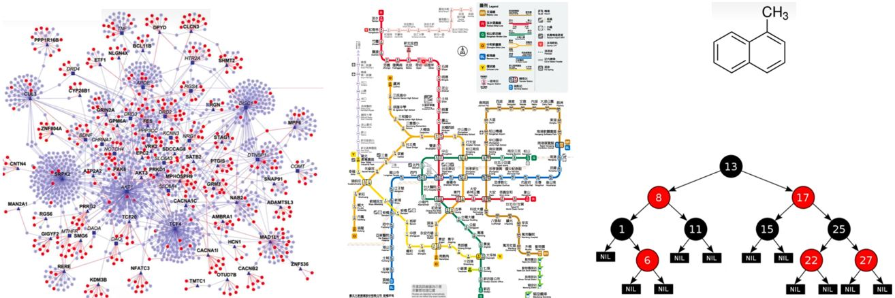</figure>

&emsp;&emsp;我们要怎么把一个graph塞进neural network中呢？之前我们的输入可能是一张照片、一个序列，如果我们把上面这样的图喂给model，要如何让model知道图的结构，也就是node和edge的特征呢？

<figure>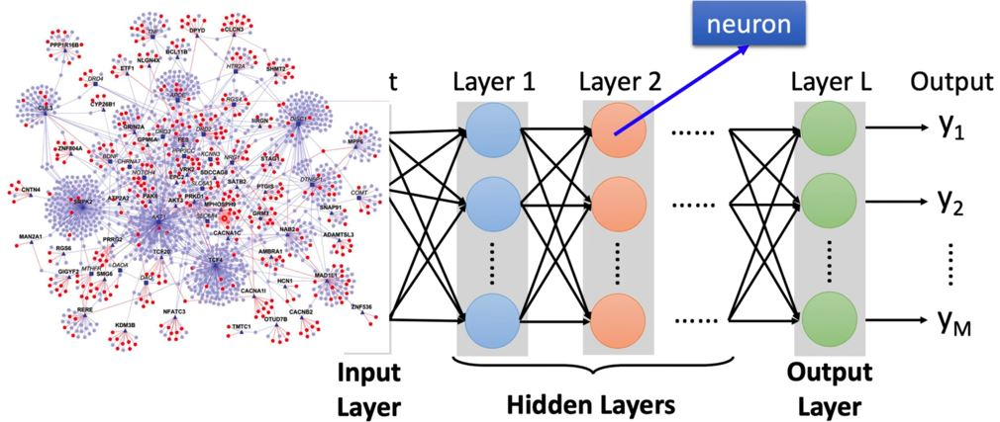</figure>

为什么我们需要用GNN呢？  
— GNN可以用在Classification、Generation等问题中。
<figure>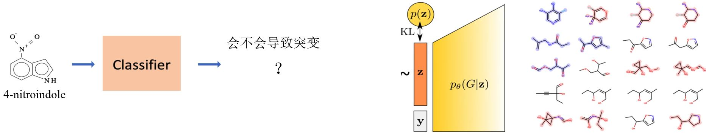</figure>

<figure>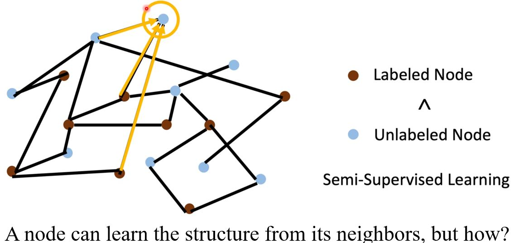</figure>

如何利用卷积将节点嵌入到一个特征空间中？  
— Solution 1：将convolution (corelation)的概念推广到图中 → Spatial-based convolution  
— Solution 2：回到信号处理中对convolution的定义 → Spectral-based convolution

### Roadmap

<figure>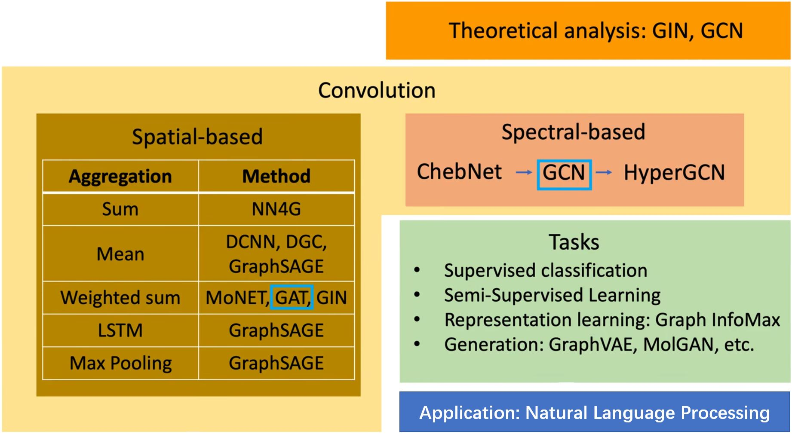</figure>

### Tasks, Dataset and Benchmark

**Tasks:**
* Semi-supervised node classification
* Regression
* Graph classification
* Graph representation learning
* Link prediction

**Common dataset:**
* CORA: citation network. 2.7k nodes and 5.4k links
* TU-MUTAG: 188 molecules with 18 nodes on average

## Spatial-based GNN

**Review: Convolution**

<figure>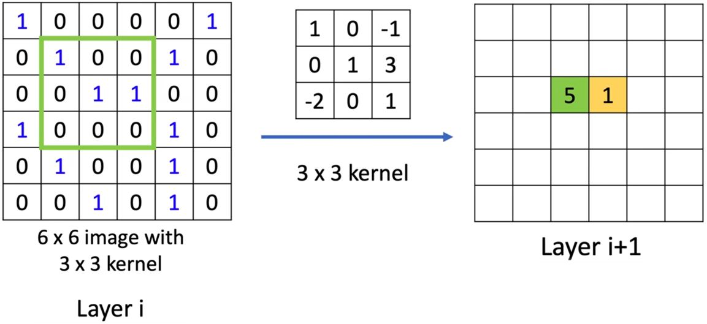</figure>

### Spatial-based Convolution

&emsp;&emsp;<b>Aggregate</b>：用neighbor feature更新下一层的hidden state  
&emsp;&emsp;<b>Readout</b>：把所有nodes的feature集合起来代表整个graph

<figure>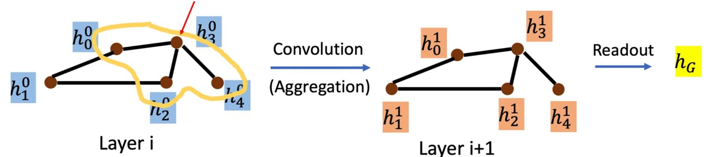</figure>

#### NN4G (Neural Networks for Graph)

<figure>
    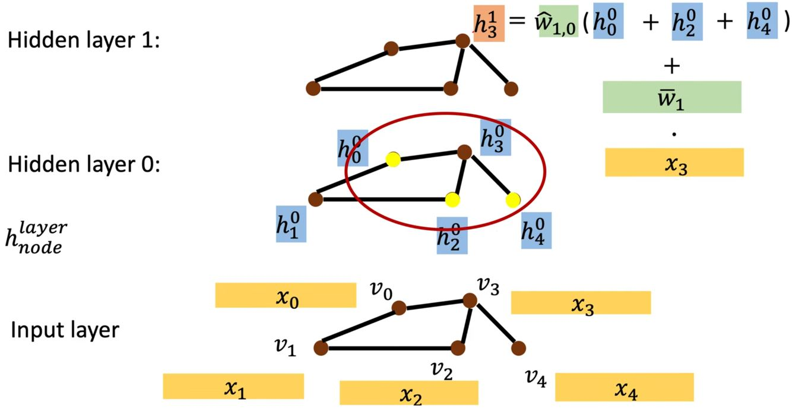
    <figcaption>Aggregate</figcaption>
</figure>
<figure>
    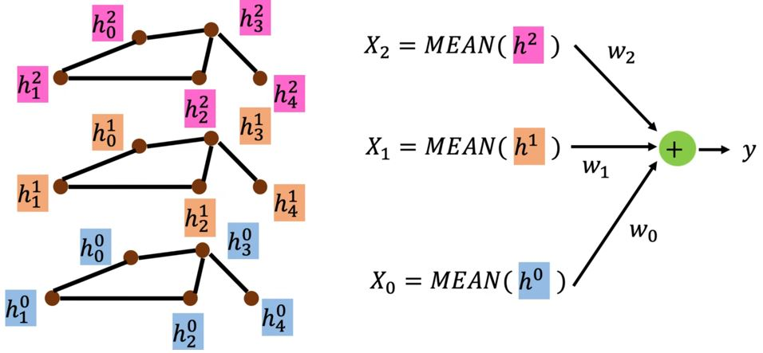
    <figcaption>Readout</figcaption>
</figure>

#### DCNN (Diffusion-Convolution Neural Network)

<figure>
    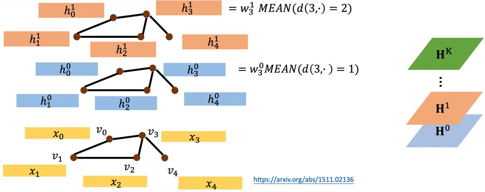
    <figcaption>Aggregate</figcaption>
</figure>
<figure>
    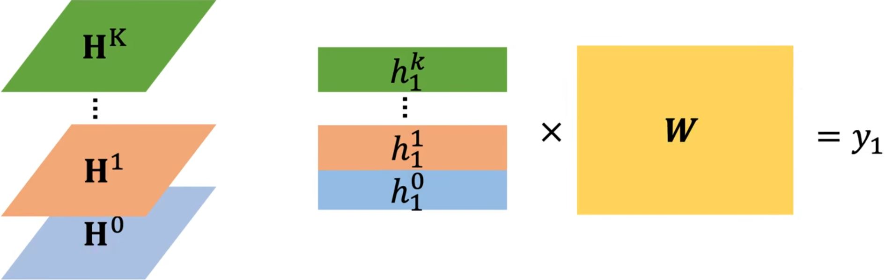
    <figcaption>Node features</figcaption>
</figure>

#### DGC (Diffusion Graph Convolution)

<figure>
    
    <figcaption>与DCNN区别在于对node features的处理不同</figcaption>
</figure>

#### MoNET (Mixture Model Networks)

<figure>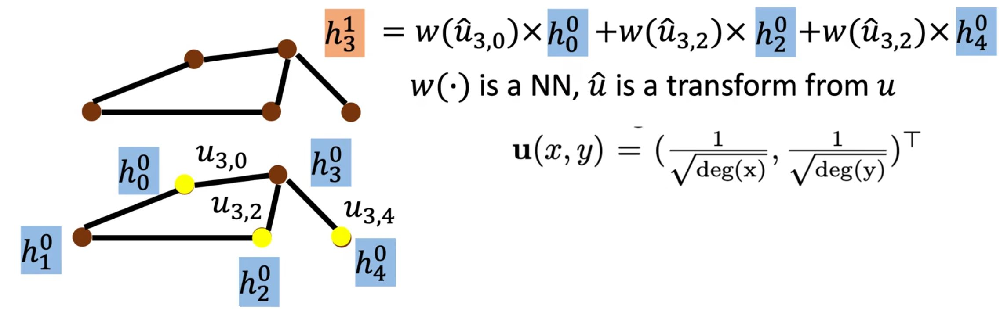</figure>

* 定义节点间“距离”的度量方
* 用加权和（平均值）而不是简单地直接把邻居节点相加（求平均）

#### GraphSAGE

<figure>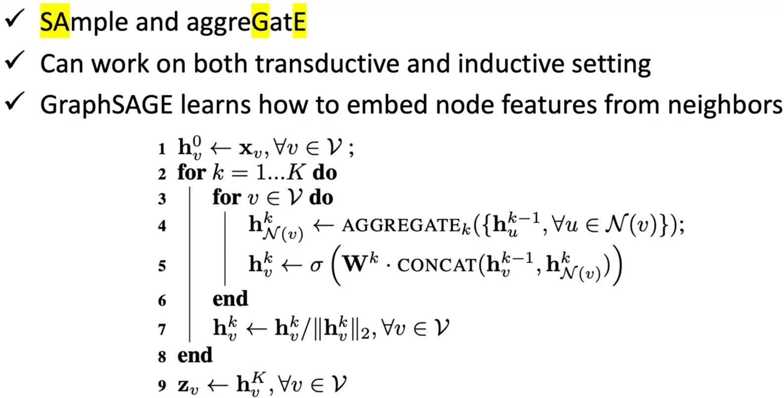</figure>
<figure>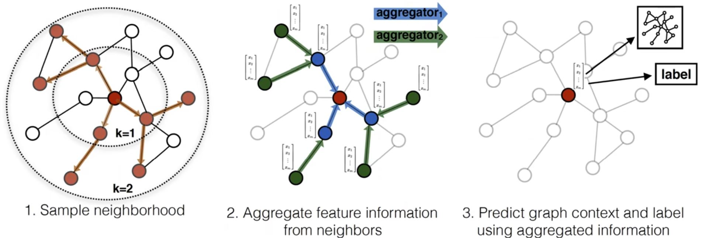</figure>

* Aggregation: mean, max-pooling or LSTM

#### GAT (Graph Attention Networks)

<figure>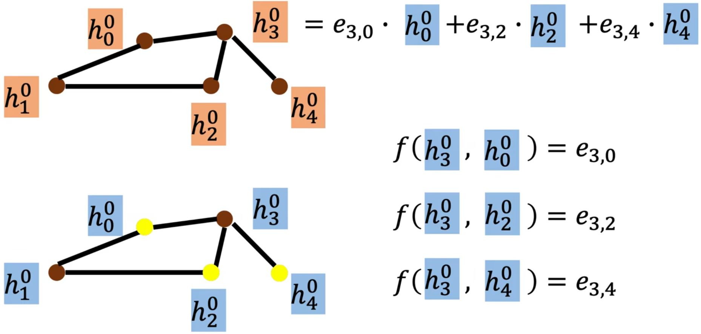</figure>

#### GIN (Graph Isomorphism Network)
……

<!-- 蓝 -->
<b></b>
<!-- 绿 --><!-- #33cc00 -->
<b></b>
<!-- 橙 -->
<b></b>