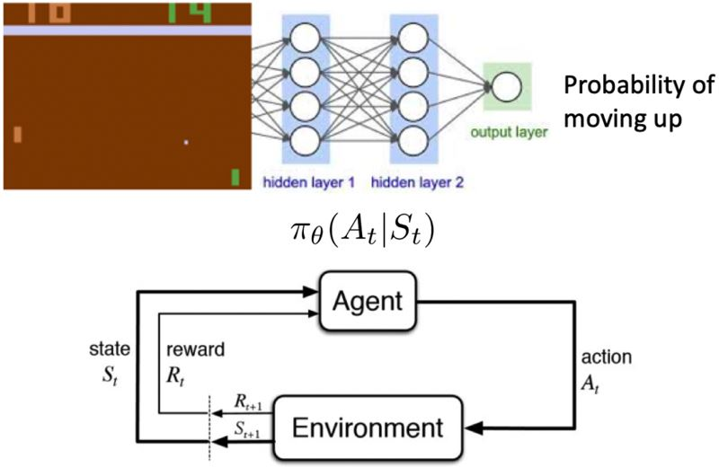
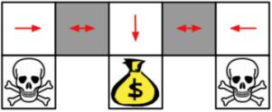
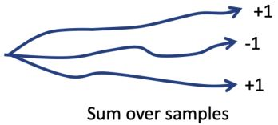

# Policy Optimization Ⅰ

## 5.1 Policy-based RL

&emsp;&emsp;确定性策略是直接从价值函数用贪心策略$$a_t = \text{arg} \max_a Q(a, s_t)$$得到的。  
&emsp;&emsp;与之相反，可以使用<b>将策略函数参数化表示为</b>$$\color{green}{\pi_{\theta} (a \vert s)}$$，其中$$\color{green}{\theta}$$<b>是可学习的策略参数</b>，输出是动作集上的概率。

&emsp;&emsp;对于策略优化，只需要知道策略中的动作，然后直接优化策略。

<figure></figure>

**Value-based RL vs. Policy-based RL**:  
1. value-based RL：学习价值函数  基于价值函数的隐性策略
2. policy-based RL：没有价值函数  直接学习策略
3. actor-critic：学习策略函数和价值函数

<figure></figure>

基于策略的强化学习优势：
1. 更好的收敛性：能保证收敛到某个局部最优（最差的情况）或全局最优（最好的情况）
2. 策略梯度对于高维动作空间更高效
3. 策略梯度可以学习随机策略，而价值函数不可以

劣势：
1. 一般都会收敛到局部最优
2. 评估策略的方差很大

**两种策略**：
1. 确定性：给定一个状态，策略会返回一个确定的动作来采取。
2. 随机性：给定一个状态，策略会返回动作的概率分布（e.g. 40%的概率向左转，60%的概率向右转）或连续动作的某个高斯分布。

例：石头剪刀布  
&emsp;&emsp;该游戏有两个玩家，什么样的策略是最好的呢？如果策略是固定的，那么很容易被打败。所以，均匀随机策略是最优的（Nash均衡）。

例：aliased gridworld  
<figure></figure>

&emsp;&emsp;在这个游戏中，agent无法分辨这两个灰色的格子。考虑以下特性（对于所有的上下左右），$$\psi (s, a) = [1(\text{上面是墙}, a = \text{向右移}), 1(\text{下面是墙}, a = \text{向左移}), \ldots]$$。  
&emsp;&emsp;如果是基于价值的RL，价值函数近似为$$Q_{\theta} (s, a) = f(\psi(s, a), \theta)$$  
&emsp;&emsp;如果是基于策略的RL，策略函数近似为$$\phi_{\theta} (s, a) = g(\psi(s, a), \theta)$$  

<figure></figure>

&emsp;&emsp;基于价值的RL会学到一个确定策略，e.g. 贪心。因为无法区分两个灰色格子，所以得到的最优确定性策略要么就是都往左（如图所示），要么就是都往右。不管是哪个，都有50%的概率会卡住。

<figure></figure>

&emsp;&emsp;基于策略的RL会学到一个随机策略。一个最优的随机性策略会在遇到这两个灰色格子的状态下，随机选择向左或向右，以一半一半的概率。这样对于任何一个起始点，agent都很有可能在几步之内到达目标状态。

### 5.1.1 Objective of optimizing policy

**目标**：给定义一个关于参数$$\theta$$的策略近似器$$\pi_{\theta}(s,a)$$，找到最好的$$\theta$$

问：如何衡量策略$$\pi_{\theta}$$的质量？

&emsp;&emsp;在episodic环境中，可以用开始的值

$$  J_{1}(\theta)
=   V^{\pi_{\theta}}\left(s_{1}\right)
=   \mathbb{E}_{\pi_{\theta}}\left[v_{1}\right]
$$

&emsp;&emsp;在连续环境中，可以用平均价值

$$  J_{a v V}(\theta)
=   \sum_{s} d^{\pi_{\theta}}(s) V^{\pi_{\theta}}(s)
$$

或每个时间步长的平均奖励

$$  J_{a v R}(\theta)
=   \sum_{s} d^{\pi_{\theta}}(s) \sum_{a} \pi_{\theta}(s, a) R(s, a)
$$

其中，$$d^{\pi_{\theta}}$$是$$\pi_{\theta}$$下Markov链的静态分布。

&emsp;&emsp;<b>策略的价值的定义</b>

$$\color{green}{\begin{aligned}
    J(\theta) 
&=  \mathbb{E}_{\tau \sim \pi_{\theta}}\left[\sum_{t} R\left(s_{t}^{\tau}, a_{t}^{\tau}\right)\right] \\
& \approx   \frac{1}{m} \sum_{m} \sum_{t} R\left(s_{t}^{m}, a_{t}^{m}\right)
\end{aligned}}$$

这和先前在基于价值的强化学习中定义的价值函数是一样的。

<figure></figure>

* 这里$$\tau$$是按策略函数$$\pi_{\theta}$$采样的轨迹
* 这里先忽略折扣因子

<b>基于策略的强化学习的目标</b>

$$\color{green}{
    \theta^*
=   \text{arg} \max_{\theta} 
    \mathbb{E}_{\tau \sim \pi_{\theta}}
    \left[\sum_{t} R\left(s_{t}^{\tau}, a_{t}^{\tau}\right)\right]
}$$

&emsp;&emsp;基于策略的强化学习是一个优化问题，找到能最大化$$J(\theta)$$的$$\theta$$。  

&emsp;&emsp;如果$$J(\theta)$$是可微的，那么可以使用基于梯度的方法：
1. 梯度上升
2. 共轭梯度
3. 准牛顿法
   
&emsp;&emsp;如果$$J(\theta)$$是不可微的，或者导数难以计算，那么可以使用一些无需导数的黑箱优化方法：
1. 交叉熵法（CEM）
2. 爬山算法
3. 进化算法

## 5.2 Monte-Carlo policy gradient
## 5.3 Reduce the Variance of PG
## 5.4 Actor-Critic
<!-- 蓝 -->

<!-- 绿 --><!-- #33cc00 -->
<b></b>
<!-- 橙 -->
