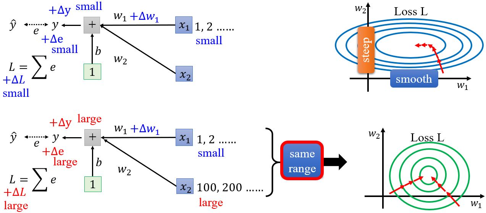
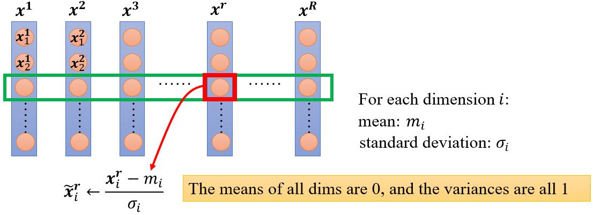
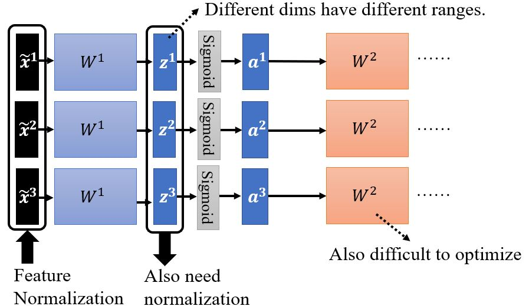
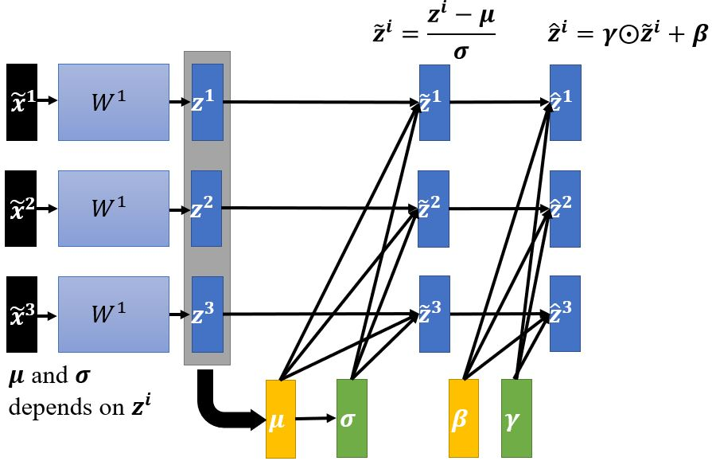
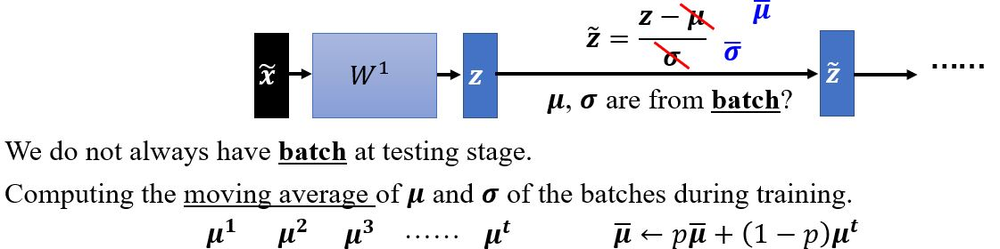
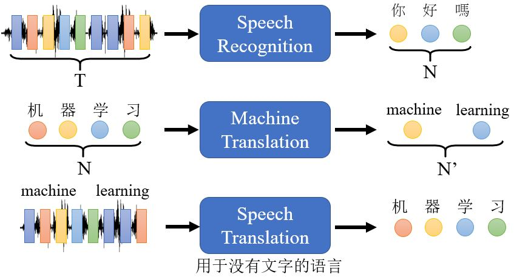

# Seq2seq — Transformer

## Introduction to Batch Normalization

**Changing Landscape**

&emsp;&emsp;前面提到过如果error surface比较崎岖的时候训练会比较困难，所以有没有什么办法能让error surface变平一点呢？Batch normalization就是基于这样的想法。  

&emsp;&emsp;什么情况下会产生不太好训练的error surface呢？假设$$w_1$$加上一个小的$$\Delta w_1$$，$$L$$会跟着改变。什么情况下$$w_1$$的变化会对$$L$$的影响很小呢？一种可能的情况是当input $$x_1$$的值都很小的时候。反之，如果现在$$x_2$$的值都很大，那么当$$w_2$$有一个小小变化的时候$$L$$的变化都很大，导致在$$w_2$$方向上做优化的时候error surface变化很大。所以，对于线性的模型如果输入之间的scale差距很大的时候，就可能产生不同方向坡度非常不同的error surface。

<figure></figure>

&emsp;&emsp;如何解决这个问题呢？如果给不同的维度同样的数值范围，error surface应该会变得容易训练。

### Feature normalization

<figure></figure>

&emsp;&emsp;一般来说，特征归一化会让梯度下降收敛地更快。

#### Considering RL

<figure></figure>

&emsp;&emsp;对于下一层网络的参数$$W^2$$来说，它的输入又是不同维的range不一样的，所以也需要进行归一化。在激活函数前或是后没有区别，如果用Sigmoid作激活函数，对$$z$$作特征归一化相对更好。

<figure></figure>

### Btach normalization

&emsp;&emsp;在实操中，我们只对一个batch作normalization，因为对整个数据集做归一化是不现实的。一般batch normalization用在batch比较大的时候，因为这样它才能比较好地近似整个数据集的$$\pmb{\mu}$$和$$\pmb{\sigma}$$。

<figure></figure>

&emsp;&emsp;在batch normalization中还会引入参数$$\pmb{\beta}$$和$$\pmb{\gamma}$$，这样模型可以自己决定hidden layer的输出要不要是0。一般$$\pmb{\beta}$$的初始值是全为1的向量，而$$\pmb{\gamma}$$的初始值为零向量。

#### Testing

<figure></figure>

#### Internal covariate shift?

<figure></figure>

Original paper：[Batch Normalization: Accelerating Deep Network Training by Reducing Internal Covariate Shift](https://arxiv.org/abs/1502.03167)

&emsp;&emsp;Batch normalization是如何帮助优化的呢？

&emsp;&emsp;原始论文里认为也许是因为internal covariate shift，但是[How Does Batch Normalization Help Optimization?](https://arxiv.org/abs/1805.11604)一文反驳了这个观点，这篇文章指出内部协变量偏移在神经网络训练中不一定是个问题，batch normalization有效也不见得是因为解决了内部协变量偏移。同时，这篇文章用实验结果（和理论分析）支持了batch normalization能够改变error surface的形状，而且发现用一些其它能改善error surface的方法也有差不多或甚至更好的效果，所以作者认为batch normalization能有效是serendipitous（机缘巧合的）。

### To learn more

现在除了batch normalization还有很多归一化方法：
* [Batch Renormalization](https://arxiv.org/abs/1702.03275)
* [Layer Normalization](https://arxiv.org/abs/1607.06450)
* [Instance Normalization](https://arxiv.org/abs/1607.08022)
* [Group Normalization](https://arxiv.org/abs/1803.08494)
* [Weight Normalization](https://arxiv.org/abs/1602.07868)
* [Spectrum Normalization](https://arxiv.org/abs/1705.10941)

---

## 5.1 Sequence-to-sequence

&emsp;&emsp;前面介绍过序列作为输入时候，输出有三种情况，其中一种是输出仍然是一个序列，且输出的长度是由模型决定的。

<figure></figure>

&emsp;&emsp;对于没有文字的语言，比如说闽南话，我们能不能让机器直接识别出对应的中文文字呢？反过来，如果输入文字输出闽南话，那就是**Text-to-Speech (TTS) Synthesis**，也就是在做语音合成。

<!-- 蓝 -->
<b></b>
<!-- 绿 --><!-- #33cc00 -->
<b></b>
<!-- 橙 -->
<b></b>