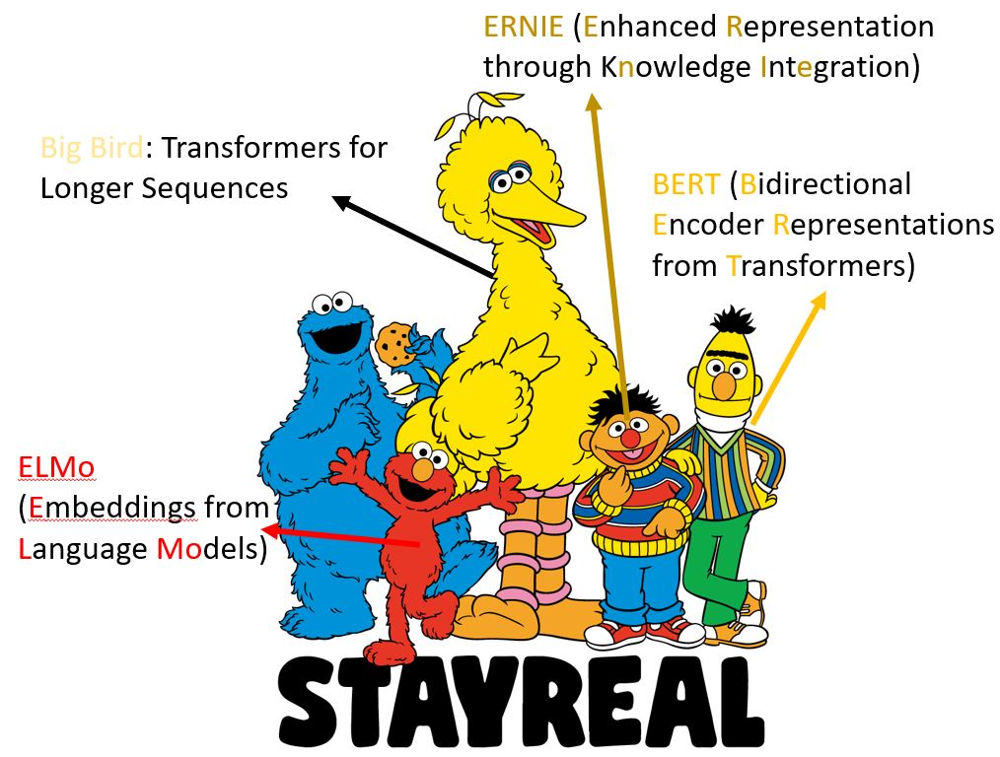
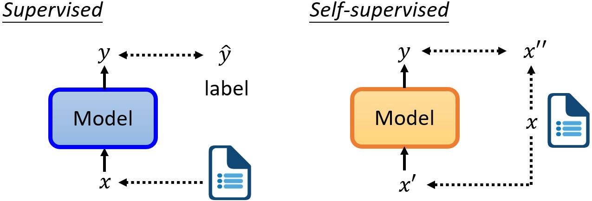
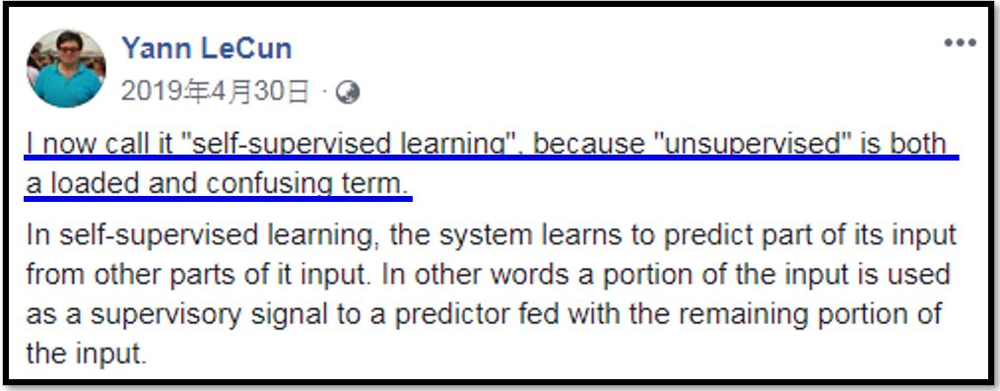
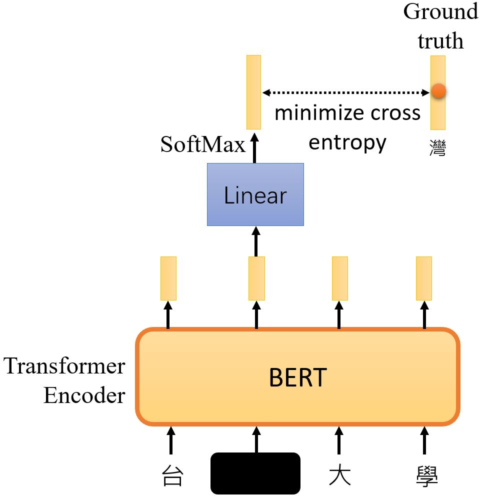
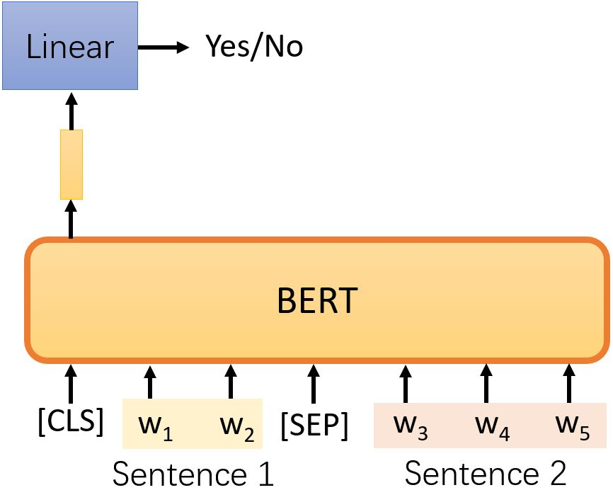
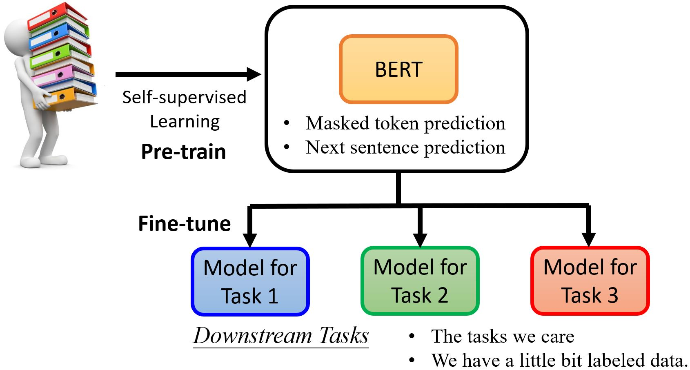

# Self-Supervised Learning for Speech & Image

<figure></figure>

&emsp;&emsp;BERT的参数量为340M，模型在变得越来越大。

| ELMo | BERT | GPT-2 | Megatron | T5 | Turing NLG | GPT-3 | Switch Transformer |
|-------|-------|-------|-------|-------|-------|------|------|
| 94M | 340M | 1542M | 8D | 11B | 17B | 175B | 1.6T |

## 7.1 Self-Supervised Learning

<figure>
    
    <figcaption>自监督学习将没有标注的资料分成两部分，让一部分作为模型的输入，另一部分作为模型的标注。</figcaption>
</figure>

<figure>
    
    <figcaption>自监督学习可以看作一种无监督学习的方法。</figcaption>
</figure>

### 7.1.1 Masking Input

<figure></figure>

<figure></figure>

### 7.1.2 Next Sentence Prediction

<figure></figure>

&emsp;&emsp;取两句话中间用[SEP]表示分隔，并在最前面加一个特殊符号[CLS]。将整个序列丢到
BERT（Transformer encoder）中得到序列，只取[CLS]所对应的输出，将其乘上一个线性变换，完成一个二元分类问题，预测两句话是否相接。  
&emsp;&emsp;该方法现在已被证明对BERT后续的任务没有太大帮助。[RoBERTa: A Robustly Optimized BERT Pretraining Approach](https://arxiv.org/abs/1907.11692) 这可能是因为这个任务太简单了，所以对于BERT来说没有学到太多。另一种更有用的方法：SOP (Sentence order predicion) 被用于[ALBERT: A Lite BERT for Self-supervised Learning of Language Representations](https://arxiv.org/abs/1909.11942)。

### 7.1.3 Fine-tune

<figure>
    
    <figcaption>经过预训练的BERT可以用来解决下游任务，即我们真正关心的任务。一个比较常用的任务集是GLUE。</figcaption>
</figure>

[GLUE (General Language Understanding Evaluation)](https://gluebenchmark.com/
)  
* Corpus of Linguistic Acceptability (CoLA)
* Stanford Sentiment Treebank (SST-2)
* Microsoft Research Paraphrase Corpus (MRPC)
* Quora Question Pairs (QQP)
* Semantic Textual Similarity Benchmark (STS-B)
* Multi-Genre Natural Language Inference (MNLI)
* Question-answering NLI (QNLI)
* Recognizing Textual Entailment (RTE) 
* Winograd NLI (WNLI) 

GLUE也有[中文版本](https://www.cluebenchmarks.com/)。

<figure>
    
    <figcaption>BERT及其家族在GLUE上的结果。图来自SuperGLUE: https://arxiv.org/abs/1905.00537</figcaption>
</figure>

<!-- 蓝 -->
<b></b>
<!-- 绿 --><!-- #33cc00 -->
<b></b>
<!-- 橙 -->
<b></b>