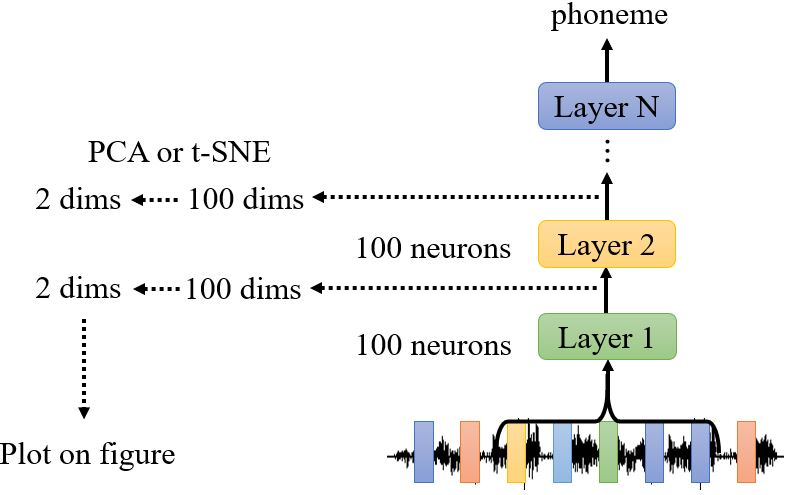
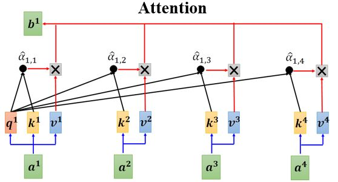
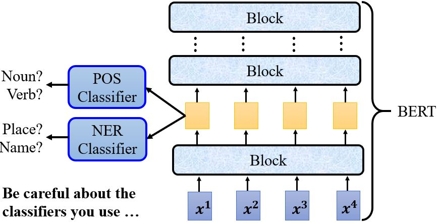
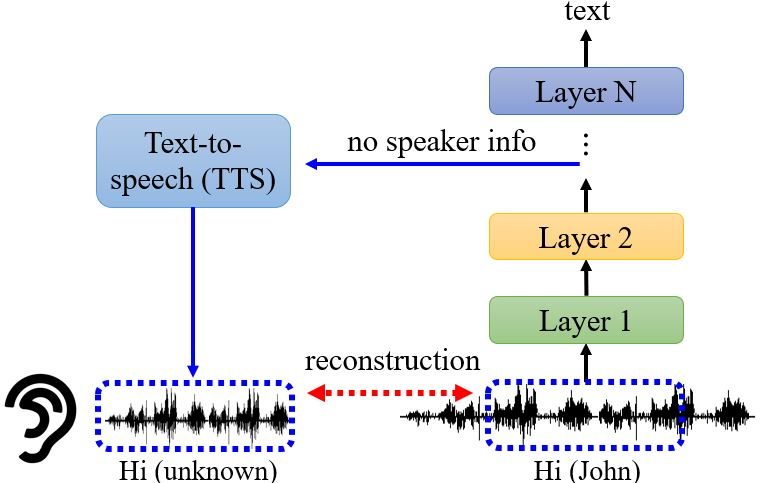
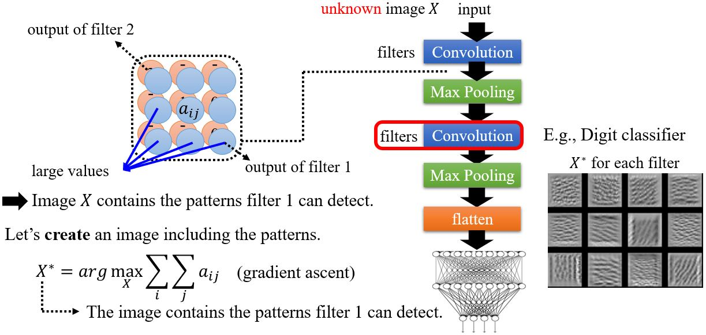
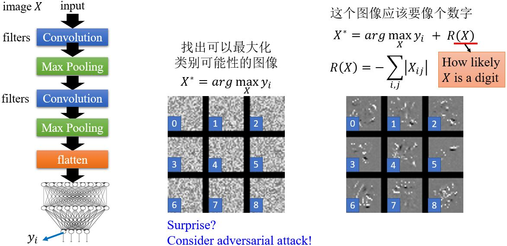
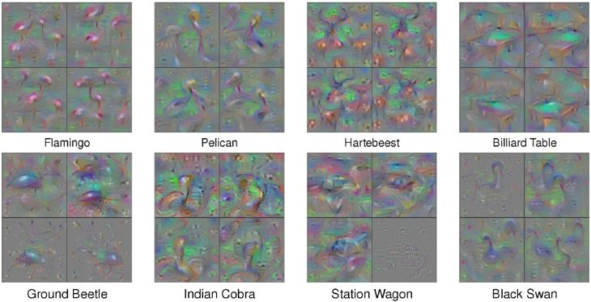

# Explainable AI

## 9.1 Introduction

### 9.1.1 Why we need explanable ML?

* 正确的答案$$\neq$$智能
* 法律要求贷款发行人解释他们的模型。
* 医学诊断模型对人的生命负责，它可以是一个黑匣子吗？
* 如果在法庭上使用模型，我们必须确保模型以非歧视的方式行事。
* 如果自动驾驶汽车突然出现异常，我们需要解释原因。

<figure>
    
    <figcaption>https://www.explainxkcd.com/wiki/index.php/1838:_Machine_Learning</figcaption>
</figure>

### 9.1.2 Interpretable v.s. Powerful 

&emsp;&emsp;有些模型是本质上可解释的：  
&emsp;&emsp;&emsp;比如，线性模型（通过权重可以知道每个特征的重要程度）  
&emsp;&emsp;&emsp;但是不是很有效

&emsp;&emsp;深度网络很难解释，它其实是黑箱……但是比线性模型有效。

<figure></figure>

&emsp;&emsp;有没有既interpretable又powerful的模型呢？Decision tree是不是可以？决策树比线性模型有效得多，相较于深度学习又是可解释的。**Decision tree is all you need!?**

<figure></figure>

&emsp;&emsp;其实决策树也可以非常复杂。在Kaggle比赛里深度学习往往没有决策树的方法效果好，但实际上我们用的是random forest，而当我们有很多棵决策树的时候也很难知道它们是如何决策的。

### 9.1.3 Goal of Explainable ML

可解释性机器学习的目标其实很难讲清楚，我们要完全地了解ML模型是如何工作的吗？  
* 我们都不知道大脑是怎么工作的！但是我们相信人做出的决定！  

或许，我们只是需要一个理由来相信ML。

### 9.1.4 Local & Global explaination

<figure></figure>

&emsp;&emsp;<b>Local Explanation</b>: **explain the decision**   
&emsp;&emsp;&emsp;Question: Why do you think this image is a cat?  

&emsp;&emsp;<b>Global Explanation</b>: **explain the whole model**   
&emsp;&emsp;&emsp;Question: What does a “cat” look like? (not referred to a specific image)

## 9.2 Local explanation

### 9.2.1 Which component is critical? 

<figure></figure>

&emsp;&emsp;哪个部分对做决定至关重要呢？

<figure></figure>
<figure></figure>

#### Case Study

<figure></figure>

&emsp;&emsp;以Pokémon和Digimon分类器为例，这个任务对人类来说都很困难，那为什么实验结果的精度会这么高呢？我们画出它们的Saliency map看看。

<figure></figure>

**What Happened?**  
&emsp;&emsp;机器关注的点怎么都在空白的地方呢？原来所有Pokémon都是PNG格式的，而Digimon都是JPEG格式的，而PNG格式的文件加载之后背景是黑色的。所以说，机器是靠背景颜色区分Pokémon和Digimon的。

### 9.2.2 Limitations

#### 1. Noisy Gradient

<figure></figure>

**SmoothGrad**：向输入图像随机添加噪声，得到噪声图像的显着性图，并对它们进行平均。

#### 2. Gradient Saturation

<figure></figure>

&emsp;&emsp;<b>梯度并不是总能反应重要程度</b>，比如上面这个鼻子长度和是大象的概率的关系。可以考虑用[Integrated gradient (IG)](https://arxiv.org/abs/1611.02639)的方法解决这个问题。

### 9.2.3 How a network processes the input data?

#### 1. Visualization

<figure></figure>
<figure></figure>

&emsp;&emsp;输入语音信号的特征是杂乱的，但是我们发现8-th隐藏层的特征似乎开始有迹可循。

<figure></figure>

&emsp;&emsp;我们主观上感觉注意力网络似乎是可以解释的，但是有文章认为[Attention is not Explanation](https://arxiv.org/abs/1902.10186)。同时也有文章反驳这种观点，认为[Attention is not not Explanation
](https://arxiv.org/abs/1908.04626)。所以，这个问题还没有盖棺定论。

#### 2. Probing

<figure></figure>

&emsp;&emsp;假如我们想知道BERT的某一层发生了什么，除了用肉眼观察外，我们还可以训练一个probing，这个探针其实就是分类器。比如，训练一个POS tag的分类器，然后把BERT的embedding丢进去，如果得到的正确率高就说明embedding里包含很多词性信息。又比如，训练一个NER (Name Entity Recognition)分类器，然后根据它的正确率判断这些feature里有没有名字、地址等信息。有一点需要注意的是，所用的<b>分类器的强度</b>，也就是说如果分类器正确率不高，那它的结果是无法作为评判的依据的。

<figure></figure>

&emsp;&emsp;Probing也不一定要是分类器，也有很多其它形式。比如在语音辨识里，我们做一个TTS把网络输出的结果复原成声音讯号，可以证明模型训练的过程中真的抹去了语者的特征，只保留了声音信号中的内容。  
例子：[What does a network layer hear? Analyzing hidden representations of end-to-end ASR through speech synthesis](https://arxiv.org/abs/1911.01102) [Youtube](https://youtu.be/6gtn7H-pWr8)

## 9.3 Global Explaination

### 9.3.1 What does a filter detect?

<figure></figure>

&emsp;&emsp;以图像识别为例，filter 1的有些输出值很大，说明原始图像$$X$$包含了某些filter 1可以识别到的特征。如果我们想要知道这些特征是什么，我们可以试着画出一张包含了这些特征的图像。以数字分类器为例，用MNIST数据集来训练，其中某个卷积层中各个filter对应的$$X^*$$如右图所示。

### 9.3.2 What does a digit look like for CNN?

<figure></figure>

&emsp;&emsp;如果我们对输出$$y_i$$画出其filter对应特征的图像，我们能看到数字吗？显然不能。如果想要让这个图像看起来像个数字，我们需要加入一个关于$$X$$有多像数字的项再进行优化，得到的结果会看起来好一点。但实际上这样做效果也有限，如果想要得到像下图[论文](https://arxiv.org/abs/1506.06579)中比较好解释的结果还需要做很多工作，像加入正则化项、调整超参数……

<figure>
    
    <figcaption>With several regularization terms, and hyperparameter tuning ……</figcaption>
</figure>

### 9.3.3 Constraint from generator

&emsp;&emsp;在global explanation的方法中，如果想要看到非常清楚的图片，可以训练一个图像的generator。把低维向量$$\mathbf{z}$$输入到图像生成器得到图像$$X$$，再把图像$$X$$输入到图像分类器中得到$$\mathbf{y}$$。

<!-- 蓝 -->
<b></b>
<!-- 绿 --><!-- #33cc00 -->
<b></b>
<!-- 橙 -->
<b></b>