# Explainable AI

## 9.1 Introduction

### 9.1.1 Why we need explanable ML?

* 正确的答案$$\neq$$智能
* 法律要求贷款发行人解释他们的模型。
* 医学诊断模型对人的生命负责，它可以是一个黑匣子吗？
* 如果在法庭上使用模型，我们必须确保模型以非歧视的方式行事。
* 如果自动驾驶汽车突然出现异常，我们需要解释原因。

<figure>
    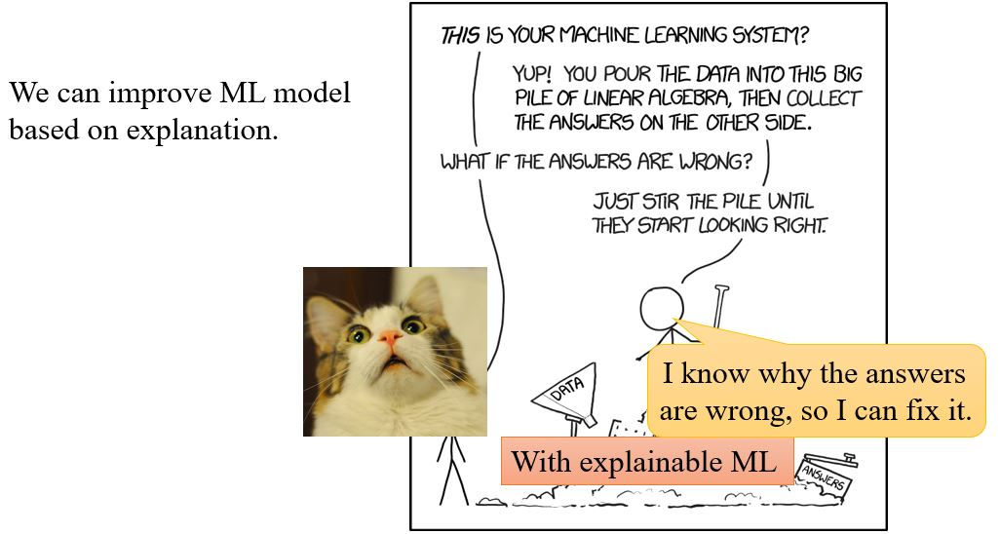
    <figcaption>https://www.explainxkcd.com/wiki/index.php/1838:_Machine_Learning</figcaption>
</figure>

### 9.1.2 Interpretable v.s. Powerful 

&emsp;&emsp;有些模型是本质上可解释的：  
&emsp;&emsp;&emsp;比如，线性模型（通过权重可以知道每个特征的重要程度）  
&emsp;&emsp;&emsp;但是不是很有效

&emsp;&emsp;深度网络很难解释，它其实是黑箱……但是比线性模型有效。

<figure></figure>

&emsp;&emsp;有没有既interpretable又powerful的模型呢？Decision tree是不是可以？决策树比线性模型有效得多，相较于深度学习又是可解释的。**Decision tree is all you need!?**

<figure>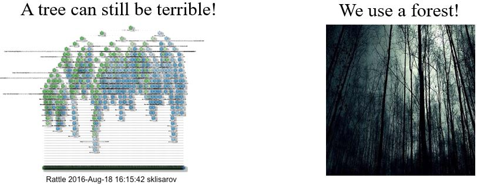</figure>

&emsp;&emsp;其实决策树也可以非常复杂。在Kaggle比赛里深度学习往往没有决策树的方法效果好，但实际上我们用的是random forest，而当我们有很多棵决策树的时候也很难知道它们是如何决策的。

### 9.1.3 Goal of Explainable ML

可解释性机器学习的目标其实很难讲清楚，我们要完全地了解ML模型是如何工作的吗？  
* 我们都不知道大脑是怎么工作的！但是我们相信人做出的决定！  

或许，我们只是需要一个理由来相信ML。

### 9.1.4 Categories

<figure>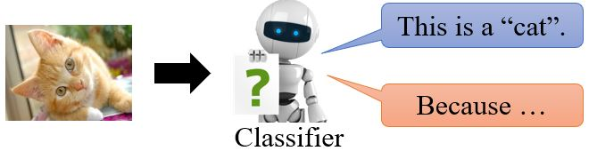</figure>

&emsp;&emsp;<b>Local Explanation</b>: **explain the decision** Why do you think this image is a cat?  
&emsp;&emsp;<b>Global Explanation</b>: **explain the whole model** What does a “cat” look like? (not referred to a specific image)

## 9.2 Local explanation

### 9.2.1 Which component is critical? 

<figure>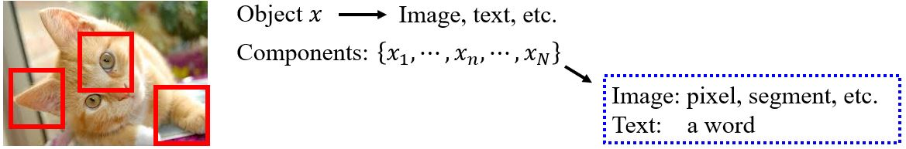</figure>

&emsp;&emsp;哪个部分对做决定至关重要呢？

<figure>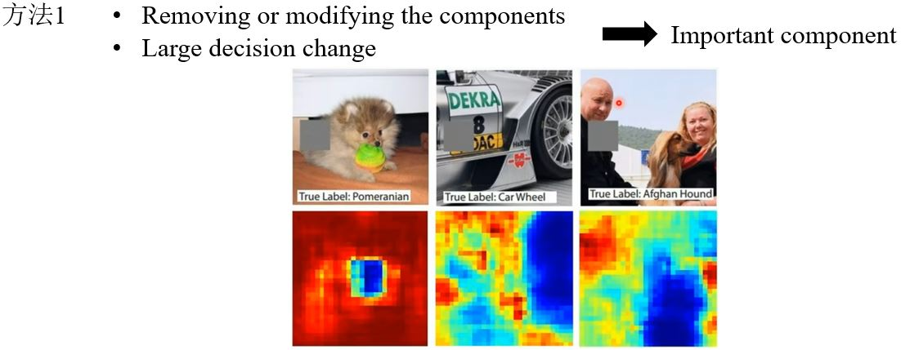</figure>
<figure>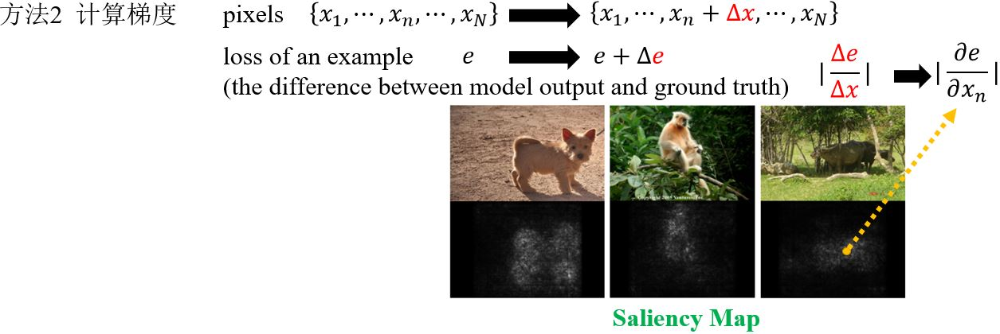</figure>

#### Case Study

<figure>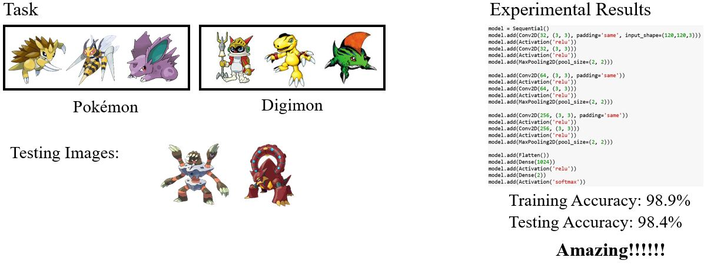</figure>

&emsp;&emsp;以Pokémon和Digimon分类器为例，这个任务对人类来说都很困难，那为什么实验结果的精度会这么高呢？我们画出它们的Saliency map看看。

<figure>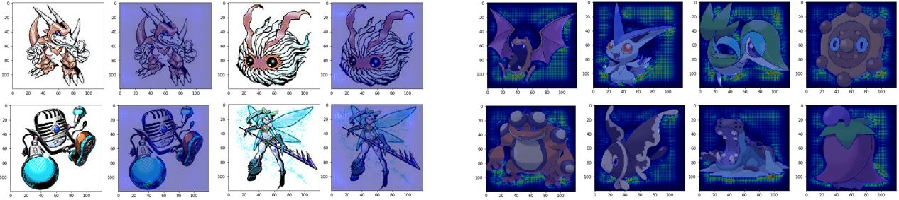</figure>

**What Happened?**  
&emsp;&emsp;机器关注的点怎么都在空白的地方呢？原来所有Pokémon都是PNG格式的，而Digimon都是JPEG格式的，而PNG格式的文件加载之后背景是黑色的。所以说，机器是靠背景颜色区分Pokémon和Digimon的。

### 9.2.2 Limitations

#### 1. Noisy Gradient

<figure>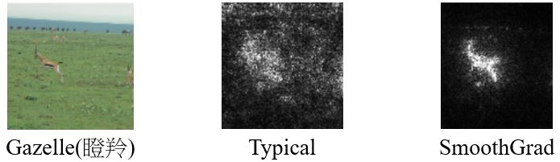</figure>

**SmoothGrad**：向输入图像随机添加噪声，得到噪声图像的显着性图，并对它们进行平均。

#### 2. Gradient Saturation

&emsp;&emsp;<b>梯度并不是总能反应重要程度</b>，比如上面这个鼻子长度和是大象的概率的关系。可以考虑用[Integrated gradient (IG)](https://arxiv.org/abs/1611.02639)的方法解决这个问题。

### 9.2.3 How a network processes the input data?

#### 1. Visualization

<figure>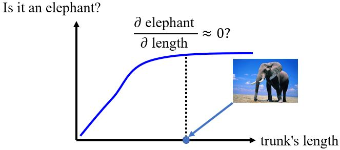</figure>
<figure>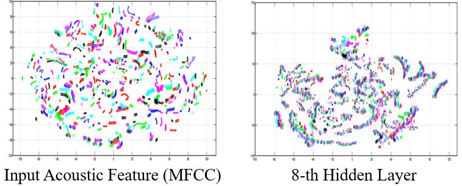</figure>

<figure></figure>

#### 2. Probing

<!-- 蓝 -->
<b></b>
<!-- 绿 --><!-- #33cc00 -->
<b></b>
<!-- 橙 -->
<b></b>