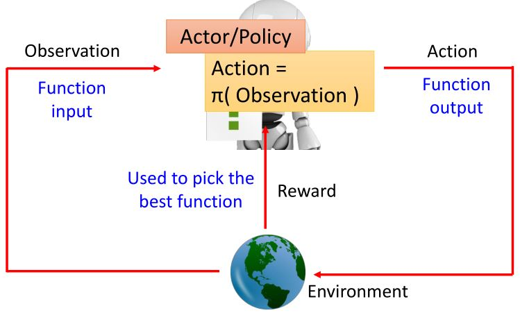
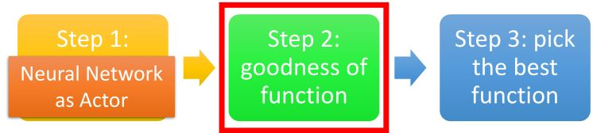
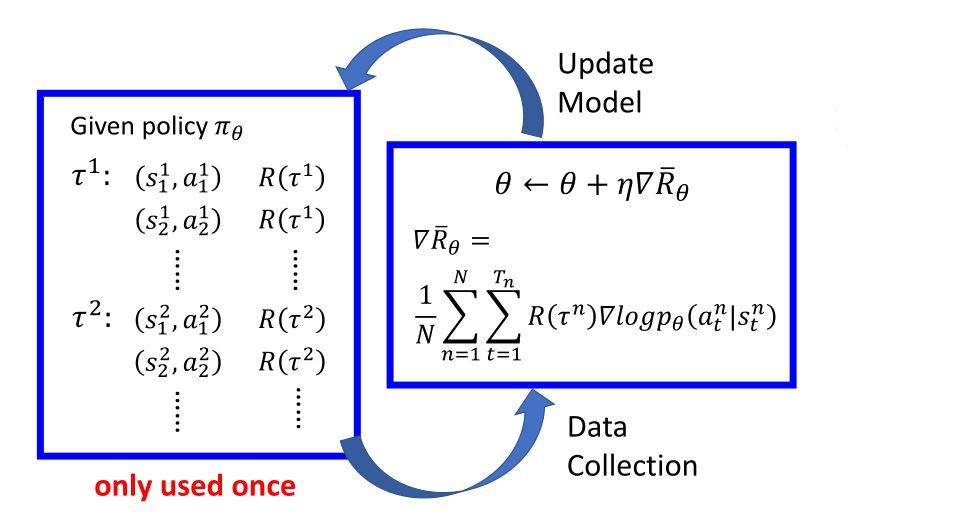
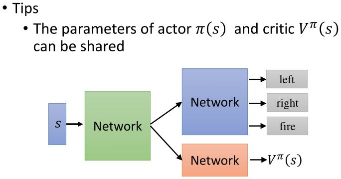

# Introduction of RL

<figure>
    
    <figcaption>强化学习的场景</figcaption>
</figure>

&emsp;&emsp;强化学习中state是agent观察到的环境的状态，所以可以是部分可观的。

<figure>
    
    <figcaption>机器学习 = 寻找一个函数</figcaption>
</figure>

&emsp;&emsp;强化学习中只有少数的状态可以得到reward，如何在这样的情况下发掘正确的action是一个难点。强化学习从经验中学习，需要大量的学习过程。

例：[space incader](https://gym.openai.com/envs/SpaceInvaders-v0/)

<figure>
    
</figure>

<b><font color="#3399ff">强化学习的性质（难点）</font></b>：
* 延迟奖励（需要有远见）
* agent的行为会影响后续接收到的数据（需要学会探索）

<figure>
    
    <figcaption>强化学习概览</figcaption>
</figure>

## 1.1 Policy-based Approach

&emsp;&emsp;<b><font color="#00B050">(learning an actor)</font></b>

<figure>
    
    <figcaption>深度学习的三个步骤</figcaption>
</figure>

### 1.1.1 Neural network as actor

<figure>
    
</figure>

* 神经网络输入：机器所观察到的内容，表示成一个向量或矩阵
* 神经网络输出：每个动作对应于输出层的一个神经元

<figure>
    
</figure>

问：用神经网络代替查找表的好处？  
<b><font color="#3399ff">Generalization</font></b>

### 1.1.2 Goodness of actor

<figure>
    
</figure>

&emsp;&emsp;给定一个网络参数为$$\theta$$的actor $$\pi_{\theta} (s)$$，用actor $$\pi_{\theta} (s)$$来玩游戏。我们的目标是最大化total reward：$$R_{\theta} = \sum_{t=1}^T r_t$$。哪怕是同一个actor，每次的$$R_{\theta}$$也是不同的。因为actor采用随机性策略，所以**actor本身和游戏都是存在随机性的**。

&emsp;&emsp;定义$$\color{green}{\bar{R_{\theta}}}$$为$$\color{green}{R_{\theta}}$$<b><font color="#00B050">的期望值</font></b>。$$\bar{R_{\theta}}$$可以评估actor $$\pi_{\theta} (s)$$的好坏。

&emsp;&emsp;一个episode可以被看作一个轨迹$$\tau$$，$$\tau = \{ s_1, a_1, r_1, s_2, a_2, r_2, \cdots, s_T, a_T, r_T \}$$，$$R_{\tau} = \sum_{n=1}^T r_n$$。如果用actor来玩游戏，每个$$\tau$$都有可能被采样到，其概率$$P(\tau \vert \theta)$$取绝于参数$$\theta$$。

$$      \bar{R_{\theta}} 
=       \sum_{\tau} R(\tau) P(\tau \vert \theta)
\approx \frac{1}{N} \sum_{n=1}^N R(\tau^n)
$$

&emsp;&emsp;要求$$R_{\theta}$$的期望，需要对所以可能的轨迹求和。可以按策略$$\pi_{\theta}$$来玩$$N$$次游戏，得到$$\tau^1, \tau^2, \cdots, \tau^N$$，即从$$P(\tau \vert \theta)$$中进行$$N$$次采样。

### 1.1.3 Pick the best function

<figure>
    
</figure>

#### Gradient ascent

<figure>
    
</figure>

#### Policy gradient

&emsp;&emsp;已知$$\bar{R_{\theta}} = \sum_{\tau} R(\tau) P(\tau \vert \theta)$$，其梯度为$$\nabla \bar{R_{\theta}} = \sum_{\tau} R(\tau) \nabla P(\tau \vert \theta) $$。因此$$R(\tau)$$无需是可微的，可以是一个黑箱（因为reward是由环境给出的）。

利用$$\frac{d \log(f(x))}{dx} = \frac{1}{f(x)} \frac{d f(x)}{dx}$$，可以进一步得到

$$\begin{aligned}
    \nabla \bar{R_{\theta}} 
=   \sum_{\tau} R(\tau) P(\tau \vert \theta) \frac{\nabla P(\tau \vert \theta)}{P(\tau \vert \theta)} 
=&  \sum_{\tau} R(\tau) P(\tau \vert \theta) \nabla \log P(\tau \vert \theta) \\
\approx& \frac{1}{N} \sum_{n=1}^N R(\tau^n) \nabla \log P(\tau^n \vert \theta) 
\end{aligned} $$

&emsp;&emsp;轨迹$$\tau=\{ s_{1}, a_{1}, r_{1}, s_{2}, a_{2}, r_{2}, \cdots, s_{T}, a_{T}, r_{T} \}$$，所以

$$
\begin{aligned}
    P(\tau \mid \theta)
&=  p\left(s_{1}\right) \prod_{t=1}^{T} p\left(a_{t} \mid s_{t}, \theta\right) p\left(r_{t}, s_{t+1} \mid s_{t}, a_{t}\right) \\
    \log P(\tau \mid \theta) 
&=  \log p\left(s_{1}\right) + \sum_{t=1}^{T} \log p\left(a_{t} \mid s_{t}, \theta\right)+\log p\left(r_{t}, s_{t+1} \mid s_{t}, a_{t}\right) 
\end{aligned}$$

$$\boxed{
    \nabla \log P(\tau \vert \theta) 
=   \sum_{t=1}^{T} \log p\left(a_{t} \mid s_{t}, \theta\right)
}$$

到这一步，我们已经略去了和$$\theta$$无关的项。

&emsp;&emsp;梯度上升，$$\theta^{new} \leftarrow \theta^{old} + \eta \nabla \bar{R}_{\theta^{old}}$$

$$\begin{aligned}
    \nabla \bar{R_{\theta}} 
\approx \frac{1}{N} \sum_{n=1}^N R(\tau^n) \nabla \log P(\tau^n \vert \theta) 
=&  \frac{1}{N} \sum_{n=1}^N R(\tau^n) 
    \sum_{t=1}^{T_n} \nabla \log p(a_{t}^n \mid s_{t}^n, \theta) \\
=&  \frac{1}{N} \sum_{n=1}^N \sum_{t=1}^{T_n}
    R(\tau^n) \nabla \log p(a_{t}^n \mid s_{t}^n, \theta)
\end{aligned} $$

<figure>
    
</figure>

```note
这里很重要的一点是，考虑整个轨迹的奖励之和而不是一次即时的奖励。因为强化学习的特性 reward delay。
```

<figure>
    
</figure>

#### Add a baseline

<figure>
    
</figure>

&emsp;&emsp;在采样过程中，可能会漏掉某个动作，尽管它的奖励很高，但它的的概率会降低。可能存在$$R(\tau^n)$$一直为正的情况，需要减去一个bias。

$$\begin{aligned}
    &\theta^{new} \leftarrow  \theta^{old} + \eta \nabla \bar{R}_{\theta^{old}} \\
    &\nabla \bar{R_{\theta}} 
\approx \frac{1}{N} \sum_{n=1}^N \sum_{t=1}^{T_n}
    \big(R(\tau^n) - b\big) \nabla \log p(a_{t}^n \mid s_{t}^n, \theta)
\end{aligned} $$

## 1.2 Value-based Approach

&emsp;&emsp;<b><font color="#00B050">(learning a critic)</font></b>

## 1.3 DRL: Actor-Critic

<figure>
    
</figure>

<figure>
    
</figure>

<figure>
    
</figure>

<!-- 蓝 -->
<b><font color="#3399ff"></font></b>
<!-- 绿 --><!-- #33cc00 -->
<b><font color="#00B050"></font></b>
<!-- 橙 -->
<b><font color="#FF4500"></font></b>