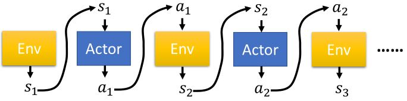
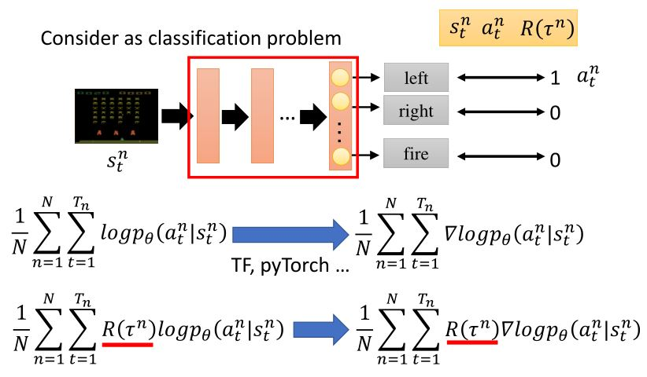
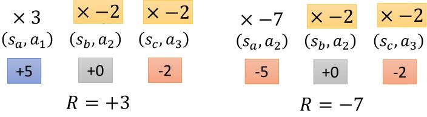

# Proximal Policy Optimization

&emsp;&emsp;PP是OpenAI默认的强化学习算法。

<figure>
    
</figure>

## 2.1 Review on PG

<figure>
    
    <figcaption>基本组成部分</figcaption>
</figure>

策略$$\pi$$是一个关于参数$$\theta$$的网络
* 输入：机器所观察到的内容，表示成一个向量或矩阵
* 输出：每个动作对应于输出层的一个神经元

<figure>
    
</figure>

<figure>
    
</figure>

<figure>
    
</figure>

<figure>
    
</figure>

&emsp;&emsp;轨迹为$$\tau = \{ s_1, a_1, s_2, a_2, \cdots, s_T, a_T \}$$，$$\begin{aligned}p_{\theta}(\tau) &=p\left(s_{1}\right) p_{\theta}\left(a_{1} \mid s_{1}\right) p\left(s_{2} \mid s_{1}, a_{1}\right) p_{\theta}\left(a_{2} \mid s_{2}\right) p\left(s_{3} \mid s_{2}, a_{2}\right) \cdots \\&=p\left(s_{1}\right) \prod_{t=1}^{T} p_{\theta}\left(a_{t} \mid s_{t}\right) p\left(s_{t+1} \mid s_{t}, a_{t}\right)\end{aligned}$$

<figure>
    
</figure>

$$\text{expected reward } \bar{R}_{\theta} = \sum_{\tau} R(\tau) p_{\theta}(\tau) = \mathbb{E}_{\tau \sim p_{\theta}(\tau)} [R(\tau)]$$

&emsp;&emsp;要使期望奖励最大，利用梯度上升法来更新参数。

$$\begin{aligned}
    \text{policy gradient } \nabla \bar{R_{\theta}} 
=&  \sum_{\tau} R_{\tau} \nabla p_{\theta}(\tau)
=   \sum_{\tau} R_{\tau} p_{\theta}(\tau) \nabla \log p_{\theta}(\tau) \\
=&  \mathbb{E}_{\tau \sim p_{\theta}(\tau)} [R_{\tau} \nabla \log p_{\theta}(\tau)] 
\approx \frac{1}{N} \sum_{n=1}^N R(\tau^n) \nabla \log p_{\theta}(\tau^n)
=  \frac{1}{N} \sum_{n=1}^N \sum_{t=1}^{T_n}
    R(\tau^n) \nabla \log p_{\theta}(a_{t}^n \mid s_{t}^n)
\end{aligned}$$

<figure>
    
</figure>

### 2.1.1 Implementation

<figure>
    
</figure>

&emsp;&emsp;如果从分类问题的角度看，将状态作为输入，每个行为看作是一个标签，那么输出就应该是每种类型对应的概率。可以看出，强化学习的过程相比于分类问题多了一个total reward。

### 2.1.2 Tips

#### 1. Add a baseline

&emsp;&emsp;可能存在$$R(\tau^n)$$一直为正的情况（e.g. 打乒乓球），所以需要减去一个$$b$$。

$$\begin{aligned}
    &\theta^{new} \leftarrow  \theta^{old} + \eta \nabla \bar{R}_{\theta^{old}} \\
    &\nabla \bar{R_{\theta}} 
\approx \frac{1}{N} \sum_{n=1}^N \sum_{t=1}^{T_n}
    \big(R(\tau^n) - b\big) \nabla \log p(a_{t}^n \mid s_{t}^n, \theta)
    \quad b \approx \mathbb{E}[R(\tau)]
\end{aligned} $$

<figure>
    
    <figcaption>蓝色柱状面积表示概率大小，绿色的箭头长度表示奖励大小</figcaption>
</figure>

#### 2. Assign suitable credit

<figure>
    
</figure>

&emsp;&emsp;在一个episode中，可能有好的action和不好的action，一个trajectory得到的total reward高并不能代表所有的action都很好。如果我们可以采样足够多次，那么就可以避免这个问题。但是，现在我们的采样次数有限，所以要给每个action一个credit，将total reward改为从某个行为被执行后累计的reward，并添加折扣因子。

<figure>
    
</figure>

## 2.2 On-policy → Off-policy

* On-policy：学习到的agent和与环境交互的agent是同一个
* Off-policy：学习到的agent和与环境交互的agent是不同的

$$ \nabla \bar{R_{\theta}} 
=  \mathbb{E}_{\tau \sim p_{\theta}(\tau)} [R_{\tau} \nabla \log p_{\theta}(\tau)] 
$$

* 用策略$$\pi_{\theta}$$收集数据，当$$\theta$$被更新时，必须要重新采样训练数据
* 目标：用从策略$$\pi_{\theta '}$$的采样来训练$$\theta$$。$$\theta '$$是固定的，所以其采样数据可以重用。

### 2.2.1 Importance Sampling

<!-- 蓝 -->
<b></b>
<!-- 绿 --><!-- #33cc00 -->
<b></b>
<!-- 橙 -->
<b></b>