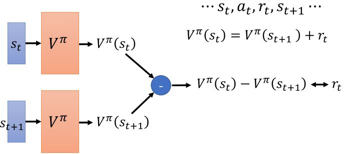
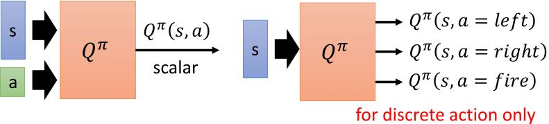
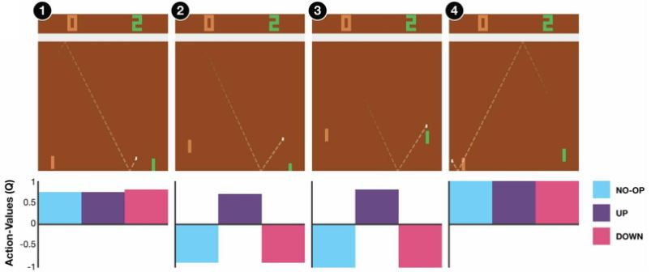
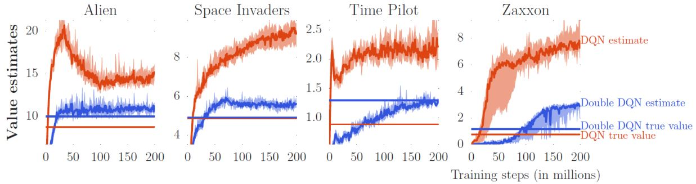
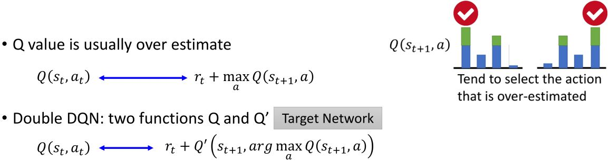
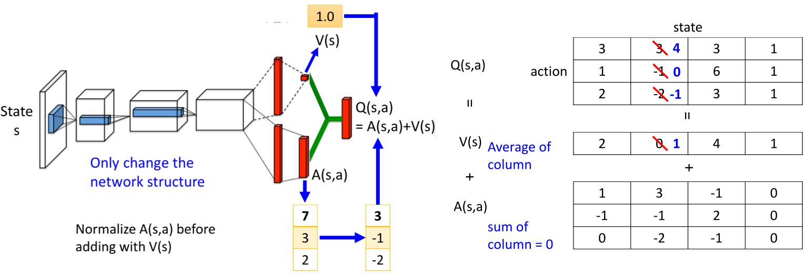
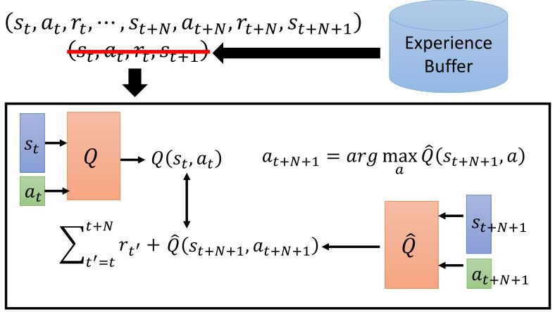
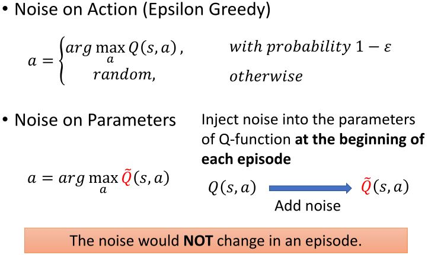
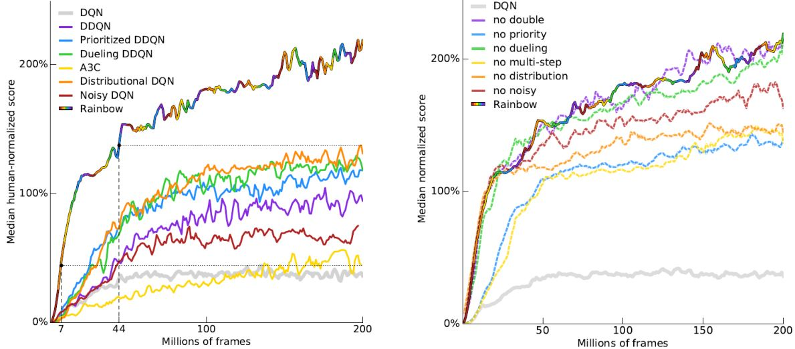

# Q-Learning

## 3.1 Introduction of Q-Learning

### 3.1.1 Critic

* 一个critic不能直接决定动作
* 给定一个actor $$\pi$$，它会评价这个actor的好坏
* State value function $$V^{\pi}(s)$$：
  根据actor $$\pi$$，在状态$$s$$时采取动作$$a$$后累计奖励的期望值

<figure>
    
</figure>

```warning
Critic的输出值取决于actor的好坏。
```
#### How to estimate ?

&emsp;1. Monte-Carlo based approach

&emsp;&emsp;Critic观察$$\pi$$如何玩游戏。看到某个状态后，一直到episode结束所累计的奖励。

<figure>
    
</figure>

&emsp;2. Temporal-difference approach

&emsp;&emsp;有的时候episode时间太长，把所有的学习都推迟到结束的时候太慢了。

<figure>
    
</figure>

&emsp;&emsp;MC v.s. TD

<figure>
    
</figure>

#### Another critic

* State-action value function $$Q^{\pi}(s,a)$$：
  根据actor $$\pi$$，访问了状态$$s$$后累计奖励的期望值

<figure>
    
</figure>

<figure>
    
    <figcaption>https://web.stanford.edu/class/psych209/Readings/MnihEtAlHassibis15N atureControlDeepRL.pdf</figcaption>
</figure>

### 3.1.2 Q-Learning

Another way to use critic.

<figure>
    
</figure>

给定$$Q^{\pi}(s,a)$$，找到一个新的比$$\pi$$“更好”的actor $$\pi'$$
* “更好”：对于所有的状态$$s$$，$$V^{\pi'}(s) \ge V^{\pi}(s)$$

$$\pi'(s) = \text{arg}\max_a Q^{\pi}(s,a)$$

&emsp;&emsp;$$\pi'$$没有其它参数，它由$$Q$$决定。  
&emsp;&emsp;对连续动作$$a$$不适用

&emsp;&emsp;为什么$$\pi'(s) = \text{arg}\max_a Q^{\pi}(s,a)$$一定有$$V^{\pi'}(s) \ge V^{\pi}(s)$$？

<figure>
    
</figure>

### 3.1.3 Target network

&emsp;&emsp;在实际训练中，更新目标如果不断变动会造成更新困难，所以需要用一个固定网络作为目标网络。实际操作过程中，一般会更新$$N$$次后更新一次目标网络。

<figure>
    
</figure>

### 3.1.4 Exploration

<figure>
    
</figure>

### 3.1.5 Replay buffer

<figure>
    
</figure>

1. 缩短和环境互动所花费的时间
2. 使收集到的经验更加多样化

### 3.1.6 Typical Q-learning algorithm

<figure>
    
</figure>

## 3.2 Tips of Q-Learning

### 3.2.1 Double DQN

<figure>
    
    <figcaption>与DQN相比，Double DQN的估计与真实值更接近，并且Double DQN的真实值比DQN大，说明Double DQN学到的策略比DQN好</figcaption>
</figure>

<figure>
    
</figure>

&emsp;&emsp;如果$$Q$$高估了$$a$$，那么$$a$$会被选中，$$Q'$$会给出它的正确的值。如果$$Q'$$高估了某个动作，那个动作是不会被$$Q$$选中的。

Hado V . Hasselt, “Double Q-learning”, NIPS 2010.   
Hado van Hasselt, Arthur Guez, David Silver, “Deep Reinforcement Learning with Double Q-learning”, AAAI 2016.

### 3.2.2 Dueling DQN

<figure>
    
</figure>

Ziyu Wang, Tom Schaul, Matteo Hessel, Hado van Hasselt, Marc Lanctot, Nando de Freitas, “Dueling Network Architectures for Deep Reinforcement Learning”, arXiv preprint, 2015.

### 3.2.3 Prioritized replay

<figure>
    
</figure>

### 3.2.4 Multi-step

<figure>
    
</figure>

### 3.2.5 Noisy net

<figure>
    
</figure>

<figure>
    
</figure>

### 3.2.6 Distributional Q-function

<figure>
    
</figure>

### 3.2.7 Rainbow

<figure>
    
</figure>

## 3.3 Q-Learning for Continuous Actions

<figure>
    
</figure>
