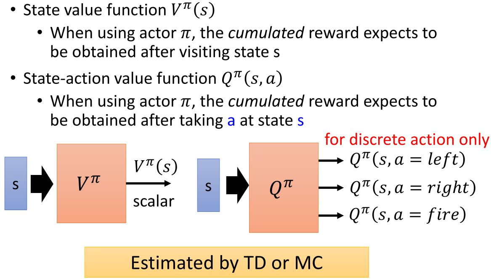
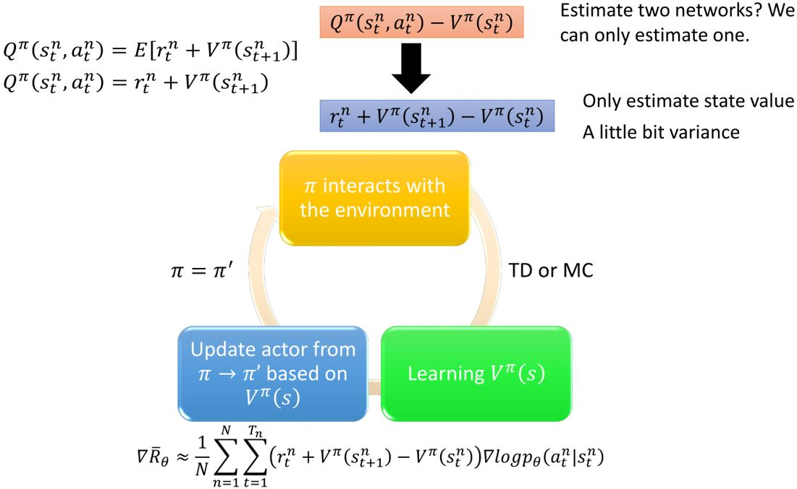
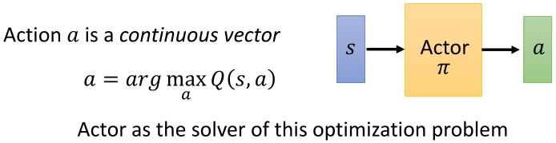
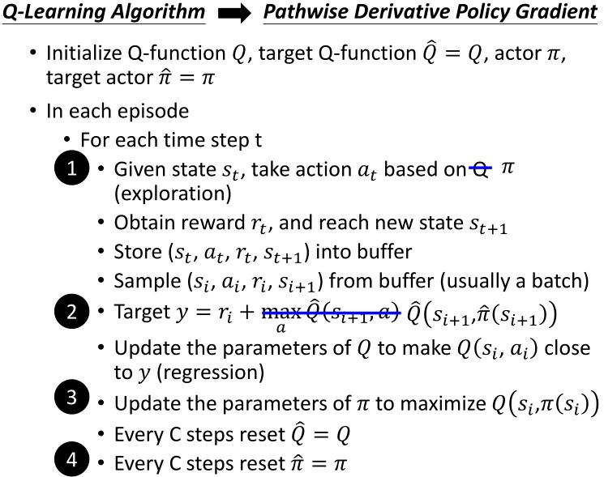

# Actor-Critic

Review-Policy Gradient

<figure>
    
</figure>

Review-Q-Learning

<figure>
    
</figure>

**Actor-Critic**

<figure>
    
</figure>

## 4.1 Advantage Actor-Critic

<figure>
    
</figure>

<figure>
    
</figure>

Tips:
* actor $$\pi(s)$$和critic $$V^{\pi}(s)$$的参数可以共享
* 用输出熵作为$$\pi(s)$$的正则化  
  倾向于更大的熵 $$\rightarrow$$ exploration

## 4.2 Asynchronous Advantage Actor-Critic (A3C)

&emsp;&emsp;在A2C的基础上，利用多个worker来收集经验。

<figure>
    
</figure>

## 4.3 Pathwise Derivative Policy Gradient

David Silver, Guy Lever, Nicolas Heess, Thomas Degris, Daan Wierstra, Martin Riedmiller, “Deterministic Policy Gradient Algorithms”, ICML, 2014.   
Timothy P . Lillicrap, Jonathan J. Hunt, Alexander Pritzel, Nicolas Heess,
Tom Erez, Yuval Tassa, David Silver, Daan Wierstra, “CONTINUOUS CONTROL WITH DEEP REINFORCEMENT LEARNING”, ICLR, 2016.

### 4.3.1 Another way to use critic

<figure>
    
</figure>

<figure>
    
</figure>

### 4.3.2 PDPG

<figure>
    
</figure>

<figure>
    
</figure>

<figure>
    
</figure>

### 4.3.3 Connection with GAN

<figure>
    
    <figcaption>David Pfau, Oriol Vinyals, “Connecting Generative Adversarial  Networks and Actor-Critic Methods”, arXiv preprint, 2016</figcaption>
</figure>

<!-- 蓝 -->
<b></b>
<!-- 绿 --><!-- #33cc00 -->
<b></b>
<!-- 橙 -->
<b></b>