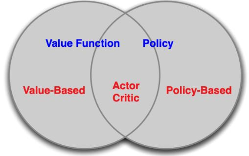
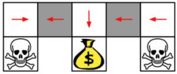
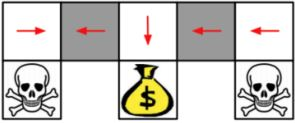
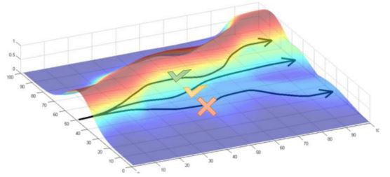
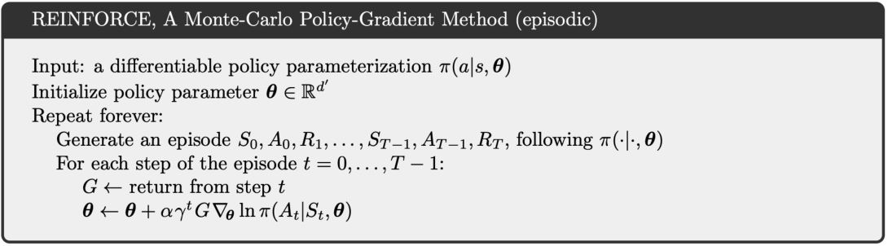
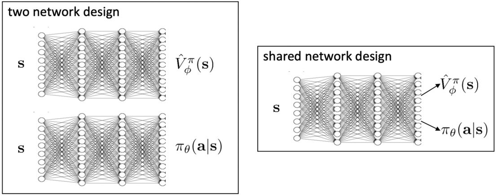
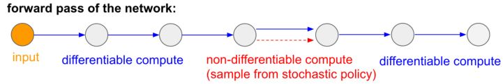
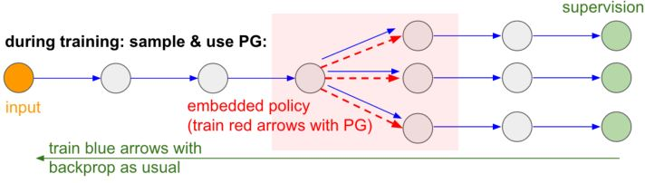

# Policy Optimization Ⅰ

## 5.1 Policy-based RL

&emsp;&emsp;确定性策略是直接从价值函数用贪心策略$$a_t = \text{arg} \max_a Q(a, s_t)$$得到的。与之相反，可以使用<b><font color="#00B050">将策略函数参数化表示为</font></b>$$\color{green}{\pi_{\theta} (a \vert s)}$$，其中$$\color{green}{\theta}$$<b><font color="#00B050">是可学习的策略参数</font></b>，输出是动作集上的概率。对于策略优化，只需要知道策略中的动作，然后直接优化策略。

<figure></figure>

**Value-based RL vs. Policy-based RL**:  
1. value-based RL：学习价值函数  基于价值函数的隐性策略
2. policy-based RL：没有价值函数  直接学习策略
3. actor-critic：学习策略函数和价值函数

<figure></figure>

<b><font color="#3399ff">基于策略的强化学习优势：</font></b>
1. 更好的收敛性：能保证收敛到某个局部最优（最差的情况）或全局最优（最好的情况）
2. 策略梯度对于高维动作空间更高效
3. 策略梯度可以学习随机策略，而价值函数不可以

<b><font color="#3399ff">劣势：</font></b>
1. 一般都会收敛到局部最优
2. 评估策略的方差很大

**两种策略**：
1. **确定性**：给定一个状态，策略会返回一个确定的动作来采取。
2. **随机性**：给定一个状态，策略会返回动作的概率分布（e.g. 40%的概率向左转，60%的概率向右转）或连续动作的某个高斯分布。

例：石头剪刀布  
&emsp;&emsp;该游戏有两个玩家，什么样的策略是最好的呢？如果策略是固定的，那么很容易被打败。所以，均匀随机策略是最优的（Nash均衡）。

例：aliased gridworld  
<figure></figure>

&emsp;&emsp;在这个游戏中，agent无法分辨这两个灰色的格子。考虑以下特性（对于所有的上下左右），$$\psi (s, a) = [1(\text{上面是墙}, a = \text{向右移}), 1(\text{下面是墙}, a = \text{向左移}), \ldots]$$。  
&emsp;&emsp;如果是基于价值的RL，价值函数近似为$$Q_{\theta} (s, a) = f(\psi(s, a), \theta)$$  
&emsp;&emsp;如果是基于策略的RL，策略函数近似为$$\phi_{\theta} (s, a) = g(\psi(s, a), \theta)$$  

<figure></figure>

&emsp;&emsp;基于价值的RL会学到一个确定策略，e.g. 贪心。因为无法区分两个灰色格子，所以得到的最优确定性策略要么就是都往左（如图所示），要么就是都往右。不管是哪个，都有50%的概率会卡住。

<figure></figure>

&emsp;&emsp;基于策略的RL会学到一个随机策略。一个最优的随机性策略会在遇到这两个灰色格子的状态下，随机选择向左或向右，以一半一半的概率。这样对于任何一个起始点，agent都很有可能在几步之内到达目标状态。

### 5.1.1 Objective of optimizing policy

**目标**：给定义一个关于参数$$\theta$$的策略近似器$$\pi_{\theta}(s,a)$$，找到最好的$$\theta$$

问：如何衡量策略$$\pi_{\theta}$$的质量？

&emsp;&emsp;在episodic环境中，可以用第一个值

$$  J_{1}(\theta)
=   V^{\pi_{\theta}}\left(s_{1}\right)
=   \mathbb{E}_{\pi_{\theta}}\left[v_{1}\right]
$$

&emsp;&emsp;在连续环境中，可以用平均价值

$$  J_{a v V}(\theta)
=   \sum_{s} d^{\pi_{\theta}}(s) V^{\pi_{\theta}}(s)
$$

或每个时间步长的平均奖励

$$  J_{a v R}(\theta)
=   \sum_{s} d^{\pi_{\theta}}(s) \sum_{a} \pi_{\theta}(s, a) R(s, a)
$$

其中，$$d^{\pi_{\theta}}$$是$$\pi_{\theta}$$下Markov链的静态分布。

&emsp;&emsp;<b><font color="#00B050">策略的价值的定义：</font></b>

$$\color{green}{\begin{aligned}
    J(\theta) 
&=  \mathbb{E}_{\tau \sim \pi_{\theta}}\left[\sum_{t} R\left(s_{t}^{\tau}, a_{t}^{\tau}\right)\right] \\
& \approx   \frac{1}{m} \sum_{m} \sum_{t} R\left(s_{t}^{m}, a_{t}^{m}\right)
\end{aligned}}$$

这和先前在基于价值的强化学习中定义的价值函数是一样的。

<figure></figure>

* 这里$$\tau$$是按策略函数$$\pi_{\theta}$$采样的轨迹
* 这里先忽略折扣因子

<b><font color="#00B050">基于策略的强化学习的目标：</font></b>

$$\color{green}{
    \theta^*
=   \text{arg} \max_{\theta} 
    \mathbb{E}_{\tau \sim \pi_{\theta}}
    \left[\sum_{t} R\left(s_{t}^{\tau}, a_{t}^{\tau}\right)\right]
}$$

### 5.1.2 Policy optimization

&emsp;&emsp;基于策略的强化学习是一个<font color="#3399ff">优化问题</font>，找到能最大化$$J(\theta)$$的$$\theta$$。  

&emsp;&emsp;如果$$J(\theta)$$是可微的，那么可以使用基于梯度的方法：1. 梯度上升  2. 共轭梯度  3. 准牛顿法
   
&emsp;&emsp;如果$$J(\theta)$$是不可微的，或者导数计算比较麻烦，那么可以使用一些无需导数的黑箱优化方法：1. 交叉熵法（CEM）  2. 爬山算法  3. 进化算法

#### Using derivative

&emsp;&emsp;函数$$J(\theta)$$为策略目标函数。目标：通过沿策略的梯度上升，找到能够使$$J(\theta)$$最大的参数$$\theta^*$$。沿梯度方向调整$$\theta$$，其中$$\alpha$$为步长。

$$ \Delta \theta = \alpha \nabla_{\theta} J(\theta) $$

&emsp;&emsp;定义$$J(\theta)$$的梯度为$$\nabla_{\theta} J(\theta) = \left( \frac{\partial J(\theta)}{\partial \theta_1}, \frac{\partial J(\theta)}{\partial \theta_2}, \cdots, \frac{\partial J(\theta)}{\partial \theta_n}, \right)^T$$。

#### Using derivative-free methods

&emsp;1. Cross-entropy method (CEM)

* 最优参数$$\theta^* = \text{arg} \max J(\theta)$$
* 把$$J(\theta)$$当作一个黑箱得分函数（不可微）

<figure></figure>

例：[一个简单的强化学习问题的CEM例子](https://github.com/cuhkrlcourse/RLexample/blob/master/my_learning_agent.py)

```note
在有些环境中，基于CEM的方法非常高效，可能比可以优化的强化学习办法效果好。
```

&emsp;2. Approximate Gradients by Finite Difference

&emsp;&emsp;要评估$$\pi_{\theta}(s, a)$$的策略梯度，对于每个维度$$k \in [1, n]$$，通过在$$\theta$$的第$$k$$维附近制造一个小的扰动量$$\epsilon$$来估计目标函数的第$$k$$个偏微分。

$$      \frac{\partial J(\theta)}{\partial \theta_k}
\approx \frac{J(\theta + \epsilon u_k) - J(\theta)}{\epsilon}
$$

其中，$$u_k$$是第$$k$$个元素为1，其余元素为0的单位向量。

&emsp;&emsp;尽管这个方法有噪声且效率低，但是它对任意策略都有效，即使策略是不可微的。

### 5.1.3 Computing the PG analytically

&emsp;&emsp;假设策略$$\pi_{\theta}$$在非零时是可微的，可以计算出它的梯度为$$\nabla_{\theta} \pi_{\theta} (s, a)$$。利用似然比的技巧

$$  \nabla_{\theta} \pi_{\theta} (s, a)
=   \pi_{\theta} (s, a) \frac{\nabla_{\theta} \pi_{\theta} (s, a)}{\pi_{\theta} (s, a)}
=   \pi_{\theta} (s, a) \nabla_{\theta} \log \pi_{\theta} (s, a)
$$

&emsp;&emsp;得分函数（score function）为$$\nabla_{\theta} \log \pi_{\theta} (s, a)$$。

**Policy example: softmax policy**

* 简单策略模型：用特征的线性组合$$\phi (s,a)^T \theta$$来衡量动作
* 动作的概率与期望权重成正比 $$\pi_{\theta} (s, a) = \frac{\exp^{\phi (s,a)^T \theta}}{\sum_{a'} \exp^{\phi (s,a')^T \theta}}$$
* 得分函数为$$\nabla_{\theta} \log \pi_{\theta} (s, a) = \phi (s, a) - \mathbb{E}_{\pi_{\theta}} [\phi (s, .)]$$

**Policy example: Gaussian policy**

&emsp;&emsp;在连续动作空间中，可以定义一个高斯策略
* 均值是状态特征的线性组合 $$\mu(s) = \phi(s)^T \theta$$
* 方差可以固定为$$\sigma^2$$或者是参数化的
* 策略是高斯分布的、连续的 $$a \sim \mathcal{N}(\mu(s), \sigma^2)$$
* 得分函数为$$\nabla_{\theta} \log \pi_{\theta} (s, a) = \frac{(a - \mu(s)) \phi(s)}{\sigma^2}$$

## 5.2 Monte-Carlo Policy Gradient

### 5.2.1 PG for one-step MDPs

&emsp;&emsp;考虑一类简单的one-step MAPs，从状态$$s \sim d(s)$$开始，在一步之后结束，奖励为$$r = R(s, a)$$。用似然比来计算策略梯度

$$  J(\theta) 
= \mathbb{E}_{\pi_{\theta}} [r] 
= \sum_{s \in \mathcal{S}} d(s) \sum_{a \in \mathcal{A}} \pi_{\theta}(s, a) r
$$

梯度为

$$\begin{aligned}
    \nabla_{\theta} J(\theta)
=&  \sum_{s \in \mathcal{S}} d(s) \sum_{a \in \mathcal{A}} \pi_{\theta}(s, a)
    \nabla_{\theta} \log \pi_{\theta}(s, a) r \\
=&  \mathbb{E}_{\pi_{\theta}} [r \nabla_{\theta} \log \pi_{\theta}(s, a)]
\end{aligned}$$

### 5.2.2 PG for multi-steps MDPs

&emsp;&emsp;从一个episode得到的状态-动作轨迹可以表示为$$\tau=\left(s_{0}, a_{0}, r_{1}, \ldots s_{T-1}, a_{T-1}, r_{T}, s_{T}\right) \sim\left(\pi_{\theta}, P\left(s_{t+1} \mid s_{t}, a_{t}\right)\right)$$，沿着轨迹$$\tau$$得到的奖励总和为$$R(\tau) = \sum_{t=0}^{T-1} R(s_t, a_t)$$。

&emsp;&emsp;策略目标为

$$  J(\theta)
=   \mathbb{E}_{\pi_{\theta}}\left[\sum_{t=0}^{T-1} R\left(s_{t}, a_{t}\right)\right]
=   \sum_{\tau} P(\tau ; \theta) R(\tau)
$$

其中$$P(\tau ; \theta)=\mu\left(s_{0}\right) \prod_{t=0}^{T-1} \pi_{\theta}\left(a_{t} \mid s_{t}\right) p\left(s_{t+1} \mid s_{t}, a_{t}\right)$$表示当执行策略$$\pi_{\theta}$$时沿轨迹$$\tau$$的概率。

&emsp;&emsp;我们的目标就是找到策略参数$$\theta$$

$$  \theta^{*}
=   \underset{\theta}{\arg \max} J(\theta)
=   \underset{\theta}{\arg \max} \sum_{\tau} P(\tau ; \theta) R(\tau)
$$

对$$\theta$$求梯度

$$\begin{aligned}
    \nabla_{\theta} J(\theta) 
&=  \nabla_{\theta} \sum_{\tau} P(\tau ; \theta) R(\tau) \\
&=  \sum_{\tau} \nabla_{\theta} P(\tau ; \theta) R(\tau) \\
&=  \sum_{\tau} \frac{P(\tau ; \theta)}{P(\tau ; \theta)} 
    \nabla_{\theta} P(\tau ; \theta) R(\tau) \\
&=  \sum_{\tau} P(\tau ; \theta) R(\tau) 
    \frac{\nabla_{\theta} P(\tau ; \theta)}{P(\tau ; \theta)} \\
&=  \sum_{\tau} P(\tau ; \theta) R(\tau) \nabla_{\theta} \log P(\tau ; \theta)
\end{aligned}$$

用在策略$$\pi_{\theta}$$下的$$m$$条采样路径的经验估计来近似

$$      \nabla_{\theta} J(\theta) 
\approx \frac{1}{m} \sum_{i=1}^{m} R\left(\tau_{i}\right) 
        \nabla_{\theta} \log P\left(\tau_{i} ; \theta\right)
$$

**将轨迹分解为状态和动作**

&emsp;&emsp;将$$\nabla_{\theta} \log P\left(\tau_{i} ; \theta\right)$$分解

$$\begin{aligned}
    \nabla_{\theta} \log P(\tau ; \theta) 
&=  \nabla_{\theta} \log \left[\mu\left(s_{0}\right) \prod_{t=0}^{T-1} \pi_{\theta}\left(a_{t} \mid s_{t}\right) p\left(s_{t+1} \mid s_{t}, a_{t}\right)\right] \\
&=  \nabla_{\theta}\left[\log \mu\left(s_{0}\right)+\sum_{t=0}^{T-1} \log \pi_{\theta}\left(a_{t} \mid s_{t}\right)+\log p\left(s_{t+1} \mid s_{t}, a_{t}\right)\right] \\
&=  \sum_{t=0}^{T-1} \nabla_{\theta} \log \pi_{\theta}\left(a_{t} \mid s_{t}\right)
\end{aligned}$$

```note
利用likelihood ratio trick，在求偏微分时，通过log把连乘转换成连加，并且只留下了score function的那一项。
```

### 5.2.3 Likelihood ratio PG
&emsp;&emsp;我们的目标就是找到策略参数$$\theta$$，

$$  \theta^{*} = \underset{\theta}{\arg \max} J(\theta) = \underset{\theta}{\arg \max} \sum_{\tau} P(\tau ; \theta) R(\tau)$$

用在策略$$\pi_{\theta}$$下的$$m$$条采样路径的经验估计来近似$$\nabla_{\theta} J(\theta) \approx \frac{1}{m} \sum_{i=1}^{m} R\left(\tau_{i}\right) \nabla_{\theta} \log P\left(\tau_{i} ; \theta\right)$$。

然后我们有

$$\nabla_{\theta} \log P\left(\tau_{i} ; \theta\right)=\sum_{t=0}^{T-1} \nabla_{\theta} \log \pi_{\theta}\left(a_{t} \mid s_{t}\right)$$

$$      \nabla_{\theta} J(\theta) 
\approx \frac{1}{m} \sum_{i=1}^{m} R\left(\tau_{i}\right) 
        \sum_{t=0}^{T-1} \nabla_{\theta} \log \pi_{\theta}\left(a_{t}^{i} \mid s_{t}^{i}\right)
$$

&emsp;&emsp;无需知道动态模型！！！

## 5.3 Reduce the Variance of PG

### 5.3.1 Understanding score function gradient estimator

&emsp;&emsp;$$\mathbb{E}_{\tau \sim \pi_{\theta}} [R(\tau)]$$的一般形式为计算函数$$f(x)$$期望的梯度，即

$$\begin{aligned}
    \nabla_{\theta} \mathbb{E}_{p(x;\theta)}[f(x)]
&=   \mathbb{E}_{p(x;\theta)} [f(x) \nabla_{\theta} \log{p(x;\theta)}]  \\
&\approx    \frac{1}{S} \sum_{s=1}^S f(x_s) \nabla_{\theta} \log{p(x_s;\theta)} 
\ , \text{where } x_s \sim p(x;\theta)
\end{aligned}  
$$

这个梯度可以理解为：  
&emsp;&emsp;调整参数$$\theta$$使得分布$$p$$未来的采样$$x$$在$$f(x)$$的评价中更高的得分。  
&emsp;&emsp;按与方向$$f(x_s) \nabla_{\theta} \log{p(x_s;\theta)}$$有多好成比例地提高样本的对数似然度。

<figure></figure>

**与极大似然相比：**  

两者的梯度  
&emsp;&emsp;Policy gradient estimator：$$\nabla_{\theta} J(\theta) \approx \frac{1}{M} \sum_{m=1}^M \left( \sum_{t=1}^T \nabla_{\theta} \log \pi_{\theta}(a_{t,m} \vert s_{t,m}) \right) \left( \sum_{t=1}^T r(a_{t,m} \vert s_{t,m}) \right)$$  
&emsp;&emsp;Maximum likelihood estimator：$$\nabla_{\theta} J_{ML}(\theta) \approx \frac{1}{M} \sum_{m=1}^M \left( \sum_{t=1}^T \nabla_{\theta} \log \pi_{\theta}(a_{t,m} \vert s_{t,m}) \right)$$

也就是说，<b><font color="#3399ff">好的动作变得更有可能，坏的动作变得更不可能</font></b>。

<figure></figure>

$$  \nabla_{\theta} J(\theta) 
\approx \frac{1}{m} \sum_{i=1}^m R(\tau_i) \nabla_{\theta} \log P(\tau_i ; \theta)
$$ 

<figure>
    
    <figcaption>如果上山可以得到更多reward，那么就调整策略参数来增加轨迹向高处移动的可能性</figcaption>
</figure>

**Large Variance of Policy Gradient**

&emsp;&emsp;我们有如下的近似更新：

$$  \nabla_{\theta} J(\theta) 
\approx \frac{1}{m} \sum_{i=1}^m R(\tau_i) \sum_{t=0}^{T-1} \nabla_{\theta} \log \pi_{\theta}(a_t^i \vert s_t^i)
$$ 

这个估计是<b><font color="#3399ff">无偏的但是非常noisy</font></b>（因为对策略梯度的求解是通过MC方法采样来近似的）。两种解决方案：
1. Use temporal causality
2. Include a baseline

### 5.3.2 Using causality

&emsp;&emsp;之前的策略梯度为$$\nabla_{\theta} \mathbb{E}_{\tau}[R] = \mathbb{E}_{\tau} \left[ \left( \sum_{t=0}^{T-1} r_t \right) \left( \sum_{t=0}^{T-1} \nabla_{\theta} \log \pi_{\theta}(a_t \vert s_t) \right) \right]$$，可以理解为根据$$r_t$$对log likelihood做加权，然而前面的log likelihood并不会对后面的reward造成影响，因为实际上$$t=t'$$时刻的reward只受到在$$t=0$$到$$t=t'$$之间的likelihood的影响。

&emsp;&emsp;我们可以推导出单个奖励项的梯度估计为

$$  \nabla_{\theta} \mathbb{E}_{\tau} [r_t']
=   \mathbb{E}_{\tau} [r_t' \sum_{t=0}^{t'} \nabla_{\theta} \log \pi_{\theta}(a_{t} \mid s_{t})]
$$

把这个式子按$$t$$求和，得到

$$\begin{aligned}
    \nabla_{\theta} J(\theta) = \nabla_{\theta} \mathbb{E}_{\tau \sim \pi_{\theta}}[R] 
&=  \mathbb{E}_{\tau}\left[\sum_{t^{\prime}=0}^{T-1} r_{t^{\prime}} \sum_{t=0}^{t^{\prime}} \nabla_{\theta} \log \pi_{\theta}\left(a_{t} \mid s_{t}\right)\right] \\
&=  \mathbb{E}_{\tau}\left[\sum_{t=0}^{T-1} \nabla_{\theta} \log \pi_{\theta}\left(a_{t} \mid s_{t}\right) \sum_{t^{\prime}=t}^{T-1} r_{t^{\prime}}\right] \\
&=  \mathbb{E}_{\tau}\left[\sum_{t=0}^{T-1} G_{t} \cdot \nabla_{\theta} \log \pi_{\theta}\left(a_{t} \mid s_{t}\right)\right]
\end{aligned}$$

$$  \nabla_{\theta} \mathbb{E}_{\tau \sim \pi_{\theta}}[R] 
=   \mathbb{E}_{\tau}\left[\sum_{t=0}^{T-1} G_{t} \cdot \nabla_{\theta} \log \pi_{\theta}\left(a_{t} \mid s_{t}\right)\right]
$$

* 其中$$G_t = \sum_{t'=t}^{T-1} r_{t'}$$是轨迹在step $$t$$时的return
* <b><font color="#00B050">Cauality</font></b>：当$$t \le t'$$时，$$t'$$时刻的策略无法影响$$t$$时刻的reward

&emsp;&emsp;最终，我们有如下的估计更新

$$\color{green}{
        \nabla_{\theta} \mathbb{E}[R] 
\approx \frac{1}{m} \sum_{i=1}^{m} \sum_{t=0}^{T-1} G_{t}^{(i)} \cdot \nabla_{\theta} \log \pi_{\theta}\left(a_{t}^{i} \mid s_{t}^{i}\right)
}$$

#### REINFORCE: A MC PG algorithm

&emsp;&emsp;该算法简单地按照策略$$\pi_{\theta}$$对多个轨迹进行采样，同时使用估计的梯度更新$$\theta$$。

<figure></figure>

经典论文：Williams (1992). [Simple statistical gradient-following algorithms for connectionist reinforcement learning](https://link.springer.com/content/pdf/10.1007/BF00992696.pdf): introduces REINFORCE algorithm.

### 5.3.3 Using baseline

&emsp;&emsp;原来的更新中$$G_t = \sum_{t'=t}^{T-1} r_{t'}$$是可能方差很大的轨迹的return，所以我们可以给策略梯度减去一个baseline $$b(s)$$来抑制方差

$$  \nabla_{\theta} \mathbb{E}_{\tau \sim \pi_{\theta}}[R] 
=   \mathbb{E}_{\tau} \left[\sum_{t=0}^{T-1} \color{green}{(G_{t}-b(s_t))} \color{black}{\cdot} \nabla_{\theta} \log \pi_{\theta}(a_{t} \mid s_{t})\right]
$$

也就是说：以与return $$G_t$$比expected return好多少成比例的方式增加动作$$a_t$$的logprob。

&emsp;&emsp;我们可以证明baseline $$b(s)$$是可以减少方差而不改变期望的，即$$\mathbb{E}_{\tau} \big[ \nabla_{\theta} \log \pi_{\theta}(a_{t} \vert s_{t}) b(s_t) \big] = 0$$，$$\mathbb{E}_{\tau} \big[\nabla_{\theta} \log \pi_{\theta}\left(a_{t} \vert s_{t}\right)\left(G_{t}-b\left(s_{t}\right)\right) \big] = \mathbb{E}_{\tau} \big[\nabla_{\theta} \log \pi_{\theta}\left(a_{t} \vert s_{t}\right) G_{t} \big]$$，$$\operatorname{Var}_{\tau} \big[\nabla_{\theta} \log \pi_{\theta}\left(a_{t} \vert s_{t}\right)\left(G_{t}-b\left(s_{t}\right)\right) \big] <\operatorname{Var}_{\tau} \big[\nabla_{\theta} \log \pi_{\theta}\left(a_{t}  s_{t}\right) G_{t} \big]$$。因此，<b><font color="#3399ff">减去一个baseline在期望上是无偏的，但会减少方差</font></b>。

&emsp;&emsp;一个好用的baseline是expected return：$$b(s_t) = \mathbb{E} [r_t + t_{t+1} + \ldots + r_{T-1}]$$。或者，我们也可以使用参数化的$$b_{\mathbf{w}}(s_t)$$

$$  \nabla_{\theta} J(\theta) 
=   \mathbb{E}_{\tau} \left[\sum_{t=0}^{T-1} \color{green}{(G_{t}-b_{\mathbf{w}}(s_t))} \color{black}{\cdot} \nabla_{\theta} \log \pi_{\theta}(a_{t} \mid s_{t})\right] 
$$

* Baseline $$b(s)$$可以减小方差，且不会改变期望
* Baseline $$b_{\mathbf{w}}(s_t)$$的参数$$\mathbf{w}$$也需要学习，所以我们有两组参数$$\mathbf{w}$$和$$\theta$$

#### Vanilla PG algorithm with baseline

<figure></figure>

经典论文：Sutton, McAllester, Singh, Mansour (1999). [Policy gradient methods for reinforcement learning with function approximation.](https://proceedings.neurips.cc/paper/1999/file/464d828b85b0bed98e80ade0a5c43b0f-Paper.pdf)

## 5.4 Actor-Critic

### 5.4.1 Using a Critic

&emsp;&emsp;更新为$$\nabla_{\theta} J(\theta) = \mathbb{E}_{\pi_{\theta}}\left[\sum_{t=0}^{T-1} G_{t} \cdot \nabla_{\theta} \log \pi_{\theta}\left(a_{t} \mid s_{t}\right)\right]$$。在实际用的时候，$$G_t$$是MC策略梯度的一个采样，它是对$$Q^{\pi_{\theta}}(s_t,a_t)$$的无偏但有噪声的估计。所以，我们可以用一个<b><font color="#00B050">cirtic</font></b>来代替它对action-value函数做估计，即

$$\color{green}{Q_{\mathbf{w}}(s,a) \approx Q^{\pi_{\theta}}(s,a)}$$

这样，更新就会变成

$$  \nabla_{\theta} J(\theta) 
=   \mathbb{E}_{\pi_{\theta}}\left[
        \sum_{t=0}^{T-1} \color{green}{Q_{\mathbf{w}}(s,a)} \color{black}{\cdot} 
        \nabla_{\theta} \log \pi_{\color{green}{\theta}} \color{black}{\left(a_{t} \mid s_{t}\right)}
    \right]
$$

这样就得到了actor-critic policy gradient。
* Actor：用于生成动作的策略函数
* Critic：用于评估动作的奖励的价值函数

AC算法需要维护两组参数
* Actor：按critic建议的方向更新策略参数$$\theta$$
* Critic：更新动作-价值函数参数$$\mathbf{w}$$

### 5.4.2 Estimating the action-value function

&emsp;&emsp;<b><font color="#3399ff">Critic的作用是进行策略评估</font></b>，即在当前的参数$$\theta$$下策略$$\pi_{\theta}$$有多好。策略评估是一个熟悉的问题，前面在Monte-Carlo policy evaluation、Temporal-Difference learning和Least-squares policy evaluation中都有探索过。

#### 1. Action-value AC algorithm

&emsp;&emsp;利用一个线性值函数逼近器：$$Q_{\mathbf{w}}(s,a) = \psi(s,a)^T \mathbf{w}$$

* Critic：根据线性的TD(0)来更新$$\mathbf{w}$$
* Actor：根据策略梯度更新$$\theta$$

<figure></figure>

#### 2. AC function approximators

&emsp;&emsp;我们可以有两个独立的函数来逼近价值函数和策略函数，或者共用网络设计（特征提取是共享的，但输出有两个），如下图所示

<figure></figure>

### 5.4.3 Reducing the variance of AC by a baseline

&emsp;&emsp;还记得Q-funtion / state-action-value function为$$Q^{\pi, \gamma}(s,a) = \mathbb{E}_{\pi}[r_1 + \gamma r_2 + \ldots \mid s_1=s, a_1=a]$$。状态价值函数$$V^{\pi, \gamma}(s) = \mathbb{E}_{\pi}[r_1 + \gamma r_2 + \ldots \mid s_1=s] = \mathbb{E}_{a \sim \pi}[Q^{\pi, \gamma}(s,a)]$$就是一个很好的baseline。所以我们引入一个<b><font color="#00B050">advantage function</font></b>（优势函数），将$$Q$$和baseline $$V$$结合起来

$$\color{green}{
    A^{\pi, \gamma}(s,a) = Q^{\pi, \gamma}(s,a) - V^{\pi, \gamma}(s)
}$$

对应地，策略梯度变为

$$  \nabla_{\theta}J(\theta)
=   \mathbb{E}_{\pi_{\theta}} [\nabla_{\theta} \log \pi_{\theta}(s,a) A^{\pi, \gamma}(s,a)]
$$

### 5.4.4 N-step estimators

&emsp;&emsp;之前我们用的是reward的MC估计，我们也可以用TD方法来进行策略梯度的更新，或者其它任何TD和MC的混合方法。

&emsp;&emsp;对于$$n = 1, 2, \infty$$，n-step return为

$$\begin{array}{cl}
n=1 \ (\text{TD}) \ \ & G_{t}^{(1)}=r_{t+1}+\gamma v\left(s_{t+1}\right) \\
n=2 \qquad \quad & G_{t}^{(2)}=r_{t+1}+\gamma r_{t+2}+\gamma^{2} v\left(s_{t+2}\right) \\
n=\infty(\text{MC}) & G_{t}^{(\infty)}=r_{t+1}+\gamma r_{t+2}+\ldots+\gamma^{T-t-1} r_{T}
\end{array}$$

对应的advantage estimators为

$$\begin{aligned}
    \hat{A}_{t}^{(1)}
&=  r_{t+1}+\gamma v\left(s_{t+1}\right)-v\left(s_{t}\right) \\
    \hat{A}_{t}^{(2)}
&=  r_{t+1}+\gamma r_{t+2}+\gamma^{2} v\left(s_{t+2}\right)-v\left(s_{t}\right) \\
    \hat{A}_{t}^{(\infty)}
&=  r_{t+1}+\gamma r_{t+2}+\ldots+\gamma^{T-t-1} r_{T}-v\left(s_{t}\right)
\end{aligned}$$

其中，$$\hat{A}_{t}^{(1)}$$**方差低但偏差高**，$$\hat{A}_{t}^{(\infty)}$$**方差高但偏差低**。

## 5.5 Overcoming Non-differentiable Computation

&emsp;&emsp;PG的另一个有趣的好处是它帮助我们克服了不可微计算。

<figure></figure>

&emsp;&emsp;在训练中，我们会生成很多样本（由下面的分支表示），然后我们将鼓励最终产生良好结果（在这种情况下，例如通过最后的损失来衡量）的样本。

<figure></figure>

参考：[Deep Reinforcement Learning: Pong from Pixels](http://karpathy.github.io/2016/05/31/rl/)

---

## Extention of Policy Gradient

&emsp;&emsp;目前最先进的强化学习方法几乎都是policy-based
* A2C和A3C：Asynchronous Methods for Deep Reinforcement Learning, ICML’16. 具有代表性的高性能AC算法: https://openai.com/blog/baselines-acktr-a2c/
* TRPO：Schulman, L., Moritz, Jordan, Abbeel (2015). Trust region policy optimization: deep RL with natural policy gradient and adaptive step size
* PPO：Schulman, Wolski, Dhariwal, Radford, Klimov (2017). Proximal policy optimization algorithms: deep RL with importance sampled policy gradient

### Different schools of RL

1. Value-based RL: 通过动态规划来解决RL
   * 传统的强化学习和控制理论
   * 代表性的算法：Deep Q-learning和它的变体
   * 代表性的学者：Richard Sutton, David Silver, from DeepMind
2. Policy-based RL: 主要通过学习来解决RL
   * 机器学习和深度学习
   * 代表性的算法：PG和它的变体TRPO, PPO和其它的一些算法
   * 代表性的学者：Pieter Abbeel, Sergey Levine, John Schulman, from OpenAI, Berkelely

详见周老师在知乎的回答：[请问DeepMind和OpenAI身后两大RL流派有什么具体的区别？](https://www.zhihu.com/question/316626294/answer/627373838)

### PG code example

1. [PG算法的一个很好的总结](https://lilianweng.github.io/posts/2018-04-08-policy-gradient/)
2. [REINFORCE code on CartPole](https://github.com/cuhkrlcourse/RLexample/blob/master/policygradient/reinforce.py)
3. [PG on Pong](https://github.com/cuhkrlcourse/RLexample/blob/master/policygradient/pg-pong-pytorch.py)
4. [PG with a baseline on Pong](https://github.com/cuhkrlcourse/RLexample/blob/master/policygradient/pgb-pong-pytorch.py)