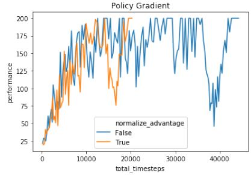
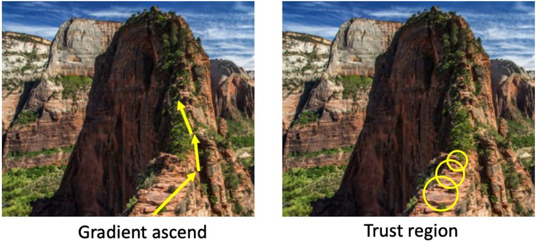
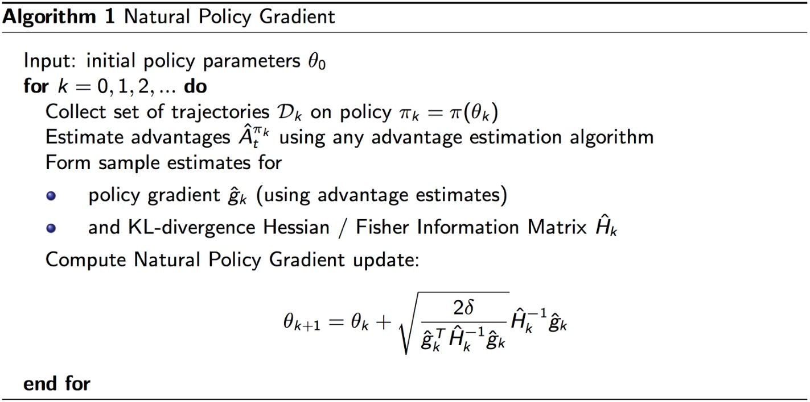
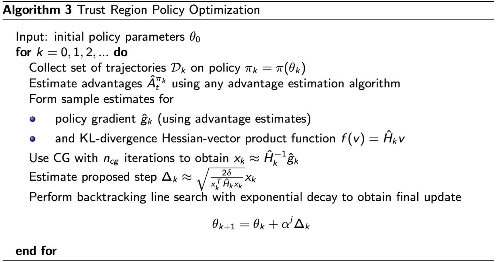
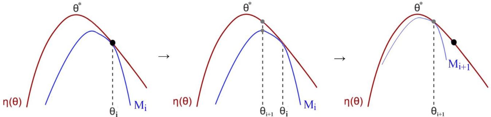
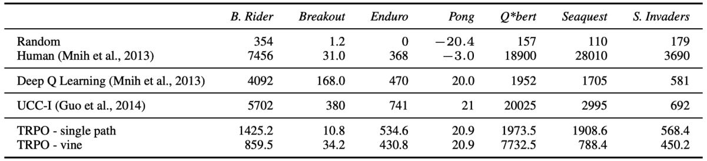

# Plicy Optimization Ⅱ: SOTA

1. Policy Gradient→Natural Policy Gradient/TRPO→ACKTR→PPO  
   &emsp;[TRPO](http://proceedings.mlr.press/v37/schulman15.pdf): Trust region policy optimization. Schulman, L., Moritz, Jordan, Abbeel. 2015  
   &emsp;[ACKTR](https://proceedings.neurips.cc/paper/2017/file/361440528766bbaaaa1901845cf4152b-Paper.pdf): Scalable trust-region method for deep reinforcement learning using Kronecker-factored approximation. Y. Wu, E. Mansimov, S. Liao, R. Grosse, and J. Ba. 2017  
   &emsp;[PPO](https://arxiv.org/pdf/1707.06347.pdf): Proximal policy optimization algorithms. Schulman, Wolski,
Dhariwal, Radford, Klimov. 2017  
1. Q-learning→DDPG→TD3→SAC  
   &emsp;[DDPG](http://proceedings.mlr.press/v32/silver14.pdf): Deterministic Policy Gradient Algorithms, Silver et al. 2014  
   &emsp;[TD3](http://proceedings.mlr.press/v80/fujimoto18a/fujimoto18a.pdf): Addressing Function Approximation Error in Actor-Critic Methods, Fujimoto et al. 2018  
   &emsp;[SAC](http://proceedings.mlr.press/v80/haarnoja18b/haarnoja18b.pdf): Soft Actor-Critic: Off-Policy Maximum Entropy Deep Reinforcement Learning with a Stochastic Actor, Haarnoja et al. 2018  

```warning
这章的内容非常有挑战性，建议先阅读论文。
```

## 6.0 Review

### 6.0.1 Value-based VS Policy-based

* 在基于价值的RL<b><font color="#3399ff">确定性</font></b>策略是直接对价值函数作$$a_t = \operatorname{argmax}_a Q(s_t,a)$$贪心运算得到的。
* 在策略优化中，我们有来自$$\pi_{\theta}(a \vert s)$$<b><font color="#3399ff">随机</font></b>的策略输出，其中$$\theta$$是要优化的策略参数。
  
策略目标函数为$$J(\theta) = \mathbb{E}_{\tau \sim \pi_{\theta}} [R(\tau)]$$，  
策略梯度（REINFORCE）为$$\nabla_{\theta} J(\theta) =\mathbb{E}_{\pi_{\theta}}\left[G_{t} \nabla_{\theta} \log \pi_{\theta}(s, a)\right] \approx \frac{1}{N} \sum_{i=1}^{N} \sum_{t=0}^{T-1} G_{t}^{i} \nabla_{\theta} \log \pi_{\theta}\left(s_{i}, a_{i}\right)$$。

### 6.0.2 Advantage Actor-Critic

**引入baseline来减小AC的方差**

&emsp;&emsp;Advantage function将$$Q$$与baseline $$V$$结合：

$$A^{\pi}(s,a) = Q^{\pi}(s,a) - V^{\pi}(s)$$

那么策略梯度变为：

$$  \nabla_{\theta}J(\theta)
=   \mathbb{E}_{\pi_{\theta}} [\nabla_{\theta} \log \pi_{\theta}(s,a) A^{\pi_{\theta}}(s,a)]
$$

两个函数逼近器包含两组参数向量，利用TD learning或MC来更新这两组参数

$$\begin{aligned}
   V_{\mathbf{v}}(s) & \approx V^{\pi}(s) \\
   Q_{\mathbf{w}}(s,a) & \approx Q^{\pi}(s,a)
\end{aligned}$$

&emsp;&emsp;对于真价值函数$$V^{\pi_{\theta}}(s)$$，其**TD error** $$\delta^{\pi_{\theta}} = r(s,a) + \gamma V^{\pi_{\theta}}(s') - V^{\pi_{\theta}}(s)$$，是<b><font color="#3399ff">优势函数的估计值</font></b>。

$$\begin{aligned}
   \mathbb{E}_{\pi_{\theta}}\left[\delta^{\pi_{\theta}} \mid s, a\right] 
&= \mathbb{E}_{\pi_{\theta}}\left[r+\gamma V^{\pi_{\theta}}\left(s^{\prime}\right) \mid s, a\right]-V^{\pi_{\theta}}(s) \\
&= Q^{\pi_{\theta}}(s, a)-V^{\pi_{\theta}}(s) \\
&= A^{\pi_{\theta}}(s, a)
\end{aligned}$$

所以，我们可以用TD error来计算策略梯度

$$  \nabla_{\theta}J(\theta)
=   \mathbb{E}_{\pi_{\theta}} [\nabla_{\theta} \log \pi_{\theta}(s,a) \delta^{\pi_{\theta}}]
$$

这样，<b><font color="#FF4500">只要一组由TD估计的critic参数</font></b>$$\color{red}{\kappa}$$就可以了

$$\delta_{\mathbf{v}} = r + \gamma V_{\kappa}(s') - V_{\kappa}(s)$$

### 6.0.3 Different time-scales

#### Crtic at different time-scales

&emsp;&emsp;Critic可以从以下多个目标来估计线性价值函数$$V_{\kappa}(s) = \psi(s)^T \kappa$$：  
对于MC，其更新为$$\Delta \kappa = \alpha(\color{green}{G_t} \color{black}{-} V_{\kappa}(s)) \psi(s)$$  
对于TD(0)，其更新为$$\Delta \kappa = \alpha(\color{green}{r + \gamma V_{\kappa}(s')} \color{black}{-} V_{\kappa}(s)) \psi(s)$$  
对于k-step return，其更新为$$\Delta \kappa = \alpha(\color{green}{\sum_{i=0}^k \gamma^i r_{t+i} + \gamma^k V_{\kappa}(s_{t+k})} \color{black}{-} V_{\kappa}(s)) \psi(s)$$  

#### Actors at different time-scales

&emsp;&emsp;策略梯度$$\nabla_{\theta}J(\theta) = \mathbb{E}_{\pi_{\theta}} [\nabla_{\theta} \log \pi_{\theta}(s,a) A^{\pi_{\theta}}(s,a)]$$也可以在许多时间尺度上进行估计：  
Monte-Carlo Actor-Critic策略梯度用整个return的误差来估计，$$\nabla_{\theta}J(\theta) = \alpha(G_t - V_{\kappa}(s_t)) \nabla_{\theta} \log \pi_{\theta}(s_t,a_t)$$。  
TD Difference Actor-Critic策略梯度用TD error来估计，$$\nabla_{\theta}J(\theta) = \alpha \big(r + \gamma V_{\kappa}(s_{t+1}) - V_{\kappa}(s_t) \big) \nabla_{\theta} \log \pi_{\theta}(s_t,a_t)$$。  
k-step return  Actor-Critic策略梯度用k-step return的误差来估计，$$\nabla_{\theta}J(\theta) = \alpha \big( \sum_{i=0}^k \gamma^i r_{t+i} + \gamma^k V_{\kappa}(s_{t+k}) - V_{\kappa}(s_t) \big) \nabla_{\theta} \log \pi_{\theta}(s_t,a_t)$$。  

### 6.0.5 Summary of PG Algorithms

* 策略梯度有很多不同形式
  $$\begin{aligned}
   \nabla_{\theta} J(\theta) &=\mathbb{E}_{\pi_{\theta}}\left[\nabla_{\theta} \log \pi_{\theta}(s, a) G_{t}\right] \text{ ——REINFORCE} \\
   &=\mathbb{E}_{\pi_{\theta}}\left[\nabla_{\theta} \log \pi_{\theta}(s, a) Q^{\mathrm{w}}(s, a)\right] \text{ ——Q Actor-Critic} \\
   &=\mathbb{E}_{\pi_{\theta}}\left[\nabla_{\theta} \log \pi_{\theta}(s, a) A^{\mathrm{w}}(s, a)\right] \text{ ——Advantage Actor-Critic} \\
   &=\mathbb{E}_{\pi_{\theta}}\left[\nabla_{\theta} \log \pi_{\theta}(s, a) \delta\right] \text{ ——TD Actor-Critic}
   \end{aligned}$$
* Critic用策略评估（e.g. MC或TD learning）来估计$$Q^{\pi}(s,a)$$，$$A^{\pi}(s,a)$$或$$V^{\pi}(s)$$。

## 6.1 Trust Region Policy Optimization

<b><font color="#FF4500">Problems with PG</font></b>

&emsp;<b><font color="#FF4500">1. 采样效率低</font></b>，因为PG是在线学习，$$\nabla_{\theta} J(\theta) = \mathbb{E}_{a \sim \pi_{\theta}} [\nabla_{\theta} \log{ \pi_{\theta}(s,a) r(s,a) }]$$

&emsp;<b><font color="#FF4500">2. 策略更新过大或步长不当会破坏训练</font></b>  
&emsp;&emsp;这点和监督学习不一样，因为在监督学习中学习和数据是独立的。  
&emsp;&emsp;在RL中，步长过大→坏的策略→坏的数据收集  
&emsp;&emsp;可能无法从坏的策略中恢复，这会破坏整体的性能

<figure>
   
   <figcaption>训练过程不稳定，策略梯度的更新与数据收集是耦合的</figcaption>
</figure>

**如何使训练更稳定？**  
— Trust region和natural policy gradient（二阶的优化方式）

**如何进行离策略的策略优化？**   
— 在TRPO中用的重要性采样

### 6.1.0 Preliminaries

#### 1. Natural policy gradient

&emsp;&emsp;策略梯度是欧几里得度量参数空间中最陡的上升：

$$ d^{*}
=  \nabla_{\theta} J(\theta)=\lim _{\epsilon \rightarrow 0} \frac{1}{\epsilon} \arg \max J(\theta+d), 
\text { s.t. }\|d\| \leq \epsilon
$$

它的缺点是对策略函数的参数化很敏感。

&emsp;&emsp;以KL-divergence（相对熵）为约束的distribution space（策略输出）中的最陡上升：

$$ d^{*}
=  \arg \max J(\theta+d), 
\text { s.t. } KL(\pi_{\theta} \| \pi_{\theta+d})=c
$$

将KL散度固定为常数$$c$$，可以确保我们以恒定速度沿着分布空间移动，而不管曲率如何（因此对模型参数化具有鲁棒性，因为我们只关心由参数引起的分布）。

**KL-divergence as metric for two distributions**

&emsp;&emsp;<b><font color="#00B050">KL散度</font></b>用于度量两个分布的“近似程度”：

$$\color{green}{ 
   KL(\pi_{\theta} \| \pi_{\theta’})
=  \mathbb{E}_{\pi_{\theta}}[\log \pi_{\theta}] - \mathbb{E}_{\pi_{\theta}}[\log \pi_{\theta'}]
}$$

尽管KL散度是非对称的，因此不是真正的度量，但这不影响我们使用它。这是因为当$$d$$趋向于0时，KL散度是渐进对称的。所以，在局部邻域内KL散度是近似对称的。

&emsp;&emsp;我们可以证明KL散度的二阶Taylor展开为

$$      KL(\pi_{\theta} \| \pi_{\theta+d}) 
\approx \frac{1}{2} d^T \mathbf{F} d$$

其中$$\mathbf{F}$$是KL散度的二阶导数$$\mathbb{E}_{\pi_{\theta}} [\nabla \log \pi_{\theta} \nabla \log \pi_{\theta}^T]$$，即**Fisher Information Matrix**（费舍尔信息矩阵）。

&emsp;&emsp;把以KL-divergence（相对熵）为约束的distribution space（策略输出）中的最陡上升$$ d^{*} = \arg \max J(\theta+d), \text { s.t. } KL(\pi_{\theta} \| \pi_{\theta+d})=c$$写成Lagrangian形式，$$JJ(\theta+d)$$由其一阶泰勒展开近似，约束KL散度由其二阶泰勒展开近似，得到

$$\begin{aligned}
    d^{*} 
&=  \underset{d}{\arg \max } J(\theta+d)-\lambda\left(K L\left(\pi_{\theta} \| \pi_{\theta+d}\right)-c\right) \\
& \approx \underset{d}{\arg \max } J(\theta)+\nabla_{\theta} J(\theta)^{T} d-\frac{1}{2} \lambda d^{T} F d+\lambda c
\end{aligned}$$

为了求最大化，我们令其关于$$d$$的导数为零，得到<b><font color="#00B050">natural Policy gradient</font></b> $$d = \frac{1}{\lambda} \mathbf{F}^{-1} \nabla_{\theta} J(\theta)$$。

&emsp;&emsp;自然策略梯度是**二阶**优化，更加准确而且与模型如何参数化无关（model invariant）。

$$\theta_{t+1} = \theta_t + \alpha \mathbf{F}^{-1} \nabla_{\theta} J(\theta)$$

其中，$$\mathbf{F} = \mathbb{E}_{\pi_{\theta}(s,a)} [\nabla \log \pi_{\theta}(s,a) \nabla \log \pi_{\theta}(s,a)^T]$$为Fisher信息矩阵，即KL散度的二阶微分。$$\mathbf{F}$$度量了策略（分布）关于模型参数$$\theta$$的曲率。

```note
无论模型如何参数化，自然策略梯度都会产生相同的策略变化。
```

关于自然梯度：[A Natural Policy Gradient, 2001](https://proceedings.neurips.cc/paper/2001/file/4b86abe48d358ecf194c56c69108433e-Paper.pdf)、[techblog: Natural Gradient Descent](https://agustinus.kristia.de/techblog/2018/03/14/natural-gradient/)、[知乎：自然策略梯度](https://zhuanlan.zhihu.com/p/546885304)。

#### 2. PG with IS

&emsp;&emsp;我们可以利用重要性采样将策略梯度变成离策略学习。<b><font color="#00B050">重要性采样</font></b>（important sampling, IS）：计算$$f(x)$$的期望值，其中$$x$$具有数据分布$$p$$。我们可以从另一个分布$$q$$中采样数据，使用$$p$$和$$q$$之间的概率比重新校准结果。（[IS代码示例](https://machinelearning1.wordpress.com/2017/10/22/importance-sampling-a-tutorial/)）

$$  \mathbb{E}_{x \sim p} [f(x)]
=   \int p(x)f(x)dx = \int q(x) \frac{p(x)}{q(x)} dx
=   \mathbb{E}_{x \sim q} \left[ \frac{p(x)}{q(x)} f(x) \right]
$$

对策略目标进行重要性采样

$$  J(\theta) 
=   \mathbb{E}_{\color{green}{a \sim \pi_{\theta}}} \color{black}{[r(s,a)]}
=   \mathbb{E}_{\color{green}{a \sim \hat{\pi}}} \color{black}{\left[ \frac{\pi_{\theta}(s,a)}{\hat{\pi}(s,a)} r(s,a) \right]}
$$

### 6.1.1 Increasing the robustness with TR

&emsp;&emsp;行为策略可以直接是旧策略，因此我们可以有一个替代目标函数

$$  \theta
=   \underset{\theta}{\arg \max } J_{\theta_{\text {old }}}(\theta)
=   \underset{\theta}{\arg \max } \mathbb{E}_{t}\left[\frac{\pi_{\theta}\left(a_{t} \mid s_{t}\right)}{\pi_{\theta_{\text {old }}}\left(a_{t} \mid s_{t}\right)} R_{t}\right]
$$

当$$\pi_{\theta} / \pi_{\theta_{\text{old}}}$$太大时，估计值可能会过大。**解决方案**：限制后续策略之间的差异。比如，用KL散度来测量两个策略之间的距离

$$  KL(\pi_{\theta_{\text{old}}} \| \pi_{\theta})
= - \sum_a \pi_{\theta_{\text{old}}}(a \vert s) 
    \log \frac{\pi_{\theta}(a \vert s)}{\pi_{\theta_{\text{old}}}(a \vert s)}
$$

因此，包含置信区间的目标变成最大化

$$\begin{aligned}
&   J_{\theta_{\text {old }}}(\theta)
  = \mathbb{E}_t \left[\frac{\pi_\theta\left(a_t \mid s_t\right)}{\pi_{\theta_{\text {old }}}\left(a_t \mid s_t\right)} R_t\right] \\
&   \text {s.t. } KL \big(\pi_{\theta_{\text {old }}} \left(. \mid s_t\right) \| \pi_\theta \left(. \mid s_t\right)\big) \leq \delta
\end{aligned}$$

&emsp;&emsp;在置信区间中，我们将参数搜索限制在一个由$$\delta$$控制的区域内。这是TRPO和PPO背后的思想。

<figure>
    
    <figcaption>置信区间可以防止优化过程中跌到悬崖中</figcaption>
</figure>

### 6.1.2 Trust region optimization

&emsp;&emsp;将用Taylor展开到二阶，经推导可得

$$\begin{aligned}
    J_{\theta_t}(\theta) & \approx g^T (\theta-\theta_t) \\
    K L\left(\theta_t \| \theta\right) & \approx \frac{1}{2} (\theta-\theta_t)^T H (\theta-\theta_t)
\end{aligned}$$

其中，$$g = \nabla_{\theta} J_{\theta_t}(\theta)$$，$$H = \nabla_{\theta}^2 KL(\theta_t \| \theta)$$，$$\theta_t$$即$$\theta_{\text{old}}$$。

&emsp;&emsp;那么目标变为：

$$\begin{aligned}
&   \theta_{t+1} = \operatorname{arg max}_{\theta} g^T(\theta-\theta_t) \\
&   \text{s.t. } \frac{1}{2} (\theta-\theta_t)^T H (\theta-\theta_t) \le \delta
\end{aligned}$$

这是一个二次方程，可以求解析解：

$$ \theta_{t+1} = \theta_t + \sqrt{\frac{2 \delta}{g^T H^{-1} g}} H^{-1} g $$

```note
TRPO的参数更新中没有设置步长，这里我们认为步长是跟δ的大小相关（即上式中的根号项）。所以在TRPO中只需要给出我们希望新策略和旧策略间相距多少即可。
```

### 6.1.3 Natural policy gradient

&emsp;&emsp;自然梯度是相对于Fisher信息的最陡上升方向，$$H$$即为Fisher信息矩阵（FIM），其计算如下

$$H =\nabla_\theta^2 K L\left(\pi_{\theta_t} \| \pi_\theta\right)=E_{a, s \sim \pi_{\theta_t}}\left[\nabla_\theta \log \pi_\theta(a, s) \nabla_\theta \log \pi_\theta(a, s)^T\right]
$$

学习率 ($$\delta$$) 可以被认为是选择了一个<b><font color="#3399ff">根据策略变化</font></b>标准化的步长。这是有益的，因为这意味着任何参数更新都不会显著改变策略网络的输出。

<figure></figure>


### 6.1.4 TRPO

&emsp;&emsp;FIM及其转置计算成本很高，所以TRPO通过解线性方程$$H \mathbf{x} = g$$来估计$$\mathbf{x} = H^{-1} g$$。

&emsp;&emsp;考虑二次方程的优化。解$$\mathbf{Ax = b}$$等价于$$\mathbf{x} = \operatorname{arg max}_{\mathbf{x}} \frac{1}{2} \mathbf{x}^T \mathbf{Ax} - \mathbf{b}^T \mathbf{x}$$，由于$$f'(\mathbf{x}) = \mathbf{Ax - b} = 0$$，所以我们可以把二次方程优化为

$$ \min_{\mathbf{x}} \frac{1}{2} \mathbf{x}^T H \mathbf{x} - g^T \mathbf{x}$$

用共轭梯度法求解。它与梯度上升非常相似，但可以在较少的迭代中完成。

<figure>
    
    <figcaption>自然策略梯度的改进版本</figcaption>
</figure>

&emsp;&emsp;TRPO论文的附录A提供了一个2页证明，证明此方法可保证单调改进，即<b><font color="#3399ff">每次TRPO迭代中的策略更新都会创建更好的策略</font></b>

$$  J(\pi_{t+1}) - J(\pi_t) \ge M_t(\pi_{t+1}) - M(\pi_t)
    \qquad \text{where } M_t(\pi) = L_{\pi_t}(\pi)-\alpha D_{KL}(\pi_t, \pi)
$$

因此，通过在每次迭代时最大化$$M_t$$，可以保证真实目标$$J$$是不会减小的。它是一种Minorize-Maximization (MM) 算法，是一类包含期望最大化的方法。MM算法通过最大化代理函数（下面的蓝线）来迭代地实现这一点，该代理函数近似于本地的预期回报。

<figure></figure>

#### Result & Demo of TRPO

<figure></figure>

&emsp;&emsp;演示视频位于(https://www.youtube.com/watch?v=KJ15iGGJFvQ)。

### 6.1.5 Limitations of TRPO

1. TRPO的可扩展性问题  
   &emsp;&emsp;每次为当前策略模型计算$$H$$代价很高  
   &emsp;&emsp;需要大量rollout才能逼近$$H$$ $$H=E_{s, a \sim \pi_{\theta_t}}\left[\left(\nabla_\theta \log \pi_\theta(s, a)\right)^T\left(\nabla_\theta \log \pi_\theta(s, a)\right)\right]$$  
   &emsp;&emsp;共轭梯度（Conjugate Gradient, CG）使实现更加复杂  
2. TRPO在有些任务的表现上不如DQN

<figure></figure>


<!-- 蓝 -->
<b><font color="#3399ff"></font></b>
<!-- 绿 --><!-- #33cc00 -->
<b><font color="#00B050"></font></b>
<!-- 橙 -->
<b><font color="#FF4500"></font></b>