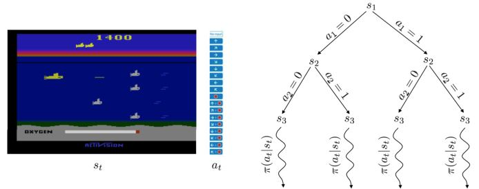
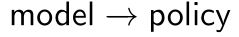
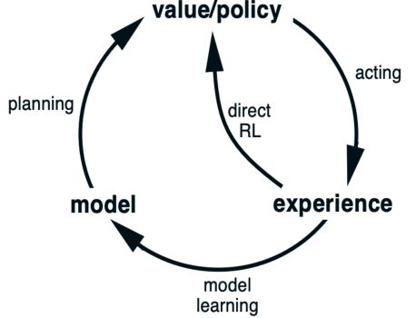
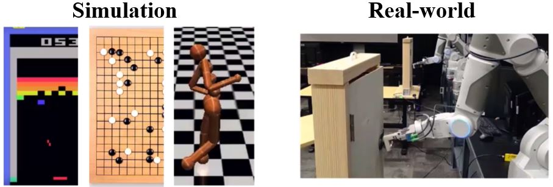
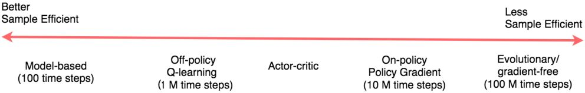
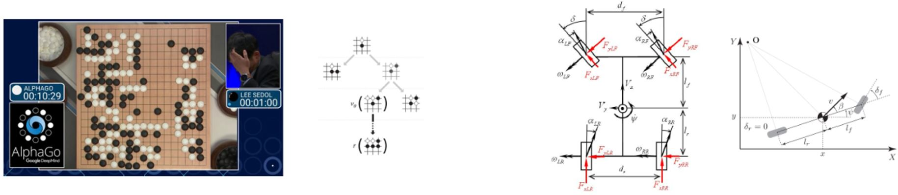
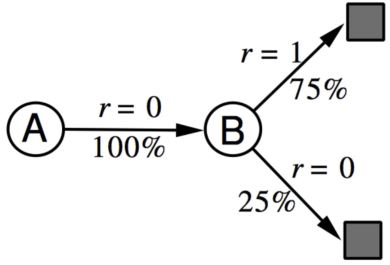

# Model-based Reinforcement Learning

## 7.1 Introduction to Model-based RL

先前关于model-free RL的课程
* 利用策略梯度直接从经验中学习策略
* 通过MC或TD学习价值函数

这节将关注model-based RL
* 从经验中学习环境的模型
* 利用学到的模型来改进价值/策略优化

### 7.1.1 Building a model of the environment

<figure></figure>

agent不仅可以和环境交互，也可以和模型交互

### 7.1.2 Modeling the environment for planning

<figure>
    
    <figcaption>如果我们有环境模型，那么就可以利用环境模型进行规划，帮助更好地估计策略或价值函数</figcaption>
</figure>

规划是将模型作为输入并通过与环境模型交互来产生或改进策略的计算过程

<figure></figure>

状态空间规划：在状态空间内搜索到达目标的最优策略或最优路径

Model-based **Value Optimization**方法享有一个一般结构

<figure></figure>

Model-based **Policy Optimization**的结构更加简单

<figure></figure>

### 7.1.3 Structure of Model-based RL

<figure>
    
    <figcaption>学习、规划和动作之间的关系</figcaption>
</figure>

真实经验的两个作用：
1. 直接利用之前的方法来改进价值和策略
2. 改进模型，令模型更加准确的表示真实环境（环境预测模型：$$p(s_{t+1} \vert s_t,a_t), R(s_t,a_t)$$）

### 7.1.4 Advantage of Model-based RL

<figure></figure>

<b>更好的采样效率</b>

* 采样高效的学习对于现实生活中的RL应用很重要，比如机器人（[DARPA Robotics failure](https://www.youtube.com/watch?v=g0TaYhjpOfo)）
* 可以通过监督学习方法来高效地学习模型

<figure></figure>

<b>Model-based RL存在的问题：</b>

1. 先学习模型，后构建价值函数或策略函数，这会导致两个近似误差来源
2. 很难保证收敛

### 7.1.5 What is a model

&emsp;&emsp;模型$$\mathcal{M}$$是由$$\eta$$参数化的MDP过程的表示。一般来说，模型$$\color{green}{\mathcal{M} = (P, R)}$$<b>包含状态转移和奖励</b>

$$\begin{aligned}
    S_{t+1} & \sim P_{\eta}(S_{t+1} \vert S_t,A_t)  \\
    R_{t+1} & =    R_{\eta}(S_{t+1} \vert S_t,A_t)
\end{aligned}
$$

通常情况下，我们**假设状态转移与奖励之间条件无关**

$$  P(S_{t+1},R_{t+1} \vert S_t,A_t)
  = P(S_{t+1} \vert S_t,A_t) P(R_{t+1} \vert S_t,A_t)
$$

#### Sometimes easy to access the model

比如，已知模型：围棋，游戏的规则就是模型；物理模型，车辆的动力学模型和自行车的运动学模型

<figure></figure>

## 7.2 Model-based Value Optimization

### 7.2.1 Learning the model

&emsp;&emsp;目标：从经验$$\{S_1, A_1, R_2, \ldots, S_T\}$$中学习模型$$\mathcal{M}\eta$$。这可以看作一个监督学习问题。学习$$s,a \rightarrow r$$是回归问题，学习$$s,a \rightarrow s^{\prime}$$是密度估计问题。损失函数可以是均方误差、KL散度，然后优化$$\eta$$来使得经验损失最小。

Examples of models: 
1. Table Lookup Model
2. Linear Expectation Model
3. Linear Gaussian Model
4. Gaussian Process Model
5. Deep Belief Network Model ...

**Table Lookup Model**

&emsp;&emsp;模型是一个明确的MDP，$$\hat{\mathcal{P}}$$和$$\hat{\mathcal{R}}$$。计下每个状态-动作对的访问次数为$$N(s,a)$$，则

$$  \hat{\mathcal{P}}_{s,s'}^a
  = \frac{1}{N(s,a)}    \sum_{t=1}^T 1 (S_t=s, A_t=a, S_{t+1}=s')
$$

$$  \hat{\mathcal{R}}_{s,s'}^a
  = \frac{1}{N(s,a)}    \sum_{t=1}^T \sum_{t=1}^T 1 (S_t=s, A_t=a)R_t
$$

**Example of AB**  
&emsp;&emsp;有两个状态A和B，没有折扣，观察到8个episode：(A, 0, B ,0), (B, 1), (B, 1), (B, 1), (B, 1), (B, 1), (B, 1), (B, 0)。所以从经验中估计的查表模型如下
<figure></figure>

### 7.2.2 Sample-based planning

&emsp;&emsp;一个简单但采样高效的规划方法是只用模型来生成样本。一般步骤：  
1. 从模型中采样经验  
   $$S_{t+1} \sim \mathcal{P}_\eta(S_{t+1} \vert S_t, A_t)$$  
   $$R_{t+1} \sim \mathcal{R}_\eta(R_{t+1} \vert S_t, A_t)$$
2. 对采样到的经验用model-free的方法：Monte-Carlo control、Sarsa、Q-learning

**Example of AB**  
&emsp;&emsp;从得到的模型中采样经验：(B, 1), (B, 0), (B, 1), (A, 0, B ,1), (B, 1), (A, 0, B ,1), (B, 1), (B, 0)。在采样到的经验的基础上进行Monte-Carlo学习，得到$$V(A) = 1, V(B) = 0.75$$。

<b>Planning with an inaccurate model</b>

&emsp;&emsp;给定一个不完美的模型$$<\mathcal{P}_\eta, \mathcal{R}_\eta> \neq <\mathcal{P}, \mathcal{R}>$$，model-based RL的性能上限是近似MDP $$<\mathcal{S}, \mathcal{A}>, \mathcal{P}_\eta, \mathcal{R}_\eta$$的最优策略。当模型不准确的时候，规划过程只能计算出次优策略。

可能的解决方案：
1. 当模型的精确度较低时，使用model-free RL
2. 明确推理模型的不确定性（我们对估计状态的置信度如何）：利用概率模型，如Bayesian和Gaussian过程

现在，我们有两类经验。  
Real experience：从环境（true MDP）中采样 $$S', S \sim \mathcal{P}_{s, s'}^a$$, $$R = \mathcal{R}_s^a$$  
Simulated experience：从模型（approximate MDP）中采样 $$\hat{S}', \hat{S} \sim \mathcal{P}_\eta (S' \vert S, A)$$, $$\hat{R} = \mathcal{R}_\eta (R \vert S, A)$$  

### 7.2.3 Integrating learning and planning

Model-free RL
* 无模型
* 从真实经验中学习价值函数（和/或 策略）

Model-based RL（采用Sample-based Planning）
* 从真实经验中学习模型
* 从仿真经验中规划价值函数（和/或 策略）

Dyna
* 从真实经验中学习模型
* 从真实和仿真经验中学习和规划价值函数（和/或 策略）

## 7.3 Model-based Policy Optimization
## 7.4 Case Study on Robot Object Manipulation
<!-- 蓝 -->
<b></b>
<!-- 绿 --><!-- #33cc00 -->
<b></b>
<!-- 橙 -->
<b></b>