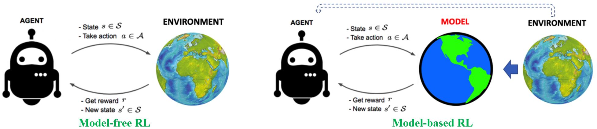
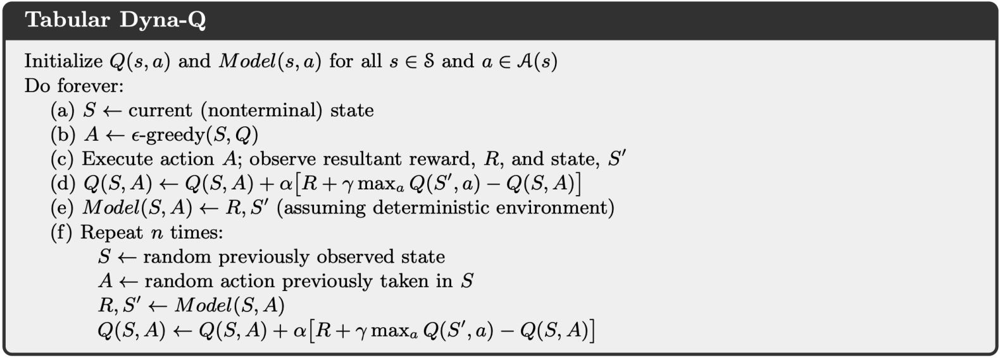
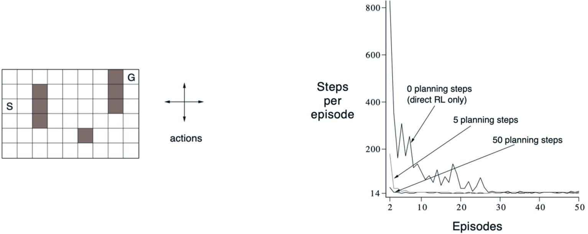
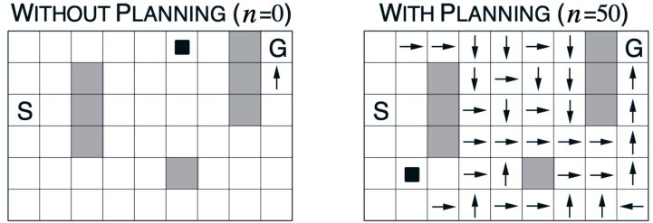
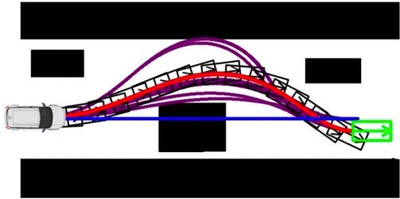
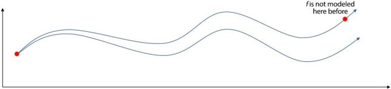
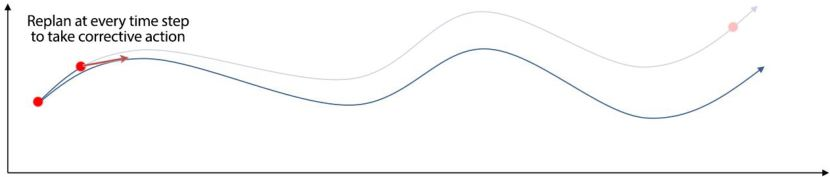
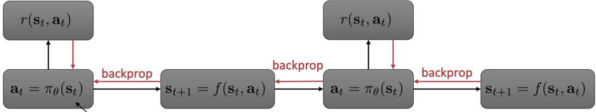
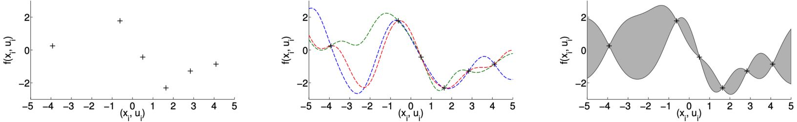

# Model-based Reinforcement Learning

## 7.1 Introduction to Model-based RL

先前关于model-free RL的课程
* 利用策略梯度直接从经验中学习策略
* 通过MC或TD学习价值函数

这节将关注model-based RL
* 从经验中学习环境的模型
* 利用学到的模型来改进价值/策略优化

### 7.1.1 Building a model of the environment

<figure></figure>

agent不仅可以和环境交互，也可以和模型交互

### 7.1.2 Modeling the environment for planning

<figure>
    
    <figcaption>如果我们有环境模型，那么就可以利用环境模型进行规划，帮助更好地估计策略或价值函数</figcaption>
</figure>

&emsp;&emsp;规划是将模型作为输入并通过与环境模型交互来产生或改进策略的计算过程

<figure></figure>

&emsp;&emsp;状态空间规划：在状态空间内搜索到达目标的最优策略或最优路径

Model-based **Value Optimization**方法享有一个一般结构

<figure></figure>

Model-based **Policy Optimization**的结构更加简单

<figure></figure>

### 7.1.3 Structure of model-based RL

<figure>
    
    <figcaption>学习、规划和动作之间的关系</figcaption>
</figure>

真实经验的两个作用：
1. 直接利用之前的方法来改进价值和策略
2. 改进模型，令模型更加准确的表示真实环境（环境预测模型：$$p(s_{t+1} \vert s_t,a_t), R(s_t,a_t)$$）

### 7.1.4 Advantage of model-based RL

<figure></figure>

<b>更好的采样效率</b>

* 采样高效的学习对于现实生活中的RL应用很重要，比如机器人（[DARPA Robotics failure](https://www.youtube.com/watch?v=g0TaYhjpOfo)）
* 可以通过监督学习方法来高效地学习模型

<figure></figure>

<b>Model-based RL存在的问题：</b>

1. 先学习模型，后构建价值函数或策略函数，这会导致两个近似误差来源
2. 很难保证收敛

### 7.1.5 What is a model

&emsp;&emsp;模型$$\mathcal{M}$$是由$$\eta$$参数化的MDP过程的表示。一般来说，模型$$\color{green}{\mathcal{M} = (P, R)}$$<b>包含状态转移和奖励</b>

$$\begin{aligned}
    S_{t+1} & \sim P_{\eta}(S_{t+1} \vert S_t,A_t)  \\
    R_{t+1} & =    R_{\eta}(S_{t+1} \vert S_t,A_t)
\end{aligned}
$$

通常情况下，我们**假设状态转移与奖励之间条件无关**

$$  P(S_{t+1},R_{t+1} \vert S_t,A_t)
  = P(S_{t+1} \vert S_t,A_t) P(R_{t+1} \vert S_t,A_t)
$$

#### Sometimes easy to access the model

比如，已知模型：围棋，游戏的规则就是模型；物理模型，车辆的动力学模型和自行车的运动学模型

<figure></figure>

## 7.2 Model-based Value Optimization

### 7.2.1 Learning the model

&emsp;&emsp;目标：从经验$$\{S_1, A_1, R_2, \ldots, S_T\}$$中学习模型$$\mathcal{M}\eta$$。这可以看作一个监督学习问题。学习$$s,a \rightarrow r$$是回归问题，学习$$s,a \rightarrow s^{\prime}$$是密度估计问题。损失函数可以是均方误差、KL散度，然后优化$$\eta$$来使得经验损失最小。

Examples of models: 
1. Table Lookup Model
2. Linear Expectation Model
3. Linear Gaussian Model
4. Gaussian Process Model
5. Deep Belief Network Model ...

**Table Lookup Model**

&emsp;&emsp;模型是一个明确的MDP，$$\hat{\mathcal{P}}$$和$$\hat{\mathcal{R}}$$。计下每个状态-动作对的访问次数为$$N(s,a)$$，则

$$  \hat{\mathcal{P}}_{s,s'}^a
  = \frac{1}{N(s,a)}    \sum_{t=1}^T 1 (S_t=s, A_t=a, S_{t+1}=s')
$$

$$  \hat{\mathcal{R}}_{s,s'}^a
  = \frac{1}{N(s,a)}    \sum_{t=1}^T \sum_{t=1}^T 1 (S_t=s, A_t=a)R_t
$$

**Example of AB**  
&emsp;&emsp;有两个状态A和B，没有折扣，观察到8个episode：(A, 0, B ,0), (B, 1), (B, 1), (B, 1), (B, 1), (B, 1), (B, 1), (B, 0)。所以从经验中估计的查表模型如下
<figure></figure>

### 7.2.2 Sample-based planning

&emsp;&emsp;一个简单但采样高效的规划方法是只用模型来生成样本。一般步骤：  
1. 从模型中采样经验  
   $$S_{t+1} \sim \mathcal{P}_\eta(S_{t+1} \vert S_t, A_t)$$  
   $$R_{t+1} \sim \mathcal{R}_\eta(R_{t+1} \vert S_t, A_t)$$
2. 对采样到的经验用model-free的方法：Monte-Carlo control、Sarsa、Q-learning

**Example of AB**  
&emsp;&emsp;从得到的模型中采样经验：(B, 1), (B, 0), (B, 1), (A, 0, B ,1), (B, 1), (A, 0, B ,1), (B, 1), (B, 0)。在采样到的经验的基础上进行Monte-Carlo学习，得到$$V(A) = 1, V(B) = 0.75$$。

<b>Planning with an inaccurate model</b>

&emsp;&emsp;给定一个不完美的模型$$<\mathcal{P}_\eta, \mathcal{R}_\eta> \neq <\mathcal{P}, \mathcal{R}>$$，model-based RL的性能上限是近似MDP $$<\mathcal{S}, \mathcal{A}>, \mathcal{P}_\eta, \mathcal{R}_\eta$$的最优策略。当模型不准确的时候，规划过程只能计算出次优策略。

可能的解决方案：
1. 当模型的精确度较低时，使用model-free RL
2. 明确推理模型的不确定性（我们对估计状态的置信度如何）：利用概率模型，如Bayesian和Gaussian过程

现在，我们有两类经验。  
Real experience：从环境（true MDP）中采样 $$S', S \sim \mathcal{P}_{s, s'}^a$$, $$R = \mathcal{R}_s^a$$  
Simulated experience：从模型（approximate MDP）中采样 $$\hat{S}', \hat{S} \sim \mathcal{P}_\eta (S' \vert S, A)$$, $$\hat{R} = \mathcal{R}_\eta (R \vert S, A)$$  

### 7.2.3 Integrating learning and planning

Model-free RL
* 无模型
* 从真实经验中学习价值函数（和/或 策略）

Model-based RL（采用Sample-based Planning）
* 从真实经验中学习模型
* 从仿真经验中规划价值函数（和/或 策略）

Dyna
* 从真实经验中学习模型
* 从真实和仿真经验中学习和规划价值函数（和/或 策略）

**Dyna for Integrating Learning, Planning, and Reacting**

<figure></figure>

&emsp;&emsp;Dyna出自Richard Sutton的[Integrated architectures for learning, planning, and reacting based on approximating dynamic programming](https://citeseerx.ist.psu.edu/document?repid=rep1&type=pdf&doi=642db624b5b33a02a435ee1415d7c9f9cef36e1d)、[Dyna, an integrated architecture for learning, planning, and reacting](https://dl.acm.org/doi/abs/10.1145/122344.122377)，结合了direct RL, model learning and planning。

<figure></figure>

**Result of Dyna**

<figure></figure>

&emsp;&emsp;一个简单的迷宫环境：尽快从S到G。学习曲线改变每个实际步骤的规划步数。

<figure>
    
    <figcaption>由有规划和无规划Dyna-Q agent找到的</figcaption>
</figure>

## 7.3 Model-based Policy Optimization

&emsp;&emsp;先前的model-based value-based RL从模型获取仿真轨迹，然后再计算价值和策略。我们可以省去估计价值的步骤直接优化策略和学习模型吗？

<figure></figure>

### 7.3.1 Model-based policy optimization in RL

$$\begin{aligned}
    \tau = \{s_1, a_1, s_2, a_2 \ldots, s_T, a_T\} \sim \pi_\theta(a_t \vert s_t) \\
    \underset{\theta}{\arg \max} \mathbb{E}_{\tau \sim \pi_\theta} \left[\sum_t \gamma^t r(s_t, a_t)\right] \\
    p(s_1, a_1, \ldots, s_t, a_T) = p(s_1) \prod_{t=1}^T \pi_\theta(a_t \mid s_t) p(s_{t+1} \vert s_t, a_t)
\end{aligned}$$

&emsp;&emsp;策略梯度作为model-free RL，只关心策略$$\pi_\theta(a_t \vert s_t)$$和期望return。在策略梯度中，并不需要$$p(s_{t+1} \vert s_t, a_t)$$（不管是否已知）。但是，如果我们知道模型或者可以学习模型的话，是不是可以做的更好呢？

&emsp;&emsp;RL中的model-based policy optimization受控制理论影响很深。控制理论会优化控制器。模型的动力学方程写作$$s_t = f(s_{t-1}, a_{t-1})$$，控制器利用模型来决定能够最小化一段轨迹成本的最优控制：

$$  \underset{a_1, \ldots, a_T}{\arg \min} \sum_{t=1}^T c(s_t, a_t) \qquad
    \text{s.t. } s_t = f(s_{t-1}, a_{t-1})
$$

### 7.3.2 Model learning for trajectory optimization

#### Optimal control for trajectory optimization

<figure></figure>

&emsp;&emsp;如果动力学方程已知，那么这就是最优控制问题。成本函数是负的RL问题中的奖励。在一些简化的假设下，最优解可以通过Linear-Quadratic Regulator (LQR) 和iterative LQR (iLQR)求得。

#### Algorithm 1

如果我们不知道动力学模型，那么可以讲将模型学习和轨迹优化结合起来：
1. 运行基本策略$$\pi_0(a_t \vert s_t)$$（随机策略）来收集$$\mathcal{D} = \{(s,a,s')_i\}$$
2. 学习最小化$$\sum_i \| f(s_i, a_i) - s_i' \|^2$$的动力学模型$$s' = f(s,a)$$
3. 根据$$f(s,a)$$来选择动作

Step 2是监督学习，目的是训练一个能最小化采样数据最小均方误差的模型。  
Step 3可以利用LQR求解，利用模型和代价函数来计算最优轨迹。

#### Algorithm 2

<figure></figure>

&emsp;&emsp;先前的解决方案很容易漂移，微小的误差会沿着轨迹快速累积。我们可能会落在模型还没有学到过的区域内，所以我们得到如下迭代学习模型的改进算法：
1. 运行基本策略$$\pi_0(a_t \vert s_t)$$（随机策略）来收集$$\mathcal{D} = \{(s,a,s')_i\}$$
2. 循环：  
   学习最小化$$\sum_i \| f(s_i, a_i) - s_i' \|^2$$的动力学模型$$s' = f(s,a)$$  
   根据$$f(s,a)$$来选择动作
   执行选中的那些动作并将结果数据$$\{(s,a,s')_i\}$$加到$$\mathcal{D}$$中

#### Algorithm 3 with MPC

&emsp;&emsp;不过，先前的解决方法在再次拟合模型之前执行了所有的规划操作。我们可能已经off-grid太远了。所以，我们可以用Model Predictive Control (MPC)，我们虽然优化整条轨迹但是我们只执行第一步，然后观察后重新规划。重规划给了我们机会，能够再次观察当前状态后执行正确的动作。

<figure></figure>

1. 运行基本策略$$\pi_0(a_t \vert s_t)$$（随机策略）来收集$$\mathcal{D} = \{(s,a,s')_i\}$$
2. 每$$N$$步循环： 
   学习最小化$$\sum_i \| f(s_i, a_i) - s_i' \|^2$$的动力学模型$$s' = f(s,a)$$  
   每步循环：  
   &emsp;根据$$f(s,a)$$来选择动作  
   &emsp;执行规划出的第一个动作并观察结果$$s'$$（MPC）  
   &emsp;并将$$\{(s,a,s')\}$$加到数据集$$\mathcal{D}$$中

#### Algorithm 4: learning model and policy together

<figure></figure>

最后，我们可以将策略学习与模型学习和最优控制结合起来。
1. 运行基本策略$$\pi_0(a_t \vert s_t)$$（随机策略）来收集$$\mathcal{D} = \{(s,a,s')_i\}$$
2. 循环：  
   学习最小化$$\sum_i \| f(s_i, a_i) - s_i' \|^2$$的动力学模型$$s' = f(s,a)$$  
   通过$$f(s,a)$$反向传播到策略来优化$$\pi_\theta(a_t \vert s_t)$$  
   运行策略$$\pi_\theta(a_t \vert s_t)$$，将访问过的$$\{(s,a,s')\}$$加到数据集$$\mathcal{D}$$中

### 7.3.3 Parameterizing the model

用什么函数来参数化动力学方程呢？
1. Global model：$$s_{t+1} = f(s_t,a_t)$$由一个大的神经网络来表示  
   优点：表达能力强且可以用大量数据来拟合  
   缺点：在低数据情况下效果不佳，且不能表示模型的不确定性
2. Local model：将转移过程建模为time-varying linear-Gaussian dynamics  
   优点：非常data-efficient且可以表示模型的不确定性  
   缺点：不太适合非平滑的动力学模型  
   &emsp;&emsp;&emsp;当数据集较大时非常慢

**Global model v.s. Local model**

&emsp;&emsp;Local model是时变线性高斯时

$$\begin{aligned}
    p(\mathbf{x}_{t+1} \mid \mathbf{x}_t, \mathbf{u}_t) 
& = \mathcal{N} \left( f(\mathbf{x}_t, \mathbf{u}_t) \right) \\
    f(\mathbf{x}_t, \mathbf{u}_t) 
& = \mathbf{A}_t \mathbf{x}_t + \mathbf{B}_t \mathbf{u}_t
\end{aligned}$$
   
我们需要的只有局部梯度$$\mathbf{A}_t = \frac{df}{d\mathbf{x}_t}$$和$$\mathbf{B}_t = \frac{df}{d\mathbf{u}_t}$$。

<figure>
    
    <figcaption>观测到的转移过程的小数据集（左），多个可信的确定性函数逼近器（中），概率函数逼近器（右）。概率函数逼近器可以对隐函数的不确定性建模。</figcaption>
</figure>

## 7.4 Case Study on Robot Object Manipulation

1. Deisenroth M P, Rasmussen C E, Fox D. Learning to control a low-cost manipulator using data-efficient reinforcement learning[J]. Robotics: Science and Systems VII, 2011, 7: 57-64.
2. Levine S, Wagener N, Abbeel P. Learning contact-rich manipulation skills with guided policy search (2015). The best Robotics Manipulation Paper award at ICRA 2015.

## 7.5 Summary of Model-based RL

* 我们开发一个模型来预测系统动态，而不是拟合策略或价值函数。
* Model-based RL有更高的采样效率，这对真实世界中的应用至关重要，如机器人操作。
  
<figure></figure>

<!-- 蓝 -->
<b></b>
<!-- 绿 --><!-- #33cc00 -->
<b></b>
<!-- 橙 -->
<b></b>