# Imitation Learning

## 8.1 Introduction on IL

<figure>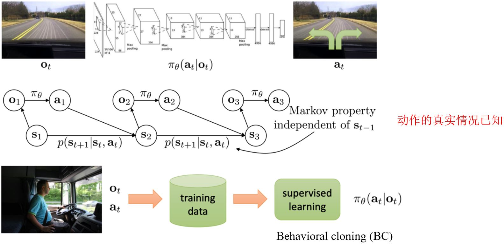</figure>

&emsp;&emsp;模仿学习可以看作是对策略网络的强监督学习，每个动作执行完可以立即得到反馈。但因为处于序列决策问题下，单纯的监督学习是不够的。


## 8.2 Behavioral cloning and DAGGER

### 8.2.1 Case study

**1. End to End Learning for Self-Driving Cars**
   
Bojarski M, Del Testa D, Dworakowski D, et al. End to end learning for self-driving cars. 2016.  
DAVER-2 System By Nvidia: It works to some degree!

<figure>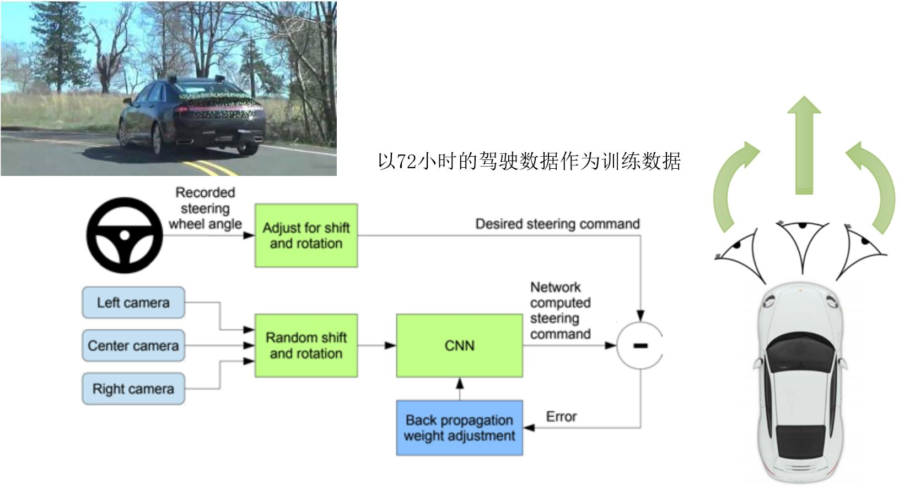</figure>

**2. Trail following as a classification**

Giusti A, Guzzi J, Cireşan D C, et al. A machine learning approach to visual perception of forest trails for mobile robots[J]. IEEE Robotics and Automation Letters, 2015, 1(2): 661-667.

<figure>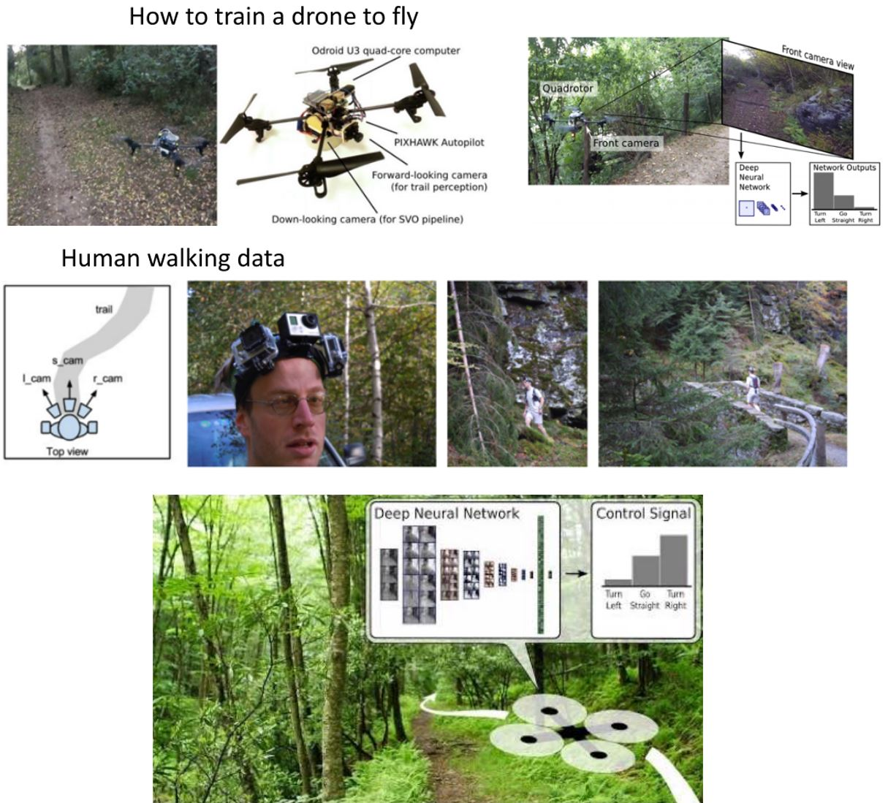</figure>

### 8.2.2 Limitations of supervised IL

&emsp;&emsp;训练过的策略遇到没有示教过的情况，错误会以$$T$$的平方增长：没有学到如何从失败中恢复。

$$J(\hat{\pi}_\text{sup}) \le T^2 \epsilon$$

<figure>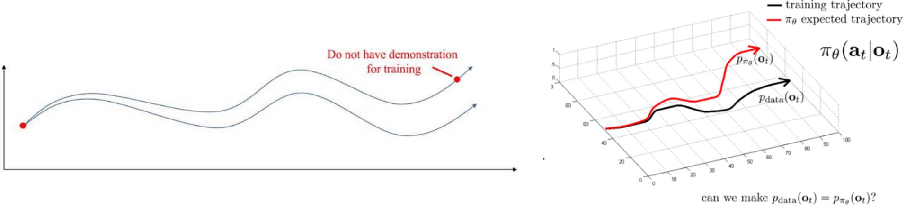</figure>

```tip
如何让agent采集到的训练数据和遇到的实际数据的分布尽可能一致？
```

<figure>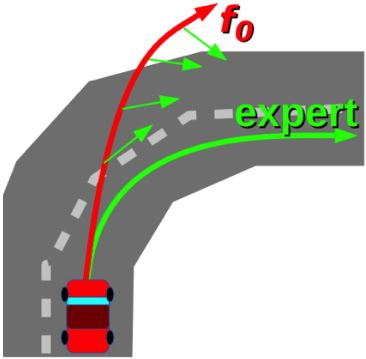</figure>

一种方法：**迭代地标注更多的on-policy数据**
* 运行当前策略并收集先前没有遇到过的状态的数据
* 人为标注这些可能的动作
  
这使我们能够收集部署策略时错过的样本。

### 8.2.3 DAgger: Dataset Aggregation

思路：对$$p_{\text{data}}(\mathbf{o}_t)$$做出正确动作，而不是$$p_{\pi_\theta}(\mathbf{o}_t)$$！  
目标：从$$p_{\pi_\theta}(\mathbf{o}_t)$$中收集训练数据而不是$$p_{\text{data}}(\mathbf{o}_t)$$  
如何实现？  — 只要运行$$\pi_\theta(\mathbf{a}_t \vert \mathbf{o}_t)$$即可，但需要标签$$\mathbf{a}_t$$！

<figure>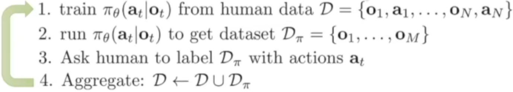</figure>

DAgger的缺点：
* 训练过程中需要多次询问专家
* 如果专家是人类的话，这个成本会非常高

**DAgger with Other Expert Algorithms**

用学习（很快）来模仿其它较慢的算法（其它算法可能慢但是结果准确）
* 玩游戏：我们可以通过离线强力搜索来计算次优专家行为，然后在训练期间使用它来逼近策略函数
* 离散优化器：许多离散优化问题（例如最短路径）非常慢。那么，使用模仿学习来尝试构建能够实时高效运行的最短路径优化器。

<figure>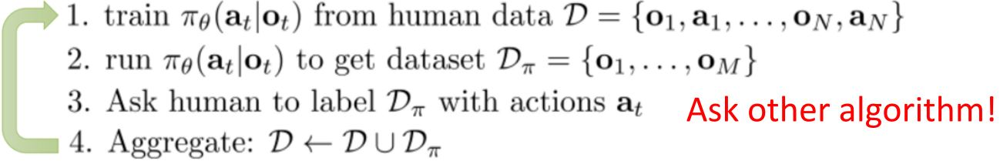</figure>


## 8.3 Inverse RL & GAIL

### 8.3.1 Inverse RL

* 有时提供专家数据比定义奖励更容易
* 学习可以解释专家行为的成本/奖励函数

<figure>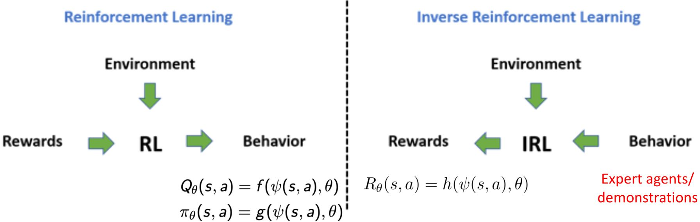</figure>

<figure>
    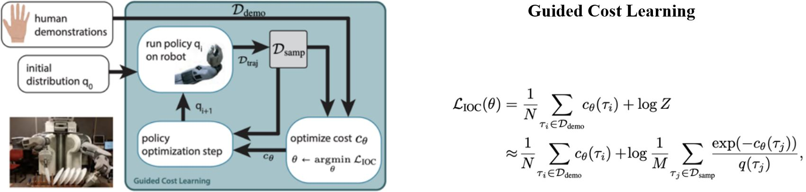
    <figcaption>Finn C, Levine S, Abbeel P. Guided cost learning: Deep inverse optimal control via policy optimization[C]//International conference on machine learning. PMLR, 2016: 49-58.</figcaption>
</figure>

### 8.3.2 Generative Adversarial IL

* 与Inverse RL相似，GANs为生成式模型学习一个目标函数

<figure>
    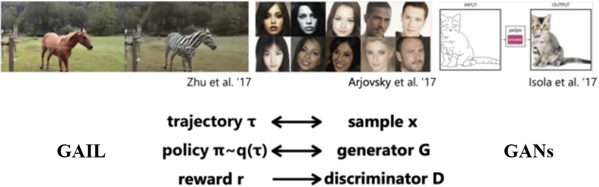
    <figcaption>Ho J, Ermon S. Generative adversarial imitation learning[J]. Advances in neural information processing systems, 2016, 29.</figcaption>
</figure>

### 8.3.3 Connection between IRL & GAIL

<figure>
    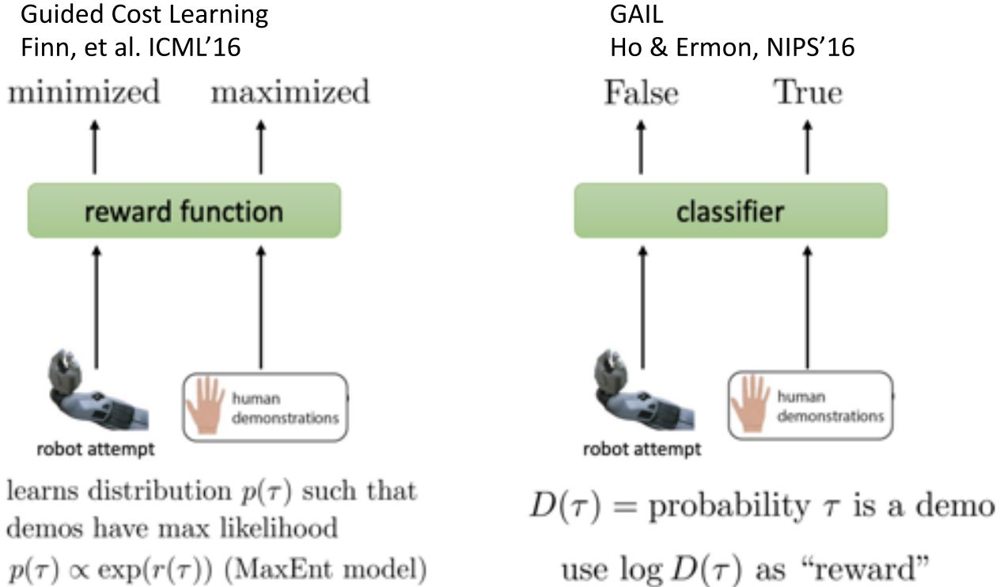
    <figcaption>Finn C, Christiano P, Abbeel P, et al. A connection between generative adversarial networks, inverse reinforcement learning, and energy-based models[J]. arXiv preprint arXiv:1611.03852, 2016.</figcaption>
</figure>

## 8.4 Improving the Supervised IL

如何改进策略模型？  
— 多模式行为  
— 非马尔可夫行为

<figure>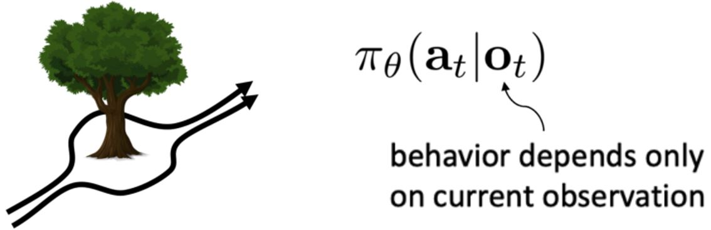</figure>

### 8.4.1 Handling multimodal behavior

<figure>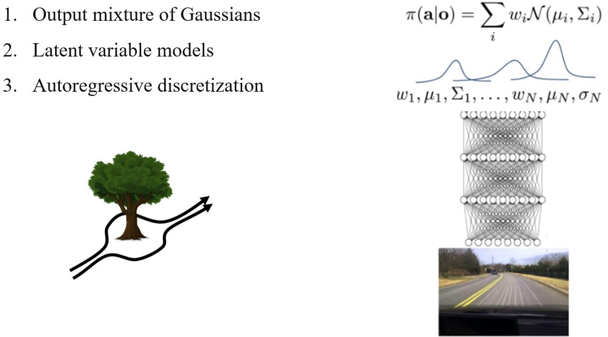</figure>

### 8.4.2 Modeling the whole history

<figure></figure>

<figure>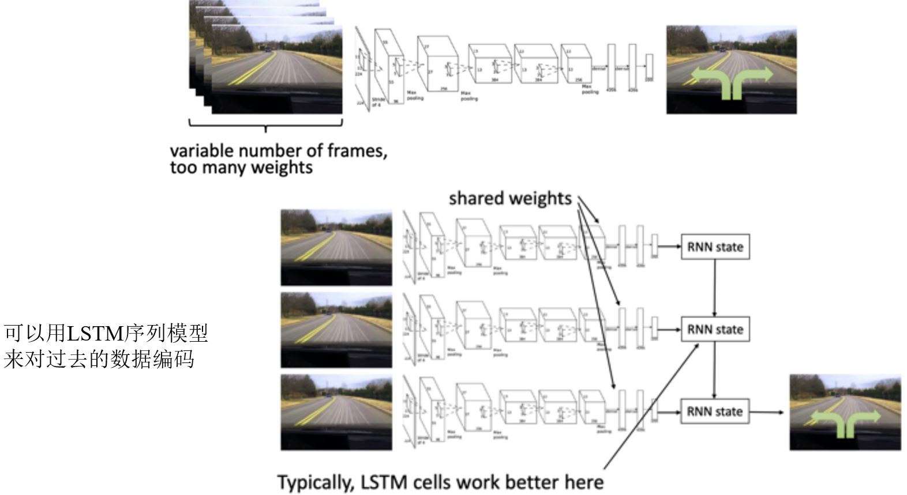</figure>

**Case Study**：利用LSTM从示教中学习

<figure>
    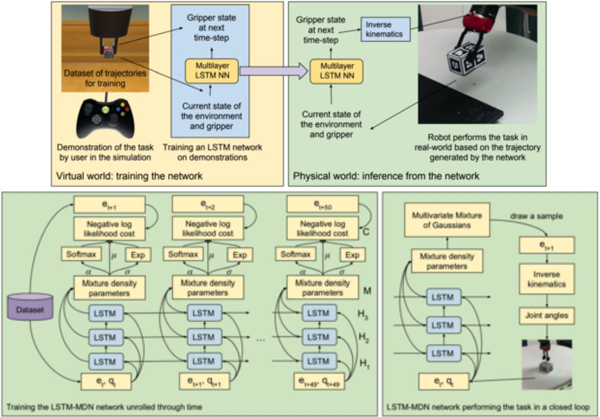
    <figcaption>Rahmatizadeh R, Abolghasemi P, Behal A, et al. Learning real manipulation tasks from virtual demonstrations using LSTM[C]. AAAI 2018.</figcaption>
</figure>

## 8.5 Unifying IL and RL

### 8.5.1 Problems with IL

* 人类需要提供数据，而数据往往是有限的
* 人类不擅长提供某些动作
* 人类可以自主学习（非监督学习）

<figure>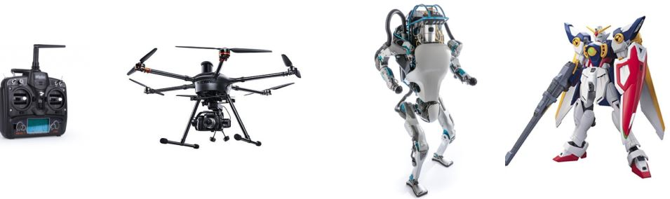</figure>

### 8.5.2 IL v.s. RL

<figure>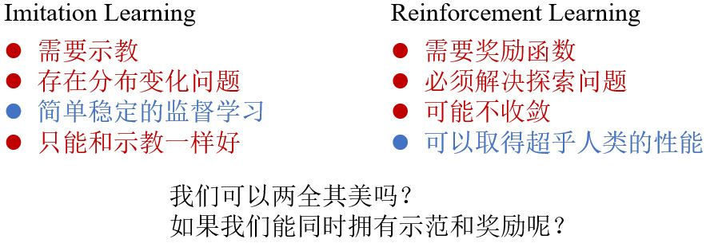</figure>

### 8.5.3 Simplest Combination: Pretrain & Finetune

* 使用专家示教来初始化策略（克服探索问题）
* 然后应用强化学习来改进策略并学习处理那些偏离场景并超越演示者的表现

<figure>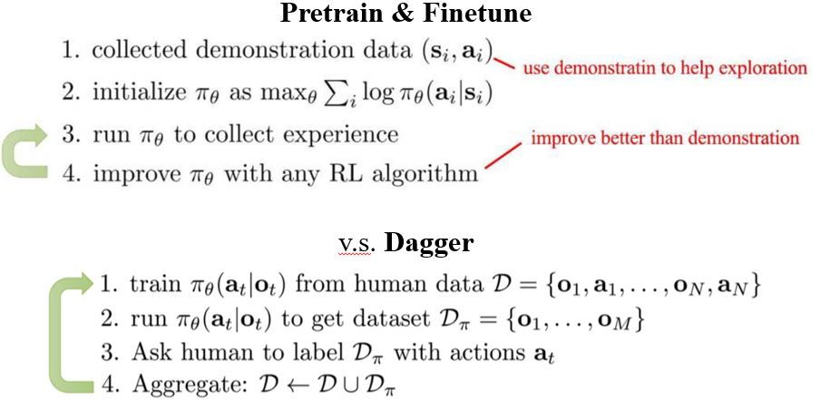</figure>

**1. Pretrain & Finetune for AlphaGo**

* SL策略网络：根据人类专家玩的游戏中的3000万步棋来训练策略网络（可以在57%的时间内预测人类的棋步） • 
* RL策略网络：然后使用策略梯度微调权重

<figure>
    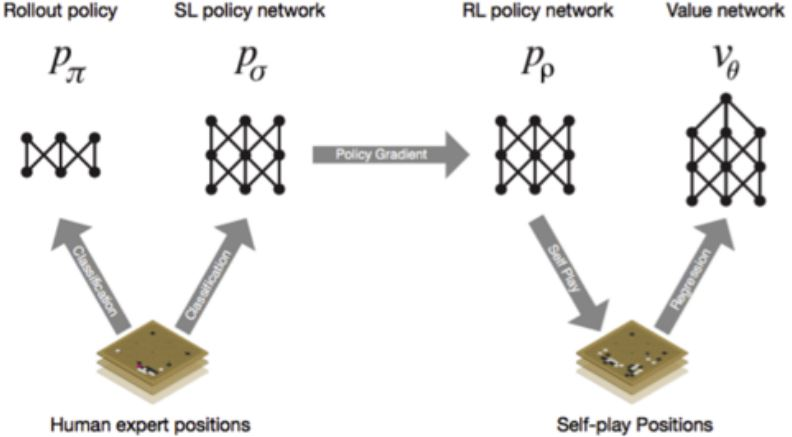
    <figcaption>David Silver, et al. Mastering the ancient game of Go with Machine Learning. Nature 2016.</figcaption>
</figure>

**2. Pretrain & Finetune for Starcraft2**

&emsp;&emsp;从暴雪发布的匿名人类游戏中进行监督学习。这使得AlphaStar能够通过模仿来学习星际争霸天梯上玩家使用的基本微观和宏观策略。这个初始agent在95%的游戏中击败了内置的“精英”级AI（对于人类玩家来说大约是黄金级）。

<figure>
    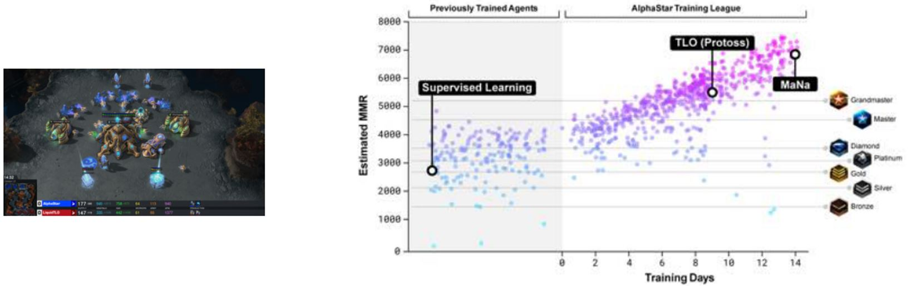
    <figcaption>David Silver, et al. Mastering the ancient game of Go with Machine Learning. Nature 2016.</figcaption>
</figure>

<b><font color="#FF4500">Problem with the Pretrain & Finetune</font></b>

<figure>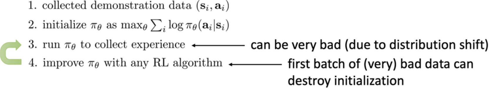</figure>

```tip
我们能否避免忘记示教的内容？
```

### 8.5.4 Off-policy RL

* Off-policy RL可以利用任何数据
* 我们可以把示教内容当作off-policy样本使用  
  * 由于示教在每次迭代中都作为数据提供，因此它们永远不会被遗忘
  * 策略仍然可以变得比示教更好，因为它不必被迫模仿它们
* Off-policy策略梯度（利用重要性采样）
* Off-policy Q-learning

**Policy gradient with demonstrations**

&emsp;&emsp;策略梯度的重要性采样

<figure>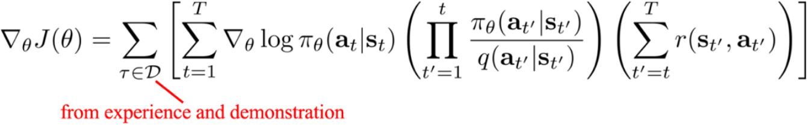</figure>

问题：示教数据来自哪个分布？  
选项1：用监督动作克隆来拟合$$\pi_{\text{demo}}$$  
选项2：假设Diract delta $$\pi_{\text{demo}}(\tau) = \frac{1}{N} \delta (\tau \in \mathcal{D})$$

**Guided Policy Search**

<figure>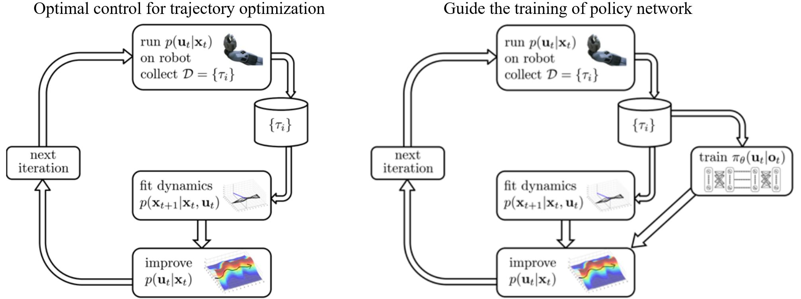</figure>

&emsp;&emsp;回顾model-based RL，轨迹优化的最优控制（$$f$$已知），

$$  \underset{u_1, \ldots, u_T}{\min} \sum_{t=1}^T c(x_t, u_t) \qquad
    \text{s.t. } x_t = f(x_{t-1}, u_{t-1})
$$

如果$$f$$未知，我们可以学习局部线性模型并用这些模型来求解一个时变线性高斯控制器

$$\begin{aligned}
    p(\mathbf{x}_{t+1} \mid \mathbf{x}_t, \mathbf{u}_t) 
& = \mathcal{N} \left( f(\mathbf{x}_t, \mathbf{u}_t) \right) \\
    f(\mathbf{x}_t, \mathbf{u}_t) 
& = \mathbf{A}_t \mathbf{x}_t + \mathbf{B}_t \mathbf{u}_t
\end{aligned}$$

&emsp;&emsp;Guided policy search (GPS) formulation如下

$$  \underset{u_1, \ldots, u_T}{\min} \sum_{t=1}^T c(x_t, u_t) \qquad
    \text{s.t. } x_t = f(x_{t-1}, u_{t-1}) \qquad
    \text{s.t. } u_t = \pi_\theta(x_t)
$$

$$  \underset{p(\tau)}{\min} \sum_{t=1}^T E_{p(\mathbf{x}_t, \mathbf{u}_t)}
    [  c(\mathbf{x}_t, \mathbf{u}_t) + \mathbf{u}_t^T \lambda_t
      + \rho_t D_{KL}(p(\mathbf{u}_t \vert \mathbf{x}_t) \| \pi_\theta(\mathbf{u}_t \vert \mathbf{x}_t))    ]
$$

**Q-learning with demonstrations**

* Q-learning本身是off-policy的，无需考虑重要性权重
* 简单的解决方式：直接把示教数据加进回放池

<figure></figure>

### 8.5.5 IL as an auxiliary loss function

* 混合目标：可以将RL和IL目标结合起来

<figure></figure>

```warning
需要小心调整权重
```

**Hybrid policy gradient**

<figure>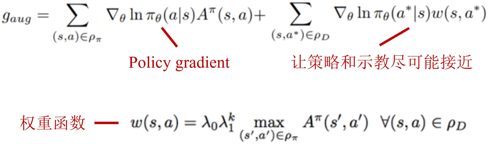</figure>

Rajeswaran A, Kumar V, Gupta A, et al. Learning complex dexterous manipulation with deep reinforcement learning and demonstrations. 2017.

**Hybrid Q-learning**

&emsp;&emsp;利用一小组演示数据来大幅加速学习过程

<figure>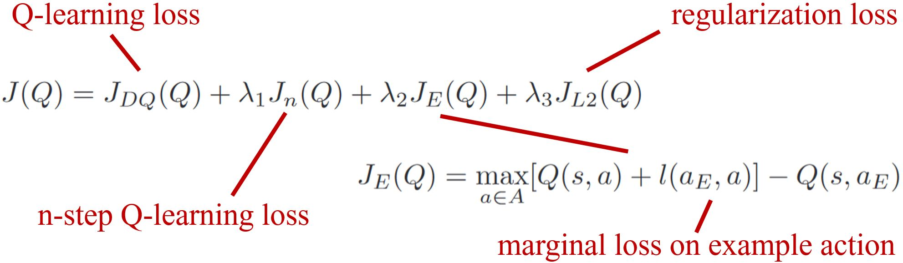</figure>

Hester T, Vecerik M, Pietquin O, et al. Deep q-learning from demonstrations[C]//Proceedings of the AAAI conference on artificial intelligence. 2018, 32(1).

<figure>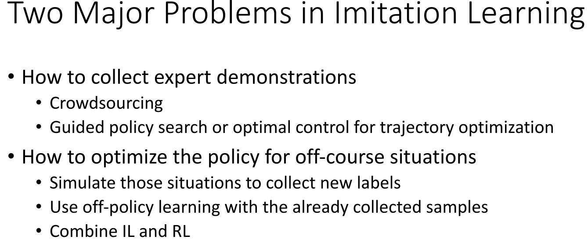</figure>

<figure>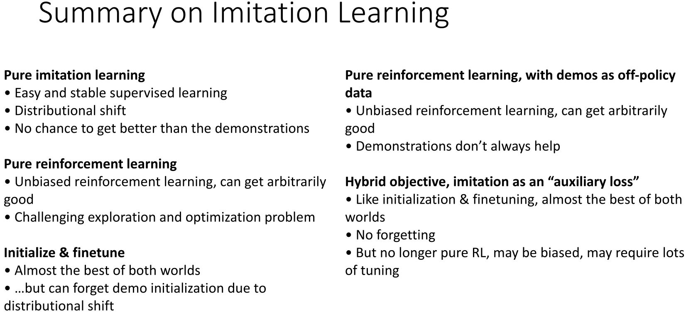</figure>

<figure>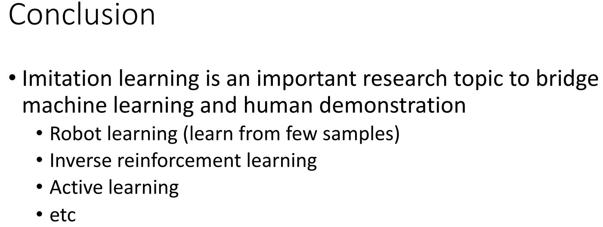</figure>

Recent survey: [An Algorithmic Perspective on Imitation Learning](https://arxiv.org/pdf/1811.06711.pdf)  
相关笔记：https://zhuanlan.zhihu.com/p/96923276

<!-- 蓝 -->
<b><font color="#3399ff"></font></b>
<!-- 绿 --><!-- #33cc00 -->
<b><font color="#00B050"></font></b>
<!-- 橙 -->
<b><font color="#FF4500"></font></b>