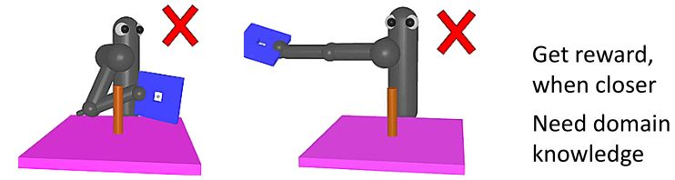
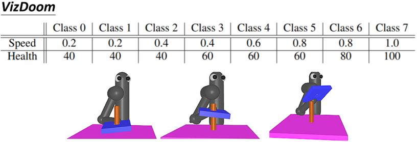
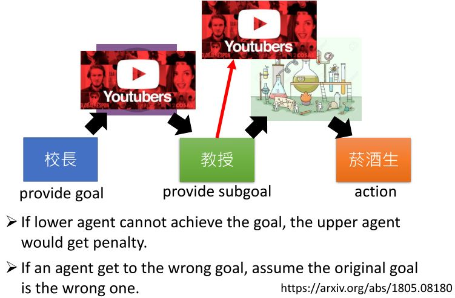
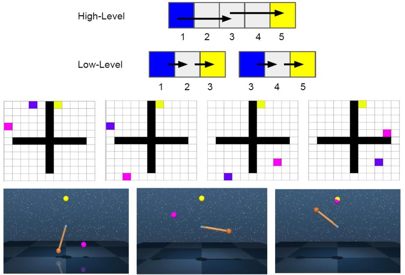

# Sparse Reward

## 5.1 Reward Shaping

<figure>
    
</figure>

<figure>
    
</figure>

<figure>
    
</figure>

### 5.1.1 Curiosity

### 5.1.2 Intrinsic curiosity module

<figure>
    
</figure>

<figure>
    
</figure>

&emsp;&emsp;有些状态很难预测，但是没有什么价值，比如风吹草动，所以还要想办法引导agent。可以利用一个Feature Ext来提取状态的特征，利用network2来预测$$\hat{a}_t$$，使其尽可能的接近实际采取的$$a$$，这样可以过滤掉与采取行动无关的一些状态。

<figure>
    
</figure>

## 5.2 Curriculum Learning

* 从简单的训练开始，然后再越来越难。

<figure>
    
</figure>

**Reverse curriculum generation**

1. 给定一个目标状态$$s_g$$
2. 采样一些和$$s_g$$很接近的状态$$s_1$$
3. 从状态$$s_1$$开始，每个轨迹有奖励$$R(s_1)$$
4. 去掉奖励过大（已经学过了）和过小（对于现阶段来说太难）的那些$$s_1$$
5. 根据$$s_1$$采样$$s_2$$，然后从$$s_2$$开始

<figure>
    
</figure>

## 5.3 Hierarchical RL

<figure>
    
</figure>

<figure>
    
</figure>