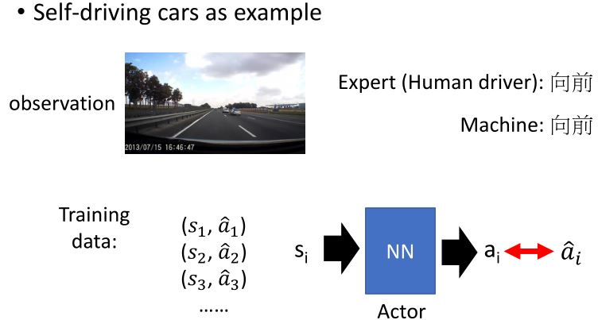
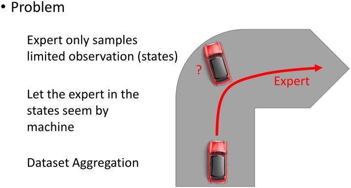
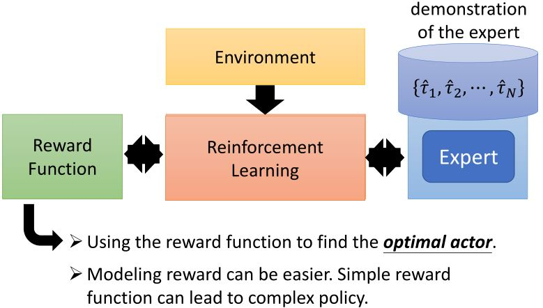

# Imitation Learning

* 模仿学习又称 learning by demonstration, apprenticeship learning
* 有一个专家展示如何完成任务  
  * 机器也可以与环境互动，但是无法获得奖励。  
  * 在有些任务中，很难定义奖励。  
  * 人工制定的奖励会导致不受控制的行为
* 两种方法：  
  * Behavior cloning  
  * Inverse reinforcement learning (inverse optimal control)

## 6.1 Behavior Cloning

&emsp;&emsp;行为克隆其实就是监督学习。

<figure>
    
</figure>

<figure>
    
</figure>

<figure>
    
</figure>

* 主要问题：如果机器的能力有限，它可能会选择错误的行为来复制。
* 有些行为必须复制，但有些可以忽略。  
  * 监督学习同等对待所有错误

<figure>
    
</figure>

**Mismatch**：
* 在监督学习中，我们期望训练和训练数据有同样的分布
* 在行为克隆中：
  * 训练：$$(s,a) \sim \hat{\pi}$$（expert）  
  &emsp;actor采取的动作$$a$$会影响$$s$$的分布
  * 测试：$$(s',a') \sim \pi^*$$（actor cloning expert）  
  &emsp;如果$$\hat{\pi} = \pi^*$$，那么$$(s,a)$$和$$(s',a')$$来自同一个分布  
  &emsp;如果$$\hat{\pi}$$和$$\pi^*$$不一样，那么$$s$$和$$s'$$的分布可能会差很多。

## 6.2 Inverse Reinforcement Learning

<figure>
    
</figure>

### 6.2.1 Framework of IRL

<figure>
    
</figure>

### 6.2.2 Third person imitation learning

Bradly C. Stadie, Pieter Abbeel, Ilya Sutskever, “Third-Person Imitation Learning”, arXiv preprint, 2017.

<figure>
    
</figure>

**Recap: Sentence Generation & Chat-bot**

<figure>
    
</figure>
 

<!-- 蓝 -->
<b></b>
<!-- 绿 --><!-- #33cc00 -->
<b></b>
<!-- 橙 -->
<b></b>