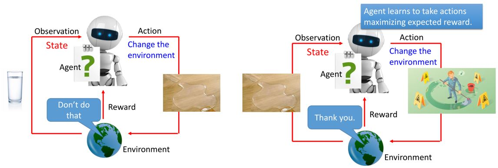
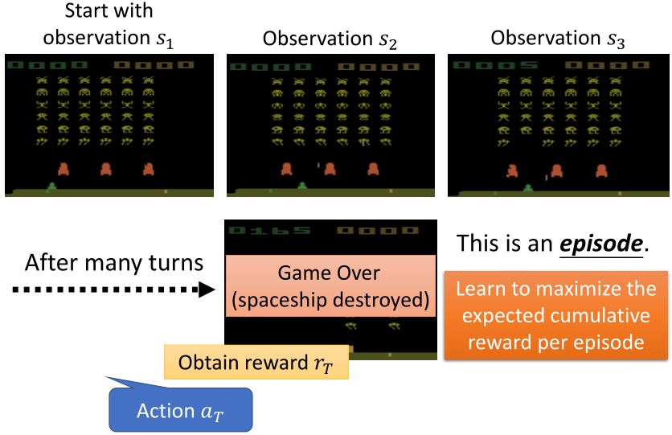
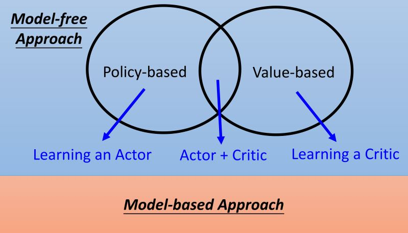

# 深度强化学习

&emsp;&emsp;本笔记主要参考台湾大学[李宏毅教授](http://speech.ee.ntu.edu.tw/~tlkagk/)的[强化学习课程](https://www.bilibili.com/video/BV1F4411c7og?p=1)。

---

<figure>
    
    <figcaption>强化学习的场景</figcaption>
</figure>

&emsp;&emsp;强化学习中state是agent观察到的环境的状态，所以可以是部分可观的。

<figure>
    
    <figcaption>机器学习 = 寻找一个函数</figcaption>
</figure>

&emsp;&emsp;强化学习中只有少数的状态可以得到reward，如何在这样的情况下发掘正确的action是一个难点。强化学习从经验中学习，需要大量的学习过程。

例：[space incader](https://gym.openai.com/envs/SpaceInvaders-v0/)

<figure>
    
</figure>

<b>强化学习的性质（难点）</b>：
* 延迟奖励（需要有远见）
* agent的行为会影响后续接收到的数据（需要学会探索）

<figure>
    
    <figcaption>强化学习概览</figcaption>
</figure>