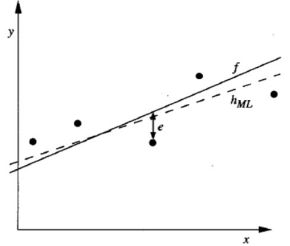

# 贝叶斯学习

&emsp;&emsp;发掘两个事件之间的联系（因果分析、前提和结论）  
&emsp;&emsp;<font color="#3399ff">反向思考</font>

---

## 2.1 Bayes Theorem

$$\color{green}{
    P(h \vert D) = \frac{P(D \vert h) P(h)}{P(D)}
}
$$

&emsp;&emsp;$$\color{green}{P(h \vert D)}$$为事件$$h$$发生的<b><font color="#00B050">后验概率</font></b>  
&emsp;&emsp;$$\color{green}{P(h)}$$为事件$$h$$发生的<b><font color="#00B050">先验概率</font></b>  
&emsp;&emsp;$$\color{green}{P(D)}$$为事件$$D$$发生的先验概率  
&emsp;&emsp;$$\color{green}{P(D \vert h)}$$为已知事件$$h$$发生时事件$$D$$发生的概率

* 事件$$h$$发生的先验概率$$P(h)$$  
&emsp;&emsp;假设：<font color="#3399ff">互斥</font>  
&emsp;&emsp;H space：完备  
&emsp;&emsp;$$\sum{P(h_i)=1}$$

* 事件$$D$$发生的先验概率$$P(D)$$  
&emsp;&emsp;把$$D$$作为所有可能数据的样本  
&emsp;&emsp;<font color="#3399ff">与</font>$$h$$<font color="#3399ff">无关</font>  
&emsp;&emsp;在不同假设的比较中可以被忽略

* 似然度（<b><font color="#00B050">likelihood</font></b>）$$P(D \vert h)$$  
&emsp;&emsp;<b><font color="#00B050">对数似然度</font></b> $$\log(P(D \vert h))$$

## 2.2 选择假设

### 2.2.1 最大后验假设

一般来说，我们想要的是根据给定训练数据**可能性最大的假设**。  

&emsp;&emsp;最大后验假设（<b><font color="#00B050">Maximum A Posteriori</font></b>, MAP）$$h_{MAP}$$

$$\color{green}{\begin{aligned}  
    h_{MAP} = & \mathop{argmax}_{h \in H} P(h \vert D) \\
            = & \mathop{argmax}_{h \in H} 
                    \frac{P(D \vert h) P(h)}{P(D)} \\
            = & \mathop{argmax}_{h \in H} P(D \vert h) P(h)
\end{aligned}}$$

### 2.2.2 极大似然假设

&emsp;&emsp;如果我们对假设一无所知，或者我们知道所有的假设都有相同的概率，那么MAP就是maximum likelihood（$$h_{ML}$$<b><font color="#00B050">极大似然假设</font></b>）。

$$\color{green}{
    h_{MAP} = \mathop{argmax}_{h \in H} P(D \vert h)
}$$

**极大似然假设&最小均方误差**

&emsp;&emsp;训练数据：$$<x_i,d_i>$$

&emsp;&emsp;$$d_i = f(x_i) + e_i$$  
&emsp;&emsp;&emsp;&emsp;$$d_i$$：独立样本  
&emsp;&emsp;&emsp;&emsp;$$f(x_i)$$：目标函数的无噪声值  
&emsp;&emsp;&emsp;&emsp;$$e_i$$：噪声，独立随机变量，正态分布$$N(0,\sigma^2)$$

<center>
    <figure>
        
    </figure>
</center>

可得$$d_i$$：正态分布$$N(f(x_i),\sigma^2)$$

$$\begin{aligned}  h_{ML} 
    & = \mathop{argmax}_{h \in H} 
            \sum_{i=1}^m 
                \ln{\frac{1}{\sqrt{2 \Pi \sigma^2}}}
              - \frac{1}{2} (\frac{d_i - h(x_i)}{\sigma})   \\
    & = \mathop{argmax}_{h \in H} 
            \sum_{i=1}^m {-\frac{1}{2} (\frac{d_i - h(x_i)}{\sigma})} \\
    & = \mathop{argmax}_{h \in H} \sum_{i=1}^m -(d_i - h(x_i))^2    \\
    & = \mathop{argmin}_{h \in H} \sum_{i=1}^m (d_i - h(x_i))^2     \\
\end{aligned}$$

独立随机变量，正态分布噪声$$N(0,\sigma^2)$$，$$h_{ML} = h_{LSE}$$

```note
服从极大似然估计的假设就是服从最小均方误差的假设。
```

### 2.2.3 朴素贝叶斯分类器

&emsp;&emsp;假设目标函数$$f: X \rightarrow V$$，其中每个实例$$x = (a_1,a_2,\ldots,a_n)$$，那么$$f(x)$$最可能的值为$$v_{MAP} = \mathop{argmax}_{v_j \in V} P(x \vert v_j)P(v_j)$$。

<b><font color="#00B050">Naive Bayes assumption</font></b>:

$$  P(x \vert v_j)  = P(a_1,a_2,\ldots,a_n \vert v_j) 
                    = \prod_i P(a_i \vert v_j)
$$

<b><font color="#00B050">Naive Bayes classifier</font></b>:

$$\begin{aligned} v_{NB} 
    & = \mathop{argmax}_{v_j \in V} P(v_j) \prod_i P(a_i \vert v_j) \\
    & = \mathop{argmax}_{v_j \in V} 
            \{ \log P(v_j) + \sum_i \log P(a_i \vert v_j) \}
\end{aligned}$$

如果满足独立属性条件，那么$$v_{MAP} = v_{NB}$$。

### 2.2.4 MDL (Minimum Description Length)

&emsp;&emsp;Occam’s razor: 倾向于最短的假设

&emsp;&emsp;MDL：倾向于能够使$$h_{MDL} = \mathop{argmin}_{h \in H}\{ L_{C_1}(h) + L_{C_2}(D \vert h) \}$$最小的假设$$h$$  
其中，$$L_C(x)$$是$$x$$在编码$$C$$下的<b><font color="#00B050">描述长度</font></b>。

**MDL & MAP**

$$\begin{aligned}  
    h_{MAP} = & \mathop{argmax}_{h \in H} P(D \vert h) P(h)             \\
            = & \mathop{argmax}_{h \in H} 
                    \{ \log_2 P(D \vert h) + \log_2 P(h) \}     \\
            = & \mathop{argmin}_{h \in H} 
                    \{ - \log_2 P(D \vert h) - \log_2 P(h) \}   \\
            = & \mathop{argmin}_{h \in H} 
                    \{ L_{C_2}(D \vert h) - L_{C_1}(h) \}       \\
            =   h_{MDL}
\end{aligned}$$

```note
符合服从极大后验的假设即为服从最小描述长度的假设。
```

权衡：<font color="#3399ff">假设的复杂性 vs. 假设所犯错误的数量</font>  
倾向于有一些错误的短假设而不是完美分类训练数据的长假设

```tip
这种倾向可以用于解决过拟合问题。
```