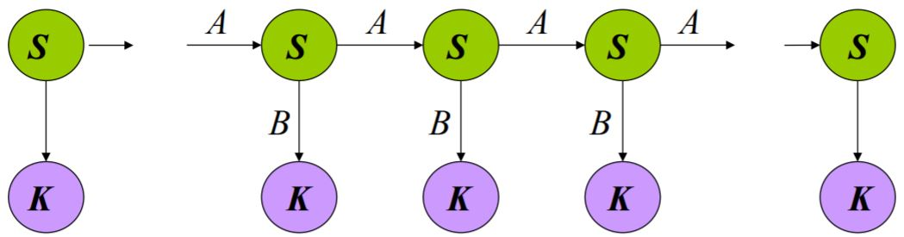
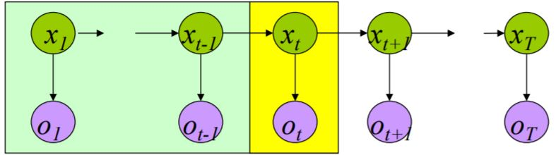
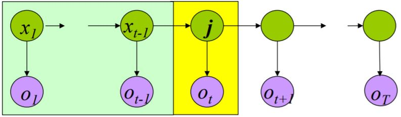

# MM & HMM

应用背景：  
&emsp;&emsp;天气预报：下雨、晴天、多云……  
&emsp;&emsp;预测传染病的感染  
&emsp;&emsp;语音识别  
&emsp;&emsp;中文输入法  
&emsp;&emsp;人口预测  
&emsp;&emsp;生物信息学（e.g. 基因分析）  
&emsp;&emsp;……

---

## 3.1 Markov Model

**例**：天气预报问题

* 三种天气状态：{晴天，雨天，雾天}
* 今天的天气情况与昨天、前天、……的天气有关，$$P(w_n \vert w_{n-1},w_{n-2},\ldots,w_1)$$
* 如果已知过去三天的情况（按顺序）：晴天，晴天，雾天
* 那么明天是雨天的概率：$$P(w_4 = \text{雨天} \vert w_3 = \text{雾天} ,w_2 = \text{晴天} ,w_1 = \text{晴天} )$$

### 3.1.1 马尔可夫模型

```warning
一下讨论均基于一阶马尔可夫假设
```

* 给定一系列数据 $$D = \{ x_1,x_2,x_3,\ldots,x_N \}$$
* <b><font color="#00B050">一阶马尔可夫假设</font></b>  
在$$n$$时刻观察的概率仅取决于在$$n-1$$时刻的观察。  
$$p(x_n \vert x_{n-1}, \ldots, x_2, x_1)$$
$$p(D \vert M) = p(x_1) \prod_{n=2}^N p(x_n \vert x_{n-1})$$
* <b><font color="#00B050">转移概率</font></b>$$\color{green}{a_{i,j}}$$  
给定$$n-1$$时刻的状态$$S_i$$，$n$$时刻处于状态$$S_j$$的概率
$$a_{i,j} = p(x_n = S_j \vert x_{n-1} = S_i)$$

### 3.1.2 转移概率的性质

1. 非负性 $$a_{i,j} \ge 0$$
2. <font color="##3399ff">Time invariant</font> (homogeneous <font color="##3399ff">时间不变性</font>)  
   $$   p(x_n = S_j \vert x_{n-1} = S_i)
      = p(x_{n+T} = S_j \vert x_{n-1+T} = S_i)$$
3. 转移矩阵：每行之和 = 1
$$  \mathbf{A} = 
    \begin{bmatrix}
        a_{11} & a_{12} & a_{13} \\
        a_{21} & a_{22} & a_{23} \\
        a_{31} & a_{32} & a_{33} \\
    \end{bmatrix} \qquad
    \sum_{j=1}^M {a_{i,j}} = 1 \text{ for } i = 1,\ldots,M
$$

**例**

<center>
    <figure>
        
    </figure>
</center>

利用Markov假设：$$P(w_n \vert w_{n-1},w_{n-2},\ldots,w_1) \approx P(w_n \vert w_{n-1})$$  
以及联合概率：$$P(w_1,\ldots,w_n) = \prod_{i=1}^n P(w_i \vert w_{i-1})$$

Q1：已知今天是晴天，那么明天是晴天且后天下雨的概率是多少？  
Q2：已知今天是雾天，那么后天下雨的概率是多少？

## 3.2 Hidden Markov Model

什么是隐马尔可夫模型（HMM）？

例：天气预测问题  
&emsp;&emsp;假设一个人被关在一个房间里几天，他想知道外面的天气。  
&emsp;&emsp;他所能知道的唯一线索：看守者是否拿着伞。  

* 观察到的状态：伞？
* 隐藏的状态：天气

<center>
    <figure>
        
    </figure>
</center>

&emsp;&emsp;图形模型  
&emsp;&emsp;圆圈：状态  
&emsp;&emsp;箭头：状态之间的依赖关系

&emsp;&emsp;绿色圆圈：hidden states  
&emsp;&emsp;只由前一个状态决定  
&emsp;&emsp;<font color="#3399ff">未来与过去无关，只与现在有关。</font>

&emsp;&emsp;紫色圆圈：observed states  
&emsp;&emsp;观察到的状态只与隐状态有关

<center>
    <figure>
        
    </figure>
</center>

&emsp;&emsp;$$\{ S,K,\prod,A,B \}$$  
&emsp;&emsp;$$S: \{ s_1, \ldots, s_N \}$$ 隐状态的值  
&emsp;&emsp;$$K: \{ k_1, \ldots, k_M \}$$ 观察状态的值  
&emsp;&emsp;$$\prod = \{\pi_i\}$$ 初始状态概率  
&emsp;&emsp;$$A = \{ a_{ij} \}$$ 状态转移概率 $$ p(x_n=S_j \vert x_{n-1}=S_i) = a_{ij} $$  
&emsp;&emsp;$$B = \{ b_{ij} \}$$ 观察状态概率（输出概率） $$ p(y_n=K_j \vert x_n=S_i) = b_{ij} $$

例：之前的天气Markov过程为$$P(w_1,\ldots,w_n) = \prod_{i=1}^n P(w_i \vert w_{i-1})$$，而现在实际的天气情况被隐藏了，我们只能观察到看守者是否带了雨伞

$$  P(w_1,\ldots,w_n \vert u_1,\ldots,u_n) 
= \frac {P(u_1,\ldots,u_n \vert w_1,\ldots,w_n) P(w_1,\ldots,w_n)}
        {P(u_1,\ldots,u_n)}
$$

其中，如果看守者在第$$i$$天带了伞，那么$$u_i$$为真，如果没有则为假。

### 3.2.1 输出独立性假设

&emsp;&emsp;假设对于所有的$$i$$，已知$$w_i$$，那么对于所有的$$j \neq i$$ $$u_i$$与所有的$$u_j$$和$$w_j$$无关。

$$  P(u_1,\ldots,u_n \vert w_1,\ldots,w_n)
=   \prod_{i=1}^n P(u_i \vert w_i)
$$

Q3：观察变量有两种取值$$\{ C1 = \text{带伞} , C2 = \text{没带伞} \}$$  
隐变量有三种状态$$\{ S_1 = \text{晴天} , S_2 = \text{雨天} ,S_1 = \text{雾天} \}$$  
假设被关进房间的第一天是晴天，第二天看守者带了伞，那么第二天下雨的概率是多少？

$$\begin{aligned}  
  & p(x_2=S_2 \vert y_2=C_1 , x_1=S_1)  \\
= & p(x_2=S_2 \vert x_1=S_1)
  * p(y_2=C_1 \vert x_2=S_2)
  / p(y_2=C_1 \vert x_1=S_1)
\end{aligned}$$

### 3.2.2 基本问题

&emsp;&emsp;给定初始HMM $$\mu = \{ A,B,\prod \}$$，观察序列为$$O = o_1,\ldots,o_T$$

* <font color="#3399ff">Estimation problem</font>  
计算给定观察序列的概率$$p(O \vert \mu)$$
* <font color="#3399ff">Decoding problem</font>  
给定一个观察序列，计算<font color="#3399ff">最有可能的隐状态</font>序列
* <font color="#3399ff">Learning problem</font>  
给定一个观察序列和可能模型的集合，哪个模型与数据最接近。

#### 1. Estimation prob.

&emsp;&emsp;$$O = o_1,\ldots,o_T$$，$$\mu = \{ A,B,\prod \}$$，计算$$P(O \vert \mu)$$

**Solution 1**

<center>
    <figure>
        
    </figure>
</center>

$$P(O \vert \mu) = \sum_X P(O,X \vert \mu)$$

其中，$$P(O, X \vert \mu) = P(O \vert X, \mu) P(X \vert \mu)$$，所以

$$P(O \vert \mu) = \sum_X P(O \vert X, \mu) P(X \vert \mu)$$

其中，$$P(O \vert X, \mu) = b_{x_1 o_1} b_{x_2 o_2} \cdots b_{x_T o_T}$$，$$P(X \vert \mu) = \pi_{x_1} a_{x_1 x_2} a_{x_2 x_3} \cdots b_{x_{T-1} o_T}$$

$$\boxed{  
    P(O \vert \mu)
=   \sum_{\{ x_1 \ldots x_T \}}
    {   \pi_{x_1} b_{x_1 o_1}
        \prod_{t=1}^{T-1} a_{x_t x_{t+1}} b_{x_{t+1} o_{t+1}}
    }
}$$

方法1需要列出所有可能的状态序列（$$\text{长度} = T$$），需要做$$2TN^T$$次乘法（共$$N$$种可能的状态）。

**Solution 2: Foward algorithm**

<center>
    <figure>
        
    </figure>
</center>

HMM特殊的结构为动态规划提供了一种有效的解决方案——前向算法。

&emsp;&emsp;定义

$$\color{green}{ \alpha_t(i) = P(o_1 \cdots o_t, x_t=i \vert \mu) }
    \quad \rightarrow \quad
    P(O \vert \mu) = \sum_{i=1}^N \alpha_T(i)
$$

$$\begin{aligned}
    \alpha_{t+1}(j) 
    & = P(o_1 \cdots o_{t+1}, x_{t+1}=j \vert \mu)  \\
    & = \sum_{i=1 \ldots N}
            P(o_1 \cdots o_{t}, o_{t+1}, x_t=i, x_{t+1}=j)  \\
    & = \sum_{i=1 \ldots N}
            P(o_1 \cdots o_{t}, o_{t+1}, x_{t+1}=j \vert x_t=i)P(x_t=i) \\
    & = \sum_{i=1 \ldots N}
            P(o_1 \cdots o_{t} \vert x_t=i) 
            P(o_{t+1}, x_{t+1}=j \vert x_t=i) P(x_t=i)  \\
    & = \sum_{i=1 \ldots N}
            P(o_1 \cdots o_{t} \vert x_t=i)
            P(x_{t+1}=j \vert x_t=i) P(o_{t+1} \vert x_{t+1}=j) \\
    & = \sum_{i=1 \ldots N} \alpha_t(i) a_{ij} b_{j O_{t+1}}
\end{aligned}$$

$$\boxed {
    P(O \vert \mu) = \sum_{i=1}^N \alpha_T(i)
}$$

&emsp;&emsp;$$P(O \vert \mu)$$：$$O(N^2 T)$$乘法

**Solution 3: Backard algorithm**

<center>
    <figure>
        
    </figure>
</center>

$$  \color{green}
        { \beta_t(i) = P(o_t \cdots o_T \vert x_t=i , \mu) }
    \quad \rightarrow \quad
    \boxed{ P(O \vert \mu) = \sum_{i=1}^N \pi_i \beta_1(i) }
$$

$$  \beta_t(i) = \sum_{j=1 \ldots N} 
                        a_{ij} b_{i O_t} \beta_{t+1}(j)
                        \quad  , t = T,T-1,\ldots,1 \ 1 \le i \le N \\
    \beta_{T+1}(i) = 1 \quad , \ 1 \le i \le N
$$

**总结**
    
&emsp;&emsp;枚举法 $$ P(O \vert \mu) = \sum_{\{ x_1,\ldots,x_T \}} {\pi_{x_1} b_{x_1 o_1} \prod_{t=1}^{T-1} a_{x_t x_{t+1}} b_{x_{t+1} o_{t+1}} }$$

&emsp;&emsp;前向法 $$P(O \vert \mu) = \sum_{i=1}^N \alpha_T(i)$$

&emsp;&emsp;后向法 $$P(O \vert \mu) = \sum_{i=1}^N \pi_i \beta_1(i)$$

#### 2. Decoding prob.

* 给定一个观察序列，计算<font color="#3399ff">最有可能的隐状态</font>序列。
* 找出最能解释观测结果的状态序列。
* 可能有多个$$X$$使得$$P(X \vert O)$$取到最大。
  
**Viterbi algorithm**

```warning
维特比算法找到的可能是局部最优值。
```

<center>
    <figure>
        
    </figure>
</center>

定义

$$  \delta_t(j)
  = \max_{x_1 \ldots x_{t-1}} 
        P( x_1 \ldots x_{t-1} , o_1 \ldots o_{t-1} x_t = j , o_t )
$$


#### 3. Learning prob.


<br />
<!-- 蓝 -->
<font color="#3399ff"></font>
<!-- 绿 --><!-- #33cc00 -->
<b><font color="#00B050"></font></b>
<!-- 橙 -->
<font color="#FF4500"></font>